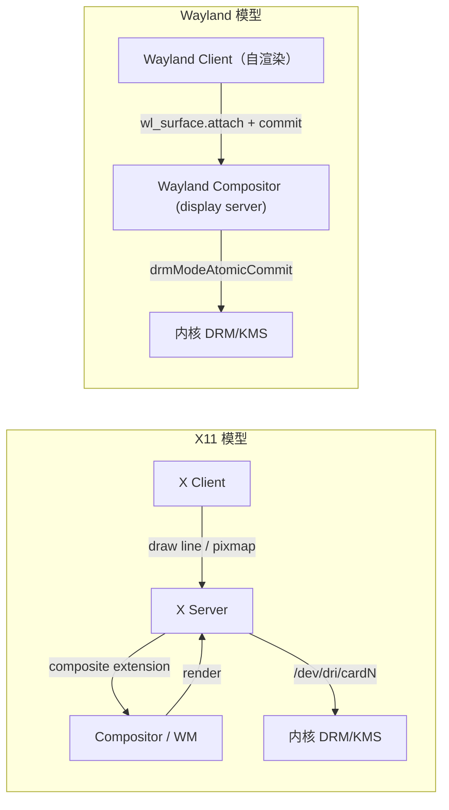
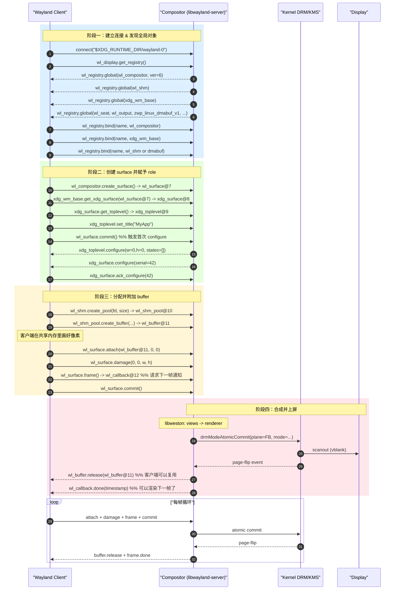
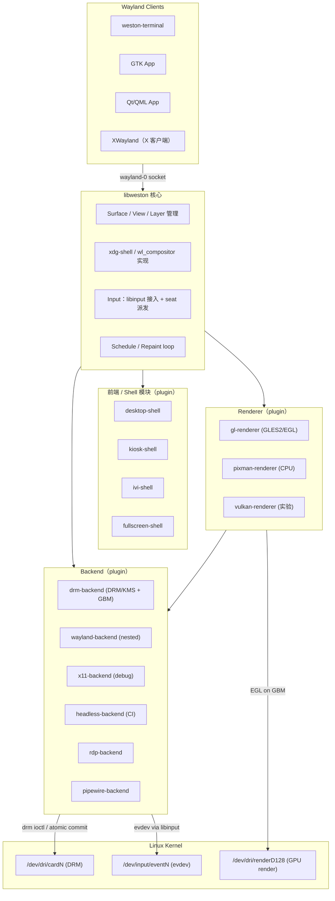
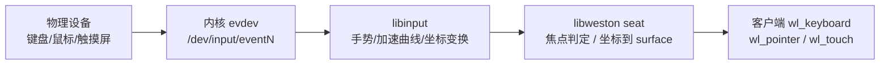
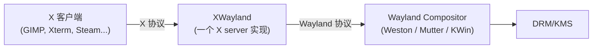

# Wayland/Weston 体系结构

> [!note]
> **Ref:**
> - [Wayland 协议文档](https://wayland.freedesktop.org/docs/html/)
> - [Wayland Book (Drew DeVault)](https://wayland-book.com/)
> - [Weston GitLab](https://gitlab.freedesktop.org/wayland/weston)
> - 本仓库 [[01-ui-stack-overview]]、[[04-kernel-fb-drm-kms]]


## 1. 为什么有 Wayland

Wayland 不是 "X12"，而是一次**对 display server 角色的彻底重构**。要理解它解决什么问题，必须先回顾 X11 留下的历史包袱。

### 1.1 X11 的设计前提

X11 协议（1987）诞生于"工作站时代"，它有三条基本假设：

1. **网络透明（network transparency）**：客户端和 X Server 可以跨网络通信，协议为字节流；
2. **Server 充当 GPU/绘制代理**：客户端发"画一根线"、"画一个矩形"，X Server 在本地把它绘制到 framebuffer；
3. **绘制原语丰富**：X 协议本身定义了 core drawing requests（XDrawLine、XFillRectangle、XCopyArea 等）。

这个设计在 90 年代终端 X 工作站连接远程主机的语境下非常合理。但是在 2010 年代之后，所有现代桌面应用都自己用工具包（GTK、Qt）渲染、走 OpenGL/Vulkan、走 Cairo/Skia，**几乎没人用 X 的 core drawing requests**。X Server 沦为一个"语义错位的中间层"。

### 1.2 现代痛点

| 痛点                | 表现                                                                                 |
| ------------------- | ------------------------------------------------------------------------------------ |
| Tearing             | X Server 没有原子提交概念，多窗口/多 frame 不能保证一帧到位                          |
| 安全                | 任意客户端可以 `XGrabKeyboard` 拦截全部按键、可以截屏其它窗口；输入安全模型几乎为零  |
| 合成器是补丁        | Compositor（如 compiz、kwin）通过 Composite extension 把窗口画到 offscreen pixmap 再叠加，X Server 还在画一遍 |
| 多层路径            | 客户端 → X Server → Compositor → 内核 → GPU，链路冗长                                |
| HiDPI / 多分辨率    | 协议对 per-monitor scale 支持不佳，需要工具包绕开 X                                  |
| 输入设备热插拔/触摸 | 由 XInput2 补丁堆砌，与现代 evdev/libinput 模型割裂                                  |

### 1.3 Wayland 的核心理念

> **"Every frame is perfect."**

这是 Kristian Høgsberg（Wayland 作者）反复强调的一句话。它意味着：

- **合成器即 display server**：不再有"X Server + Compositor"两层，Wayland compositor 同时承担 display server、输入管理、surface 合成；
- **客户端自己渲染**：客户端用 OpenGL ES / Vulkan / CPU rasterizer 在 buffer 上画好一整帧，然后通过 `wl_surface.commit` 一次性提交给合成器；
- **合成器只做 composite & scanout**：拿到客户端 buffer 后，合成器决定如何叠加输出到显示器；
- **协议极简**：核心协议只描述"对象、buffer、输入事件、生命周期"，**不提供任何绘制原语**；
- **可扩展**：通过 XML 扩展协议增加能力（xdg-shell、linux-dmabuf、presentation-time 等）。

### 1.4 角色对照



注意 Wayland 模型里**没有"WM"**这个独立组件——窗口管理是 compositor 的职责之一。

### 1.5 不是要做的事

Wayland 协议**不**做以下事情：

- 不做网络透明（远程显示用 RDP/VNC/Waypipe 等单独方案）；
- 不规定 widget toolkit；
- 不规定窗口管理策略（floating vs tiling 由 compositor 决定）；
- 不规定渲染 API（客户端可以用任何方式产生 buffer）。

这种"少做事"的姿态让协议保持简洁，但也意味着**每个 compositor 自己实现窗口策略，桌面体验差异大**——这是 Wayland 长期被诟病的"碎片化"根源。


## 2. Wayland 协议结构

### 2.1 协议描述：XML + wayland-scanner

Wayland 协议**不是**一份手工写的 C 头文件，而是一份 XML 描述：

```xml
<!-- 来自 wayland.xml 节选 -->
<interface name="wl_surface" version="6">
  <request name="destroy" type="destructor"/>
  <request name="attach">
    <arg name="buffer" type="object" interface="wl_buffer" allow-null="true"/>
    <arg name="x" type="int"/>
    <arg name="y" type="int"/>
  </request>
  <request name="damage">...</request>
  <request name="commit"/>
  <event name="enter">
    <arg name="output" type="object" interface="wl_output"/>
  </event>
  ...
</interface>
```

工具 `wayland-scanner` 把这份 XML 编译成两套代码：

| 模式               | 用途                                       | 头文件                            |
| ------------------ | ------------------------------------------ | --------------------------------- |
| `client-header`    | 客户端调用接口                             | `wayland-client-protocol.h`       |
| `server-header`    | 合成器接收请求                             | `wayland-server-protocol.h`       |
| `private-code`     | marshaling / unmarshaling 的 C 实现        | `*-protocol.c`                    |

构建系统（meson）通常这样调用：

```meson
wayland_scanner = find_program('wayland-scanner')
xdg_shell_xml = '/usr/share/wayland-protocols/stable/xdg-shell/xdg-shell.xml'

xdg_shell_client_h = custom_target('xdg-shell-client-protocol.h',
  input  : xdg_shell_xml,
  output : 'xdg-shell-client-protocol.h',
  command: [wayland_scanner, 'client-header', '@INPUT@', '@OUTPUT@'])
```

### 2.2 对象 + 接口 + 请求 / 事件

Wayland 是**面向对象的、双向的 RPC 协议**：

- **接口（interface）**：一类对象的能力描述（如 `wl_surface`、`xdg_toplevel`）；
- **对象（object）**：接口的实例，每个对象有一个 32-bit ID；
- **请求（request）**：客户端 → 合成器的方法调用；
- **事件（event）**：合成器 → 客户端的回调通知；
- **ID 分配**：客户端 ID 在 `[1, 0xFEFFFFFF]`，服务端 ID 在 `[0xFF000000, 0xFFFFFFFF]`，避免冲突。

### 2.3 传输层：Unix Domain Socket + fd passing

```
$XDG_RUNTIME_DIR/wayland-0       # 默认 socket
$XDG_RUNTIME_DIR/wayland-0.lock  # 防重复绑定
```

- 客户端用 `WAYLAND_DISPLAY` 环境变量定位 socket（默认 `wayland-0`）；
- 协议帧格式：`[object_id:32][opcode+size:32][args...]`，小端；
- **关键能力**：通过 `SCM_RIGHTS` 传递 fd——`wl_shm_pool` 的共享内存 fd、`linux_dmabuf` 的 dma-buf fd、`wl_keyboard.keymap` 的 keymap fd 都靠它。

这一条"socket + fd passing"是 Wayland 零拷贝的物理基础——客户端把 GPU 渲染好的 dma-buf 通过 fd 传给合成器，合成器作为 KMS 的 framebuffer 直接 scanout，**整条路径数据没动过**。

### 2.4 核心接口一览

| 接口                    | 角色                                    | 关键请求/事件                                                    |
| ----------------------- | --------------------------------------- | ---------------------------------------------------------------- |
| `wl_display`            | 连接根对象，对应一条客户端连接          | `sync`、`get_registry`                                           |
| `wl_registry`           | "全局对象目录"                          | event `global`/`global_remove`；request `bind`                   |
| `wl_compositor`         | 创建 surface 和 region 的工厂           | `create_surface`、`create_region`                                |
| `wl_surface`            | "一块可显示的内容"，最核心抽象          | `attach`、`damage`、`frame`、`commit`、`set_buffer_scale`        |
| `wl_buffer`             | 一块图像数据（不规定来源）              | event `release`                                                  |
| `wl_shm` / `wl_shm_pool`| CPU 共享内存 buffer 工厂                | `create_pool`、`pool.create_buffer`                              |
| `zwp_linux_dmabuf_v1`   | GPU dma-buf 导入                        | `create_params` → `create` / `create_immed`                      |
| `wl_seat`               | 一组关联的输入设备                      | event `capabilities`；`get_pointer`/`get_keyboard`/`get_touch`   |
| `wl_keyboard`           | 键盘事件                                | event `keymap`、`key`、`modifiers`                               |
| `wl_pointer`            | 指针事件                                | event `enter`、`motion`、`button`、`axis`                        |
| `wl_touch`              | 触摸事件                                | event `down`、`motion`、`up`、`frame`                            |
| `wl_output`             | 一台物理显示器                          | event `geometry`、`mode`、`scale`、`done`                        |
| `xdg_wm_base`           | xdg-shell 全局入口                      | `get_xdg_surface`、event `ping`                                  |
| `xdg_surface`           | 桌面 surface 的 role 适配器             | `get_toplevel`、`get_popup`、`set_window_geometry`、`ack_configure` |
| `xdg_toplevel`          | "桌面窗口"角色                          | `set_title`、`set_app_id`、`set_maximized`、event `configure`    |
| `xdg_popup`             | "弹出层"角色（菜单等）                  | event `configure`、`popup_done`                                  |

### 2.5 surface 的"role"模型

`wl_surface` 是一块裸内容，**它的语义由附加的 role 决定**：

- 没 role：刚创建的 surface 不能 commit 显示；
- toplevel role：通过 `xdg_surface.get_toplevel` 赋予，变成桌面窗口；
- popup role：菜单/tooltip；
- cursor role：通过 `wl_pointer.set_cursor` 当鼠标贴图；
- subsurface role：从属于另一个 surface（视频画中画常用）；
- layer-shell role（wlr 扩展）：状态栏、壁纸、锁屏覆盖层；
- ivi-surface（汽车 IVI 场景）。

一个 surface **只能绑定一个 role**，role 一旦确定不可更改——这是协议保证。

### 2.6 协议扩展机制

| 类别       | 路径前缀                              | 稳定性策略                                |
| ---------- | ------------------------------------- | ----------------------------------------- |
| stable     | `wayland-protocols/stable/`           | 协议冻结，前向兼容                        |
| staging    | `wayland-protocols/staging/`          | 接口冻结待迁 stable，可生产用             |
| unstable   | `wayland-protocols/unstable/`         | 名字带 `_v1`/`_v2`，可能不兼容            |
| wlr        | `wlroots/protocol/`                   | wlroots 生态扩展（layer-shell 等）        |
| 厂商私有   | 自带 XML                              | 通常 IVI / 嵌入式定制                     |

常用扩展速览：

- `xdg-shell`：桌面窗口、popup（已 stable）；
- `linux-dmabuf-v1`：dma-buf 共享 buffer（stable）；
- `presentation-time`：精确 vblank 时间戳，多媒体音画同步用；
- `viewporter`：surface 到 output 的缩放/裁切；
- `tablet-v2`：数位板 / 触屏笔；
- `wlr-layer-shell`：桌面 shell 组件（waybar、swaylock）；
- `xdg-decoration`：服务端/客户端窗口装饰协商；
- `idle-inhibit`、`pointer-constraints`、`relative-pointer`：游戏/视频特化。


## 3. 核心生命周期 SequenceDiagram

下面这张图是**理解 Wayland 协议必背的一张图**：客户端从 connect 到第一帧上屏的全过程。



几条容易忽略的细节：

1. **第一帧必须等 configure**：客户端 commit 之前 surface 没有 role-specific state，必须先 `ack_configure` 才能 attach buffer；
2. **`wl_buffer.release` 是回收信号**，不是销毁——客户端见到 release 后才能向 buffer 重新写像素；
3. **`wl_surface.frame` 是节流机制**：合成器只在该 surface 可见且即将刷新时回调，hidden 窗口的客户端会被天然限速；
4. **damage 是优化提示**：合成器可以只重绘 damage region，但不强制；
5. **commit 是事务**：attach + damage + scale + buffer_transform 等所有挂起状态在 commit 时原子生效——这就是 "every frame is perfect"。


## 4. Weston 在生态里的位置

Weston 不是唯一的 Wayland compositor，但它有特殊地位：**libweston 是协议的参考实现**，新协议通常先在 Weston 落地再被其他 compositor 抄。

### 4.1 主流 Wayland Compositor 对比

| Compositor             | 基础设施           | 典型用途                | 是否 kiosk 友好          | 备注                                    |
| ---------------------- | ------------------ | ----------------------- | ------------------------ | --------------------------------------- |
| **Weston**             | libweston          | 参考实现、嵌入式、车机   | 是（kiosk-shell）        | 协议落地最早；可裁剪                    |
| Mutter                 | Clutter (历史)     | GNOME 桌面              | 否                       | 与 GNOME 紧耦合                         |
| KWin                   | KDE Frameworks     | KDE 桌面                | 否                       | 也支持 X11 模式                         |
| sway                   | wlroots            | i3 风格平铺桌面         | 一般                     | wlroots 是 wayland-protocols 风向标     |
| Hyprland               | wlroots（fork）    | 美化平铺桌面            | 否                       | 动画/特效丰富                           |
| Cage                   | wlroots            | kiosk / 单全屏应用      | 强                       | 极简 kiosk compositor                   |
| QtWayland Compositor   | Qt                 | 嵌入式 Qt 应用 + 内嵌合成 | 强                       | 用 QML 写合成器                         |
| Mir                    | 自研               | Ubuntu Touch 历史项目   | 一般                     | 现在主打 IoT                            |
| labwc                  | wlroots            | Openbox 风格            | 一般                     | 轻量浮动 WM                             |

### 4.2 为什么嵌入式偏爱 Weston / Cage / QtWayland

- **依赖少**：Weston 可以不依赖 GTK/Qt/GNOME，纯 EGL+GLES2；
- **后端可选**：drm-backend 直接对接 KMS，无须 X；
- **shell 可换**：weston desktop-shell / kiosk-shell / ivi-shell / fullscreen-shell 通过 `weston.ini` 切换；
- **小**：编译后核心二进制几 MB；
- **license 友好**：MIT；
- **systemd 集成**：`weston.service` 直接拉起，是 RK / TI / NXP / iMX 系列 SDK 的常见默认。

### 4.3 libweston 是什么

libweston 是从 Weston 抽出来的**"做一个 Wayland compositor"的库**：

```
weston(可执行)
  └── libexec-weston/  desktop-shell.so, kiosk-shell.so, ...
            ↘
       libweston.so   ←— 你也可以 link 它写自己的 compositor
            ↘
       libwayland-server.so
```

部分项目（如 agl-compositor、grd 早期版本、某些车机 HMI 框架）直接 link libweston 而不用 weston 可执行——这是 libweston 的设计目的。


## 5. Weston 内部分层

### 5.1 总览架构图



注意三件事：

1. **前端 shell、renderer、backend 都是 plugin**（`.so`，运行时 `dlopen`）；
2. libweston 核心只管"surface/view/layer 数据结构、input 派发、repaint 调度、xdg-shell 协议实现"；
3. **数据流是 client → core → renderer → backend → kernel**，反向控制流是 backend 的 vblank → core 的 repaint cycle。

### 5.2 前端 Shell

Shell 是"窗口管理策略"——它决定窗口长什么样、怎么排布、有没有任务栏。

| Shell                | 适用场景                              |
| -------------------- | ------------------------------------- |
| `desktop-shell`      | 类桌面体验，面板 + 启动器 + 多窗口    |
| `kiosk-shell`        | 单应用全屏占据 output，嵌入式首选     |
| `ivi-shell`          | 汽车 IVI / HMI，按 surface ID 分层    |
| `fullscreen-shell`   | 一个 client 一个 output，演示/远程    |

Shell 接收来自 libweston 的 surface lifecycle 回调，决定每个 surface 放在哪个 `weston_layer` 上、`weston_view` 的位置和大小。

### 5.3 libweston 核心数据结构

```
weston_compositor
 ├── weston_backend            （唯一）
 ├── weston_renderer           （唯一）
 ├── weston_seat[]             （输入设备组）
 ├── weston_output[]           （物理 / 虚拟显示器）
 ├── weston_layer[]            （叠加层，决定 z 顺序）
 │     └── weston_view[]       （surface 在某个 output 上的呈现实例）
 │           └── weston_surface（协议对象 wl_surface 的核心结构）
 │                 ├── pending_state（未 commit 的状态）
 │                 ├── current_state（已 commit 的状态）
 │                 └── role / role_data
 └── repaint loop（基于每个 output 的 vblank）
```

一个 `wl_surface` 在协议层只有一份；它对应的 `weston_surface` 也只有一份；但是它可以被多个 `weston_view` 引用——例如同一个 surface 镜像到两块屏幕，就是两个 view。

### 5.4 Renderer

| Renderer            | 输入                            | 输出                                | 性能       | 适用                            |
| ------------------- | ------------------------------- | ----------------------------------- | ---------- | ------------------------------- |
| `gl-renderer`       | dma-buf / SHM → EGLImage / tex  | EGLSurface → GBM BO → KMS FB        | 硬件加速   | 任何有 GLES2 + EGL 的平台       |
| `pixman-renderer`   | SHM 像素                        | 软件合成到 framebuffer              | CPU only   | 无 GPU 或调试 GPU 问题          |
| `vulkan-renderer`   | dma-buf → VkImage               | VkImage → DRM                       | 硬件加速   | 实验性（Weston 12+）            |

renderer 的核心职责是"把多个 surface 的内容根据 view 的几何信息合成到 output 的 framebuffer"。在 `drm-backend` + `gl-renderer` 的组合下，输出 framebuffer 是 GBM 分配的 dma-buf，可以直接作为 KMS scanout buffer——零拷贝到屏幕。

### 5.5 Backend 一览

| Backend                | 何时用                                           | 关键依赖                                    |
| ---------------------- | ------------------------------------------------ | ------------------------------------------- |
| `drm-backend`          | 嵌入式 / 无 X 桌面 / 主流生产环境                | `libdrm`、`libgbm`、`libinput`、`logind`    |
| `wayland-backend`      | 嵌入到另一个 Wayland compositor 里跑（开发用）   | 父 compositor                               |
| `x11-backend`          | 嵌入到 X server 里跑（开发/调试）                | Xlib / xcb                                  |
| `headless-backend`     | CI、自动化测试、无显示器渲染                     | 无（可选 pixman / gl）                      |
| `rdp-backend`          | 远程桌面，把合成结果作为 RDP 服务推出去          | `freerdp`                                   |
| `pipewire-backend`     | 把 output 当作 video source 推给 PipeWire 消费   | `libpipewire`                               |

在 i.MX6ULL / RK3566 这类嵌入式板子上，几乎一律使用 `drm-backend + gl-renderer`（或 `drm-backend + pixman-renderer` 当 GPU 资源紧张时）。

### 5.6 drm-backend 调用链

```
libweston repaint timer
  └── output->repaint(weston_output*)
        ├── renderer->repaint_output()
        │     └── gl-renderer: 绑定 EGLSurface, 画所有 view, eglSwapBuffers
        │           └── 内部 GBM 把 swap 后的 BO 暴露给 backend
        └── drm-backend: drmModeAtomicCommit(plane FB := GBM BO, ...)
              └── 内核 page flip
                    └── EPOLL 上 drm fd 触发 page_flip_handler
                          └── libweston: output->repaint_complete()
                                └── 释放上一帧 BO + 安排下一次 repaint
```

这是嵌入式调试 Weston 卡顿/掉帧时最该熟悉的回路——任何一环延迟都会变成 jank。


## 6. 配置与启动

### 6.1 weston.ini 关键 section

> [!tip]
>
> xdg: X Deskshop Group ,跨桌面组，由 **[freedesktop.org](https://freedesktop.org/)** 组织制定的一系列规范

`/etc/xdg/weston/weston.ini` 或 `$XDG_CONFIG_HOME/weston/weston.ini`：

```ini
[core]
shell=kiosk-shell.so
require-input=false
idle-time=0
backend=drm-backend.so
renderer=gl
xwayland=false

[shell]
background-color=0xff002b36
panel-position=none

[output]
name=HDMI-A-1
mode=1280x800@60
transform=normal
scale=1

[output]
name=DSI-1
mode=preferred
transform=270           # 竖屏顺时针 270°

[keyboard]
keymap_layout=us
repeat-rate=25
repeat-delay=600

[input-method]
path=/usr/libexec/weston-keyboard

[autolaunch]
path=/usr/bin/myapp
watch=true
```

| Section          | 关键字段                                                      |
| ---------------- | ------------------------------------------------------------- |
| `[core]`         | `shell`, `backend`, `renderer`, `idle-time`, `require-input`  |
| `[shell]`        | `background-image`, `panel-position`, `locking`               |
| `[output]`       | `name`, `mode`, `transform`, `scale`, `seat`                  |
| `[keyboard]`     | `keymap_layout`, `repeat-rate`, `repeat-delay`                |
| `[input-method]` | `path`（虚拟键盘可执行）                                      |
| `[autolaunch]`   | `path`, `watch`（kiosk-shell 配合）                           |

`name=HDMI-A-1` 必须与 DRM connector 名一致，可以用 `weston-info` 或 `drm_info` 查到。

### 6.2 启动方式

#### 方式 A：直接在 TTY 上

```sh
# 在 tty1 上以普通用户身份直接拉起
XDG_RUNTIME_DIR=/run/user/$(id -u) weston --tty=1
```

需要：

- 用户在 `video` 和 `input` 组；
- 或者 weston 通过 logind 拿设备权限；
- 现代发行版几乎都用 logind 路径。

#### 方式 B：通过 logind / seat

Weston 通过 `org.freedesktop.login1` 拿到 `MasterDevice` 句柄获取 DRM/evdev 控制权。这是 systemd 系发行版的默认方式，**不需要 weston-launch 这个 setuid 程序**。

#### 方式 C：systemd unit

`weston.service`（节选）：

```ini
[Unit]
Description=Weston Wayland compositor
After=systemd-user-sessions.service getty@tty7.service
Conflicts=getty@tty7.service

[Service]
Type=notify
NotifyAccess=all
EnvironmentFile=/etc/default/weston
ExecStart=/usr/bin/weston --modules=systemd-notify.so
User=weston
Restart=on-failure
TTYPath=/dev/tty7
StandardInput=tty
TTYReset=yes
TTYVHangup=yes
TTYVTDisallocate=yes

[Install]
WantedBy=multi-user.target
```

关键点：

- `Type=notify` + `systemd-notify.so` module：Weston 启动完成后向 systemd 报告 ready；
- 独立用户 `weston`，权限通过 logind 提供；
- `TTYPath=/dev/tty7`：占用 tty7，避免与 getty 抢。

### 6.3 嵌入式 kiosk 典型组合

```
[core]
shell=kiosk-shell.so
require-input=false
idle-time=0
backend=drm-backend.so

[output]
name=DSI-1
mode=preferred

[autolaunch]
path=/usr/bin/myapp-fullscreen
watch=true
```

特征：

- 单 output 独占；
- 不要任务栏 / 不要 idle 黑屏 / 不需要键盘也能起来；
- `autolaunch` 保活，应用挂了自动重启；
- 客户端通常用 Qt/QML、SDL、或自己写的 EGL 程序。


## 7. 输入路径

### 7.1 总体流



### 7.2 与各层的关系

| 层                  | 角色                                                                  |
| ------------------- | --------------------------------------------------------------------- |
| `evdev`             | 内核暴露原始 input event（`struct input_event`）                      |
| `libinput`          | 用户态库；做加速曲线、tap-to-click、palm rejection、calibration       |
| `uinput`            | 反向 evdev：用户态合成虚拟设备（自动化测试用）                        |
| `tslib`             | 历史触摸校准库；现代系统多用 libinput + xinput-calibrator 替代        |
| libweston seat      | 维护 keyboard focus / pointer focus / touch 序列，按 surface 派发     |
| `wl_keyboard` 等    | 协议事件接口，客户端最终接收                                          |

### 7.3 焦点模型

- **keyboard focus**：一次只有一个 surface 拥有，合成器策略决定（点击、Alt-Tab）；
- **pointer focus**：跟随光标进入/离开（`enter`/`leave` 事件）；
- **touch**：每个 touch sequence 锁定到 down 时的 surface，不随移动转移；
- **客户端不能 grab**：与 X 不同，客户端拿不到全局按键，只有合成器能；这是 Wayland 的安全前提。

### 7.4 触摸屏校准

drm-backend 下，触摸事件经 libinput 后已应用 libinput 校准矩阵（来自 udev rule 或 `LIBINPUT_CALIBRATION_MATRIX`）。Weston 还可以通过 `weston.ini` 的 `[touch-calibrator]` 段进入交互式校准模式：

```ini
[libinput]
enable-tap=true
```

需要的 udev rule（示例）：

```
ACTION=="add|change", KERNEL=="event[0-9]*", ATTRS{name}=="goodix-ts", \
  ENV{LIBINPUT_CALIBRATION_MATRIX}="0 -1 1 1 0 0"
```


## 8. Buffer 共享与零拷贝

### 8.1 wl_shm 路径（CPU）

```
客户端                  内核                合成器
  | mmap shm fd           |                  |
  | 画像素 (CPU memcpy)   |                  |
  | wl_shm_pool.create_buffer ---->          |
  |                                          | mmap 同一个 fd
  |                                          | renderer 上传到纹理 / 软件 blit
```

特征：

- 简单、不依赖 GPU；
- 一次客户端写 + 一次合成器读 + 可能一次 GPU 上传 = **至少两次拷贝**；
- 适合：小图标、cursor、低帧率 UI、无 GPU 平台。

### 8.2 linux-dmabuf 路径（GPU 零拷贝）

```
客户端 EGL/Vulkan                内核 DRM render node              合成器
  | 在 renderD128 上分配 BO        |                                |
  | 渲染（GPU 操作 BO）            |                                |
  | gbm_bo_get_fd -> dma-buf fd                                     |
  | zwp_linux_dmabuf_v1.create_params                               |
  | params.add(fd, plane, ...)                                      |
  | params.create_immed -> wl_buffer ------------------------------>|
  |                                                                 | dmabuf_import_to_EGLImage
  |                                                                 | glBindTexture / glDrawArrays
  |                                                                 | drmModeAtomicCommit(plane FB := BO)
  ↑                                                                 |
  | buffer.release（合成器画完）                                    |
```

特征：

- 完全零拷贝（buffer 物理内存只此一份）；
- 客户端和合成器跨进程共享同一块 GPU 内存；
- format/modifier 协商：合成器通过 dmabuf feedback 告知客户端"我对这个 output 偏好哪些 format/modifier"，客户端按需分配可 scanout 友好的 buffer；
- 适合：所有现代客户端（GTK4、Qt、Chromium、视频解码器输出）。

### 8.3 GBM 与 EGL 的角色

| 库          | 角色                                                                 |
| ----------- | -------------------------------------------------------------------- |
| **GBM**     | 跨 mesa/驱动的 buffer object 分配器；产出可 scanout 的 dma-buf       |
| **EGL**     | 把 dma-buf 包成 `EGLImage`（`EGL_LINUX_DMA_BUF_EXT`），可绑到 GL tex |
| **DRM/KMS** | 拿 dma-buf 作为 framebuffer 进行 scanout（`drmModeAddFB2WithModifiers`） |

Weston `gl-renderer` + `drm-backend` 的工作流：

1. backend 用 GBM 创建 `gbm_surface`；
2. renderer 在其上建立 `EGLSurface`；
3. 合成完一帧后 `eglSwapBuffers`；
4. backend `gbm_surface_lock_front_buffer` 拿到 BO；
5. backend `drmModeAddFB2` 把 BO 注册为 framebuffer；
6. `drmModeAtomicCommit` 把这个 FB 装到 plane 上 scanout；
7. page-flip 回调后释放上一帧 BO。

### 8.4 Implicit vs Explicit Sync

GPU 渲染是异步的——客户端 commit 时像素可能还没写完。两种同步方式：

- **Implicit sync**：通过 dma-buf 的 dma_fence 隐式等待，合成器看似拿到就能用，内核保证顺序；
- **Explicit sync** (`linux-explicit-synchronization-v1`)：客户端显式提交 sync_file fd，合成器 wait fence 后再读——延迟更低，是新世代标准。


## 9. 与 X11 兼容：XWayland

历史 X 应用（老版 GIMP、Steam、若干商业软件）只懂 X 协议。XWayland 让它们在 Wayland 下继续运行：



- XWayland 启动后，每个 X 窗口在 Wayland 侧表现为一个 surface（**rootless** 模式）；
- 合成器要专门处理 XWayland 的窗口管理协议（ICCCM / EWMH）和坐标系统；
- `xwayland=true`（Weston）或自动启动（Mutter/KWin/sway）；
- 嵌入式系统通常**关闭** XWayland 以减小体积和攻击面。


## 10. 调试技巧

### 10.1 协议层

#### `WAYLAND_DEBUG=1`

```sh
WAYLAND_DEBUG=1 weston-terminal 2>&1 | head -40
```

输出每条 request/event：

```
[3242343.123]  -> wl_display@1.get_registry(new id wl_registry@2)
[3242343.130] wl_registry@2.global(1, "wl_compositor", 6)
[3242343.131] wl_registry@2.global(2, "wl_shm", 1)
...
```

合成器端也支持：`WAYLAND_DEBUG=server weston`。

#### `wayland-info` / `weston-info`

打印当前合成器暴露的全局对象、版本、wl_output 几何/scale/transform：

```sh
$ wayland-info
interface: 'wl_compositor', version: 6, name: 1
interface: 'wl_shm', version: 1, name: 2
interface: 'wl_output', version: 4, name: 5
        x: 0, y: 0, scale: 1
        physical_width: 0 mm, physical_height: 0 mm
        make: 'unknown', model: 'unknown'
        mode 1280x800@60.000 current preferred
interface: 'xdg_wm_base', version: 6, name: 7
interface: 'zwp_linux_dmabuf_v1', version: 4, name: 12
...
```

排查"客户端找不到接口"几乎一定先跑这个。

### 10.2 Weston 内部

#### `weston-debug` 协议

Weston 暴露一个调试协议 `weston_debug_v1`，可以订阅命名 stream：

```sh
weston-debug --list
weston-debug drm-backend > drm.log
weston-debug scene-graph
weston-debug shell
```

stream 包括：`drm-backend`、`scene-graph`、`gl-shader-generator`、`xwm`、`shell` 等。

#### 启动日志

```sh
weston --log=/tmp/weston.log --debug
```

`--debug` 开调试协议；`--log` 把 stderr 重定向到文件。

#### Profiling repaint loop

```sh
weston --log=/tmp/weston.log --debug-protocol
WESTON_TRACE=1 weston   # 部分构建支持
```

更细的性能分析用 `perf` / `gpuvis` / `frame-perf` 工具。

### 10.3 环境变量速查

| 变量                  | 作用                                                       |
| --------------------- | ---------------------------------------------------------- |
| `WAYLAND_DISPLAY`     | 客户端用的 socket 名（默认 `wayland-0`）                   |
| `XDG_RUNTIME_DIR`     | socket 所在目录                                            |
| `WAYLAND_DEBUG`       | `1`=客户端，`server`=合成器，`client`=客户端               |
| `MESA_LOADER_DRIVER_OVERRIDE` | 强制选 mesa 驱动                                   |
| `LIBGL_DEBUG`         | mesa GL 调试                                               |
| `EGL_LOG_LEVEL`       | mesa EGL 调试（`fatal`/`warning`/`info`/`debug`）          |
| `GBM_BACKEND`         | 选 GBM 后端实现                                            |
| `LIBINPUT_LOG_PRIORITY` | libinput 日志（`debug`/`info`/`error`）                  |

### 10.4 常见排错快查

| 现象                                                 | 排查路径                                                                                              |
| ---------------------------------------------------- | ----------------------------------------------------------------------------------------------------- |
| 客户端 `WAYLAND_DISPLAY` 未连接                      | 检查 `$XDG_RUNTIME_DIR` 是否存在；`ls -l $XDG_RUNTIME_DIR/wayland-*`；用户在 socket 的组里？           |
| 黑屏但 weston 启动正常                               | `weston-info` 看 wl_output mode 对不对；DRM connector 名是否匹配 `weston.ini`                          |
| 客户端只能 SHM 不能 dmabuf                           | `wayland-info` 看是否有 `zwp_linux_dmabuf_v1`；客户端 EGL `EGL_EXT_image_dma_buf_import` 支持？        |
| 触摸坐标错位                                         | 看 udev rule / `LIBINPUT_CALIBRATION_MATRIX`；`libinput list-devices` 是否识别                        |
| 卡顿/掉帧                                            | `weston-debug drm-backend` 看 page-flip 周期；`drmModeAtomicCommit` 是否返回 -EBUSY                    |
| XWayland 应用看不到字体                              | 字体路径权限；fontconfig 缓存                                                                         |
| HiDPI 模糊                                           | 合成器是否上报 `wl_output.scale`；客户端 toolkit 是否支持 fractional-scale-v1                         |


## 11. 小结

回到最初的问题——**为什么有 Wayland**：

| 维度          | X11                                          | Wayland                                              |
| ------------- | -------------------------------------------- | ---------------------------------------------------- |
| 协议角色      | 绘制 + 显示 + 输入分发                       | buffer 提交 + 输入分发                               |
| 渲染方        | Server（历史） / Client（现代实际）          | Client（一律）                                       |
| 合成器        | 外挂 Composite extension                     | 合成器 == display server                             |
| Tearing       | 难免                                         | 协议级原子提交，frame-perfect                        |
| 输入安全      | 任意 client 可 grab / sniff                  | 只有合成器能拿全局输入                               |
| 网络透明      | 内建                                         | 没有；用 Waypipe / RDP 等                            |
| 扩展机制      | X extension（C 头文件）                      | XML 协议 + wayland-scanner，强类型                   |
| Buffer 共享   | Pixmap、XShm、DRI3                           | wl_shm、linux-dmabuf（一等公民）                     |
| 嵌入式适配    | 必须跑 Xorg、依赖多                          | 直接 drm-backend，依赖小                             |

Weston 在这套生态里扮演**"协议参考实现 + 嵌入式可裁剪 compositor"**两个角色。理解了它的"前端 shell → libweston → renderer → backend → 内核 DRM"这条链，就掌握了 Wayland 类系统的诊断范式——任何掉帧、黑屏、输入丢失，都可以沿这条链定位。

后续往下钻可以分三条路线：

- 协议路线：精读 `wayland.xml` 和 `xdg-shell.xml`，搞清楚每个 surface state 的语义；
- 内核路线：见 [[04-kernel-fb-drm-kms]]，理解 DRM/KMS atomic、plane、connector、CRTC 模型；
- 应用路线：拿 SDL / EGL + GLES2 写一个最小的 Wayland 客户端，亲手走一遍 §3 的时序。

向上回看整个 UI 栈的全景，参考 [[01-ui-stack-overview]]。
