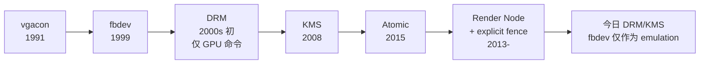
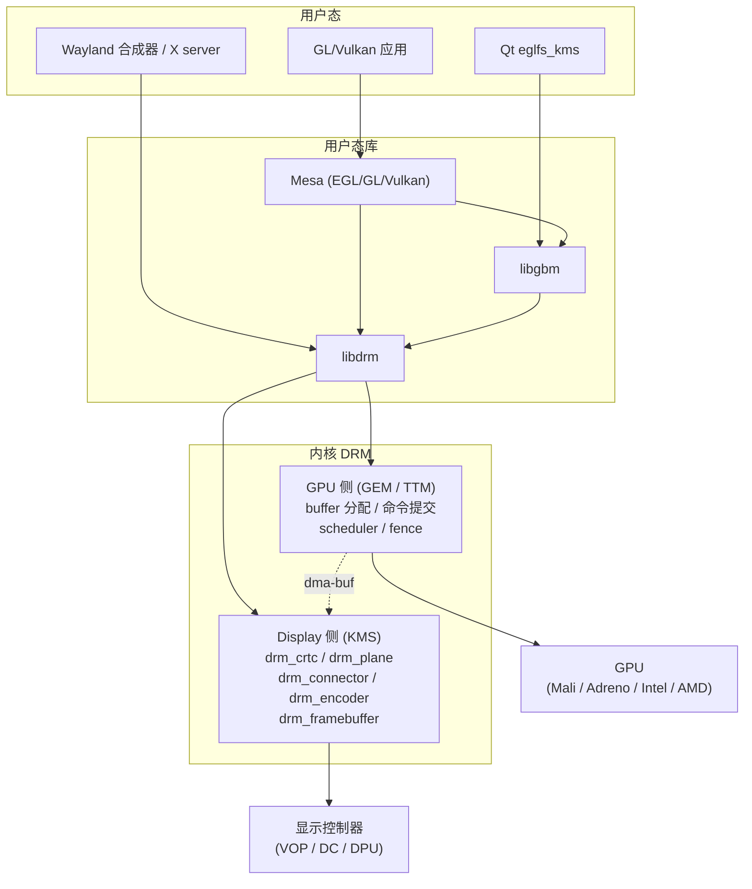
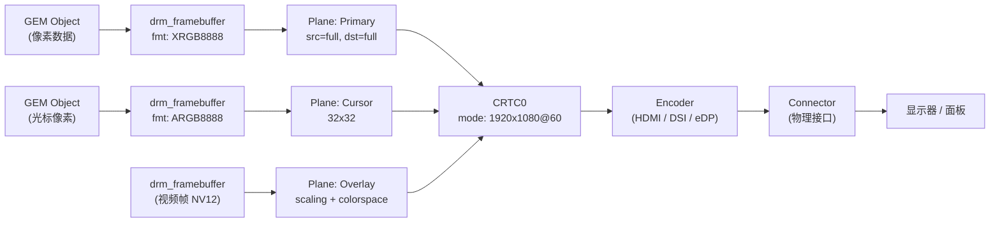
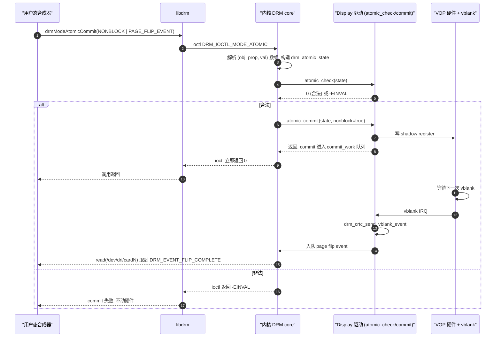
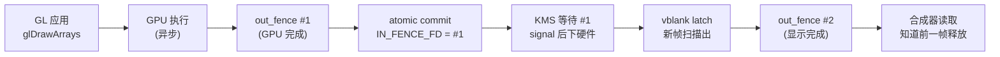
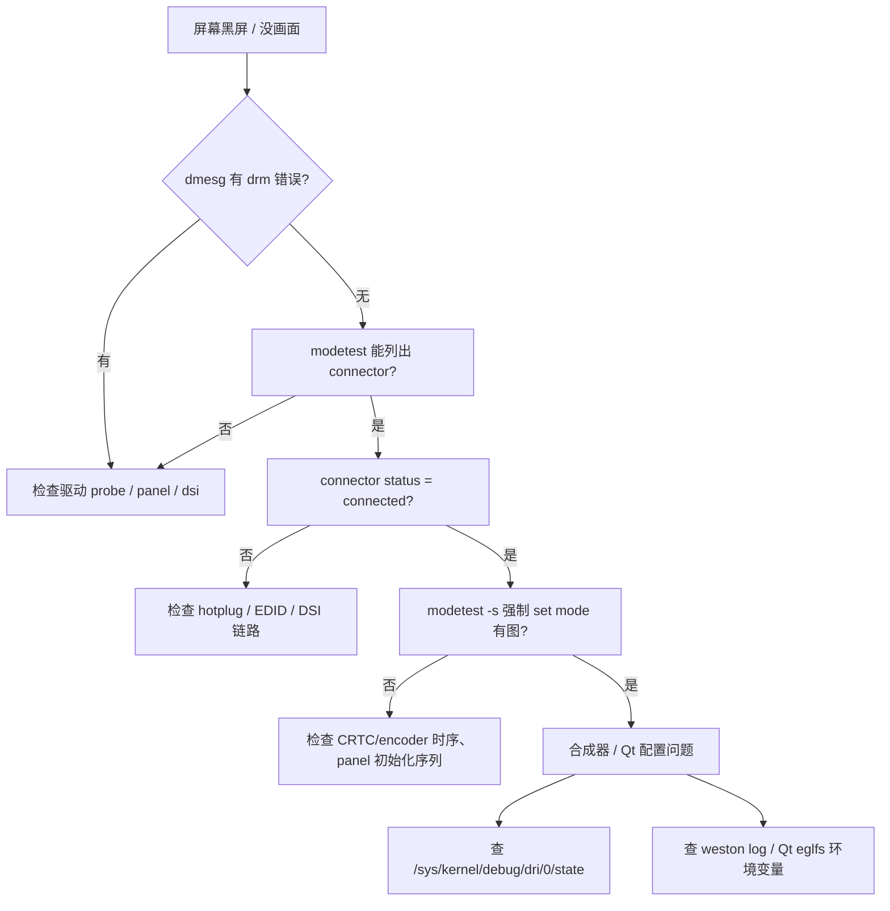

# 内核图形子系统：Framebuffer 与 DRM/KMS

> [!note]
> **Ref:**
> - 内核源码 `drivers/gpu/drm/`、`include/drm/`、`include/uapi/drm/`、`drivers/video/fbdev/`
> - [Kernel docs: GPU Driver Developer's Guide](https://docs.kernel.org/gpu/index.html)
> - [LWN: KMS series](https://lwn.net/Articles/653071/)
> - Rockchip VOP2 驱动 `drivers/gpu/drm/rockchip/`
> - 本仓库 [[01-ui-stack-overview]]、[[03-wayland-weston]]

本文是 Linux 图形栈系列的内核侧汇总。上层应用与窗口系统的关系见 [[01-ui-stack-overview]]，Wayland/Weston 合成器细节见 [[03-wayland-weston]]，Qt 应用如何选择平台后端见 [[02-qt-application]]。这里聚焦于内核：**fbdev 为什么不够用，DRM/KMS 又是怎么补齐这些短板的**。

---

## 1. 背景与历史

Linux 图形栈在内核里走过了一条从"只能写像素"到"能整体管理显示管线 + GPU 资源"的演化路径。要理解今天的 DRM/KMS，先看它的前身。

### 1.1 vgacon 与文本控制台

最早 Linux 启动时只有 `vgacon`：通过 VGA 的文本模式（80x25 字符 + 16 色）直接读写显存段 `0xB8000`。这套机制只服务于内核打印（`printk` 经过 `console` 框架最终落到 vgacon），与图形应用无关。

### 1.2 fbdev：第一代统一抽象

进入 X11 时代以后，X server 接管了图形输出，但仍然存在两个问题：
- 控制台（VT）切到图形模式需要一个内核侧的接口，否则 X 崩了就只剩黑屏。
- 不同显卡驱动需要一套**与硬件无关**的"提供一块可写像素的缓冲区"的抽象。

fbdev（framebuffer device）正是为此而生：
- 用户态可以 `open("/dev/fb0")` + `mmap` 拿到一块线性显存。
- 提供 `FBIOPUT_VSCREENINFO` / `FBIOPAN_DISPLAY` 等 ioctl 切换分辨率、做双缓冲翻页。
- 内核态控制台 `fbcon` 在 fbdev 之上绘制文本，从此控制台也是图形的（中文、字体、Logo 都成为可能）。

但 fbdev 的抽象是"一块平面像素 + 几个 ioctl"，**没有**：
- plane / overlay 的概念（硬件多 layer 完全没法用）。
- 模式设置的统一对象模型（每个驱动各自实现 set_par）。
- 显式同步（fence、page flip event）。
- GPU 命令提交（fbdev 完全不管 3D）。
- 缓冲共享（无法把一块 buffer 同时给 camera/codec/display）。

### 1.3 DRM 的诞生

90 年代末，Utah-GLX、DRI（Direct Rendering Infrastructure）项目想让多个 OpenGL 客户端 + X server 同时直接访问 GPU，而不是每次都让 X server 当中转代理。这就需要一个内核驱动来做"命令提交仲裁 + 显存管理"——这就是 **DRM (Direct Rendering Manager)**。

最早的 DRM 只管 GPU 侧：分配 buffer、提交命令 batch、做硬件锁定。模式设置（resolution、timing）依然在用户态的 X driver 里。

### 1.4 KMS 的加入

"模式设置在用户态"带来的灾难：
- X server 崩溃 → 显示模式残留，控制台读不出来。
- VT 切换（Ctrl+Alt+F1）需要先把模式还原到 text，X 再设回 graphics → 黑屏闪烁数秒。
- suspend/resume 时序极其脆弱。
- 多 GPU、多 head 完全没法协调。

2008 年前后，**KMS (Kernel Mode Setting)** 被引入 DRM：把"设置显示模式"的能力从用户态 X driver 拉回内核。从此：
- 控制台、X、Wayland 共享同一份模式设置代码。
- VT 切换无闪烁。
- plymouth 启动动画可以接管显示（无需等 X）。
- 多 Plane / Atomic 等高级特性成为可能。

### 1.5 fbdev 的现状

- **新平台**：一律用 DRM/KMS。Rockchip、Allwinner、i.MX8、Mediatek、NVIDIA Tegra、Intel、AMD 全部都是 DRM 驱动。
- **fbdev 仍然存在**：作为 DRM 驱动的"emulation 兼容层"（`drm_fb_helper` / `fbdev_emulation` / 现在改名为 `fbdev_generic`）。`/dev/fb0` 实际上是 DRM 驱动伪造出来给老应用用的。
- **老平台 / 极简平台**：i.MX6ULL 的 `mxsfb`、一些极小 SoC 还是纯 fbdev 驱动，因为它们根本没有 GPU。本仓库的 i.MX6ULL BSP 就是这种情况。

### 1.6 时间线小结



### 1.7 关键里程碑细节

- **2000**：DRM 进入主线（2.3.x），最初为 3dfx Voodoo、Matrox、ATI Rage 提供命令通道。
- **2003**：DRI2 拆分 X server 与 direct rendering 客户端的 buffer 协议。
- **2008**：KMS 在 Intel `i915` 驱动上首次合入；Fedora 9 默认开启。
- **2011**：dma-buf 合入（3.3 内核），跨子系统共享 buffer 成为可能。
- **2013**：DRM render node 合入（3.12 内核）。
- **2015**：Atomic modesetting 合入（4.0 内核）。
- **2017**：drm_syncobj 合入（4.13 内核），Vulkan 显式同步落地。
- **2020+**：fbdev helper 进一步弱化，新驱动只需提供 `drm_client_setup_with_fourcc` 即可获得 fbdev emulation。

这条时间线说明：今天的内核图形栈是**一层一层叠加补齐**的产物。学习时按这个顺序看每一层补了什么，比单独读源码更容易抓住要点。

---

## 2. fbdev 简介

虽然 fbdev 已是 legacy，但理解它能让我们看清 DRM/KMS 解决了什么问题。

### 2.1 设备模型

- 字符设备 `/dev/fbN`（N=0,1,...），主设备号 29。
- sysfs 路径 `/sys/class/graphics/fbN/`：包含 `bits_per_pixel`、`modes`、`virtual_size`、`stride` 等。
- 内核内驱动注册到 `fb_info` 链表，由 `drivers/video/fbdev/core/fbmem.c` 统一管理。

### 2.2 关键 ioctl

| ioctl | 作用 |
|-------|------|
| `FBIOGET_VSCREENINFO` | 读"可变屏幕信息"：xres、yres、bits_per_pixel、xoffset/yoffset |
| `FBIOPUT_VSCREENINFO` | 修改可变信息（如分辨率、虚拟分辨率、pan 偏移） |
| `FBIOGET_FSCREENINFO` | 读"固定屏幕信息"：smem_start、smem_len、line_length |
| `FBIOPAN_DISPLAY` | 切换显示原点（实现简单双缓冲） |
| `FBIOBLANK` | 关闭 / 打开显示（省电） |
| `FBIO_WAITFORVSYNC` | 等待垂直同步（不是所有驱动都实现） |

### 2.3 用户态最小示例

```c
int fd = open("/dev/fb0", O_RDWR);
struct fb_var_screeninfo var;
struct fb_fix_screeninfo fix;
ioctl(fd, FBIOGET_VSCREENINFO, &var);
ioctl(fd, FBIOGET_FSCREENINFO, &fix);

size_t size = fix.line_length * var.yres;
uint8_t *fb = mmap(NULL, size,
                   PROT_READ | PROT_WRITE,
                   MAP_SHARED, fd, 0);

// 直接写像素（假设 RGB565）
for (int y = 0; y < var.yres; y++) {
    uint16_t *row = (uint16_t *)(fb + y * fix.line_length);
    for (int x = 0; x < var.xres; x++)
        row[x] = (x ^ y) & 0xFFFF;
}

munmap(fb, size);
close(fd);
```

### 2.4 fbdev 的"硬伤"

- **无 plane / overlay**：硬件就算支持多 layer，fbdev 也只能看到一个 primary plane。
- **无 atomic**：改分辨率、改 pan、改 blanking 都是分开 ioctl，无法一次提交、原子生效。
- **无 fence**：page flip 后什么时候真的扫描出新帧？只能 `FBIO_WAITFORVSYNC` 阻塞等。
- **无 GPU 命令通道**：fbdev 完全不是 GPU 驱动，3D / 视频解码硬件加速无从谈起。
- **buffer 共享差**：fbdev 的 buffer 是 fbmem 内部的，camera v4l2 或 codec 拿到这块内存只能靠 hacky 的物理地址传递。

DRM/KMS 把以上五条短板全部补齐。

### 2.5 内核侧 fbdev 驱动骨架

为了对比，简单看一下纯 fbdev 驱动的代码结构（i.MX6ULL `mxsfb` 风格）：

```c
static struct fb_ops mxsfb_ops = {
    .owner          = THIS_MODULE,
    .fb_check_var   = mxsfb_check_var,
    .fb_set_par     = mxsfb_set_par,
    .fb_setcolreg   = mxsfb_setcolreg,
    .fb_blank       = mxsfb_blank,
    .fb_pan_display = mxsfb_pan_display,
    .fb_fillrect    = sys_fillrect,
    .fb_copyarea    = sys_copyarea,
    .fb_imageblit   = sys_imageblit,
    .fb_mmap        = mxsfb_mmap,
};

static int mxsfb_probe(struct platform_device *pdev) {
    struct fb_info *info = framebuffer_alloc(sizeof(*ctx), &pdev->dev);
    info->fbops = &mxsfb_ops;
    info->screen_base = dma_alloc_wc(...);   // 分配显存
    register_framebuffer(info);              // /dev/fbN 出现
    return 0;
}
```

可以看到 fbdev 的"对象模型"就是单个 `fb_info` 加几个回调，简单是简单，但所有"显示管线分层"的概念都不存在。要表达多 layer 必须扩 ioctl，各家自由发挥，毫无可移植性——这正是 KMS 要解决的问题。

---

## 3. DRM/KMS 总体架构

### 3.1 两套设备节点

```
/dev/dri/card0          # legacy / primary node, 特权
/dev/dri/renderD128     # render node, 无显示控制，仅 GPU 提交
```

- **card0**：可以做模式设置（KMS）+ GPU 提交。一台机器一时只能有一个进程成为它的 "DRM master"（一般是 X server 或 Wayland 合成器）。
- **renderD128**：DRM 1.2+ 引入。**没有**模式设置能力，**只**做 GPU 渲染 / 计算。普通用户进程（如 Chromium 的 GPU process）即使没有 DRM master，也能通过 render node 用 GPU。

权限：`card0` 一般 `crw-rw----+ root video` 加 ACL（logind 把 seat 上的活跃用户加进 ACL）；`renderD128` 一般 `crw-rw----+ root render`。

### 3.2 子系统切分

DRM 内部其实是两个相对独立的子系统：



- **Display 侧（KMS）**：管显示控制器，对外暴露 CRTC / Plane / Encoder / Connector / Framebuffer 一套对象模型，操作通过 `DRM_IOCTL_MODE_*` 完成。
- **GPU 侧（GEM/TTM/scheduler）**：管 GPU buffer 分配、命令 batch 提交、引擎调度、fence。

在 ARM SoC 上，这两块通常是**两个独立的 DRM 驱动**：
- Display：`rockchip-drm`、`sun4i-drm`、`imx-drm`、`mediatek-drm`。
- GPU：`panfrost`（Mali）、`lima`（旧 Mali）、`v3d`（树莓派）、`msm`（Qualcomm）。

两者之间通过 **dma-buf / PRIME** 共享 buffer：GPU 渲染好的 buffer 用 dma-buf 导出，display 驱动 import 后作为 framebuffer 扫描出去。

在 x86 上，Intel `i915`、AMD `amdgpu` 这种"单驱动包含 display + GPU"也很常见。

### 3.3 libdrm 与 udev/logind

- **libdrm**：薄薄一层 ioctl 包装（`drmModeGetResources`、`drmModeAtomicCommit`、`drmIoctl` 等）。所有上层（Mesa、Weston、Qt）都用它。
- **udev**：负责创建 `/dev/dri/*` 节点、加载固件、设置权限。
- **logind / seatd**：管理"哪个用户在哪个 seat 上是活跃的"，把 card 节点的 ACL 授予活跃用户，并通过 `TakeDevice` D-Bus 方法把 fd 交给合成器。

---

## 4. KMS 对象模型

这是理解整个 DRM 显示侧的"金钥匙"。

### 4.1 对象一览

| 对象 | 含义 |
|------|------|
| `drm_framebuffer` | 一块带格式（DRM_FORMAT_*）和 stride 的内存。**不包含**像素数据所有权，只是"指向若干 GEM object + 格式描述"。 |
| `drm_plane` | 合成层。Primary（必选）、Cursor（可选）、Overlay（可选）。每个 plane 在某一时刻引用一个 framebuffer，并指定它在 CRTC 上的 src/dst 区域。 |
| `drm_crtc` | "扫描出引擎"。把若干 plane 合成成一帧，按 mode 指定的时序送给 encoder。 |
| `drm_encoder` | 像素格式打包器。比如把 RGB 像素串行化成 LVDS / TMDS / DSI 命令。 |
| `drm_connector` | 物理输出口（HDMI、eDP、MIPI-DSI、DP、VGA、Composite）。负责读 EDID、检测 hotplug、提供可用 mode 列表。 |
| `drm_display_mode` | 一组时序参数：`hdisplay/vdisplay/hsync_*/vsync_*/clock/flags`。 |
| `drm_property` | 通用属性机制。所有可写的"旋钮"（如 plane 的 src_x、CRTC 的 active）都是 property。 |

### 4.2 串接关系



要点：
- **Plane → CRTC** 是 N:1（一个 CRTC 上可以挂多个 Plane）。
- **CRTC → Encoder** 通常 1:1，但 Encoder 可与多个 CRTC 兼容（"possible_crtcs" mask）。
- **Encoder → Connector** 通常 1:1。
- **Framebuffer** 是被引用的对象，可以同时被多个 plane 引用（少见，但合法）。

### 4.3 Mode 与 EDID

- Connector 在 `detect()` 阶段读 EDID（HDMI/eDP/DP via DDC、AUX channel），解析出 mode 列表 → 暴露给用户态。
- 用户态从 mode list 中挑一个，构造一次 atomic commit，把它 set 到 CRTC 上。
- 内部 MIPI-DSI 屏（如 TSPI D310T9362V1）通常没有 EDID，mode 在 DTS 里写死或由 panel driver 提供。

### 4.4 以 Rockchip RK3566 VOP2 为例

Rockchip RK3566 SoC 的显示控制器是 **VOP2**（Video Output Processor 2），它的硬件→KMS 对象映射如下：

| 硬件单元 | KMS 对象 | 备注 |
|----------|----------|------|
| VP0、VP1（Video Port） | 2 个 `drm_crtc` | VP0 可接 HDMI/eDP/DSI；VP1 一般接副屏 |
| Cluster Layer 0/1 | 2 个 `drm_plane`（Primary 类） | 支持 AFBC（ARM Framebuffer Compression） |
| Esmart Layer 0/1 | 2 个 `drm_plane`（Overlay 类） | 支持 scaling、YUV |
| Smart Layer 0/1 | 2 个 `drm_plane`（Overlay 类） | 简化路径 |
| HDMI TX | 1 个 `drm_encoder` + `drm_connector` | `dw-hdmi` 复用 |
| MIPI-DSI Host | 1 个 `drm_encoder` + 通过 panel-bridge 接 `drm_connector` | `dw-mipi-dsi` |
| eDP | 1 个 `drm_encoder` + `drm_connector` | |

DTS 中关键节点：

```dts
vop: vop@fe040000 {
    compatible = "rockchip,rk3568-vop";
    // ...
};

vop_mmu: iommu@fe043e00 {
    compatible = "rockchip,rk3568-iommu";
    // ...
};

dsi0: dsi@fe060000 {
    compatible = "rockchip,rk3568-mipi-dsi";
    ports { /* 输入来自 VOP，输出去 panel */ };
};
```

驱动入口：
- `drivers/gpu/drm/rockchip/rockchip_drm_drv.c`：注册整个 DRM 设备，做 component bind。
- `drivers/gpu/drm/rockchip/rockchip_drm_vop2.c`：VOP2 主体，创建 CRTC + Plane。
- `drivers/gpu/drm/rockchip/dw_mipi_dsi.c`：DSI host 驱动 + encoder。
- `drivers/gpu/drm/bridge/`：panel bridge / dsi bridge。
- `drivers/gpu/drm/panel/panel-*`：具体 panel driver（设置初始化序列、提供 mode）。

本仓库 TSPI 3.1 寸 MIPI-DSI 屏的移植日志见 `note/BSP-Dev/LCD-Touch/TSPI-D310T9362V1/Port-log/`。

### 4.5 Property 体系

KMS 的几乎所有"可写参数"都通过 `drm_property` 暴露，atomic commit 就是"批量改一堆 property"。常见 property：

- **CRTC**：`ACTIVE`（开/关 CRTC）、`MODE_ID`（绑定 blob 形式的 mode）、`OUT_FENCE_PTR`。
- **Plane**：`FB_ID`、`CRTC_ID`、`SRC_X/Y/W/H`（16.16 定点，相对 framebuffer）、`CRTC_X/Y/W/H`（相对 CRTC）、`zpos`、`rotation`、`pixel blend mode`、`IN_FENCE_FD`。
- **Connector**：`CRTC_ID`、`DPMS`、`EDID`（只读 blob）、`link-status`、`HDR_OUTPUT_METADATA`。

用 `proptest`、`drm_info` 可以把它们全 dump 出来：

```sh
drm_info | less
proptest -M rockchip
```

### 4.6 关键内核数据结构速查

| 结构体 | 头文件 | 角色 |
|--------|--------|------|
| `struct drm_device` | `<drm/drm_device.h>` | 一个 DRM 设备实例，对应 `/dev/dri/cardN` |
| `struct drm_file` | `<drm/drm_file.h>` | 每个 `open()` 一份；持有 GEM handle 命名空间 |
| `struct drm_framebuffer` | `<drm/drm_framebuffer.h>` | 一块 FB（指向若干 GEM + 格式 + modifier） |
| `struct drm_plane` / `drm_plane_state` | `<drm/drm_plane.h>` | Plane 对象与其状态 |
| `struct drm_crtc` / `drm_crtc_state` | `<drm/drm_crtc.h>` | CRTC 对象与其状态（mode、enable） |
| `struct drm_encoder` | `<drm/drm_encoder.h>` | Encoder |
| `struct drm_connector` / `drm_connector_state` | `<drm/drm_connector.h>` | Connector |
| `struct drm_atomic_state` | `<drm/drm_atomic.h>` | 一次 atomic commit 的完整 staging state |
| `struct drm_gem_object` | `<drm/drm_gem.h>` | GEM 对象基类 |
| `struct dma_buf` / `dma_resv` / `dma_fence` | `<linux/dma-buf.h>` `<linux/dma-resv.h>` `<linux/dma-fence.h>` | 跨子系统 buffer 与同步 |
| `struct drm_panel` | `<drm/drm_panel.h>` | 面板抽象（DSI / DPI 屏） |
| `struct drm_bridge` | `<drm/drm_bridge.h>` | 中间桥（DSI bridge、LVDS bridge） |

每个"state"结构都是**可复制、可回滚**的——这是 atomic 设计的精髓：在 commit 真正下发前，所有改动都只在副本上发生，check 通过才 swap in。

---

## 5. Atomic Modesetting

### 5.1 Legacy vs Atomic

**Legacy KMS ioctl**（按对象分别下发）：

| ioctl | 行为 |
|-------|------|
| `DRM_IOCTL_MODE_SETCRTC` | 设置 CRTC mode 并绑定 primary framebuffer |
| `DRM_IOCTL_MODE_PAGE_FLIP` | 翻页：换 primary plane 的 framebuffer |
| `DRM_IOCTL_MODE_CURSOR` | 设光标 |
| `DRM_IOCTL_MODE_SETPLANE` | 设 overlay plane |

问题：
- 一次"开机时 set mode + 在 overlay 上挂视频 + 调光标位置"要发三四个 ioctl，**没有原子性**。中间任何一个失败，已下发的会留下半完成状态。
- 无法事先 dry-run 检查"这套配置硬件能不能扛得住"。
- 没有统一的 fence in/out 接口。

**Atomic ioctl** (`DRM_IOCTL_MODE_ATOMIC`)：

一次提交一个 `<object_id, property_id, value>` 三元组的数组。语义：
- 要么全部生效，要么全部回滚。
- `DRM_MODE_ATOMIC_TEST_ONLY` flag：只做合法性检查，不真的下发硬件。
- `DRM_MODE_ATOMIC_NONBLOCK`：非阻塞，配合 page flip event 异步通知。
- `DRM_MODE_ATOMIC_ALLOW_MODESET`：允许这次 commit 改 mode（重置）。
- `DRM_MODE_PAGE_FLIP_EVENT`：commit 完成后从 `/dev/dri/cardN` 读到一个 event。

### 5.2 内核侧两阶段

驱动实现 `drm_mode_config_funcs.atomic_check` 与 `.atomic_commit` 两个回调，对应 helper `drm_atomic_helper_check` / `drm_atomic_helper_commit`：

1. **atomic_check**：复制出一个 `drm_atomic_state`，把用户提交的 property 值套进去，遍历所有受影响对象的 `atomic_check`，让驱动判断"这套组合能不能在硬件上跑"。任何一个返回非 0 → 整次 commit 拒绝。
2. **atomic_commit**：把新 state 真正"swap in"，按受影响对象顺序更新硬件寄存器；如果是 vsync 类型的更改（page flip、plane fb），通常用 shadow register + 在 vblank 时刻硬件自动 latch，避免撕裂。

### 5.3 一次完整 atomic commit 的时序



### 5.4 fence 与异步

- **IN_FENCE_FD**（plane property）：commit 时告诉内核"这个 plane 的 buffer 还在被 GPU 写，要等这个 fence signal 后再扫描出"。GPU 不必先 CPU 等待。
- **OUT_FENCE_PTR**（CRTC property）：内核回填一个 fd，用户态可以用它表示"上一帧扫描完成"。
- **PAGE_FLIP_EVENT**：legacy 风格，仍可用，但 fence 路径更通用。

### 5.5 TEST_ONLY 的妙用

合成器在做"试着把这帧整成 4 个 plane"时，先发一次 TEST_ONLY commit；如果硬件说带不动（带宽超限、scaler 不够），合成器就 fallback 到 GPU 合成。这是 Weston / Mutter 实现 "direct scanout" 的基础。

### 5.6 一次 atomic commit 的 ioctl payload 剖面

用户态构造 atomic 请求时，实际通过 `struct drm_mode_atomic` 描述：

```c
struct drm_mode_atomic {
    __u32 flags;                  // ATOMIC_TEST_ONLY / NONBLOCK / PAGE_FLIP_EVENT / ALLOW_MODESET ...
    __u32 count_objs;             // 涉及多少对象
    __u64 objs_ptr;               // -> u32[count_objs]      每个对象 ID
    __u64 count_props_ptr;        // -> u32[count_objs]      每个对象有几个 property 改动
    __u64 props_ptr;              // -> u32[Σ count_props]   property ID 流
    __u64 prop_values_ptr;        // -> u64[Σ count_props]   property value 流
    __u64 reserved;
    __u64 user_data;              // 回填到 page flip event 里
};
```

可见**所有信息都被收敛成一组 `(obj_id, prop_id, value)` 三元组**——这就是 atomic 的统一性来源。无论改 mode、改 plane 位置还是改 connector DPMS，都用同一个 ioctl。

### 5.7 driver 端 atomic_check 的典型工作

一个典型的 `crtc_atomic_check`：

1. 校验 mode 是否合法（pixel clock 在硬件范围内、HFP/HBP 合规）。
2. 校验绑在该 CRTC 上的所有 plane 总带宽不超过 VOP 的扫描带宽。
3. 校验 plane 重叠 / zpos 顺序是否硬件能合成。
4. 校验 scaler 数量是否够（VOP2 Esmart layer 才有 scaler）。
5. 若涉及 mode 改变，把 PLL/dclk 频率算好填进 `crtc_state->adjusted_mode`。

不通过就返回 `-EINVAL`，atomic 全体回滚。这种"先 dry-run 再下硬件"的模式让合成器可以**安全地试探最优 plane 布局**。

---

## 6. GEM 与 buffer 管理

显示侧的 framebuffer 必须指向一块真实的内存。这块内存怎么分配、谁拥有、能不能跨进程 / 跨子系统共享，是 DRM 的另一条主线。

### 6.1 GEM (Graphics Execution Manager)

- 每个 DRM 文件（`open("/dev/dri/card0")`）拥有自己的"GEM handle 名字空间"。
- `DRM_IOCTL_MODE_CREATE_DUMB` / `DRM_IOCTL_I915_GEM_CREATE` / driver-specific 的 ioctl 分配一块 buffer，返回一个 32-bit GEM handle。
- handle **不能直接跨进程传递**，因为不同 fd 下数字含义不同。

### 6.2 PRIME：GEM handle ↔ dma-buf fd

```
DRM_IOCTL_PRIME_HANDLE_TO_FD   # 把本 fd 下的 GEM handle 导出为一个 dma-buf fd
DRM_IOCTL_PRIME_FD_TO_HANDLE   # 把外来的 dma-buf fd 导入, 拿到本 fd 下的 GEM handle
```

- dma-buf fd 是真正的 fd，可以走 UNIX socket SCM_RIGHTS 传给另一个进程。
- 也可以传给其它子系统：v4l2、video codec、DRM 的另一个 device（如 GPU → display）。
- 这就是 "**PRIME**" 的本意：DRM 与 dma-buf 之间的桥。

### 6.3 TTM (Translation Table Maps)

- 一套更重的 buffer manager，主要解决"显存与系统内存之间的迁移"（独立 VRAM 卡）。
- AMD、Nouveau、VMware 等用 TTM。
- ARM SoC 几乎一律走 **GEM CMA helpers**（`drm_gem_cma_*`）—— 因为 SoC 上 GPU 和 display 共享系统 DRAM，没有独立 VRAM 概念，只需要连续物理内存（CMA）。

### 6.4 dma-buf：跨子系统的零拷贝桥

- 一个内核对象 `struct dma_buf`，绑定到一个 fd。
- 暴露接口：`attach / detach / map_dma_buf / unmap_dma_buf / mmap / vmap / begin_cpu_access / end_cpu_access`。
- 任何能"理解 sg_table"的驱动都可以 import：v4l2、drm、video codec、IIO 都行。
- 还自带 **dma-resv**（dma reservation object）：里面挂着 fence 链表，描述"这块 buffer 当前有谁在读、有谁在写"。这就是 implicit fence 的载体。

### 6.5 GBM (Generic Buffer Management)

- 用户态库 `libgbm`（来自 Mesa）。
- 解决"EGL/合成器想在 DRM 设备上分配一块**既能给 GPU 渲染、又能给 KMS scanout** 的 buffer"这个具体需求。
- 关键 API：
  - `gbm_device_create(drm_fd)` —— 在某个 DRM fd 上建一个 GBM 设备。
  - `gbm_surface_create(gbm, w, h, format, GBM_BO_USE_SCANOUT | GBM_BO_USE_RENDERING)` —— 建一个 GBM surface，让 EGL 在它上面建 EGLSurface。
  - `gbm_bo_get_handle / get_fd / get_stride / get_modifier` —— 从 BO 拿到 GEM handle 或 dma-buf fd，给 `drmModeAddFB2` 构造 framebuffer。
- 工作流：

```
1. eglGetPlatformDisplay(EGL_PLATFORM_GBM_KHR, gbm_device)
2. eglCreateWindowSurface(..., gbm_surface)
3. 应用绘制 → eglSwapBuffers
4. gbm_surface_lock_front_buffer() 取到一个 gbm_bo
5. drmModeAddFB2(gbm_bo 的 handle / stride / format / modifier)
   构造 framebuffer
6. drmModeAtomicCommit 把 fb 挂到 plane 上扫描出
7. vblank 后, gbm_surface_release_buffer(prev_bo)
```

- 没有 GBM 时，Qt `eglfs_kms` / Weston `drm-backend` / SDL2 KMSDRM 完全跑不起来。

### 6.6 在 i.MX6ULL 上为什么这些都用不上

i.MX6ULL **没有 GPU**，显示控制器是 `mxsfb` + LCD 接口。BSP 默认是 fbdev 驱动，不是 DRM。因此 dma-buf / PRIME / GBM 在该平台不实质生效，Qt 一般用 `linuxfb` 插件直接 mmap framebuffer。

### 6.7 modifier 与 tiling / 压缩格式

`drmModeAddFB2WithModifiers` 引入了 `modifier` 概念：同样是 `DRM_FORMAT_XRGB8888` 像素，可能是线性排布，也可能是 GPU 偏好的 tiling 排布，甚至是压缩格式。

常见 modifier：

| Modifier | 含义 |
|----------|------|
| `DRM_FORMAT_MOD_LINEAR` | 线性，CPU 友好，扫描出也支持 |
| `DRM_FORMAT_MOD_ARM_AFBC(...)` | ARM Framebuffer Compression，Mali / RK VOP2 支持 |
| `I915_FORMAT_MOD_X_TILED` / `Y_TILED` / `Yf_TILED` | Intel GPU tiling |
| `DRM_FORMAT_MOD_QCOM_COMPRESSED` | Qualcomm UBWC |

合成器协商 modifier 的流程：

1. Plane 通过 IN_FORMATS blob 暴露 "我能 scanout 哪些 (fmt, modifier) 组合"。
2. EGL 通过 `EGL_EXT_image_dma_buf_import_modifiers` 暴露 "我能渲染到哪些 modifier"。
3. 合成器取**交集**，挑一个最优的（一般是 AFBC > tiling > linear）。
4. 用该 modifier 分配 GBM BO → 包成 DRM FB → 挂 plane。

这套机制让"GPU 直接渲染压缩格式 + display 直接扫描压缩格式"成为可能，省一半带宽。

---

## 7. 同步原语

DRM 里"什么时候 buffer 真的可被使用 / 真的扫描完"靠 fence 描述。

### 7.1 implicit fence (dma-resv)

- buffer 的 `dma_buf->resv` 里挂着 fence。
- producer（GPU）提交 batch 时 attach 一个 "exclusive write fence"。
- consumer（display）在 commit 时不显式传 fence，driver 内部自己从 `dma_resv` 里读 fence 并等待。
- 优点：兼容老用户态。
- 缺点：粒度只能"整个 buffer"，无法 per-job、per-region。

### 7.2 explicit fence (sync_file / drm_syncobj)

- **sync_file**：一个 fd，包一个或多个底层 dma_fence。EGL_ANDROID_native_fence_sync 通过它返回 fence 给应用。
- **drm_syncobj**：DRM 自己的 sync 对象，可以是 binary（一次性）或 timeline（单调递增 value）。Vulkan 的 timeline semaphore 走它。
- 显式 fence 路径：GPU 提交时 `OUT_FENCE_FD` 拿到 fd → 传给 atomic commit 的 `IN_FENCE_FD` plane property。

### 7.3 vblank event / page flip event

- 用户态 `read(card_fd)` 可以拿到事件结构（`struct drm_event_vblank`），含 timestamp、sequence、user_data。
- 合成器拿这个事件来调度下一帧的渲染节奏（"present"）。
- 没有它就只能 polling 或 sleep，效果差。

### 7.4 高刷新率 / VRR

- DRM 新加 `VRR_ENABLED` connector property、CRTC 的 `vrr_enabled`、`async page flip`。
- 配合 FreeSync / G-Sync 实现可变刷新率。

### 7.5 fence 在管线中的接力图



这种"接力"让 CPU 不需要忙等 GPU，全管线异步流水。

---

## 8. Render Node 与权限模型

### 8.1 为什么把 render 拆出来

历史上 `/dev/dri/cardN` 既能做模式设置又能做 GPU 渲染。问题：
- 浏览器 GPU process、CUDA、机器学习推理都只想用 GPU 计算，根本不关心显示。
- 让它们成为 DRM master 会和合成器冲突。
- 给它们 cardN 的权限相当于给了它们"改你显示模式"的能力，安全隐患大。

于是引入 render node：
- 同一个 GPU 设备同时暴露 `card0` 和 `renderD128`。
- `renderD128` 上**所有 KMS ioctl 都被拒绝**。
- 普通用户加入 `render` 组就能用 GPU，但不能改显示。

### 8.2 DRM master

- 同一时刻一个 `card0` 只能有一个 DRM master。
- 通过 `DRM_IOCTL_SET_MASTER` / `DROP_MASTER` 切换。
- legacy 模式下 X server 在打开 cardN 时自动成为 master。
- 现代模式下 logind 持有 master，把 fd 通过 D-Bus 交给合成器（同时 drop master），合成器再 set master。VT 切换时 logind 帮所有用户 drop / 再 set。

### 8.3 logind / seatd / elogind

- **logind**（systemd 的一部分）：管理用户 session 和 seat。
- **seatd**：无 systemd 时的替代，作用相同。
- 它们通过 udev tag (`uaccess`) + ACL 给当前 seat 的活跃用户加 cardN 读写权限，避免合成器要 root 才能跑。

---

## 9. fbdev emulation 与 DRM

很多老应用、嵌入式 UI 框架仍然 `open("/dev/fb0")` + `mmap`。要兼容它们，现代 DRM 驱动会注册一个 "fbdev emulation"：

- helper：`drm_fb_helper`（即将被 `drm_client_setup_with_fourcc` / `fbdev_generic` 取代）。
- 它在 DRM 驱动 probe 完成后，自动建一个 dumb buffer，把它包成 `drm_framebuffer`，再注册一个 `fb_info` 到 fbdev 框架。
- 结果：`/dev/fb0` 出现，`mmap` 拿到的就是那块 dumb buffer 的线性映射；Qt `linuxfb`、纯 fbdev 测试程序、`fbcon` 内核控制台都能继续跑。

### 9.1 限制

- emulation 只暴露一个 plane（primary）、一个 mode，**无 atomic、无 overlay、无 fence**。
- 多 head 时只对应第一个 CRTC。
- 想用 vsync / multi-plane / direct scanout，必须直接用 DRM。

### 9.2 与 Qt 平台插件的关系

- `linuxfb` 插件 → 走 fbdev emulation，能跑但不能用上 atomic、不能 vsync。
- `eglfs_kms` 插件 → 直接 DRM + GBM + EGL，享受全部 KMS 特性，i.MX8/RK 系列推荐这条路。
- 详见 [[02-qt-application]]。

### 9.3 emulation 模式下的诡异现象

实际工程中常遇到两类容易混淆的现象：

1. **看似有 `/dev/fb0`，其实是 DRM 伪造**。`cat /proc/modules | grep drm` 有结果，说明它是 DRM emulation；纯 mxsfb 才是真 fbdev。
2. **emulation 的分辨率与 KMS 不一致**。emulation 默认绑到第一个 connector 上的"preferred mode"。在 connector 还没真插显示器时（headless 启动），它可能挑了一个 fallback 640x480，导致 Qt `linuxfb` 看到的尺寸不对。解决办法：用 `video=` 内核命令行强制，或干脆改用 `eglfs_kms`。
3. **emulation 写像素扫不出来**。多 plane 硬件下，emulation 只占 primary plane，如果合成器也在跑（占了 plane），plane 会被合成器后写覆盖。互斥地使用：要么纯 fbdev 路径，要么纯 DRM 路径。

---

## 10. 典型用户态客户

| 客户 | 主要后端 | 备注 |
|------|----------|------|
| X.Org `modesetting` driver | DRM/KMS via libdrm | 通用 X driver，逐步取代厂家专有 driver |
| Weston | `drm-backend` | Wayland 参考合成器，详见 [[03-wayland-weston]] |
| Mutter (GNOME) | DRM/KMS + EGL/GLES | 也支持 X11 后端 |
| KWin (KDE) | DRM/KMS via libdrm | wayland session |
| Sway / wlroots | DRM/KMS via libdrm | tiling WM |
| Qt 6 `eglfs_kms` | DRM/KMS + GBM + EGL | 嵌入式 Qt 首选 |
| Qt 6 `eglfs_kms_egldevice` | EGLDevice（NVIDIA） | NVIDIA Tegra 路径 |
| Qt 6 `linuxfb` | fbdev | i.MX6ULL 这种无 GPU 平台 |
| SDL2 `KMSDRM` | DRM/KMS + GBM | 游戏/模拟器嵌入式 |
| Chromium Ozone `drm` | DRM/KMS + GBM | Chrome OS / 嵌入式浏览器 |

### 10.1 命令行调试工具

| 工具 | 作用 |
|------|------|
| `modetest` | 来自 libdrm，列出 CRTC/Encoder/Connector/Plane/Mode；可直接 set mode + 显示测试图 |
| `proptest` | 列出所有 property、改 property 值 |
| `drm_info` | 友好的 JSON 输出，列出 capabilities、所有对象、property、format |
| `kmscube` | EGL/GLES 在 DRM/KMS + GBM 上画一个旋转的方块；最常用的"全链路通不通"测试 |
| `kmscube --atomic` | 用 atomic 路径跑 |
| `vbltest` | 测试 vblank event |
| `intel_gpu_top` / `radeontop` | GPU 利用率 |

### 10.2 一次典型问题排查路径



---

## 11. 嵌入式实战建议

针对 Rockchip RK3566 / TSPI 这类有 GPU 的 ARM SoC，落地选择：

### 11.1 平台插件 / 合成器选择

- **优先 `eglfs_kms`**（Qt 应用）或 Weston `drm-backend`（多应用 / Wayland 客户端）。理由：
  - 走 atomic commit，set mode 无闪烁、page flip 准确同步 vsync。
  - 用 GBM 分配的 buffer 是 GPU 渲染目标，可直接 scanout，零拷贝。
  - 支持 overlay plane（视频帧 NV12 直挂 plane，CPU/GPU 全程不碰像素）。
  - 支持 dma-buf + EGLImage，能跟 v4l2 camera / video codec 拼起来。
- **避免 `linuxfb`**：除非平台真没 GPU（如 i.MX6ULL），或者只跑一个 splash。

### 11.2 启动期检查清单

```sh
# 1. DRM 驱动是否加载
dmesg | grep -iE 'drm|vop|dsi|hdmi|panel'

# 2. card 节点是否齐
ls -l /dev/dri/

# 3. KMS 对象拓扑
modetest -M rockchip          # M 后跟驱动名

# 4. 当前 atomic state (debugfs)
cat /sys/kernel/debug/dri/0/state
cat /sys/kernel/debug/dri/0/name
cat /sys/kernel/debug/dri/0/clients

# 5. 跑通整条 GL → KMS 链路
kmscube
kmscube --atomic

# 6. Weston 试运行
weston --backend=drm-backend.so --tty=2

# 7. Qt eglfs 试运行
export QT_QPA_PLATFORM=eglfs
export QT_QPA_EGLFS_INTEGRATION=eglfs_kms
your_qt_app
```

### 11.3 debugfs 节点速查

| 路径 | 内容 |
|------|------|
| `/sys/kernel/debug/dri/0/state` | 当前 atomic state 全 dump，调试合成器最有用 |
| `/sys/kernel/debug/dri/0/framebuffer` | 所有活跃 FB |
| `/sys/kernel/debug/dri/0/gem_names` | GEM 对象列表（部分驱动） |
| `/sys/kernel/debug/dri/0/clients` | 谁打开了 card0、是否 master |
| `/sys/kernel/debug/dri/0/<crtc>/vrr_range` | VRR 范围 |
| `/sys/kernel/debug/dma_buf/bufinfo` | 全系统 dma-buf 实例 |

### 11.4 性能与功耗要点

- **direct scanout**：让视频帧直接挂 overlay plane，不要走 GPU 合成，省功耗、降延迟。
- **AFBC**：RK / Mali 支持的 framebuffer 压缩格式，传输带宽减半，过 modifier (`DRM_FORMAT_MOD_ARM_AFBC(...)`) 协商。
- **关闭 unused plane**：合成器用 `FB_ID=0` 把不用的 plane 关掉，省 VOP 带宽。
- **CRTC ACTIVE=0**：长期不显示时关 CRTC，省功耗（注意 panel 也要 power off）。

### 11.5 与本仓库其它笔记的衔接

- 上层栈一览：[[01-ui-stack-overview]]
- Qt 应用如何接入：[[02-qt-application]]
- Wayland / Weston：[[03-wayland-weston]]
- TSPI 3.1 寸 MIPI-DSI 屏移植：`note/BSP-Dev/LCD-Touch/TSPI-D310T9362V1/Port-log/`
- TSPI BSP / SDK 章节：`note/sdk/tspi/`

### 11.6 常见环境变量速查（Qt eglfs_kms / Weston）

| 环境变量 | 作用 |
|----------|------|
| `QT_QPA_PLATFORM=eglfs` | 用 eglfs 平台插件 |
| `QT_QPA_EGLFS_INTEGRATION=eglfs_kms` | 走 DRM/KMS 而不是 brcm/mali_egl |
| `QT_QPA_EGLFS_KMS_CONFIG=/etc/qt-kms.json` | 指定 KMS 配置 JSON（device、output、mode、virtualIndex） |
| `QT_QPA_EGLFS_KMS_ATOMIC=1` | 强制走 atomic 路径 |
| `QT_QPA_EGLFS_DEBUG=1` | 打印 KMS 探测、mode 选择、GBM 分配过程 |
| `QT_LOGGING_RULES=qt.qpa.*=true` | Qt 自身日志细化 |
| `WAYLAND_DEBUG=1` | Wayland 协议消息打印 |
| `WESTON_DRM_NO_MODIFIERS=1` | 关闭 modifier 协商，调试用 |
| `MESA_DEBUG=1` / `MESA_GLSL=dump` | Mesa 调试 |

一个最小 `qt-kms.json` 示例：

```json
{
    "device": "/dev/dri/card0",
    "outputs": [
        {
            "name": "DSI-1",
            "mode": "720x1280",
            "virtualIndex": 0
        }
    ]
}
```

### 11.7 嵌入式典型踩坑

- **panel 初始化序列错**：DSI 命令时序、reset 极性、power-on delay 任何一项错都黑屏。先用 `modetest -s` 直接打测试图，定位是 panel/DSI 还是合成器问题。
- **DTS pinctrl / clock 漏配**：DSI host 没有 byte clock / pixel clock 时 commit 必失败。`dmesg | grep -i dsi` 看是否报 "PLL not locked"。
- **iommu 没接好**：VOP2 必须经过 IOMMU 访问 DRAM，DTS 漏 `iommus = <&vop_mmu>` 会出现 "smmu fault" 然后画面花屏。
- **AFBC 未协商成功**：用户态以为开了 AFBC、内核驱动其实 fallback 到线性，导致带宽暴涨。看 `/sys/kernel/debug/dri/0/state` 中 plane 的 `fb-modifier` 字段确认。
- **Render node 权限**：浏览器或推理服务跑不动 GPU，通常是用户没加 `render` 组。

### 11.8 当显示完全黑屏时的最小自检脚本

```sh
#!/bin/sh
set -e
echo "== DRM 节点 =="
ls -l /dev/dri/ || true
echo
echo "== DRM 相关 dmesg =="
dmesg | grep -iE 'drm|vop|dsi|panel|hdmi' | tail -50
echo
echo "== modetest 概览 =="
modetest 2>/dev/null | head -80 || echo "modetest 不可用"
echo
echo "== sysfs connector status =="
for c in /sys/class/drm/card*-*/status; do
    echo "$c -> $(cat $c)"
done
echo
echo "== framebuffer / mode =="
for f in /sys/class/drm/card*-*/modes; do
    echo "$f:"
    cat $f 2>/dev/null | head -5
done
```

把它放到 `/usr/local/bin/drm-probe.sh`，上电后跑一遍，绝大多数显示问题都能定位到 connector / mode / 驱动 probe 这一层。

---

## 12. 小结

- **fbdev** 只解决了"给我一块像素内存"，缺 plane、缺 atomic、缺 fence、缺 GPU、缺共享，属于历史遗留。
- **DRM** 在 fbdev 之上把"GPU 命令提交 + buffer 管理"做了规范化。
- **KMS** 又在 DRM 中加入了"显示管线的对象模型"：Framebuffer / Plane / CRTC / Encoder / Connector。
- **Atomic** 把这套对象模型的所有改动收敛为一次可 test、可回滚、带 fence 的提交。
- **GEM + dma-buf + PRIME + GBM** 解决跨进程、跨子系统、跨驱动的 buffer 共享与零拷贝。
- 嵌入式 Linux 上，**只要平台有 GPU，就一律走 DRM/KMS + GBM + EGL** 这条路，fbdev 只作为兼容层留给极少数老组件。

理解了这套对象模型与对接关系，再去看 Rockchip VOP2、Wayland 合成器、Qt eglfs_kms 的源码就有了路标。后续 TSPI 屏移植、direct scanout 调优、AFBC 接通等具体话题，都建立在这一层之上。
