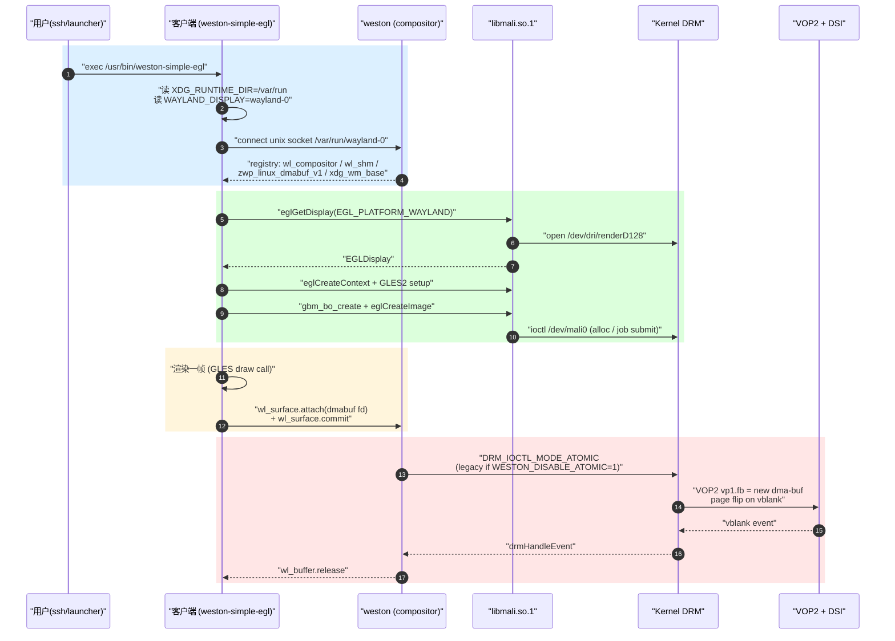

# tspi buildroot weston DE 实地剖析

> [!note]
> **Ref:**
> - `sdk/tspi-rk3566-sdk/output/.config`（顶层 SDK 配置，`RK_DEFCONFIG="rockchip_rk3566_taishanpi_1m_v10_defconfig"`）
> - `sdk/tspi-rk3566-sdk/device/rockchip/rk3566_rk3568/rockchip_rk3566_taishanpi_1m_v10_defconfig`
> - `sdk/tspi-rk3566-sdk/buildroot/configs/rockchip_rk3566_defconfig`
> - `sdk/tspi-rk3566-sdk/buildroot/configs/rockchip/gui/weston.config`
> - `sdk/tspi-rk3566-sdk/buildroot/configs/rockchip/gpu/mali.config`
> - `sdk/tspi-rk3566-sdk/buildroot/package/weston/{weston.mk, Config.in, S49weston, weston.sh, weston.service}`
> - `sdk/tspi-rk3566-sdk/buildroot/package/rockchip/rockchip-mali/rockchip-mali.mk`
> - `sdk/tspi-rk3566-sdk/buildroot/board/rockchip/common/post-build.sh`
> - `sdk/tspi-rk3566-sdk/buildroot/board/rockchip/common/overlays/10-weston/etc/xdg/weston/{weston.ini, weston.ini.d/*.ini}`
> - `sdk/tspi-rk3566-sdk/buildroot/output/rockchip_rk3566_taishanpi_1m_v10/rockchip_rk3566/target/etc/xdg/weston/weston.ini`（实际安装结果）
> - `sdk/tspi-rk3566-sdk/buildroot/output/.../target/usr/lib/libmali-bifrost-g52-g24p0-wayland-gbm.so`（Mali blob）
> - `sdk/tspi-rk3566-sdk/kernel-6.1/arch/arm64/configs/rockchip_linux_defconfig`
> - `prj/dts_tspi/tspi-rk3566-user-v10-linux.dts` + `tspi-rk3566-dsi-v10.dtsi`
> - 本仓库 [[01-ui-stack-overview]]、[[02-qt-application]]、[[03-wayland-weston]]、[[04-kernel-fb-drm-kms]]


## 1. 目的与全局结论

本笔记把 **tspi (RK3566 / Cortex-A55 4 核 / Mali-G52 Bifrost)** 这块 EVB 上 buildroot 出来的"桌面"从 SDK 入口一路扒到上屏的最后一英寸，回答三个问题：

1. **DE 究竟是什么？** 答：**Weston 14.0.2 + 自带的 `desktop-shell.so`**（不是 GNOME/KDE 也不是 Wayfire），背景图 + 底部任务栏 + Rockchip overlay 注入的几个 launcher（terminal、glmark2、weston-simple-egl、camera demo 等）。**没有 systemd**，由 BusyBox `init` 通过 SysV 风格的 `/etc/init.d/S49weston` 拉起。
2. **GPU 路径？** 闭源 **ARM Mali blob** `libmali-bifrost-g52-g24p0-wayland-gbm.so` 直接提供 `libEGL/libGLESv2/libgbm`（buildroot `rockchip-mali` 包通过 `ROCKCHIP_MALI_PROVIDES` 把这几个虚拟包顶上）；Mesa3D **没装**。内核侧走 Rockchip 自家的 `bifrost_kbase` (`CONFIG_MALI_BIFROST=y`)，而**不是** upstream `panfrost`。
3. **怎么在它上面开发？** 三条路径并存：
   - DE 内的 Wayland 客户端（GST、weston-simple-egl、Chromium-Wayland、自研 wayland-client）；
   - 把 `shell-desktop` 换成 `shell-kiosk`，单窗口全屏；
   - 完全踢掉 weston，应用直吃 DRM/KMS（Qt eglfs_kms 或 GBM+EGL+drm atomic）。

> [!important]
> SDK 同时打包了 buildroot / yocto / debian 三套 rootfs，**当前 active 的是 buildroot**（`RK_ROOTFS_SYSTEM="buildroot"`，`RK_ROOTFS_SYSTEM_BUILDROOT=y`，见 `output/.config:43-45`）。本笔记只覆盖 buildroot 这条线。


## 2. SDK 入口与 DEFCONFIG 链

### 2.1 顶层 SDK 选了哪个板子

`sdk/tspi-rk3566-sdk/output/.config:5-13`：

```
RK_DEFCONFIG="rockchip_rk3566_taishanpi_1m_v10_defconfig"
RK_CHIP_FAMILY="rk3566_rk3568"
RK_CHIP="rk3566"
RK_CHIP_ARM64=y
RK_CHIP_HAS_GPU=y
RK_ROOTFS=y
RK_BUILDROOT=y
RK_BUILDROOT_BASE_CFG="rk3566"
RK_BUILDROOT_CFG="rockchip_${RK_BUILDROOT_BASE_CFG}"
```

板级 defconfig 在 `sdk/tspi-rk3566-sdk/device/rockchip/rk3566_rk3568/rockchip_rk3566_taishanpi_1m_v10_defconfig`：

```
RK_KERNEL_DTS_NAME="tspi-rk3566-user-v10-linux"
RK_PARAMETER="parameter-buildroot-fit.txt"
RK_UBOOT_SPL=y
RK_USE_FIT_IMG=y
RK_TARGET_BOARD="taishanpi"
RK_ROOTFS_HOSTNAME="taishanpi"
```

> **实地观察 1**：板名在 SDK 里叫 "taishanpi"（"泰山派"），与 LCKFB 的 "tspi" 是同一块板的两个昵称；`RK_KERNEL_DTS_NAME` 指向 `prj/dts_tspi/tspi-rk3566-user-v10-linux.dts`，DTS 内 `model = "lckfb tspi V10 Board"`。

### 2.2 buildroot 子系统怎么被组装

`RK_BUILDROOT_CFG` 最终展开为 `rockchip_rk3566`，buildroot 在 `buildroot/configs/rockchip_rk3566_defconfig` 里**用 `#include`** 把若干 fragment 拼起来：

```
#include "base/base.config"
#include "chips/rk3566_rk3568_aarch64.config"
#include "font/chinese.config"
#include "fs/exfat.config"
#include "fs/ntfs.config"
#include "fs/vfat.config"
#include "gpu/mali.config"           <-- ARM Mali blob
#include "multimedia/audio.config"
#include "multimedia/camera.config"
#include "multimedia/gst/audio.config"
#include "multimedia/gst/camera.config"
#include "multimedia/gst/rtsp.config"
#include "multimedia/gst/video.config"
#include "multimedia/mpp.config"      <-- Rockchip MPP 硬件编解码
#include "wifibt/bt.config"
#include "wifibt/wireless.config"
#include "tools/benchmark.config"
#include "tools/common.config"
#include "tools/test.config"
#include "network/chromium.config"    <-- Chromium-Wayland
#include "ai/npu2.config"
#include "gui/weston.config"          <-- WESTON 来源
BR2_PACKAGE_IPERF3=y
BR2_PACKAGE_MINICOM=y
BR2_PACKAGE_NFS_UTILS=y
BR2_PACKAGE_NFS_UTILS_NFSV4=y
BR2_PACKAGE_OPENSSH=y
BR2_PACKAGE_QUECTEL_CM=y
BR2_PACKAGE_TINYALSA=y
BR2_PACKAGE_TINYALSA_TOOLS=y
```

### 2.3 weston/mali fragment 实际开了什么

`buildroot/configs/rockchip/gui/weston.config`（仅 7 行）：

```
BR2_PACKAGE_WAYLAND=y
BR2_PACKAGE_WAYLAND_UTILS=y
BR2_PACKAGE_WESTON=y
BR2_PACKAGE_WESTON_DRM=y
BR2_PACKAGE_WESTON_DEMO_CLIENTS=y
BR2_PACKAGE_WESTON_SIMPLE_CLIENTS=y
```

`buildroot/configs/rockchip/gpu/mali.config`：

```
BR2_PACKAGE_ROCKCHIP_MALI=y
```

> **实地观察 2**：fragment 看上去只开了 `WESTON_DRM`，但因为 weston `Config.in` 里 `BR2_PACKAGE_WESTON_SHELL_FULLSCREEN/IVI/KIOSK` 都是 `default y`，**所以 fullscreen/ivi/kiosk shell 实际也被编进来了**。从 buildroot 最终 `.config` 里能直接确认（见下）：

`output/rockchip_rk3566_taishanpi_1m_v10/rockchip_rk3566/.config` 里的 weston 相关：

```
BR2_PACKAGE_WESTON=y
BR2_PACKAGE_WESTON_DEFAULT_DRM=y
BR2_PACKAGE_WESTON_DEFAULT_COMPOSITOR="drm"
BR2_PACKAGE_WESTON_DRM=y
BR2_PACKAGE_WESTON_HAS_SHELL=y
BR2_PACKAGE_WESTON_SHELL_DESKTOP=y
BR2_PACKAGE_WESTON_SHELL_FULLSCREEN=y
BR2_PACKAGE_WESTON_SHELL_IVI=y
BR2_PACKAGE_WESTON_SHELL_KIOSK=y
BR2_PACKAGE_WESTON_SCREENSHARE=y
BR2_PACKAGE_WESTON_SIMPLE_CLIENTS=y
BR2_PACKAGE_WESTON_DEMO_CLIENTS=y
```

四种 shell（desktop / fullscreen / ivi / kiosk）的 `.so` 都被编出来了，只是默认 `weston.ini` 里 `[core] shell=` **没显式声明**，weston 会 fall back 到 `desktop-shell.so`。这点对"自定义无 DE / kiosk"很关键，详见 §7。


## 3. weston 包：版本、依赖、Meson 选项与 backend 矩阵

### 3.1 包元数据（来自 `buildroot/package/weston/weston.mk`）

```
WESTON_VERSION = 14.0.2
WESTON_SITE    = https://gitlab.freedesktop.org/wayland/weston/-/releases/14.0.2/downloads
WESTON_DEPENDENCIES = host-pkgconf wayland wayland-protocols \
    libxkbcommon pixman libpng udev cairo libinput libdisplay-info libdrm
WESTON_CONF_OPTS = \
    -Ddoc=false \
    -Dremoting=false \
    -Dtools=calibrator,debug,info,terminal,touch-calibrator
```

> **实地观察 3**：weston 是 **14.0.2**（2024 年发布的较新版），构建系统是 meson；工具集只装了 calibrator/debug/info/terminal/touch-calibrator，没有 RDP/remoting 服务端。

### 3.2 backend / shell / renderer 实际编译矩阵

`weston.mk` 里这一段决定 gl-renderer 是否启用：

```make
ifeq ($(BR2_PACKAGE_HAS_LIBEGL)$(BR2_PACKAGE_HAS_LIBGBM)$(BR2_PACKAGE_HAS_LIBGLES),yyy)
WESTON_CONF_OPTS += -Drenderer-gl=true
WESTON_DEPENDENCIES += libegl libgbm libgles
```

这三个虚拟包都是被 `rockchip-mali` 通过 `ROCKCHIP_MALI_PROVIDES` 占住的（见 `rockchip-mali.mk:14-25`），所以 **gl-renderer 默认 ON**。

汇总 tspi 上 weston 的实际 meson 选项：

| 选项 | 值 | 来源条件 |
|---|---|---|
| `backend-drm` | true | `BR2_PACKAGE_WESTON_DRM=y` |
| `backend-headless` | false | 未启用 |
| `backend-wayland` | false | 未启用（nested） |
| `backend-x11` | false | 未启用 |
| `backend-rdp` | false | 未启用 |
| `backend-vnc` | false | 未启用 |
| `backend-pipewire` | ❓ 待确认（取决于 PIPEWIRE） | grep `BR2_PACKAGE_PIPEWIRE` 确认 |
| `renderer-gl` | true | libegl/libgbm/libgles 都被 mali blob 提供 |
| `xwayland` | false | XORG7 未启用 |
| `shell-desktop` | true | `BR2_PACKAGE_WESTON_SHELL_DESKTOP=y` |
| `shell-fullscreen` | true | `BR2_PACKAGE_WESTON_SHELL_FULLSCREEN=y` |
| `shell-ivi` | true | `BR2_PACKAGE_WESTON_SHELL_IVI=y` |
| `shell-kiosk` | true | `BR2_PACKAGE_WESTON_SHELL_KIOSK=y` |
| `screenshare` | true | `BR2_PACKAGE_WESTON_SCREENSHARE=y` |
| `demo-clients` | true | `BR2_PACKAGE_WESTON_DEMO_CLIENTS=y` → 拖入 pango + gst1-plugins-base |
| `simple-clients` | damage,im,shm,touch,dmabuf-v4l,dmabuf-egl,dmabuf-feedback,egl | gl 三件套齐全 |
| `systemd` | false | buildroot 未启用 systemd |
| `color-management-lcms` | false | LCMS2 未启用 |
| `image-jpeg` | ❓ 待确认（依赖 jpeg-turbo） | grep `BR2_PACKAGE_JPEG_TURBO` 确认 |

### 3.3 Rockchip 私货 patch

`buildroot/package/weston/` 下挂着 **80+ 个 0xxx 编号的 patch**（命名规律是 Rockchip downstream 长期维护）。挑几个对开发者特别重要的：

- `0019-compositor-Support-freezing-display.patch` —— `WESTON_FREEZE_DISPLAY=/tmp/.freeze_weston` 这个环境变量就是它加的（见 `weston.sh:74`）。
- `0028-HACK-Support-setting-surface-flags-requests-and-attr.patch` —— 允许应用设置 surface 优先层（`WESTON_FIRST_APP_LAYER=top/bottom`）。
- `0033-backend-drm-Support-controlling-compositor-dynamical.patch` + `0068-Support-using-USR2-signal-to-kill-focus-client.patch` —— 这俩支撑了 `weston.ini.d/01-launcher.ini` 里那个 "Kill Focused Window" 按钮（`pkill -USR2 -x weston`）。
- `0073-HACK-gl-renderer-Fallback-to-GBM-when-surfaceless-pl.patch` —— Rockchip Mali blob 不支持 EGL surfaceless platform，必须 fallback 到 GBM。**这条决定了 weston 必须从 `/dev/dri/card0` 走 GBM 拿 buffer**。
- `0103-desktop-shell-Improve-command-parsing.patch` —— 让 `[launcher] path=...` 支持带空格/引号的命令（如 `weston-player 'v4l2src ! waylandsink'`）。

> **实地观察 4**：Rockchip 在 upstream weston 14 之上叠了 ~100 个 patch，**直接换上游官方 tarball 重编会丢失大量定制功能**（动态配置 `/tmp/.weston_drm.conf`、freeze、Mali GBM fallback…）。如果要把 weston 升级，必须把 patch 移植过去。


## 4. weston 的拉起：init 脚本 / 环境变量 / 配置注入

### 4.1 启动脚本

`buildroot/package/weston/S49weston` 被安装为 `/etc/init.d/S49weston`（在 §2.4 截屏的 `target/etc/init.d/` 里能看到它实存）：

```sh
PATH="/usr/local/sbin:/usr/local/bin:/sbin:/bin:/usr/sbin:/usr/bin"
. /etc/profile               # 加载 /etc/profile.d/*.sh

start_weston()
{
    /usr/bin/weston 2>&1 | tee /var/log/weston.log &
}
```

**启动者是 root，没有切到普通用户**（buildroot 默认 console 也是 root 登录）。`/etc/profile` 会被 source，把 `/etc/profile.d/*.sh` 全部拉进环境，关键文件：

| 文件 | 注入内容 |
|---|---|
| `/etc/profile.d/xdg.sh` | `export XDG_RUNTIME_DIR=${XDG_RUNTIME_DIR:-/var/run}` |
| `/etc/profile.d/weston.sh` | 大量 `WESTON_*` 环境变量（见下） |
| `/etc/profile.d/mali-priority.sh` | Mali 渲染线程优先级 |
| `/etc/profile.d/chromium-wayland.sh` | `CHROMIUM_FLAGS="--enable-wayland-ime"` |

> **实地观察 5**：`XDG_RUNTIME_DIR` 是 **`/var/run`**（buildroot 把它 tmpfs 化了，见 `RK_ROOTFS_FORCE_RAMTMP=y`），不是 `/run/user/<uid>`。开发应用前若手动从 ssh 起 client，需要 `export XDG_RUNTIME_DIR=/var/run; export WAYLAND_DISPLAY=wayland-0`。

### 4.2 关键 WESTON_* 环境变量（`/etc/profile.d/weston.sh`）

完整文件 123 行，挑被 enable 的：

```sh
export WL_OUTPUT_VERSION=3           # HACK for old Chromium
export WESTON_VNC_MIN_BUFFERS=4
export WESTON_DISABLE_ATOMIC=1       # 关掉 atomic 提交，sprite 走 legacy
export WESTON_DRM_MIN_BUFFERS=2
export WESTON_FREEZE_DISPLAY=/tmp/.freeze_weston
export WESTON_DRM_MIRROR=1           # 默认开多屏镜像
export WESTON_DRM_KEEP_RATIO=1
```

被注释掉的（可后续打开调试）：

- `WESTON_NO_KEYBOARD=1` —— 禁掉 weston 自带 OSK
- `WESTON_NO_BACKGROUND=1` —— 禁背景层
- `WESTON_DRM_PRIMARY=eDP-1` —— 指定主屏 connector
- `WESTON_DRM_HEAD_MODE=external-dual` —— 多屏策略
- `WESTON_OUTPUT_FLOW=vertical/horizontal/same-as` —— 多屏排布方向

文件末尾还列出了通过 `/tmp/.weston_drm.conf` 动态控制 compositor 的命令清单（off / sleep / freeze / hotplug:on / rotate90 …），这些是 Rockchip patch 0033 引入的运行时调度通道，对生产产品的 power-management 很关键。

### 4.3 weston.ini 来源与最终内容

**weston 包自带 ini 只放了一个 pixman 片段**（`buildroot/package/weston/pixman.ini` → `/etc/xdg/weston/weston.ini.d/01-pixman.ini`，受 `BR2_PACKAGE_WESTON_DEFAULT_PIXMAN` 控制，此项**未启用**，所以这个文件实际不被安装）。

真正的主体 ini 来自 **Rockchip 公共 overlay**：`buildroot/board/rockchip/common/overlays/10-weston/`。挂载逻辑在 `board/rockchip/common/post-build.sh:9-21`：

```bash
OVERLAYS="$(dirname "$0")/overlays"
for dir in $(ls "$OVERLAYS"); do
    OVERLAY_DIR="$OVERLAYS/$dir"
    if [ -x "$OVERLAY_DIR/prepare.sh" ] && \
        ! "$OVERLAY_DIR/prepare.sh" "$TARGET_DIR"; then
        echo ">>> Ignored $OVERLAY_DIR"
        continue
    fi
    rsync -av --chmod=u=rwX,go=rX --exclude .empty --exclude /prepare.sh \
        "$OVERLAY_DIR/" "$TARGET_DIR/"
done
```

也就是说，目录名按字典序遍历，存在 `prepare.sh` 则先跑它做条件判断，通过后整目录 rsync 到 rootfs。`10-weston/` 自然总是被并入。

#### 主 ini（`/etc/xdg/weston/weston.ini`，与 overlay 源 1:1）

```ini
[core]
backend=drm-backend.so
require-input=false
require-outputs=none
idle-time=0
repaint-window=-1
# gbm-format=argb8888

[shell]
# panel-position=none
panel-scale=3
cursor-size=32
clock-with-date=false
locking=false
startup-animation=none

[libinput]
# touchscreen_calibrator=true
# calibration_helper=/bin/weston-calibration-helper.sh

[keyboard]
vt-switching=false
```

> **实地观察 6**：`[core] shell=` **未显式声明**，weston 14 默认 fallback 到 `desktop-shell.so`；`idle-time=0` 关掉息屏；`require-input=false` + `require-outputs=none` 让 weston 即使没插显示器/没接触摸也能跑起来（对 headless 调试友好）；`vt-switching=false` 禁掉 Ctrl+Alt+F1/F2 切 VT。

#### Drop-in（`/etc/xdg/weston/weston.ini.d/`，按文件名顺序合并）

- `01-launcher.ini`：**5 个 launcher**——weston-terminal、`weston-player 'v4l2src ! waylandsink'`（摄像头）、`/rockchip-test/video/test_gst_multivideo.sh`、`pkill -USR2 -x weston`（kill focus window）、`pkill -USR2 weston`（restart weston）。
- `02-desktop.ini`：背景图 `/usr/share/backgrounds/background_linux.jpg`，panel 在 `bottom`，`locking=true`。
- `03-desktop-launcher.ini`：3 个 desktop-launcher（Editor / EGL Test / Glmark2）。
- `04-desktop-launcher-group.ini`：launcher 网格布局参数（默认 group，`show-text=false`）。

> **实地观察 7**：`02-desktop.ini` 里 `locking=true` 与主 ini 的 `locking=false` 冲突 —— **drop-in 后到先到，drop-in 覆盖主 ini**，所以最终是 `locking=true`（屏幕可锁）。如果用户要禁锁屏，应改 `02-desktop.ini` 或者新增 `99-override.ini`。


## 5. 内核侧支撑（DRM/KMS + Mali kbase）

### 5.1 显示路径相关 CONFIG（`kernel-6.1/arch/arm64/configs/rockchip_linux_defconfig`）

```
CONFIG_DRM=y
CONFIG_DRM_IGNORE_IOTCL_PERMIT=y       <-- Rockchip HACK：放宽 master 检查
CONFIG_DRM_LOAD_EDID_FIRMWARE=y
CONFIG_DRM_DP_AUX_CHARDEV=y
CONFIG_DRM_ROCKCHIP=y                  <-- VOP/VOP2 主驱动
CONFIG_DRM_PANEL_SIMPLE=y              <-- DSI 屏复用此驱动
CONFIG_DRM_PANEL_EDP=y
CONFIG_DRM_DISPLAY_CONNECTOR=y
CONFIG_DRM_SII902X=y                   <-- HDMI 转接桥
CONFIG_DRM_DW_HDMI_I2S_AUDIO=y
CONFIG_DRM_DW_HDMI_CEC=y
CONFIG_ROCKCHIP_DW_MIPI_DSI=y          <-- DSI controller
CONFIG_ROCKCHIP_SERDES_DRM_PANEL=y
```

> **实地观察 8（部分）**：内核 defconfig **没有** `CONFIG_DRM_FBDEV_EMULATION` 行（也没显式 `=n`）。意味着 `/dev/fb0` 是否存在取决于其他 fb-emulation 选项，**❓ 待确认（建议 `grep -E 'FB_|FRAMEBUFFER' kernel-6.1/arch/arm64/configs/rockchip_linux_defconfig`）**。fbcon 这层在 KMS-only 系统通常被关掉，由 simpledrm 临时承担早期 logo。

### 5.2 GPU 内核驱动

```
CONFIG_MALI_BIFROST=y                  <-- RK3566 主用，drivers/gpu/arm/bifrost/
CONFIG_MALI_PLATFORM_NAME="rk"
CONFIG_MALI_BIFROST_EXPERT=y
CONFIG_MALI_BIFROST_DEBUG=y
CONFIG_MALI_MIDGARD=y                  <-- 兼容老芯片（RK3399 等）
CONFIG_MALI_PLATFORM_THIRDPARTY=y
CONFIG_MALI_PLATFORM_THIRDPARTY_NAME="rk"
CONFIG_MALI_DT=y
CONFIG_MALI_DEVFREQ=y
CONFIG_MALI400=y / CONFIG_MALI450=y    <-- 旧 chip 兼容
```

> **实地观察 9**：内核走 Rockchip 维护的 **bifrost_kbase** 驱动（即 ARM 给 SoC 厂的 kernel-mode driver fork），而非 upstream Mesa **panfrost**。这意味着 GLES/EGL 必须用 Mali blob，**不能**直接换 Mesa panfrost，否则 ioctl 兼容性会撞墙。

### 5.3 DTS 中实际开启的显示通路

`prj/dts_tspi/tspi-rk3566-user-v10-linux.dts` 里通过条件 `#include` 选择面板：

```c
// #include "tspi-rk3566-edp-v10.dtsi"      // EDP 注释掉
#include "tspi-rk3566-dsi-v10.dtsi"          // 走 MIPI-DSI
// #include "tspi-rk3566-hdmi-v10.dtsi"      // HDMI 注释掉
```

`tspi-rk3566-dsi-v10.dtsi` 里实地开启的是 **3.1 英寸 480×800 MIPI-DSI 面板**（hyn/cst128a 触摸 + simple-panel-dsi）：

```dts
&dsi1 { status = "okay"; rockchip,lane-rate = <480>; ... };
&video_phy1 { status = "okay"; };
&route_dsi1 { status = "okay"; connect = <&vp1_out_dsi1>; };
&dsi1_in_vp1 { status = "okay"; };          // 把 dsi1 接到 VOP2 的 vp1
&dsi1_in_vp0 { status = "disabled"; };

backlight: pwm-backlight, pwms = <&pwm5 0 25000 0>;

dsi1_panel: panel@0 {
    compatible = "simple-panel-dsi";
    dsi,lanes = <2>;
    dsi,format = <MIPI_DSI_FMT_RGB888>;
    timing0 { clock-frequency = <30816000>; hactive=480; vactive=800; ... };
};
```

i2c1 上挂电容触摸 `hyn,cst128a` @ 0x38（reset=GPIO1_A1, irq=GPIO1_A0）。

> **实地观察 10**：注释里写 "EDP 和 MIPI 共用 VOP，不能同时启用"。RK3566 VOP2 有两个 VP（video port），DSI 被路由到 **vp1**。weston 会在 `/sys/class/drm/` 下看到一个 connector `DSI-1`。


## 6. 用户态 GPU 链路（Mali blob）与文件落点

### 6.1 `rockchip-mali` 怎么"顶替"Mesa

`buildroot/package/rockchip/rockchip-mali/rockchip-mali.mk` 关键片段：

```make
ROCKCHIP_MALI_SITE = $(TOPDIR)/../external/libmali
ROCKCHIP_MALI_SITE_METHOD = local

ifeq ($(BR2_PACKAGE_ROCKCHIP_MALI_HAS_EGL),y)
ROCKCHIP_MALI_PROVIDES += libegl
endif
ifeq ($(BR2_PACKAGE_ROCKCHIP_MALI_HAS_GBM),y)
ROCKCHIP_MALI_PROVIDES += libgbm
endif
ifeq ($(BR2_PACKAGE_ROCKCHIP_MALI_HAS_GLES),y)
ROCKCHIP_MALI_PROVIDES += libgles
endif
```

`ROCKCHIP_MALI_PROVIDES` 是 buildroot 的 "virtual package" 机制——一旦 `BR2_PACKAGE_HAS_LIBEGL/LIBGBM/LIBGLES` 被这个包 claim，**其他 GL 实现（mesa3d）就会被互斥掉**。源码不在 buildroot 自己的 dl 里，而是从 SDK 顶层的 `external/libmali` 仓库本地获取。

### 6.2 buildroot 顶层 .config 里的真实开关

```
BR2_PACKAGE_ROCKCHIP_HAS_GPU=y
BR2_PACKAGE_ROCKCHIP_MALI_SUPPORT=y
BR2_PACKAGE_ROCKCHIP_MALI=y
BR2_PACKAGE_ROCKCHIP_MALI_BIFROST_G52=y
BR2_PACKAGE_ROCKCHIP_MALI_GPU="bifrost-g52"
BR2_PACKAGE_ROCKCHIP_MALI_VERSION="g24p0"
BR2_PACKAGE_ROCKCHIP_MALI_HAS_WAYLAND=y
BR2_PACKAGE_ROCKCHIP_MALI_HAS_GBM=y
BR2_PACKAGE_ROCKCHIP_MALI_HAS_EGL=y
BR2_PACKAGE_ROCKCHIP_MALI_HAS_EGL_WAYLAND=y
BR2_PACKAGE_ROCKCHIP_MALI_HAS_GLES=y
BR2_PACKAGE_ROCKCHIP_MALI_HAS_OPENCL=y
```

OpenCL 也带上了。

### 6.3 落到 rootfs 的真实文件

`buildroot/output/rockchip_rk3566_taishanpi_1m_v10/rockchip_rk3566/target/usr/lib/`：

```
libmali-bifrost-g52-g24p0-wayland-gbm.so      <-- 主 blob，含 EGL/GLES/GBM/OpenCL
libmali.so.1.9.0
libmali.so.1 -> libmali.so.1.9.0
libmali.so   -> libmali.so.1                  <-- libEGL/libGLESv2/libgbm 都软链到它
libmali-hook.so / libmali-hook.so.1 / *.1.9.0  <-- 性能/调试 hook（LD_PRELOAD 用）
```

> **实地观察 11（重要）**：**Mali blob 同时实现了 EGL+GLES+GBM 三套 ABI**——只有一个 .so 文件，没有独立的 `libEGL.so.1` `libGLESv2.so.2` `libgbm.so.1` 上游 Mesa 文件。weston gl-renderer / Qt eglfs / Chromium 都用 `dlopen` 通过 vendor-neutral loader 或直接 link 到 `libmali.so.1` 拿到这些符号。

### 6.4 GPU 数据流

```
应用 (GLES/EGL 调用)
   │
   ▼ libmali.so.1（Mali blob，用户态）
   │  - 把 GL 命令翻译成 Bifrost cmd-stream
   │  - 通过 GBM 拿到 KMS scanout buffer 句柄
   ▼ /dev/mali0 ioctl (kbase)
内核：drivers/gpu/arm/bifrost/  (CONFIG_MALI_BIFROST=y)
   │  - GPU 命令提交 / job manager
   ▼ Mali-G52 硬件 渲染到 dma-buf
   │
   ▼ dma-buf fd 通过 wl_drm/zwp_linux_dmabuf_v1 交给 weston
weston (gl-renderer 内同样用 libmali)
   │  - 把多个 client surface 合成到 scanout buffer
   ▼ DRM atomic / legacy commit -> /dev/dri/card0
内核：drivers/gpu/drm/rockchip/  (CONFIG_DRM_ROCKCHIP=y)
   │  - VOP2 vp1 接收新 fb
   ▼ MIPI-DSI controller + video_phy1
3.1″ 480x800 LCD 上屏
```


## 7. DE 真容 + 启动链路

### 7.1 当前 DE 是什么

把以上拼起来：tspi 上的"桌面"是 **Weston 自带的 `desktop-shell.so`**，呈现：

- 底部 panel（`02-desktop.ini` 配置 `panel-position=bottom`，`panel-scale=3` 缩放成 3 倍）。
- 5 个底栏 launcher：terminal、camera demo、视频测试脚本、kill focused、restart weston。
- 桌面上 3 个 desktop-launcher 网格：Editor / EGL Test / Glmark2。
- 背景图 `/usr/share/backgrounds/background_linux.jpg`。
- 触摸/鼠标输入由 `libinput` 处理，键盘 vt-switching 关闭。
- 没有任务管理、没有应用菜单（不是 GNOME），就是 weston 参考实现的 "demo desktop"。

### 7.2 启动链路 flowchart

```mermaid
flowchart TD
    A["BootROM"] --> B["U-Boot SPL"]
    B --> C["U-Boot (FIT image)"]
    C --> D["Linux Kernel 6.1<br/>(boot.img: Image + DTB)"]
    D --> E["drivers/gpu/drm/rockchip<br/>VOP2 + MIPI-DSI"]
    D --> F["drivers/gpu/arm/bifrost<br/>(/dev/mali0)"]
    D --> G["BusyBox /sbin/init<br/>(RK_ROOTFS_SYSTEM=buildroot)"]
    G --> H["/etc/init.d/rcS<br/>(SysV runlevel S/2/3/4/5)"]
    H --> I["S00mountall.sh"]
    H --> J["S10udev"]
    H --> K["..."]
    H --> L["S49weston"]
    L -- "source /etc/profile" --> M["/etc/profile.d/weston.sh<br/>WESTON_FREEZE_DISPLAY=<br/>WESTON_DRM_MIRROR=1<br/>..."]
    L -- "/usr/bin/weston" --> N["weston (drm-backend, gl-renderer)"]
    N -- "open /dev/dri/card0" --> O["DRM (CONFIG_DRM_ROCKCHIP)"]
    N -- "dlopen libmali.so.1" --> P["Mali Bifrost G52 blob"]
    P -- "ioctl /dev/mali0" --> F
    N -- "load /etc/xdg/weston/weston.ini<br/>+ weston.ini.d/*.ini" --> Q["desktop-shell.so<br/>(panel + launcher 网格)"]
    O --> R["VOP2 vp1 → DSI1 → video_phy1"]
    R --> S["3.1\" 480x800 LCD"]
    H --> T["S99chromium-wayland.sh<br/>(若启用)"]
    H --> U["S99input-event-daemon"]
```

### 7.3 一次 Wayland 客户端启动到上屏的时序




## 8. 在这个 DE 上开发图形应用（落地步骤）

### 8.1 交叉工具链

`tspi_env.sh`（仓库根）已经准备好：

```sh
export SDK_DIR="/home/pi/imx/sdk/tspi-rk3566-sdk"
export KERN_DIR="$SDK_DIR/kernel-6.1"
export ARCH=arm64
export CROSS_COMPILE=aarch64-none-linux-gnu-
export PATH=$PATH:$SDK_DIR/prebuilts/gcc/linux-x86/aarch64/gcc-arm-10.3-2021.07-x86_64-aarch64-none-linux-gnu/bin
```

`source ~/imx/tspi_env.sh` 之后 `aarch64-none-linux-gnu-gcc` 就能用。这是 ARM 官方 GCC 10.3，**只够编纯应用，不带 buildroot 装出来的所有库 sysroot**。

如果要 link `libwayland-client.so` / `libEGL.so` 等运行时库，更可靠的做法是用 buildroot 内部的 toolchain（带完整 sysroot）：

```sh
export SYSROOT=$SDK_DIR/buildroot/output/rockchip_rk3566_taishanpi_1m_v10/rockchip_rk3566/host/aarch64-buildroot-linux-gnu/sysroot
export BR_CC=$SDK_DIR/buildroot/output/rockchip_rk3566_taishanpi_1m_v10/rockchip_rk3566/host/bin/aarch64-buildroot-linux-gnu-gcc
export PKG_CONFIG_PATH=$SYSROOT/usr/lib/pkgconfig:$SYSROOT/usr/share/pkgconfig
export PKG_CONFIG_SYSROOT_DIR=$SYSROOT
```

这条更适合 GTK/Qt 这种 pkg-config 密集型应用。

### 8.2 路径 A：GTK3 / GTK4 应用走 wayland 后端

> **❓ 待确认**：当前 buildroot `.config` **没有** `BR2_PACKAGE_LIBGTK3=y` / `BR2_PACKAGE_GTK4=y`（grep 未命中）。如果要上 GTK，需要先 `make menuconfig`：
>
> ```
> Target packages → Graphic libraries and applications (graphic/text) →
>     [*] libgtk3
>          Backends → [*] Wayland support
> ```
> 然后 `./build.sh buildroot && ./build.sh firmware`。

启用后 GTK3 应用最小骨架：

```c
// hello.c
#include <gtk/gtk.h>
static void on_activate(GtkApplication *app, gpointer data) {
    GtkWidget *win = gtk_application_window_new(app);
    gtk_window_set_title(GTK_WINDOW(win), "Hello tspi");
    gtk_widget_show_all(win);
}
int main(int argc, char *argv[]) {
    GtkApplication *app = gtk_application_new("org.lckfb.hello", G_APPLICATION_FLAGS_NONE);
    g_signal_connect(app, "activate", G_CALLBACK(on_activate), NULL);
    return g_application_run(G_APPLICATION(app), argc, argv);
}
```

交叉编译：

```sh
$BR_CC `pkg-config --cflags --libs gtk+-3.0` hello.c -o hello
```

部署 + 运行：

```sh
# 仓库约定：本地 prj/mount/ 被 NFS 挂到 EVB /mnt/
cp hello /home/pi/imx/prj/mount/
# 串口或 RNDIS ssh 上板：
ssh tspi
GDK_BACKEND=wayland XDG_RUNTIME_DIR=/var/run WAYLAND_DISPLAY=wayland-0 /mnt/hello
```

### 8.3 路径 B：Qt 应用走 wayland 平台插件

> **❓ 待确认**：当前 buildroot 同样**没装 Qt**（`# BR2_PACKAGE_QT5 is not set`，`# BR2_PACKAGE_QT6 is not set`，仅 `BR2_PACKAGE_QT5_GL_AVAILABLE=y` 表示工具链/GL 满足条件）。

两条上手路：

1. **buildroot 包内启用 Qt6**：
   ```
   Target packages → Graphic libraries and applications →
       [*] Qt6   →   [*] Qt6 Wayland
                       [*] Qt6 base GUI
                       [*] qt6declarative (QtQuick)
   ```
   重建后 `qmake` 在 sysroot 的 `host/aarch64-buildroot-linux-gnu/bin/qmake` 可直接交叉编译。

2. **不污染 SDK，单独交叉编译 Qt**：拉取 qt-everywhere-src-6.x，按 [[02-qt-application]] 的步骤指定 `-platform linux-aarch64-gnu-g++ -sysroot $SYSROOT -opengl es2 -qpa wayland`。

应用最小骨架（QML）：

```cpp
// main.cpp
#include <QGuiApplication>
#include <QQmlApplicationEngine>
int main(int argc, char *argv[]) {
    QGuiApplication app(argc, argv);
    QQmlApplicationEngine eng(QUrl("qrc:/main.qml"));
    return app.exec();
}
```

运行环境变量：

```sh
export QT_QPA_PLATFORM=wayland
export QT_WAYLAND_DISABLE_WINDOWDECORATION=1   # tspi 屏小，去窗口装饰
export XDG_RUNTIME_DIR=/var/run
export WAYLAND_DISPLAY=wayland-0
```

GLES 上下文走 Mali blob 的 `libEGL` 实现（通过 `libmali.so.1`）。

### 8.4 路径 C：裸 Wayland 客户端（C + wayland-client）

最小例子参考 `buildroot/output/.../target/usr/bin/weston-simple-shm`（已经装好可直接 strace 学习）。源码骨架：

```c
// minimal-shm.c
#include <wayland-client.h>
#include <sys/mman.h>
#include <unistd.h>
#include <string.h>

static struct wl_compositor *comp;
static struct wl_shm        *shm;
static struct wl_shell      *shell;   /* 或 xdg_wm_base，更现代 */

static void reg_global(void *d, struct wl_registry *r, uint32_t id,
                       const char *iface, uint32_t ver) {
    if (!strcmp(iface, "wl_compositor")) comp = wl_registry_bind(r, id, &wl_compositor_interface, 1);
    else if (!strcmp(iface, "wl_shm"))   shm  = wl_registry_bind(r, id, &wl_shm_interface, 1);
}
static const struct wl_registry_listener rl = { reg_global, NULL };

int main(void) {
    struct wl_display *dpy = wl_display_connect(NULL);
    struct wl_registry *reg = wl_display_get_registry(dpy);
    wl_registry_add_listener(reg, &rl, NULL);
    wl_display_roundtrip(dpy);
    /* TODO: create surface, alloc SHM buffer, paint pixels, attach + commit */
    while (wl_display_dispatch(dpy) != -1) {}
    return 0;
}
```

编译：

```sh
$BR_CC minimal-shm.c -o minimal-shm $(pkg-config --cflags --libs wayland-client)
```

### 8.5 部署与运行通道

| 通道 | 用法 |
|---|---|
| **NFS**（推荐） | 本地 `prj/mount/` ↔ 板上 `/mnt/`，`cp` 即上板。需要 `BR2_PACKAGE_NFS_UTILS=y`（已启用） |
| **scp** | RNDIS/wlan0 可达后 `scp app root@tspi:/tmp/`（USB-RNDIS 默认未开，需自行 enable，见 MEMORY.md tspi 条目） |
| **adb push** | `RK_USB_ADBD=y` 已启用，TCP 端口 5555。`adb shell` 走 `/bin/bash` |
| **串口** | 当 RNDIS/adb 都挂掉时唯一通道，**没有 `ssh tspi`** |


## 9. 自定义无 DE / 单窗口（kiosk）方案

### 9.1 方案 A：保留 weston，切到 kiosk-shell

`shell-kiosk` 已经被编进来（§3.2），所以**不需要重编 buildroot**，只改 weston.ini 即可：

1. 新建 `/etc/xdg/weston/weston.ini.d/99-kiosk.ini`：
   ```ini
   [core]
   shell=kiosk-shell.so
   require-input=false
   require-outputs=any
   idle-time=0
   
   [shell]
   # kiosk-shell 不读 [shell] panel/background，但留着兼容
   locking=false
   
   [autolaunch]
   path=/usr/bin/my-fullscreen-app
   watch=true
   ```
2. 把 `02-desktop.ini` 里 `panel-position=bottom` 去掉或注释（kiosk 不需要 panel）。
3. `/etc/init.d/S49weston restart`。

kiosk-shell 行为：所有 client 强制 fullscreen，没有 panel、没有桌面 launcher，第一个 toplevel 自动被 grab 输入焦点；`watch=true` 让 weston 监督进程，挂了自动重启。

> **❓ 待确认**：tspi 上 weston 自带的 `[autolaunch]` 段是上游 14 标准 section（在 `weston.ini.5` man page 中确认）。如果版本细节有差，可改用 `weston --shell=kiosk-shell.so -- /usr/bin/my-app` 形式，从 `S49weston` 拉起。

### 9.2 方案 B：完全去掉 weston，直吃 DRM/KMS

完整步骤：

1. **禁掉 weston**：
   ```sh
   chmod -x /etc/init.d/S49weston
   # 或 mv S49weston K49weston，按 buildroot init 约定 K* 不启动
   ```
2. **让应用拿到 DRM master**：weston 走后没人持有 `/dev/dri/card0` master，应用 `drmModeSetCrtc` 即可成为新 master。但如果 `getty` 在某个 VT 上 fbcon 占着，需要 `setsid` 或 `chvt`。CPM 系统建议在 `inittab` 里禁掉所有 tty getty。
3. **两种实现**：

#### 9.2.1 Qt eglfs_kms

```sh
export QT_QPA_PLATFORM=eglfs
export QT_QPA_EGLFS_INTEGRATION=eglfs_kms
export QT_QPA_EGLFS_KMS_CONFIG=/etc/eglfs-kms.json
export QT_QPA_EGLFS_HIDECURSOR=1
```

`/etc/eglfs-kms.json`：

```json
{
  "device": "/dev/dri/card0",
  "outputs": [
    { "name": "DSI-1", "mode": "480x800", "primary": true }
  ]
}
```

应用直接 `my-qt-app`，没有 weston 中间层。

#### 9.2.2 自研：GBM + EGL + DRM atomic

参考 [kmscube](https://gitlab.freedesktop.org/mesa/kmscube)（链接 `libmali.so.1` 取 EGL/GBM）。最小流程：

```
open("/dev/dri/card0") → drmGetResources → 选 connector(DSI-1) → 选 crtc
gbm_create_device(fd) → gbm_surface_create
eglGetPlatformDisplay(EGL_PLATFORM_GBM_KHR, gbm_dev, NULL)
eglChooseConfig + eglCreateContext + eglCreateWindowSurface(gbm_surface)
渲染循环：
    GLES draw
    eglSwapBuffers
    bo = gbm_surface_lock_front_buffer
    drmModeAddFB2 → drmModeAtomicCommit(... PAGE_FLIP_EVENT ...)
    drmHandleEvent (wait vblank)
    gbm_surface_release_buffer
```

### 9.3 两套方案对比

| 维度 | A：weston + kiosk-shell | B：直吃 DRM/KMS |
|---|---|---|
| **启动时间** | 多一层 weston 进程（~200–500 ms 增量） | 最小，应用 = 唯一图形进程 |
| **常驻内存** | weston ~30–60 MB + app | 仅 app（典型节省 30 MB+） |
| **输入处理** | libinput → weston 转发 wl_pointer/wl_touch | 应用自己 open `/dev/input/event*` + 解 evdev |
| **多 client/多窗口** | 天然支持（kiosk 强制 fullscreen 排队） | 自己写合成器，单 surface 简单，多则痛苦 |
| **崩溃恢复** | `[autolaunch] watch=true` 自动重启 | 需要 systemd-unit / 自写 watchdog |
| **GPU 用法** | 应用 GLES → wl_dmabuf → weston gl-renderer 再合成 | 应用直接 GBM scanout，**少一次合成 copy** |
| **开发复杂度** | 改一个 ini 文件 | 几百行 boilerplate（DRM atomic 不简单） |
| **可扩展性** | 后期想加叠加 OSD/通知/远控（VNC/RDP）方便 | 任何 UI 叠加都要应用自己处理 |
| **典型场景** | 工业 HMI、车机仪表、广告机（要求扩展性） | 极简 splash / 单一全屏应用 / 低端 SoC |

> **推荐**：除非内存/启动时间苛刻（< 5 s 启动到画面），**选 A**。tspi 这块板 1 GB DDR + Mali-G52 完全跑得动 weston。


## 10. 调试 checklist

### 10.1 内核侧

```sh
# 显示链路
dmesg | grep -E 'drm|rockchip|vop|dsi|panel|backlight'

# DRM 状态
cat /sys/kernel/debug/dri/0/state
cat /sys/kernel/debug/dri/0/summary
cat /sys/kernel/debug/dri/0/clients

# 现存的 connector / encoder / crtc
ls /sys/class/drm/
cat /sys/class/drm/card0-DSI-1/status     # connected | disconnected
cat /sys/class/drm/card0-DSI-1/modes

# Mali
dmesg | grep -i mali
cat /sys/class/misc/mali0/device/dvfs_enable
```

### 10.2 用户态

```sh
# DRM/KMS
modetest -M rockchip                       # list connectors/encoders/crtc
modetest -M rockchip -s <connector_id>:<mode>   # 直接打一个模式（会抢 master）
drm_info                                   # 漂亮 dump（如果装了）

# Weston
weston-info                                # 列出 wl_registry 全部 interface
WAYLAND_DEBUG=1 weston-simple-egl 2>&1 | less
WAYLAND_DEBUG=client your-app              # 客户端方向
WAYLAND_DEBUG=server weston ...            # compositor 方向

# Mali blob 调试 hook（前面看到的 libmali-hook.so）
LD_PRELOAD=/usr/lib/libmali-hook.so.1 your-app

# weston 日志
cat /var/log/weston.log
journalctl -u weston   # ❌ 无 systemd，不可用

# 动态控制 weston（Rockchip patch 提供）
echo "compositor:state:freeze" > /tmp/.weston_drm.conf
echo "output:DSI-1:rotate90"   > /tmp/.weston_drm.conf
```

### 10.3 显示不亮 / 上不了屏的常见根因

| 现象 | 排查方向 |
|---|---|
| `card0-DSI-1/status` 为 disconnected | 面板 reset GPIO / regulator 没拉高；`pinctrl-0 = <&dsi1_rst_gpio>` 配置对 |
| 屏点亮但花屏 / 颜色错乱 | `dsi,lanes` 数错（tspi 默认 2 lane，10″ 是 4 lane）；timing 的 `clock-frequency` 跟手册不匹配 |
| 背光不亮 | `pwm-backlight` 的 `pwms = <&pwm5 0 25000 0>` 周期不在面板可接受范围；`brightness-levels[default-brightness-level=192]` 太低 |
| weston 起不来 / log 报 EGL fail | `libmali.so.1` 软链断；`/dev/mali0` 权限；CONFIG_MALI_BIFROST 是否真的编进去（`lsmod` / `cat /proc/modules`） |
| 上屏卡顿/撕裂 | `WESTON_DISABLE_ATOMIC=1` 在 `weston.sh` 是开的，**取消**它（注释掉）改用 atomic + page flip |
| modetest -s 直跑黑屏 | weston 还在持有 master，先 `/etc/init.d/S49weston stop` |
| 应用启动卡 `wl_display_connect` | `XDG_RUNTIME_DIR` 没设；`/var/run/wayland-0` socket 不存在（weston 没跑） |


## 11. 一些反复用得到的速查表

### 11.1 板上关键路径

| 路径 | 含义 |
|---|---|
| `/usr/bin/weston` | weston 主程序（v14.0.2） |
| `/etc/init.d/S49weston` | SysV init 启动脚本 |
| `/etc/profile.d/weston.sh` | WESTON_* 环境变量 |
| `/etc/profile.d/xdg.sh` | `XDG_RUNTIME_DIR=/var/run` |
| `/etc/xdg/weston/weston.ini` | 主配置 |
| `/etc/xdg/weston/weston.ini.d/*.ini` | drop-in（launcher / desktop / 自定义） |
| `/var/log/weston.log` | 唯一日志（无 systemd） |
| `/usr/lib/libmali.so.1` | EGL/GLES/GBM blob |
| `/dev/dri/card0` | 主 DRM 节点（VOP2） |
| `/dev/dri/renderD128` | render-only 节点（无 KMS 权限） |
| `/dev/mali0` | Mali kbase ioctl |
| `/var/run/wayland-0` | Wayland 默认 socket |
| `/tmp/.weston_drm.conf` | 动态控制通道（Rockchip patch） |
| `/tmp/.freeze_weston` | freeze display 标志位 |

### 11.2 SDK 源端文件清单（开发者改东西时去这里改而不是改 target/）

| 想改什么 | 改哪 |
|---|---|
| 启用/禁用 kiosk-shell | `buildroot/package/weston/Config.in`（默认已 y）→ menuconfig 切换 |
| 改 weston.ini 主体 | `buildroot/board/rockchip/common/overlays/10-weston/etc/xdg/weston/weston.ini` |
| 加自定义 launcher | 在 `10-weston/etc/xdg/weston/weston.ini.d/` 加 `99-myapp.ini` |
| 改启动参数（log 路径 / freeze） | `buildroot/package/weston/weston.sh` |
| 换 panel 时序 / lane 数 | `prj/dts_tspi/tspi-rk3566-dsi-v10.dtsi` |
| 换默认 GPU blob 版本 | `BR2_PACKAGE_ROCKCHIP_MALI_VERSION` 在 menuconfig，blob 实体在 `external/libmali/` |
| 加 GTK/Qt | menuconfig → Graphic libraries → libgtk3 / Qt6 |
| 换 backend 默认 | `BR2_PACKAGE_WESTON_DEFAULT_DRM` 互斥的 `_HEADLESS/_WAYLAND/_X11` |


## 12. 与同目录其他笔记的关系

- [[01-ui-stack-overview]]：从 framebuffer → DRM → Wayland → GTK/Qt 的层级总览；本笔记是 §3 "compositor 层"在 tspi 板上的落地实例。
- [[02-qt-application]]：通用 Qt on embedded 框架；本笔记 §8.3 + §9.2.1 是其在 tspi/wayland/eglfs_kms 的两种部署形态。
- [[03-wayland-weston]]：weston 协议与架构的通论；本笔记 §3–§4 给出"具体到一个 SoC 的 patch 集与 ini drop-in 链"。
- [[04-kernel-fb-drm-kms]]：内核 DRM/KMS 子系统；本笔记 §5 是它在 RK3566+VOP2+MIPI-DSI 上的实地映射。


## 13. 仍待确认 / 后续工作

- ❓ `BR2_PACKAGE_JPEG_TURBO`、`BR2_PACKAGE_PIPEWIRE`、`BR2_PACKAGE_LCMS2` 是否实际启用（决定 weston 是否带 jpeg/pipewire 背景/HDR）。建议：
  ```sh
  grep -E "^BR2_PACKAGE_(JPEG_TURBO|PIPEWIRE|LCMS2|LIBGTK3|QT6_BASE)=" \
      $SDK_DIR/buildroot/output/rockchip_rk3566_taishanpi_1m_v10/rockchip_rk3566/.config
  ```
- ❓ 内核 fbdev emulation 是否打开（影响 `/dev/fb0` 是否存在、fbcon 是否抢屏）。建议：
  ```sh
  grep -E "FB_|FRAMEBUFFER_CONSOLE|SIMPLEDRM|DRM_FBDEV" \
      $SDK_DIR/kernel-6.1/arch/arm64/configs/rockchip_linux_defconfig
  ```
- ❓ Chromium 是否被 `S99chromium-wayland.sh` 自动 autostart（脚本存在但内容未读），如果是，则 DE 实际呈现可能是 "weston desktop-shell + 一个 Chromium 全屏窗口"。建议：
  ```sh
  cat $SDK_DIR/buildroot/output/.../target/etc/init.d/S99chromium-wayland.sh
  ```
- ❓ tspi 上 weston `[autolaunch]` section 在 14.0.2 + Rockchip patch 后的确切字段名（`path` vs `command`，`watch` vs `kill-on-exit`），需在板上 `man 5 weston.ini` 或读 `weston.ini.man` 确认。
- ❓ `RK_ROOTFS_INPUT_EVENT_DAEMON=y` 引入的 `input-event-daemon` 与 weston libinput 的关系（是否抢占 evdev、按键绑定从哪里读），相关文件 `/etc/input-event-daemon.conf` 和 `S99input-event-daemon`。
