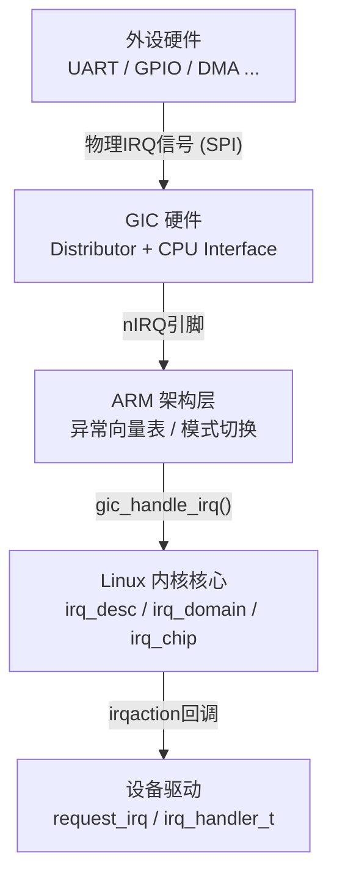
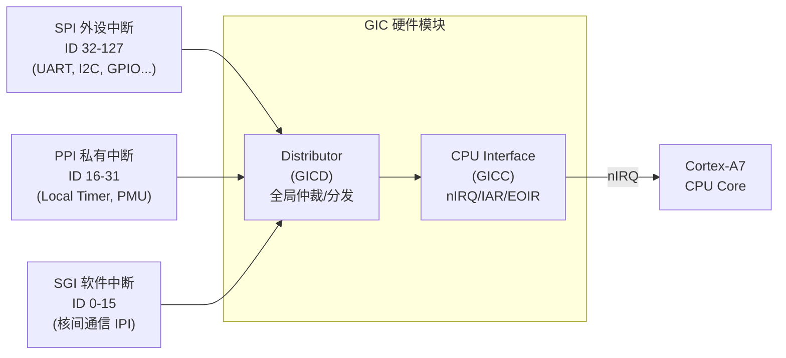
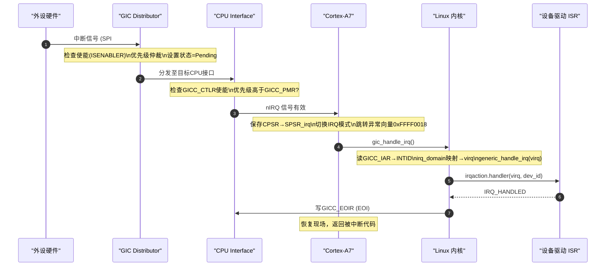

# Linux中断子系统全景：GICv2 + Cortex-A7

> [!note]
> **Ref:** [`docs/ARM® Generic Interrupt Controller(ARM GIC控制器).pdf`](../../../docs/ARM®%20Generic%20Interrupt%20Controller(ARM%20GIC控制器).pdf), [`note/SoC-Arch/00-Imx6ullArch.md`](../../SoC-Arch/00-Imx6ullArch.md), [`sdk/.../NoosProgramProject/11_GPIO中断/001_exception/gic.c`](../../../sdk/100ask_imx6ull-sdk/NoosProgramProject/11_GPIO中断/001_exception/gic.c)

## 1. 中断子系统分层模型

Linux 中断子系统是一个严格的三层架构，每层只向相邻层暴露接口。

> [!tip]
>
> | 缩写 | 全称                         | ID      |
> | ---- | ---------------------------- | ------- |
> | SGI  | Software Generated Interrupt | 0–15    |
> | PPI  | Private Peripheral Interrupt | 16–31   |
> | SPI  | Shared Peripheral Interrupt  | 32–1019 |
>
> 

| 层次 | 代表组件 | 职责 |
|------|----------|------|
| 硬件层 | GIC Distributor/CPU Interface | 中断仲裁、优先级、分发 |
| 架构层 | ARM 异常向量、`arch/arm/kernel/irq.c` | 保存现场、进入IRQ模式 |
| 框架层 | `kernel/irq/` (irq_desc, irqdomain) | 虚拟IRQ映射、流控、链式分发 |
| 驱动层 | `request_irq()` + ISR | 业务逻辑处理 |

---

## 2. GICv2 硬件架构速览（IMX6ULL）

IMX6ULL 集成 **GICv2**，支持 **128 个中断 ID**。

### 中断 ID 分区（IMX6ULL）

| 类型 | ID 范围 | 数量 | 用途 |
|------|---------|------|------|
| SGI | 0 – 15 | 16 | 软件触发，核间通信（单核上主要用于自身 IPI）|
| PPI | 16 – 31 | 16 | 每核私有：ID27=本地定时器，ID29=PMU |
| SPI | 32 – 127 | 96 | 共享外设：UART、I2C、USB、DMA 等 |

---

## 3. SPI 中断完整处理链路

从外设触发到驱动 ISR 的六阶段流程：

---

## 4. 关键寄存器速查（GICv2）

| 寄存器 | 全称 | 操作 | 作用 |
|--------|------|------|------|
| `GICD_CTLR` | Distributor Control | R/W | 全局使能/禁用 Distributor |
| `GICD_ISENABLERn` | Interrupt Set-Enable | Write 1 | 使能特定中断 |
| `GICD_ICENABLERn` | Interrupt Clear-Enable | Write 1 | 禁用特定中断 |
| `GICD_IPRIORITYRn` | Interrupt Priority | R/W | 配置中断优先级（8-bit）|
| `GICD_ITARGETSRn` | Interrupt Target | R/W | 指定 SPI 目标 CPU（单核忽略）|
| `GICD_ICFGRn` | Interrupt Config | R/W | 触发类型：电平/边沿 |
| `GICC_CTLR` | CPU Interface Control | R/W | 使能 CPU 接口中断转发 |
| `GICC_PMR` | Priority Mask | R/W | CPU 中断优先级屏蔽阈值 |
| `GICC_IAR` | Interrupt Acknowledge | Read | 认领中断，获取 INTID |
| `GICC_EOIR` | End of Interrupt | Write | 通知 GIC 中断处理完成 |

> **注意：** 读 `GICC_IAR` 是中断处理的**第一步**（Acknowledge），写 `GICC_EOIR` 是**最后一步**（EOI）。两者之间是驱动 ISR 的执行区间。

---

## 5. 笔记导航

| 文件 | 内容 |
|------|------|
| [`01-gic-hardware.md`](./01-gic-hardware.md) | GICv2 硬件深度：寄存器操作、裸机初始化、IMX6ULL 地址映射 |
| [`02-kernel-framework.md`](./02-kernel-framework.md) | Linux 内核中断框架：irq_desc / irq_domain / irq_chip 三件套 |
| [`03-driver-api.md`](./03-driver-api.md) | 驱动开发接口：request_irq、线程化中断、DTS 配置 |
