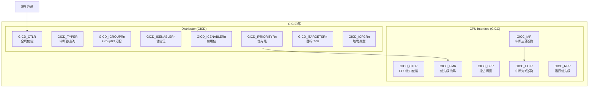
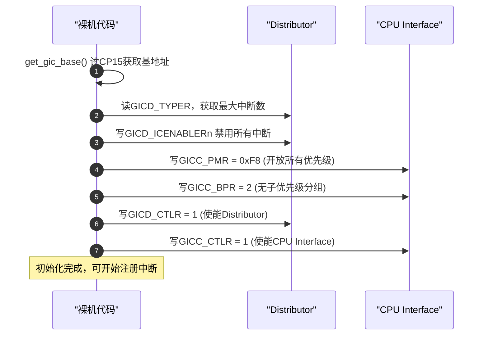
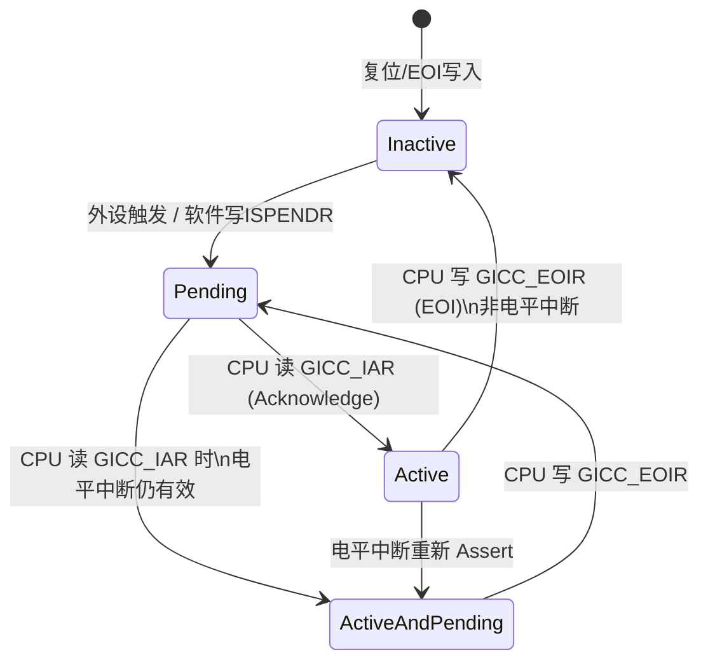

# GICv2硬件深度：寄存器与裸机初始化

> [!note]
> **Ref:** [`docs/ARM® Generic Interrupt Controller(ARM GIC控制器).pdf`](../../../docs/ARM®%20Generic%20Interrupt%20Controller(ARM%20GIC控制器).pdf), [`sdk/.../001_exception/gic.c`](../../../sdk/100ask_imx6ull-sdk/NoosProgramProject/11_GPIO中断/001_exception/gic.c)

## 1. GICv2 内部模块结构



---

## 2. 中断触发类型配置

`GICD_ICFGRn` 每个中断占 2 bit，高位决定触发类型：

| `[1:0]` 值 | 触发类型 | 适用中断 |
|------------|----------|----------|
| `0b00` | **电平敏感** (Level-sensitive) | 大多数 SPI 外设中断 |
| `0b10` | **边沿触发** (Edge-triggered) | GPIO 按键、SGI、LPI |

> SGI 永远是边沿触发，软件不可修改。

---

## 3. 优先级机制

GICv2 使用 **8-bit 优先级**，值越小优先级越高（0x00 最高）。

```
优先级值:  0x00  ...  0xFF
              ↑              ↑
            最高            最低
```

**`GICC_PMR`（优先级掩码）：** 只有优先级值 **低于** PMR 的中断（即数值小于PMR）才会被发送给 CPU。

```c
/* IMX6ULL 裸机：使能所有优先级（设置为最低优先级阈值）
 * 5位实现 → 有效位在高位，需左移 (8-5)=3 位
 */
gic->C_PMR = (0xFF << (8 - 5)) & 0xFF;  // = 0xF8

/* 二进制分组：全部位用于优先级，不分子优先级 */
gic->C_BPR = 7 - 5;  // = 2
```

---

## 4. 裸机 GIC 初始化流程（参考 SDK gic.c）



**读取 GIC 基地址（CP15 协处理器）：**

```c
GIC_Type *get_gic_base(void)
{
    GIC_Type *dst;
    /* CBAR: Configuration Base Address Register (CP15, c15, c0, 0)
     * 返回 GIC 物理基地址（= Distributor 基地址）
     */
    __asm volatile ("mrc p15, 4, %0, c15, c0, 0" : "=r" (dst));
    return dst;
}
```

---

## 5. 使能/禁用单个中断（位操作）

GICv2 使用**位图**管理每个中断的使能状态，每32个中断共用一个32-bit寄存器。

```c
/* 使能中断 nr */
void gic_enable_irq(IRQn_Type nr)
{
    GIC_Type *gic = get_gic_base();
    /* nr >> 5  : 确定是第几个 ISENABLER 寄存器（哪个 32-bit word）
     * nr & 0x1F: 确定寄存器内的位偏移（0-31）
     * 写 1 置位 = 使能；写 0 无效（Set-enable 语义）
     */
    gic->D_ISENABLER[nr >> 5] = (1UL << (nr & 0x1FUL));
}

/* 禁用中断 nr */
void gic_disable_irq(IRQn_Type nr)
{
    GIC_Type *gic = get_gic_base();
    /* ICENABLER：写 1 清除使能位（Clear-enable 语义）*/
    gic->D_ICENABLER[nr >> 5] = (1UL << (nr & 0x1FUL));
}
```

> **Set/Clear 语义**：GIC 使用两套寄存器分别执行使能和禁用，避免读-改-写竞争。这是 ARM 外设寄存器的通用设计模式。

---

## 6. 裸机中断处理 dispatch

```c
void handle_irq_c(void)
{
    GIC_Type *gic = get_gic_base();

    /* Step 1: 读 GICC_IAR → 认领中断，获取 INTID
     * 此读操作同时将中断状态从 Pending → Active
     */
    int nr = gic->C_IAR;

    /* Step 2: 通过 irq_table 查找并调用注册的处理函数 */
    irq_table[nr].irq_handler(nr, irq_table[nr].param);

    /* Step 3: 写 GICC_EOIR → 通知 GIC 处理完成
     * 将中断状态从 Active → Inactive，允许下次触发
     */
    gic->C_EOIR = nr;
}
```

---

## 7. IMX6ULL GIC 内存映射地址

根据 IMX6ULL 参考手册（Chapter 3: Memory Map）：

| 模块 | 基地址 | 大小 |
|------|--------|------|
| GIC Distributor (GICD) | `0x00A01000` | 4KB |
| GIC CPU Interface (GICC) | `0x00A02000` | 8KB |

> 在 Linux 内核中，这些地址通过 DTS 描述并由 `irq-gic.c` 驱动的 `of_iomap()` 映射到虚拟地址空间。

```dts
/* arch/arm/boot/dts/imx6ull.dtsi */
intc: interrupt-controller@00a01000 {
    compatible = "arm,cortex-a7-gic";
    #interrupt-cells = <3>;
    interrupt-controller;
    reg = <0x00a01000 0x1000>,   /* GICD */
          <0x00a02000 0x2000>;   /* GICC */
};
```

---

## 8. 中断状态机

每个中断在 GIC 内部有 4 种状态：



> **电平中断**：只要电平持续，中断会在 EOI 后重新进入 Pending。内核流控层（`handle_level_irq`）会在 ISR 执行前先 **Mask** 该中断，ISR 清除外设标志后再 **Unmask**，防止重入。
