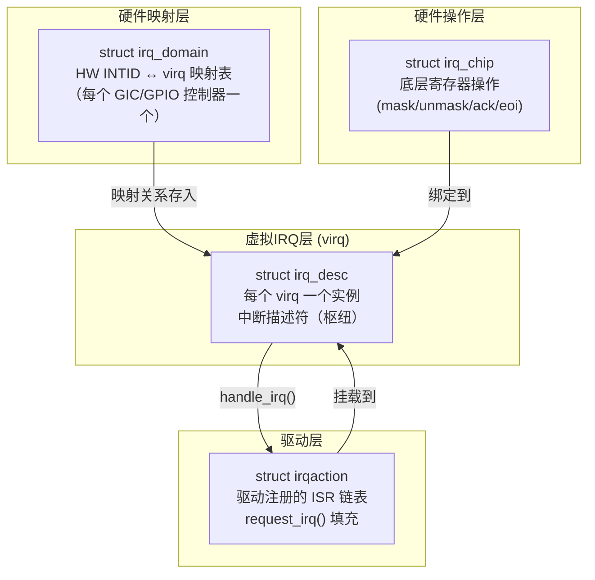
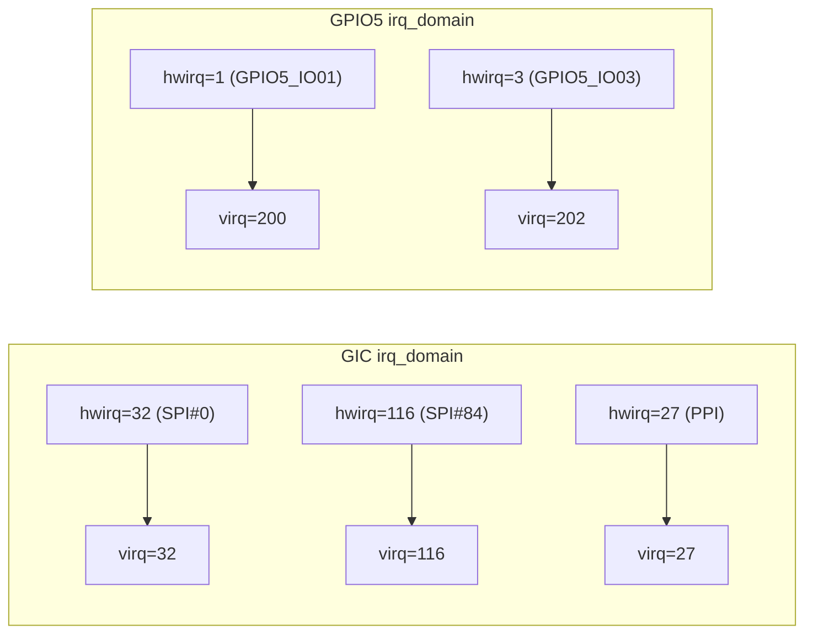
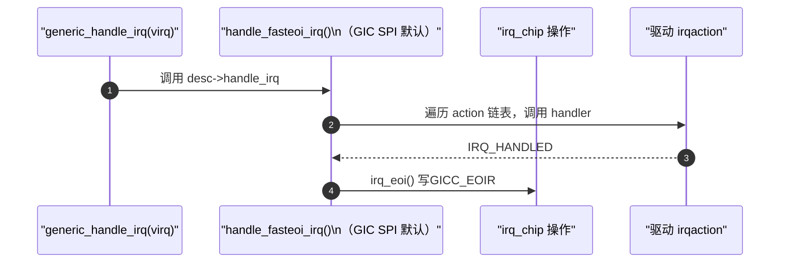

# Linux中断框架：irq_desc / irq_domain / irq_chip

> [!note]
> **Ref:** [`sdk/Linux-4.9.88/kernel/irq/irqdesc.c`](../../../sdk/100ask_imx6ull-sdk/Linux-4.9.88/kernel/irq/irqdesc.c), [`sdk/Linux-4.9.88/kernel/irq/irqdomain.c`](../../../sdk/100ask_imx6ull-sdk/Linux-4.9.88/kernel/irq/irqdomain.c), [`sdk/Linux-4.9.88/drivers/irqchip/irq-gic.c`](../../../sdk/100ask_imx6ull-sdk/Linux-4.9.88/drivers/irqchip/irq-gic.c)

## 1. 软件框架总览

Linux 内核用**三个核心对象**解耦中断的硬件差异与驱动逻辑：



---

## 2. struct irq_desc — 中断描述符

每个 **Linux 虚拟 IRQ（virq）** 对应一个 `irq_desc` 实例，是整个中断框架的**枢纽**。

```c
/* include/linux/irqdesc.h */
struct irq_desc {
    struct irq_common_data  irq_common_data;
    struct irq_data         irq_data;       /* 硬件相关数据（含 irq_chip 指针）*/
    irq_flow_handler_t      handle_irq;     /* 流控函数：handle_level_irq / handle_edge_irq */
    struct irqaction        *action;        /* 驱动 ISR 链表（request_irq 注册）*/
    unsigned int            depth;          /* 禁用嵌套计数，>0 表示被禁用 */
    unsigned int            irq_count;      /* 中断触发计数（/proc/interrupts 数据来源）*/
    const char              *name;          /* /proc/interrupts 显示名 */
    /* ... */
};
```

### irq_data — 硬件关联子结构

```c
/* include/linux/irq.h */
struct irq_data {
    u32              mask;      /* 中断掩码缓存 */
    unsigned int     irq;       /* Linux 虚拟 IRQ 号 */
    unsigned long    hwirq;     /* 硬件 INTID（GIC 原始中断号）*/
    struct irq_chip  *chip;     /* 底层硬件操作集（irq_chip）*/
    struct irq_domain *domain;  /* 所属中断域 */
    void             *chip_data;/* irq_chip 私有数据 */
};
```

---

## 3. struct irq_domain — 硬件中断号映射

**问题：** GIC 使用硬件 INTID（如 SPI #116），而 Linux 内核内部使用连续的虚拟 IRQ（virq）。两者需要建立映射。

**解决：** `irq_domain` 维护 `hwirq → virq` 的映射表。**每个中断控制器**（GIC、GPIO控制器）拥有独立的 domain。



### irq_domain 关键操作

```c
/* 驱动初始化时：为某 hwirq 创建映射，返回 virq */
unsigned int irq_create_mapping(struct irq_domain *domain, irq_hw_number_t hwirq);

/* GIC 驱动在收到中断后：hwirq → virq 查询 */
unsigned int irq_find_mapping(struct irq_domain *domain, irq_hw_number_t hwirq);
```

### GIC 中断处理中的 domain 查询

```c
/* drivers/irqchip/irq-gic.c: gic_handle_irq() 简化逻辑 */
static void gic_handle_irq(struct pt_regs *regs)
{
    u32 intid;
    /* Step 1: 读 GICC_IAR 获取硬件 INTID */
    intid = readl_relaxed(gic_cpu_base + GIC_CPU_INTACK);

    /* Step 2: hwirq → virq (通过 irq_domain 查表) */
    virq = irq_find_mapping(gic->domain, intid);

    /* Step 3: 进入通用中断处理流程 */
    generic_handle_irq(virq);

    /* Step 4: 写 GICC_EOIR 结束中断 */
    writel_relaxed(intid, gic_cpu_base + GIC_CPU_EOI);
}
```

---

## 4. struct irq_chip — 硬件操作抽象

`irq_chip` 是对**中断控制器硬件寄存器操作**的面向对象封装，类似 `file_operations` 对 VFS 的作用。

```c
/* include/linux/irq.h */
struct irq_chip {
    const char  *name;           /* /proc/interrupts 中显示的控制器名 */

    /* 核心操作集 */
    void (*irq_mask)(struct irq_data *data);      /* 屏蔽中断（写 GICD_ICENABLER）*/
    void (*irq_unmask)(struct irq_data *data);    /* 解除屏蔽（写 GICD_ISENABLER）*/
    void (*irq_ack)(struct irq_data *data);       /* 应答（边沿中断清 Pending 状态）*/
    void (*irq_eoi)(struct irq_data *data);       /* 中断结束（写 GICC_EOIR）*/
    void (*irq_enable)(struct irq_data *data);    /* 使能（默认等于 unmask）*/
    void (*irq_disable)(struct irq_data *data);   /* 禁用 */
    int  (*irq_set_type)(struct irq_data *data,   /* 设置触发类型（写 GICD_ICFGR）*/
                         unsigned int flow_type);
    int  (*irq_set_affinity)(struct irq_data *data, /* 设置 CPU 亲和性（多核）*/
                              const struct cpumask *dest, bool force);
};
```

### GIC irq_chip 实例（irq-gic.c）

```c
static struct irq_chip gic_chip = {
    .name           = "GIC",
    .irq_mask       = gic_mask_irq,    /* 写 GICD_ICENABLERn */
    .irq_unmask     = gic_unmask_irq,  /* 写 GICD_ISENABLERn */
    .irq_eoi        = gic_eoi_irq,     /* 写 GICC_EOIR */
    .irq_set_type   = gic_set_type,    /* 写 GICD_ICFGRn */
    .irq_retrigger  = gic_retrigger,
    .irq_set_affinity = gic_set_affinity,
};
```

---

## 5. 流控函数（irq_flow_handler）

`irq_desc.handle_irq` 是**流控函数**，负责在调用驱动 ISR 前后执行 mask/ack/unmask 等硬件操作。内核针对不同触发类型提供预置实现：

| 流控函数 | 适用场景 | 关键行为 |
|----------|----------|----------|
| `handle_level_irq` | 电平触发 SPI | mask → ack → ISR → unmask |
| `handle_edge_irq` | 边沿触发 | ack → ISR（无 mask）|
| `handle_fasteoi_irq` | GIC SPI（默认）| ISR → eoi |
| `handle_simple_irq` | 无流控需求 | 直接调用 ISR |



---

## 6. struct irqaction — 驱动 ISR 注册

`request_irq()` 的底层就是构造一个 `irqaction` 并挂入 `irq_desc.action` 链表：

```c
struct irqaction {
    irq_handler_t   handler;        /* 驱动注册的 ISR 函数 */
    void            *dev_id;        /* 驱动私有数据（free_irq 时用于识别）*/
    unsigned long   flags;          /* IRQF_* 标志 */
    const char      *name;          /* /proc/interrupts 显示名 */
    struct irqaction *next;         /* 共享中断时的链表指针 */
    struct task_struct *thread;     /* 线程化中断的内核线程 */
    irq_handler_t   thread_fn;      /* 线程化 ISR（下半部）*/
};
```

### 共享中断链表结构

```
irq_desc[virq].action
    │
    ├─→ irqaction { handler=uart_isr,  dev_id=uart_dev,  next=→ }
    │
    └─→ irqaction { handler=dma_isr,   dev_id=dma_dev,   next=NULL }
```

> 共享中断（`IRQF_SHARED`）要求每个 ISR 必须检查自己的设备是否真的产生了中断，不是则返回 `IRQ_NONE`。

---

## 7. /proc/interrupts — 运行时中断状态

```bash
# 典型输出（单核 IMX6ULL）
          CPU0
 18:      12345  GIC-0  27  arch_timer        # PPI, 本地定时器
 35:        892  GIC-0  67  2020000.serial    # SPI, UART1
 42:         23  GIC-0  74  20b8000.i2c       # SPI, I2C1
200:          5  gpio-mxc   1  gpio_key@5_1   # GPIO 子中断
```

| 列 | 含义 |
|----|------|
| 第1列 | Linux virq 号 |
| CPU0 | 该 CPU 处理次数 |
| GIC-0 | irq_chip 名称 |
| 27/67/74 | 硬件 hwirq（INTID）|
| 末尾 | irqaction.name |
