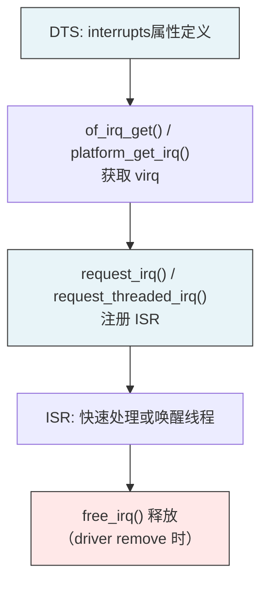

# 驱动中断开发接口：request_irq与DTS配置

> [!note]
> **Ref:** [`note/Legacy/中断子系统.md`](../../Legacy/中断子系统.md), [`sdk/Linux-4.9.88/include/linux/interrupt.h`](../../../sdk/100ask_imx6ull-sdk/Linux-4.9.88/include/linux/interrupt.h), [`sdk/Linux-4.9.88/kernel/irq/manage.c`](../../../sdk/100ask_imx6ull-sdk/Linux-4.9.88/kernel/irq/manage.c)

## 1. request_irq() — 注册中断

```c
/* include/linux/interrupt.h */
int request_irq(unsigned int      irq,        /* Linux 虚拟中断号 (virq) */
                irq_handler_t     handler,     /* ISR 函数指针 */
                unsigned long     flags,       /* IRQF_* 触发类型与行为标志 */
                const char        *name,       /* /proc/interrupts 显示名 */
                void              *dev_id);    /* 驱动私有数据，传递给 handler */
```

> **`irq` 参数是 Linux virq，不是 GIC 硬件 INTID。** 来源：DTS 解析、`gpio_to_irq()`、`platform_get_irq()` 等。

### 返回值

| 返回值 | 含义 |
|--------|------|
| `0` | 注册成功 |
| `-EINVAL` | 无效的 irq 号或 handler 为 NULL |
| `-EBUSY` | 中断已被占用且未设置 `IRQF_SHARED` |
| `-ENOMEM` | 内存不足 |

---

## 2. IRQF_* 标志详解

```c
/* 触发类型（与 DTS interrupt-cells 第3个cell对应）*/
IRQF_TRIGGER_RISING   /* 上升沿触发 */
IRQF_TRIGGER_FALLING  /* 下降沿触发 */
IRQF_TRIGGER_HIGH     /* 高电平触发 */
IRQF_TRIGGER_LOW      /* 低电平触发 */

/* 行为控制 */
IRQF_SHARED           /* 共享中断线，多设备共用同一 virq */
IRQF_ONESHOT          /* 线程化中断：ISR 线程执行期间保持 mask，防止重入 */
IRQF_NO_THREAD        /* 强制不线程化（即使系统开启 PREEMPT_RT）*/
IRQF_IRQPOLL          /* 用于中断轮询，共享中断中降低优先级 */
```

> **`IRQF_SHARED` 要求：** `dev_id` 不能为 NULL，且每个 ISR 必须检查自己的设备状态，不是本设备中断时返回 `IRQ_NONE`。

---

## 3. irq_handler_t — ISR 函数原型

```c
typedef irqreturn_t (*irq_handler_t)(int irq, void *dev_id);

enum irqreturn {
    IRQ_NONE        = (0 << 0),  /* 不是本设备中断（共享中断时使用）*/
    IRQ_HANDLED     = (1 << 0),  /* 已处理，中断正常结束 */
    IRQ_WAKE_THREAD = (1 << 1),  /* 唤醒线程化下半部（需配合 request_threaded_irq）*/
};
```

### 典型 ISR 实现框架

```c
static irqreturn_t my_device_isr(int irq, void *dev_id)
{
    struct my_device *dev = (struct my_device *)dev_id;

    /* 1. 检查是否是本设备中断（共享中断必须做）*/
    if (!(readl(dev->base + STATUS_REG) & MY_INT_FLAG))
        return IRQ_NONE;

    /* 2. 读取数据 / 处理中断事件（快速完成，不能睡眠）*/
    dev->data = readl(dev->base + DATA_REG);

    /* 3. 清除外设中断标志（防止电平中断重复触发）*/
    writel(MY_INT_FLAG, dev->base + STATUS_REG);

    /* 4. 唤醒等待的用户空间（如果有）*/
    wake_up_interruptible(&dev->wait_queue);

    return IRQ_HANDLED;
}
```

---

## 4. 线程化中断 — request_threaded_irq()

> 线程化中断的完整内核实现机制（irq_thread 主循环、IRQF_ONESHOT 原理、handler=NULL 快捷方式）已移至：
> → [`note/kernel/BottomHalf/04-threaded-irq.md`](../../../note/kernel/BottomHalf/04-threaded-irq.md)

```c
/* API 速记 */
int request_threaded_irq(unsigned int irq,
                         irq_handler_t handler,    /* 上半部，可为 NULL */
                         irq_handler_t thread_fn,  /* 下半部（irq/N 线程）*/
                         unsigned long flags,       /* 必须含 IRQF_ONESHOT */
                         const char *name, void *dev_id);

/* 最简写法：省略上半部，全部逻辑在线程中 */
devm_request_threaded_irq(dev, irq, NULL, my_thread_fn,
                          IRQF_TRIGGER_FALLING | IRQF_ONESHOT,
                          "my-sensor", priv);
```

---

## 5. GPIO 中断获取 virq

GPIO 控制器是级联中断控制器，GPIO 引脚的中断号需通过专用 API 获取：

```c
/* 方法1：从 gpio 号获取（旧接口，整数 GPIO）*/
int virq = gpio_to_irq(gpio_num);

/* 方法2：从 gpio_desc 获取（新接口，描述符）*/
int virq = gpiod_to_irq(gpio_desc);

/* 方法3：从 platform_device 资源获取（DTS 定义 interrupts 属性）*/
int virq = platform_get_irq(pdev, 0);

/* 方法4：从设备节点解析 DTS */
int virq = of_irq_get(np, 0);
```

---

## 6. DTS 中断配置

### 中断控制器声明（imx6ull.dtsi）

```dts
intc: interrupt-controller@00a01000 {
    compatible = "arm,cortex-a7-gic";
    #interrupt-cells = <3>;       /* cells格式: <type number flags> */
    interrupt-controller;
    reg = <0x00a01000 0x1000>,
          <0x00a02000 0x2000>;
};
```

**`#interrupt-cells = <3>` 三个字段：**

| 字段 | 含义 | 取值 |
|------|------|------|
| type | 中断类型 | `0`=SPI, `1`=PPI |
| number | 中断号（相对偏移）| SPI: 物理ID-32, PPI: 物理ID-16 |
| flags | 触发类型 | `1`=上升沿, `2`=下降沿, `4`=高电平, `8`=低电平 |

### 外设节点中断引用示例

```dts
/* UART1: SPI #26 → 物理 INTID = 26+32 = 58 */
uart1: serial@02020000 {
    compatible = "fsl,imx6ul-uart";
    reg = <0x02020000 0x4000>;
    interrupts = <GIC_SPI 26 IRQ_TYPE_LEVEL_HIGH>;
    interrupt-parent = <&intc>;
};

/* GPIO5: SPI #74 */
gpio5: gpio@020ac000 {
    compatible = "fsl,imx6ul-gpio";
    reg = <0x020ac000 0x4000>;
    interrupts = <GIC_SPI 74 IRQ_TYPE_LEVEL_HIGH>,
                 <GIC_SPI 75 IRQ_TYPE_LEVEL_HIGH>;
    interrupt-parent = <&intc>;
    interrupt-controller;           /* GPIO 也作为子中断控制器 */
    #interrupt-cells = <2>;         /* GPIO子中断: <引脚号 触发类型> */
};
```

### GPIO 子中断引用（消费者节点）

```dts
/* 按键设备引用 GPIO5 子中断 */
keys {
    compatible = "gpio-keys";
    key0 {
        gpios = <&gpio5 1 GPIO_ACTIVE_LOW>;
        interrupt-parent = <&gpio5>;
        interrupts = <1 IRQ_TYPE_EDGE_BOTH>;  /* GPIO5_IO01，双边沿 */
    };
};
```

---

## 7. 驱动开发完整流程



### 配对规则

| 注册 | 释放 |
|------|------|
| `request_irq()` | `free_irq(virq, dev_id)` |
| `request_threaded_irq()` | `free_irq(virq, dev_id)` |
| `devm_request_irq()` | 自动释放（设备卸载时）|

> **推荐使用 `devm_request_irq()`**，绑定设备生命周期，无需手动 `free_irq()`。

---

## 8. 调试技巧

```bash
# 查看所有中断及触发次数
cat /proc/interrupts

# 查看中断控制器树
cat /proc/irq/*/chip_name 2>/dev/null

# 查看某 virq 的详细信息
cat /proc/irq/35/spurious

# 动态开启 GIC 调试（需 CONFIG_GENERIC_IRQ_DEBUGFS）
mount -t debugfs none /sys/kernel/debug
ls /sys/kernel/debug/irq/
```
