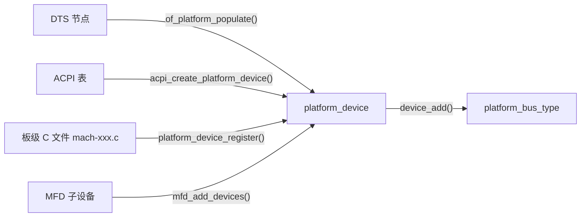
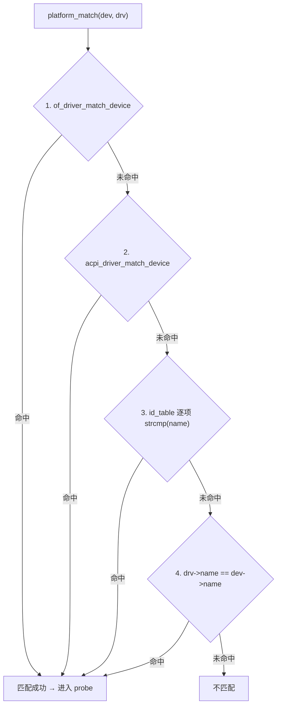
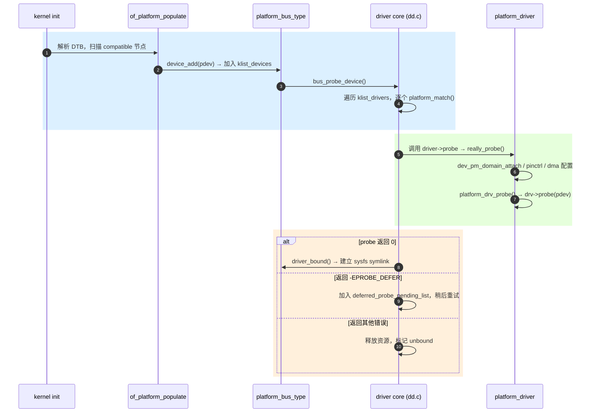

# Platform Bus 总览：bind/probe 机制与 sysfs 接口

> [!note]
> **Ref:**
> - `drivers/base/platform.c`、`drivers/base/dd.c`、`drivers/base/bus.c`（Linux-4.9.88，100ask BSP）
> - `include/linux/platform_device.h`、`include/linux/device.h`
> - LWN: [The platform device API](https://lwn.net/Articles/448499/)
> - 本仓库 `note/DTS/`、`note/Subsystem/gpio/`

---

## 1. 为什么需要 platform bus

真正的物理总线（PCI/USB/I2C）具备「枚举能力」：总线控制器可以扫描出设备，读取 vendor/product ID 自动匹配驱动。但 **SoC 内部的外设**（UART、I2C 控制器本身、GPIO bank、LCDC、watchdog…）挂在 CPU 的内存总线上，**无法被枚举**——它们的存在、寄存器基地址、IRQ 号必须由开发者「告诉」内核。

Linux 抽象出一条**虚拟总线** `platform_bus_type`，把这些「无法枚举的片上外设」统一塞进 driver model，使其也能享受 `device/driver/bus` 三元组带来的：

- 统一的 probe/remove 生命周期
- 统一的 sysfs 视图（`/sys/bus/platform/...`）
- 统一的电源管理 (PM ops, runtime PM)
- 统一的资源管理 (IRQ, MMIO, DMA, clk, regulator)

---

## 2. 三大核心数据结构

```c
// include/linux/platform_device.h
struct platform_device {
    const char      *name;          // 旧式匹配用
    int              id;            // 同名多实例时区分
    struct device    dev;           // 嵌入的通用 device
    u32              num_resources;
    struct resource *resource;      // MMIO/IRQ/DMA 资源数组
    const struct platform_device_id *id_entry;
    struct mfd_cell *mfd_cell;
    /* ... */
};

struct platform_driver {
    int  (*probe)(struct platform_device *);
    int  (*remove)(struct platform_device *);
    void (*shutdown)(struct platform_device *);
    int  (*suspend)(struct platform_device *, pm_message_t);
    int  (*resume)(struct platform_device *);
    struct device_driver driver;    // 嵌入的通用 driver（含 of_match_table）
    const struct platform_device_id *id_table;
};

extern struct bus_type platform_bus_type;   // drivers/base/platform.c
```

`platform_bus_type` 是整条机制的「调度中枢」，它注册了 `.match`、`.uevent`、`.pm` 等回调，把通用 driver core 的钩子点引到 platform 子系统的逻辑里。

---

## 3. 设备从哪里来——device 的四种诞生路径



- **DTS 路径（IMX6ULL 走这条）**：内核启动时 `of_platform_default_populate_init()` 遍历 `/` 下所有有 `compatible` 的节点，递归生成 `platform_device`。资源（reg/interrupts）由 `of_device_alloc()` 自动翻译填充。
- **板级文件**：ARM 老式 BSP 用 `platform_add_devices()` 批量注册，已逐步被 DT 取代。
- **MFD**：一颗芯片包含多个功能块（PMIC、RTC、ADC…），父驱动 probe 后用 mfd_cell 把子功能拆成多个 platform_device。
- **手动**：少量代码用 `platform_device_register_simple()` 创建临时设备，常见于测试驱动。

---

## 4. 匹配（match）机制——五条优先级链

`platform_match()` 在 `drivers/base/platform.c` 中按**优先级从高到低**尝试：



| 优先级 | 机制 | 关键字段 | 典型场景 |
|---|---|---|---|
| 1 | OF (Device Tree) | `driver.of_match_table` ↔ DTS `compatible` | 现代 ARM/PowerPC |
| 2 | ACPI | `driver.acpi_match_table` ↔ ACPI `_HID` | x86 嵌入式、ARM Server |
| 3 | id_table | `platform_driver.id_table[].name` | 一驱动支持多变体 |
| 4 | name 字符串 | `drv->name == pdev->name` | 老式 board file |

> 注意：**OF 匹配命中后，`pdev->id_entry` 不会被设置**；想在驱动里区分变体应用 `of_device_get_match_data()` 拿 `.data` 字段，而不是依赖 id_entry。

---

## 5. Bind / Probe 的完整时序



**反向同样成立**：注册 driver 时（`platform_driver_register()` → `driver_attach()`）会反过来扫描所有已存在的 device 找匹配。这就是「device 与 driver 谁先谁后都能 bind」的根因。

### 5.1 EPROBE_DEFER：probe 的「软失败」

当驱动需要的资源（clk、regulator、gpio、phy、另一驱动…）尚未就绪，应返回 `-EPROBE_DEFER`，driver core 会把它放进 `deferred_probe_pending_list`，每当有新的 driver 成功 bind，就触发一次 `deferred_probe_work_func()` 重新尝试。这是解开「驱动加载顺序依赖」的关键机制——很多新人会写成 `BUG()` 或者死等，那是错的。

---

## 6. 资源（resource）抽象

```c
struct resource *res;
void __iomem    *base;
int              irq;

res  = platform_get_resource(pdev, IORESOURCE_MEM, 0);
base = devm_ioremap_resource(&pdev->dev, res);
irq  = platform_get_irq(pdev, 0);
```

- **MEM**：来自 DTS 的 `reg = <...>`，经 `of_address_to_resource()` 翻译，已应用上级 `ranges` 映射。
- **IRQ**：来自 `interrupts`/`interrupts-extended`，由 `irq_of_parse_and_map()` 映射成 Linux virq（**不是**硬件号）。
- 推荐一律用 `devm_*` 申请，probe 失败 / remove 时自动释放，杜绝资源泄漏。

---

## 7. sysfs 视图

platform bus 在 sysfs 暴露三块视图，这是调试 bind 问题的「第一现场」：

```text
/sys/bus/platform/
├── devices/        # 所有 platform_device 的符号链接
│   └── 2020000.serial -> ../../../devices/soc0/soc/2000000.aips-bus/2020000.serial
├── drivers/        # 所有已注册的 platform_driver
│   └── imx-uart/
│       ├── bind          # echo <devname> > bind   手动绑定
│       ├── unbind        # echo <devname> > unbind 手动解绑
│       ├── uevent
│       └── 2020000.serial -> ../../../../devices/.../2020000.serial
├── drivers_autoprobe   # 0/1，关掉后注册的 driver 不自动 attach
└── drivers_probe       # echo devname > drivers_probe 触发一次 match
```

每个具体 device 节点下还会出现：

```text
/sys/devices/.../2020000.serial/
├── driver -> ../../../bus/platform/drivers/imx-uart   # 是否 bind 一目了然
├── of_node -> /sys/firmware/devicetree/base/soc/.../serial@2020000
├── modalias        # platform:imx-uart 或 of:NfooTbar...   udev 据此 modprobe
├── uevent
├── power/          # runtime PM 状态
└── driver_override # 写入字符串可强制只让某个 driver 来 bind
```

### 7.1 bind/unbind/driver_override 实战

```bash
# 临时把驱动从设备上摘下来
echo 2020000.serial > /sys/bus/platform/drivers/imx-uart/unbind

# 强制用另一个驱动接管该设备（即便 of_match 不一致）
echo my-debug-uart > /sys/bus/platform/devices/2020000.serial/driver_override
echo 2020000.serial > /sys/bus/platform/drivers_probe
```

`driver_override` 是 hot-debug 神器：写入空字符串 `""` 即清除。

---

## 8. 你可能还没注意到的话题

下面这些是「教程很少讲，但生产代码里到处都是」的进阶点：

| 话题 | 一句话要点 |
|---|---|
| **Deferred probe** | 资源未就绪返回 `-EPROBE_DEFER`，由 `deferred_probe_work` 重试，调试看 `/sys/kernel/debug/devices_deferred` |
| **Probe 顺序与 initcall level** | `module_platform_driver()` 默认 `module_init`，若必须早注册用 `subsys_initcall()`；但**不要靠 initcall 顺序解决依赖**，请用 EPROBE_DEFER |
| **Async probe** | `driver.probe_type = PROBE_PREFER_ASYNCHRONOUS`，加快多核启动，要求驱动是线程安全的 |
| **Runtime PM** | platform bus 已挂 `pm_generic_*`，驱动只需 `pm_runtime_enable()` + 实现 `runtime_suspend/resume` |
| **pinctrl 自动选状态** | driver core 在 probe 前会自动把 `default` pinctrl state 设上，驱动不必手动 lookup |
| **Generic PM domain (genpd)** | DTS 有 `power-domains = <...>` 时，core 自动 attach，probe 时上电、remove 时下电 |
| **DMA 配置** | OF 路径会调 `of_dma_configure()`，从 `dma-ranges`、`dma-coherent` 推断 dma_mask 与 ops |
| **IOMMU 配置** | 同理 `of_iommu_configure()`，绑定 IOMMU group |
| **modalias 与 udev** | `of:N<name>T<type>Cc<compat>` 字符串，udev 据此自动 modprobe ko |
| **驱动卸载竞态** | `platform_driver_unregister()` 内部会把每个 device 一一 unbind；若驱动有自创 kthread，必须在 remove 里 join 干净，否则 KASAN UAF |
| **builtin_platform_driver()** | 不允许 module 卸载的驱动用这个宏，少一份 `__exit` 代码 |
| **module_platform_driver_probe()** | 只允许 probe 一次，永不接受后续设备热插拔，节省内存（典型：早期 console） |
| **sysfs 自定义属性** | 用 `dev_groups`（推荐）而非 `device_create_file`，前者由 core 管理生命周期，无竞态 |
| **device link** | `device_link_add()` 显式声明 consumer→supplier 依赖，影响 suspend/resume 顺序与 unbind 级联 |
| **fw_devlink** | 4.x 之后基于 DT/ACPI **自动**推断 device link，几乎消灭了大部分手写 EPROBE_DEFER |
| **driver_data vs platform_data** | 前者是 driver 私有；后者是 board file 时代传参，DTS 时代基本被 `of_device_id.data` 取代 |
| **sysfs `of_node` 软链接** | 没有它就说明该 device 不是 OF 来源，调试 DTS 不生效时第一眼看这个 |
| **`/proc/device-tree` vs `/sys/firmware/devicetree/base`** | 同一份内容两个挂载点，前者 deprecated |

---

## 9. IMX6ULL 上的最小可运行示例（DT + driver）

DTS 片段：
```dts
hello@21f0000 {
    compatible = "100ask,hello";
    reg = <0x021f0000 0x100>;
    interrupts = <GIC_SPI 30 IRQ_TYPE_LEVEL_HIGH>;
    status = "okay";
};
```

驱动骨架：
```c
static const struct of_device_id hello_of_match[] = {
    { .compatible = "100ask,hello", .data = (void *)0x12345678UL },
    { /* sentinel */ }
};
MODULE_DEVICE_TABLE(of, hello_of_match);

static int hello_probe(struct platform_device *pdev)
{
    struct resource *res;
    void __iomem  *base;
    unsigned long  cookie = (unsigned long)of_device_get_match_data(&pdev->dev);
    int irq;

    res  = platform_get_resource(pdev, IORESOURCE_MEM, 0);
    base = devm_ioremap_resource(&pdev->dev, res);
    if (IS_ERR(base)) return PTR_ERR(base);

    irq = platform_get_irq(pdev, 0);
    if (irq < 0) return irq;

    dev_info(&pdev->dev, "probed @%pR irq=%d cookie=%lx\n", res, irq, cookie);
    return 0;
}

static struct platform_driver hello_drv = {
    .probe  = hello_probe,
    .driver = {
        .name           = "hello",
        .of_match_table = hello_of_match,
    },
};
module_platform_driver(hello_drv);
```

加载后用以下命令验收：
```bash
ls -l /sys/bus/platform/drivers/hello/
cat /sys/devices/platform/21f0000.hello/modalias
echo 21f0000.hello > /sys/bus/platform/drivers/hello/unbind
echo 21f0000.hello > /sys/bus/platform/drivers/hello/bind
```

---

## 10. 学习建议

1. **顺源码读两遍** `drivers/base/platform.c` 与 `drivers/base/dd.c`，把 `really_probe()` 这个函数当作内核 driver model 的「主循环」记住。
2. **拿 IMX6ULL 的一个真实驱动**（推荐 `drivers/tty/serial/imx.c`）从 `compatible` → DTS → probe → sysfs 一路追下来。
3. **故意制造 EPROBE_DEFER** 与 `driver_override` 实验，观察 `/sys/kernel/debug/devices_deferred`。
4. 最后回头读一遍 `Documentation/driver-api/driver-model/`，把零散知识穿成线。

---

## 后续可拆分的子主题

- `01-driver-model-core.md`——`device/driver/bus/class/kobject` 五件套
- `02-of-platform-populate.md`——DTS 到 platform_device 的翻译细节
- `03-deferred-probe-and-fw_devlink.md`
- `04-runtime-pm-and-genpd.md`
- `05-resource-and-devm.md`
