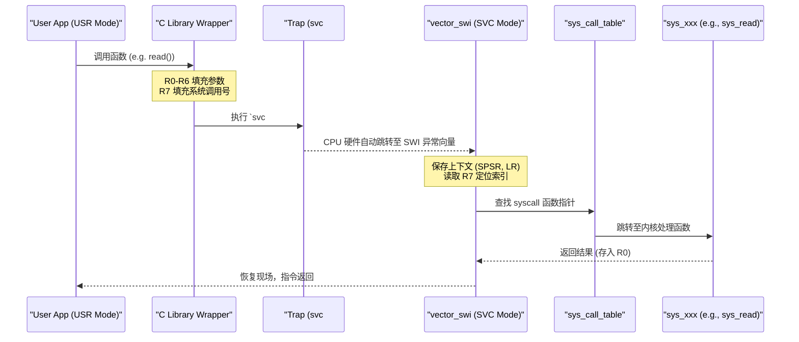

# 系统调用全景：从 User Space 到 Kernel Runtime

## 1. Pre-knowledge: 权限与空间的隔离

在 ARMv7-A 架构下（如 IMX6ULL），系统调用的物理基础源于 **处理器模式（Processor Modes）** 的切换。

- **User Mode (USR):** 用户程序运行模式。受到严格限制，无法直接操作硬件寄存器，只能访问受保护的虚拟地址空间（0x00000000 - 0xBFFFFFFF）。
- **SVC Mode (Supervisor):** 内核服务运行模式。拥有最高权限，可访问硬件并跳转到内核代码（0xC0000000 - 0xFFFFFFFF）。

**隔离的核心在于：**
用户进程不直接拥有“控制权”，必须通过一个受控的“陷阱（Trap）”请求内核代为执行。

## 2. 总体流程时序 (Sequence Diagram)



## 3. Layer 1: User API (C Wrapper & ABI)

在 Linux 系统中，用户通常不直接写汇编，而是调用 `glibc` 提供的包装函数。有关 libc 封装的具体实现机制（汇编桩、errno 处理、vDSO 等），请参考：[libc 原理：系统调用封装](./libc原理-syscall封装.md)。

### 寄存器传参规范 (ARM ABI)
根据 ARM EABI 规范，系统调用的传参方式如下：
- **R0 - R6:** 用于传递系统调用的参数（最多 7 个）。
- **R7:** **关键寄存器**。用于存放 **系统调用号 (System Call Number)**。
- **R0:** 用于存放返回值（成功时返回结果，失败时返回 `-errno`）。

### 汇编示例
以 `write(1, "hello", 5)` 为例，底层汇编大致如下：
```assembly
mov r0, #1          @ fd = 1 (stdout)
ldr r1, =buf        @ *buf
mov r2, #5          @ count = 5
mov r7, #4          @ __NR_write (系统调用号)
svc #0              @ 触发软件中断
```

## 4. Layer 2: The Trap (汇编指令与硬件行为)

### `svc` 指令 (Supervisor Call)
`svc #0` 指令（旧称 `swi`）是触发边界跨越的“传送门”。
- **硬件自动完成的工作：**
  1. 将当前程序状态（CPSR）备份到 `SPSR_svc`。
  2. 将返回地址（下一条指令）保存到 `LR_svc`。
  3. 切换 CPU 模式到 **SVC 模式**。
  4. 强制将程序计数器（PC）跳转到固定地址：**异常向量表（Vector Table）中的 SWI 偏移处**。

## 5. Layer 3: Kernel Behavior (Dispatching)

### 系统调用表 (sys_call_table)
内核维护了一个巨大的跳转表，本质是一个函数指针数组。
- 路径：`arch/arm/kernel/calls.S` (或生成的头文件)
- 逻辑：`regs->r0 = sys_call_table[regs->r7](regs->r0, regs->r1, ...)`

### 返回路径
内核完成工作后，会通过 `vector_swi` 后续的清理逻辑：
1. 从 R0 读取结果。
2. 检查是否有待处理的信号 (Signal)。
3. 使用 `ret_fast_syscall` 或 `eret` 指令恢复用户态 PC 和 CPSR，回到 USR 模式。

## 6. 工具与实战

### `strace`：用户态的上帝视角
通过 `strace` 可以实时观察进程发出的系统调用。
```bash
strace ./your_app
```
可以看到内核返回的 `1` (R0) 和对应的 syscall 名称。
