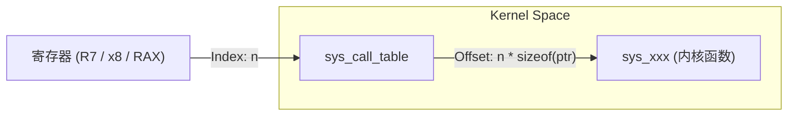

# 系统调用表 (sys_call_table) 详解

如果把 Linux 内核比作一个庞大的政府机构，那么 `sys_call_table` 就是这个机构的**办事窗口索引表**。用户进程拿着“办事单”（系统调用号），内核根据这张表找到对应的“科室”（内核处理函数）。

> [!note]
>
> cpu 引入了 user态和特权态 来隔离kernel敏感操作，故而，user态的SysCall，call 的不是一个pc addr ，而是一次将参数与**调用函数号压入regs，触发专用指令trap 入内核态，并在内核态完成SysCall分发的过程**

## 1. 核心定义：本质是一个数组

在内核源码中，`sys_call_table` 本质上是一个**函数指针数组**。

- **数组索引 (Index):** 系统调用号 (System Call Number)。
- **数组内容 (Value):** 指向对应内核处理函数（如 `sys_read`, `sys_write`）的物理地址。

### C 语言伪代码表示
```c
/* 系统调用处理函数的原型通常标记为 asmlinkage，表示从汇编层传参 */
typedef asmlinkage long (*syscall_fn_t)(const struct pt_regs *);

/* 核心跳转表 */
const syscall_fn_t sys_call_table[] = {
    [__NR_read]  = sys_read,
    [__NR_write] = sys_write,
    [__NR_open]  = sys_open,
    ...
};
```

## 2. 索引与分发 (The Dispatcher)

当 CPU 执行 `svc #0` (ARM) 或 `syscall` (x86) 陷入内核后，内核汇编入口（如 `vector_swi`）会执行以下逻辑：

1. **提取调用号:** 从寄存器（ARM 为 R7，x86 为 RAX）中读取数值。
2. **合法性检查:** 检查调用号是否超过了数组的最大索引（`NR_syscalls`），防止越界访问。
3. **查表跳转:** 根据调用号索引到 `sys_call_table` 中的偏移位置。
4. **执行函数:** 跳转到目标内核函数执行。



## 3. 代码位置：从哪里找到它？

在不同的架构和内核版本中，`sys_call_table` 的定义方式略有不同。

### ARM (32-bit / IMX6ULL)
- **定义文件:** `arch/arm/kernel/entry-common.S`
- **内容来源:** `arch/arm/kernel/calls.S`
在汇编文件中，内核使用 `.long` 指令配合宏定义批量生成这个表：
```assembly
/* arch/arm/kernel/entry-common.S */
ENTRY(sys_call_table)
#include "calls.S"
```

### x86_64
- **定义方式:** 现代 x86 内核使用更复杂的 `.tbl` 文件（如 `arch/x86/entry/syscalls/syscall_64.tbl`），在编译时通过脚本生成 C 代码。

## 4. 命名规范：`asmlinkage` 与 `sys_xxx`

- **`sys_xxx`:** 这是内核中系统调用实现的通用前缀。例如，用户态调用 `read()`，内核对应的函数是 `sys_read()`。
- **`SYSCALL_DEFINE` 宏:** 内核开发者不直接写 `long sys_read(...)`，而是使用宏，如 `SYSCALL_DEFINE3(read, ...)`。这有助于统一处理 64/32 位兼容性和安全检查。
- **`asmlinkage`:** 这是一个编译器指令（在 x86 上尤为重要）。它告诉编译器：**不要尝试用寄存器优化传参，所有的参数都应该从内存堆栈中获取**。因为汇编入口在跳转前已经把寄存器状态压入堆栈（`struct pt_regs`）。

## 5. 安全与保护 (The Fortress)

由于 `sys_call_table` 极其重要，它是黑客（Rootkit）的首选攻击目标。如果能修改这个表，就能接管整个系统的行为。

### 现代内核的防御措施：
1. **只读保护 (`rodata`):** 现代内核将 `sys_call_table` 放在不可写的内存段。即使有内核权限，直接修改也会导致 Segmentation Fault。
2. **写保护位 (WP Bit):** 在 x86 上，内核通过 CR0 寄存器的 WP 位强制执行只读。若要修改（如某些调试工具），必须临时关闭 WP 位。
3. **KASLR (内核地址随机化):** 每次开机时，`sys_call_table` 的基地址都是随机的，增加探测难度。

## 6. 总结

`sys_call_table` 是内核的**中枢调度器**。它将杂乱无章的用户态汇编指令请求转换成了有序的内核 C 函数调用。对于驱动开发者，理解这个表能帮助你理清“为什么我调用了 `read()`，驱动里的 `.read` 最终会被执行”的完整因果链条。

