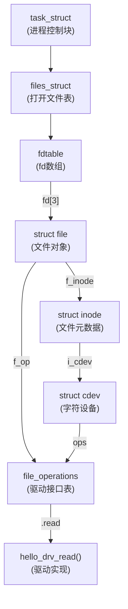
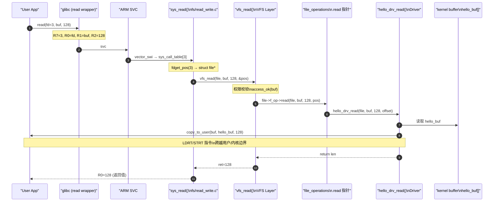

# read/write 系统调用：App 到驱动的完整全景

> [!note]
> **Ref:** [`prj/01_hello_drv/src/driver_fops.c`](/home/pi/imx/prj/01_hello_drv/src/driver_fops.c), [`note/SysCall/00-系统调用全景.md`](/home/pi/imx/note/SysCall/00-系统调用全景.md), [`sdk/Linux-4.9.88/fs/read_write.c`](/home/pi/imx/sdk/Linux-4.9.88/fs/read_write.c)

## 1. 总体路径全景

一次 `read()` 从用户空间到硬件数据的旅程跨越 **5 个层次**：

```
User App
  │  read(fd, buf, len)
  ▼
glibc wrapper          ← 填充 R7=syscall_nr, SVC #0
  │
  ▼
ARM SVC 异常向量        ← CPU 跳至 vector_swi, 切换 SVC Mode
  │
  ▼
sys_read()             ← 内核通用入口 (fs/read_write.c)
  │  vfs_read()
  ▼
file->f_op->read()     ← VFS 派发至具体 file_operations
  │
  ▼
driver_read()          ← 驱动实现，copy_to_user 搬运数据
```

## 2. 各层详解

### 2.1 用户态：glibc 封装

```c
// 用户程序
ssize_t n = read(fd, buf, 128);
```

glibc 的 `read()` 是一个汇编 stub，等效于：

```asm
mov  r0, fd          @ 参数1：文件描述符
mov  r1, buf         @ 参数2：用户缓冲区指针
mov  r2, 128         @ 参数3：字节数
mov  r7, #3          @ read 的系统调用号 = 3 (ARM EABI)
svc  #0              @ 软中断，进入内核
```

**关键：R7 = 系统调用号** 是 ARM EABI 的约定，区别于 x86 的 `rax`。

### 2.2 内核入口：sys_read

```c
// fs/read_write.c
SYSCALL_DEFINE3(read, unsigned int, fd, char __user *, buf, size_t, count)
{
    struct fd f = fdget_pos(fd);       // 从进程的 fd 表取出 struct file
    ssize_t ret = -EBADF;

    if (f.file) {
        loff_t pos = file_pos_read(f.file);
        ret = vfs_read(f.file, buf, count, &pos);  // 进入 VFS
        file_pos_write(f.file, pos);
        fdput_pos(f);
    }
    return ret;
}
```

`fdget_pos(fd)` 将整数 fd 翻译成 `struct file *`——进程打开文件表（`task_struct→files→fdt→fd[]`）的核心操作。

### 2.3 VFS 层：vfs_read 的策略路由

```c
// fs/read_write.c
ssize_t vfs_read(struct file *file, char __user *buf, size_t count, loff_t *pos)
{
    ssize_t ret;

    // 权限检查
    if (!(file->f_mode & FMODE_READ))
        return -EBADF;
    if (!file->f_op->read && !file->f_op->read_iter)
        return -EINVAL;

    // 检查用户空间地址合法性
    if (unlikely(!access_ok(VERIFY_WRITE, buf, count)))
        return -EFAULT;

    ret = rw_verify_area(READ, file, pos, count);
    if (ret >= 0) {
        count = ret;
        // 优先调用 .read，否则用 .read_iter 适配
        if (file->f_op->read)
            ret = file->f_op->read(file, buf, count, pos);
        else
            ret = new_sync_read(file, buf, count, pos);
    }
    return ret;
}
```

VFS 在这里扮演**策略路由器**：它不关心数据在哪里，只负责找到正确的 `file_operations` 并调用。

### 2.4 file_operations：驱动的接口契约

`struct file_operations`（`include/linux/fs.h`）是 VFS 与驱动的**接口协议**：

```c
struct file_operations {
    struct module *owner;
    loff_t  (*llseek)    (struct file *, loff_t, int);
    ssize_t (*read)      (struct file *, char __user *, size_t, loff_t *);
    ssize_t (*write)     (struct file *, const char __user *, size_t, loff_t *);
    unsigned int (*poll) (struct file *, struct poll_table_struct *);
    long    (*unlocked_ioctl)(struct file *, unsigned int, unsigned long);
    int     (*mmap)      (struct file *, struct vm_area_struct *);
    int     (*open)      (struct inode *, struct file *);
    int     (*release)   (struct inode *, struct file *);
    // ... 更多钩子
};
```

驱动注册时，通过 `cdev_init(&cdev, &hello_fops)` 将自己的 fops 绑定到字符设备。

### 2.5 驱动实现：copy_to_user 的关键性

```c
// prj/01_hello_drv/src/driver_fops.c
static ssize_t hello_drv_read(struct file *file,
                               char __user *buf,   // 用户空间指针！
                               size_t len,
                               loff_t *offset)
{
    int ret;
    // 不能直接 memcpy！内核不能直接访问用户空间指针
    ret = copy_to_user(buf, hello_buf, len > 1023 ? 1023 : len);
    return len;
}
```

**为什么不能直接 `memcpy`？**

| 问题 | 原因 |
|------|------|
| 地址可能无效 | 用户空间指针在内核 MMU 页表中可能未映射 |
| 缺页异常 | 用户页可能被换出，需触发 page fault |
| 安全检查 | 防止内核被诱导访问内核自身的敏感地址 |

`copy_to_user` / `copy_from_user` 内部调用 `__copy_to_user_std`，在 ARM 上使用特殊的 **`LDRT/STRT`（unprivileged load/store）** 指令，以用户权限访问内存，并注册异常修复表（`__ex_table`）。

## 3. 数据结构关联图



## 4. 完整时序图



## 5. write 路径的对称性

`write()` 路径与 `read()` **完全对称**，差异仅在于：

| 维度 | read | write |
|------|------|-------|
| 数据流向 | kernel → user | user → kernel |
| 拷贝函数 | `copy_to_user` | `copy_from_user` |
| fops 钩子 | `.read` | `.write` |
| 用户指针 | `char __user *buf`（输出） | `const char __user *buf`（输入） |
| 系统调用号 | 3 | 4 |

```c
static ssize_t hello_drv_write(struct file *file,
                                const char __user *buf,
                                size_t len,
                                loff_t *offset)
{
    copy_from_user(hello_buf, buf, len > 1023 ? 1023 : len);
    return len;
}
```

## 6. 关键知识点速查

| 知识点 | 核心结论 |
|--------|---------|
| fd → file | `task_struct→files→fdt→fd[n]` 查表 |
| VFS 作用 | 统一接口，屏蔽底层差异，策略路由到 fops |
| copy_to/from_user | 必须使用；内部用 LDRT/STRT + 异常修复表 |
| file_operations | 驱动与 VFS 的契约，注册于 cdev_init 时 |
| offset 参数 | 由 VFS 维护，驱动通过 `*offset` 推进读写位置 |
