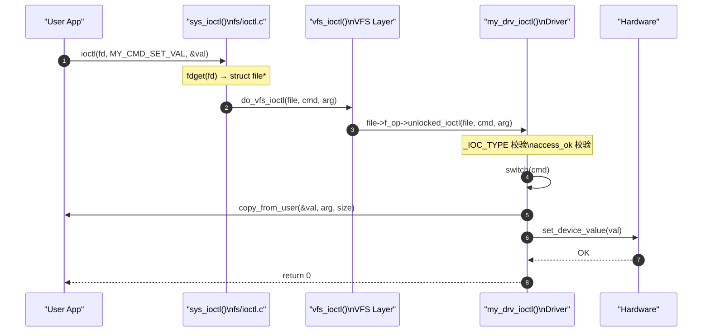

# ioctl 范式：设备控制命令的完整设计与实现

> [!note]
> **Ref:** [`sdk/Linux-4.9.88/include/uapi/asm-generic/ioctl.h`](/home/pi/imx/sdk/Linux-4.9.88/include/uapi/asm-generic/ioctl.h), [`sdk/Linux-4.9.88/fs/ioctl.c`](/home/pi/imx/sdk/Linux-4.9.88/fs/ioctl.c)

## 1. 为什么需要 ioctl

`read`/`write` 只能做数据的线性传输，无法表达"**控制语义**"：

| 需求 | read/write 能做？ | ioctl 做法 |
|------|---------|-------|
| 设置串口波特率 | 无法表达 | `ioctl(fd, TIOCSRATE, 115200)` |
| 查询 GPIO 电平 | 需要约定协议 | `ioctl(fd, GPIO_GET_VALUE, &val)` |
| 启动/停止 DMA | 无法表达 | `ioctl(fd, DMA_START, 0)` |
| 获取驱动版本 | 需要约定 | `ioctl(fd, DRV_GET_VER, &ver)` |

ioctl 是一个"**带命令号的函数调用**"，用于在用户态和驱动之间传递控制语义。

## 2. 系统调用路径

```
用户态: ioctl(fd, cmd, arg)
         │
         ▼ (syscall #54 on ARM)
sys_ioctl()                    ← fs/ioctl.c
  │  do_vfs_ioctl()
  │    vfs_ioctl()
  │      file->f_op->unlocked_ioctl(file, cmd, arg)
  ▼
driver_ioctl()                 ← 驱动实现
```

**注意**：老内核有 `ioctl`（需要 BKL 大内核锁），现代内核统一用 `unlocked_ioctl`（无 BKL）；多处理器系统中若需要与 32-bit userspace 兼容，还需实现 `compat_ioctl`。

## 3. 命令号编码规范：_IOC 宏

Linux 内核为 ioctl 命令号定义了严格的 **32-bit 编码格式**：

```
 31     30 29    16 15    8 7      0
 ┌───────┬─────────┬────────┬────────┐
 │ dir   │  size   │  type  │  nr    │
 │ 2 bit │ 14 bit  │  8 bit │  8 bit │
 └───────┴─────────┴────────┴────────┘
```

| 字段 | 含义 | 取值 |
|------|------|------|
| `dir`  | 数据方向 | `_IOC_NONE=0`, `_IOC_READ=2`, `_IOC_WRITE=1` |
| `size` | 参数大小（字节）| `sizeof(arg_type)` |
| `type` | 设备类型魔数 | 自定义 ASCII 字符，如 `'G'` |
| `nr`   | 命令序号 | 0~255 |

### 3.1 四个构造宏

```c
#include <linux/ioctl.h>  // 内核侧
// 或
#include <sys/ioctl.h>    // 用户侧

// 无数据传输
#define MY_CMD_RESET   _IO('G', 0)

// 内核→用户（读取设备状态）
#define MY_CMD_GET_VAL _IOR('G', 1, int)

// 用户→内核（写入配置）
#define MY_CMD_SET_VAL _IOW('G', 2, int)

// 双向传输
#define MY_CMD_RW      _IOWR('G', 3, struct my_param)
```

**共享头文件最佳实践**：将上述宏定义放入 `include/` 下的公共头文件，驱动和 App 共同 `#include`，避免数值不同步：

```
include/
  my_drv_ioctl.h     ← 驱动和 App 共用
src/
  driver_fops.c
app/
  app.c
```

## 4. 驱动侧实现范式

```c
#include <linux/uaccess.h>
#include "my_drv_ioctl.h"

static long my_drv_ioctl(struct file *file,
                          unsigned int cmd,
                          unsigned long arg)
{
    int val;
    int ret = 0;

    // 1. 验证命令号合法性（可选但推荐）
    if (_IOC_TYPE(cmd) != 'G')
        return -ENOTTY;   // 标准：不识别的 ioctl 返回 ENOTTY
    if (_IOC_NR(cmd) > MY_CMD_MAX_NR)
        return -ENOTTY;

    // 2. 验证用户空间指针可访问性
    if (_IOC_DIR(cmd) & _IOC_READ)
        ret = !access_ok(VERIFY_WRITE, (void __user *)arg, _IOC_SIZE(cmd));
    else if (_IOC_DIR(cmd) & _IOC_WRITE)
        ret = !access_ok(VERIFY_READ,  (void __user *)arg, _IOC_SIZE(cmd));
    if (ret) return -EFAULT;

    // 3. 按命令派发
    switch (cmd) {
    case MY_CMD_RESET:
        // 无参数，直接操作硬件
        hardware_reset();
        break;

    case MY_CMD_GET_VAL:
        // 内核 → 用户：copy_to_user
        val = get_device_value();
        if (copy_to_user((int __user *)arg, &val, sizeof(int)))
            return -EFAULT;
        break;

    case MY_CMD_SET_VAL:
        // 用户 → 内核：copy_from_user
        if (copy_from_user(&val, (int __user *)arg, sizeof(int)))
            return -EFAULT;
        set_device_value(val);
        break;

    case MY_CMD_RW: {
        struct my_param p;
        if (copy_from_user(&p, (struct my_param __user *)arg, sizeof(p)))
            return -EFAULT;
        process_param(&p);
        if (copy_to_user((struct my_param __user *)arg, &p, sizeof(p)))
            return -EFAULT;
        break;
    }

    default:
        return -ENOTTY;  // 未知命令
    }

    return ret;
}

// 注册到 fops
const struct file_operations my_fops = {
    .owner          = THIS_MODULE,
    .unlocked_ioctl = my_drv_ioctl,
    // ... 其他钩子
};
```

### 4.1 简单整数参数的特殊处理

当参数是小整数（≤ `unsigned long` 大小）时，可以不用指针，直接用 `arg` 值传递：

```c
// App 侧
ioctl(fd, MY_CMD_SET_VAL, 42);      // arg 直接是整数值，非指针

// 驱动侧
case MY_CMD_SET_VAL:
    val = (int)arg;                  // 直接强转，无需 copy_from_user
    set_device_value(val);
    break;
```

**危险**：此时不应该定义 `_IOW`（有 size 字段），改用 `_IO`，否则 access_ok 检查会尝试验证 42 作为指针——这是 bug。

## 5. 用户态调用范式

```c
#include <sys/ioctl.h>
#include <fcntl.h>
#include "my_drv_ioctl.h"   // 共用头文件

int fd = open("/dev/my_drv", O_RDWR);

// 无参数控制
ioctl(fd, MY_CMD_RESET);

// 读取设备值
int val;
ioctl(fd, MY_CMD_GET_VAL, &val);
printf("device value: %d\n", val);

// 写入配置
val = 100;
ioctl(fd, MY_CMD_SET_VAL, &val);

// 双向
struct my_param p = { .input = 10 };
ioctl(fd, MY_CMD_RW, &p);
printf("output: %d\n", p.output);
```

## 6. 错误码约定

| 返回值 | 语义 |
|--------|------|
| `0` | 成功 |
| `-ENOTTY` | 不支持该 ioctl 命令（标准约定） |
| `-EINVAL` | 参数值非法 |
| `-EFAULT` | 用户空间指针无效 |
| `-EACCES` | 权限不足 |
| `-EBUSY`  | 设备忙 |

## 7. ioctl vs netlink vs sysfs 选型

| 方案 | 适用场景 | 优缺点 |
|------|---------|--------|
| `ioctl` | 设备驱动控制，低延迟同步操作 | 简单高效，但不易扩展 |
| `sysfs` | 驱动属性读写（调试、配置） | 可读性强，但只支持简单字符串 |
| `netlink` | 网络子系统、大数据量异步通知 | 灵活，但复杂度高 |
| `debugfs` | 调试专用，不进生产 | 无权限控制 |

**原则**：字符设备驱动的控制命令优先用 `ioctl`；只读的驱动状态暴露用 `sysfs`。

## 8. 流程总结图


