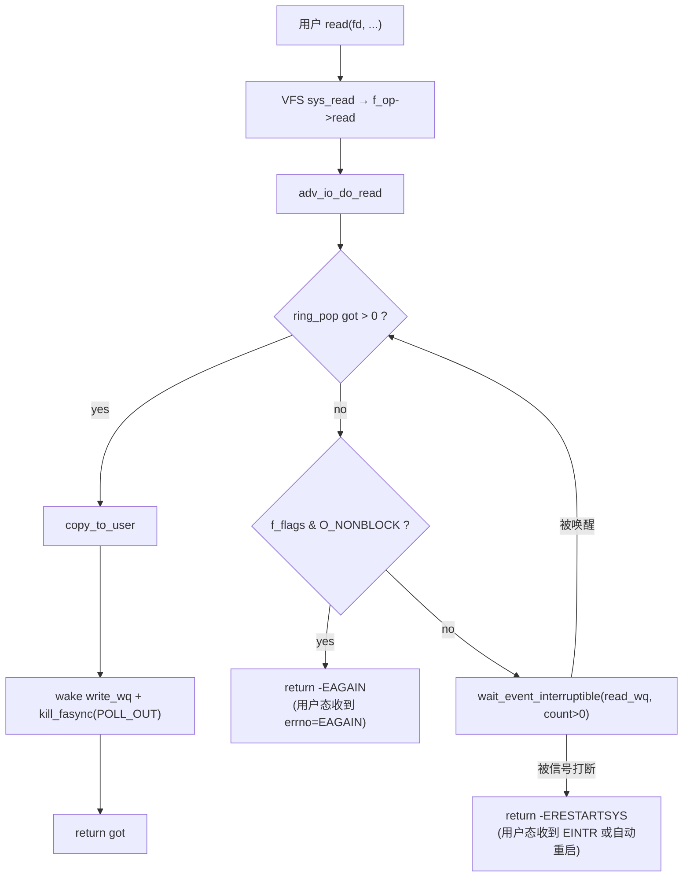

# 阻塞 / 非阻塞 IO — 驱动侧与应用侧实现细节

> [!note]
> **Ref:**
> - 驱动: `prj/03-Advanced-IO/src/adv_io_fops.c` (`adv_io_do_read` / `adv_io_do_write`)
> - 测试: `prj/03-Advanced-IO/test/test_block.c` / `test_nonblock.c`
> - strace 验证: `note/SysCall/IO/Trail-straced-SysCall.md` ① 与 ②
> - 配套机制: `note/SysCall/IO/poll-kernel-mechanism.md`

阻塞与非阻塞**不是两条独立的代码路径**,而是同一个 `f_op->read/write` 根据 `file->f_flags & O_NONBLOCK` 走不同分支。把这一点想清楚,后面所有细节都顺理成章。

---

## 1. 驱动侧:一份 read 同时支持两种模式

```c
static ssize_t adv_io_do_read(struct adv_io_dev *d, struct file *file,
                              char __user *ubuf, size_t len)
{
    u8 tmp[RING_SIZE];
    unsigned int got;
    unsigned long flags;
    int ret;

    for (;;) {
        spin_lock_irqsave(&d->ring_lock, flags);
        got = ring_pop(d, tmp, len);                     /* (1) 临界区只做搬数据 */
        spin_unlock_irqrestore(&d->ring_lock, flags);

        if (got)
            break;                                       /* (2) 拿到数据立刻出循环 */

        if (file->f_flags & O_NONBLOCK)                  /* (3) 非阻塞:直接 EAGAIN */
            return -EAGAIN;

        ret = wait_event_interruptible(d->read_wq,       /* (4) 阻塞:睡到条件成立 */
                                       READ_ONCE(d->count) > 0);
        if (ret)
            return -ERESTARTSYS;                         /* (5) 被信号打断 */
    }

    if (copy_to_user(ubuf, tmp, got))                    /* (6) 出锁后才 copy_to_user */
        return -EFAULT;

    wake_up_interruptible(&d->write_wq);                 /* (7) 腾出空间, 唤醒写者 */
    kill_fasync(&d->fasync_q, SIGIO, POLL_OUT);
    return got;
}
```

### 1.1 七个必须做对的细节

| # | 细节 | 错误后果 |
|---|---|---|
| (1) | **临界区只搬数据,不做 copy_to_user** | `copy_to_user` 可能 page fault → 持锁睡眠 → 死锁 |
| (2) | **拿到任意字节就返回**(部分读语义) | 强行读满会饿死小数据流;违反 POSIX 部分读约定 |
| (3) | `O_NONBLOCK` 检查在睡眠**之前** | 否则非阻塞退化成阻塞 |
| (4) | 用 `wait_event_interruptible` 而非 `wait_event` | 不可中断的睡眠会让进程变 D 状态,kill -9 都打不掉 |
| (5) | 被信号打断返回 `-ERESTARTSYS` | 让 VFS 决定是否自动重启,配合 `SA_RESTART` |
| (6) | 拷贝失败返回 `-EFAULT` 但**不要回滚 ring_pop** | 数据已经出 ring,回滚需要复杂的事务,通常约定丢弃 |
| (7) | 成功后**反向唤醒** + `kill_fasync` | 否则写者永远等待 / SIGIO 监听者饿死 |

### 1.2 为什么必须用 `wait_event_interruptible` 这个宏

展开后大致是:

```c
for (;;) {
    prepare_to_wait(&d->read_wq, &wait, TASK_INTERRUPTIBLE);
    if (READ_ONCE(d->count) > 0) break;     /* 双重检查, 防丢失唤醒 */
    if (signal_pending(current)) { ret = -ERESTARTSYS; break; }
    schedule();
}
finish_wait(&d->read_wq, &wait);
```

**关键点**:`prepare_to_wait` 把任务挂入 wait_queue 并置 `TASK_INTERRUPTIBLE`,**然后**才再查一次条件。这个顺序确保了:即使 producer 在"挂队列"和"check 条件"之间触发 `wake_up`,也不会丢失 —— 因为 wake 只是把任务状态改回 RUNNING,后续 `schedule()` 会立刻返回。

手写 `if (empty) schedule();` 一定有 race,**永远用 `wait_event_*` 宏**。

### 1.3 锁的粒度

```
spin_lock_irqsave  →  ring_pop 仅几行 memcpy  →  unlock
                                              ↓
                                       (锁外) copy_to_user, wake_up
```

`_irqsave` 是因为 producer 在内核 timer/中断上下文里也调 `ring_push`,与用户进程上下文构成 IRQ-vs-process 竞争 —— `spin_lock` 不够,必须屏蔽本地中断。

### 1.4 写路径的对称性

`adv_io_do_write` 的形状几乎是镜像:满 → `EAGAIN` 或睡 `write_wq`,成功后 `wake_up_interruptible(&d->read_wq)` + `kill_fasync(POLL_IN)`。这种**双 wait_queue + 双唤醒**是 ring buffer 类驱动的标准范式。

---

## 2. 应用侧:两种模式各自该怎么用

### 2.1 阻塞模式 — 最简单, 但有两个坑

```c
int fd = open("/dev/adv_io", O_RDWR);          /* 没有 O_NONBLOCK */
char buf[16];
for (;;) {
    ssize_t n = read(fd, buf, sizeof(buf));
    if (n < 0) {
        if (errno == EINTR) continue;          /* 坑 1: 被信号打断要重试 */
        perror("read"); break;
    }
    if (n == 0) break;                          /* 坑 2: 0 字节 = EOF, 不是 retry */
    process(buf, n);
}
```

- **坑 1**:即便驱动返回 `-ERESTARTSYS`,如果信号 handler 没装 `SA_RESTART`,内核会把它转换成 `EINTR` 给用户态。所有阻塞 IO 循环都必须处理 `EINTR`。
- **坑 2**:`read() == 0` 永远表示 EOF,不要写成 `while ((n = read(...)) <= 0)`,会陷入死循环或误判。

### 2.2 非阻塞模式 — 必须配合就绪通知

```c
int fd = open("/dev/adv_io", O_RDONLY | O_NONBLOCK);
/* 或者 fcntl(fd, F_SETFL, fcntl(fd,F_GETFL) | O_NONBLOCK) */

char buf[16];
ssize_t n = read(fd, buf, sizeof(buf));
if (n < 0 && errno == EAGAIN) {
    /* 没数据 - 但不要立即重试! 那会变成 100% CPU 的忙等 */
    /* 正确做法: 用 poll/epoll/SIGIO 等就绪通知 */
}
```

**非阻塞 IO 的灵魂**:`O_NONBLOCK` 本身不解决"数据何时到"的问题,它只是把"等"的责任从内核搬到用户态。**单独用 `O_NONBLOCK` 几乎没有意义** —— 必须搭配:

| 搭配 | 用途 |
|---|---|
| `poll/select/epoll` | 一个线程管多个 fd |
| `O_ASYNC` + `SIGIO` (`fasync`) | 极少 fd, 用信号驱动 |
| `aio_read` (POSIX AIO) | glibc 用线程池模拟, 见 strace ⑤ |
| 纯 busy loop | **错** —— 除非你有非常特殊的延迟需求 |

### 2.3 两种模式的混用

允许在运行时切换:

```c
int flags = fcntl(fd, F_GETFL, 0);
fcntl(fd, F_SETFL, flags | O_NONBLOCK);     /* → 非阻塞 */
fcntl(fd, F_SETFL, flags & ~O_NONBLOCK);    /* → 阻塞 */
```

驱动侧不需要做任何事,因为 `adv_io_do_read` 每次都重新读 `file->f_flags`。这就是为什么 `O_NONBLOCK` 检查必须放在 `read()` 函数体内,而不能缓存到 `private_data` 里。

---

## 3. 一张图总结控制流



---

## 4. strace 实证回放

`Trail-straced-SysCall.md` 的两段刚好对应这两条分支:

**阻塞**(`O_RDWR`,无 `O_NONBLOCK`):

```
openat("/dev/adv_io", O_RDWR)  = 3
read(3, "\0", 16)              = 1     ← 走 D→E→F→G
read(3, "\1", 16)              = 1     ← 中间 ~510ms 走 J 睡眠
```

**非阻塞**(`O_RDONLY|O_NONBLOCK`,空 ring):

```
openat("/dev/adv_io", O_RDONLY|O_NONBLOCK) = 3
read(3, ..., 16)               = -1 EAGAIN   ← 走 D→H→I, 完全没睡眠
read(3, ..., 16)               = -1 EAGAIN
```

两条 strace 中**两个 read 之间的时间差**最有说服力:阻塞分支是 ~510 ms(producer 节拍),非阻塞分支是 ~3 ms(纯系统调用 round-trip)。

---

## 5. 易错点 checklist

- [ ] 驱动 `read` 里**先解锁再 `copy_to_user`** — 否则 page fault 死锁
- [ ] 用 `wait_event_interruptible`,**不要**用 `wait_event`
- [ ] `O_NONBLOCK` 检查必须**每次** read 重新看 `file->f_flags`
- [ ] 成功路径要 **wake 反向 wait_queue** + `kill_fasync`,否则其它范式饿死
- [ ] 用户态阻塞循环必须处理 `EINTR`
- [ ] 用户态非阻塞**不要** busy loop, 必须搭配 poll/SIGIO/epoll
- [ ] `release` 里调 `fasync_helper(..., 0)` 清除 fasync 节点 (`adv_io_release` 已示范),否则 use-after-free panic
