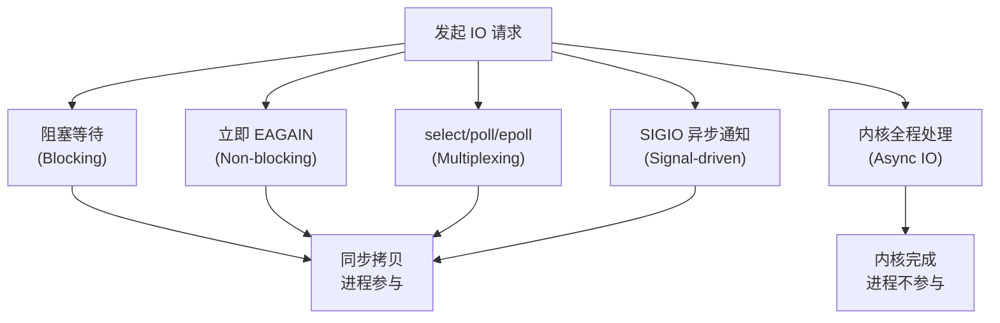
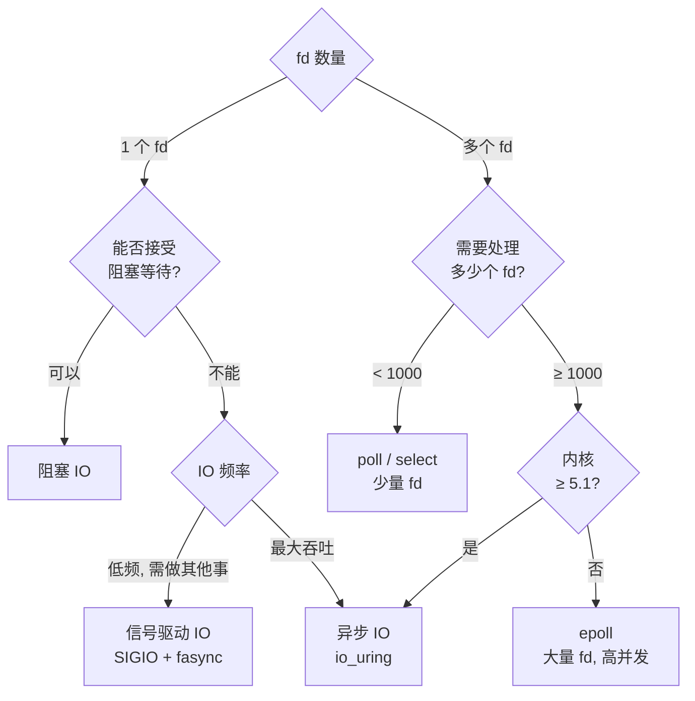

# IO 范式总览 — 五种模型的地图

> [!note]
> **Ref:** APUE 第 14 章, UNP 第 6 章。本文是**地图**,只做对照与导航,机制细节请跳转到 §6 列出的专题笔记。

Linux 上有五种 IO 范式,差异只在两件事:**(A) 等待数据时谁阻塞、(B) 拷贝数据时谁参与**。把这张二维表记住,后面所有 API 就只是同一矩阵的不同坐标。


## 1. 全景对照

| 范式 | 等待数据 | 拷贝数据 | 同步/异步 | 阻塞/非阻塞 |
|------|---------|---------|---------|------------|
| 阻塞 IO | 进程挂起 | 进程参与 | 同步 | 阻塞 |
| 非阻塞 IO | `EAGAIN` 立返 | 进程参与 | 同步 | 非阻塞 |
| IO 多路复用 | `select/poll/epoll` 挂起 | 进程参与 | 同步 | 阻塞(在 select) |
| 信号驱动 IO | 主循环不挂起,SIGIO 异步通知 | 进程参与 | 同步(拷贝时) | 非阻塞 |
| 异步 IO (AIO) | 内核全程处理 | 内核完成 | **真异步** | 非阻塞 |




## 2. 一句话定位

- **阻塞 IO** — 最简单。`read()` 直接睡到数据来。一线程一 fd。
- **非阻塞 IO** — `O_NONBLOCK` 让 `read()` 立即返回 `EAGAIN`。**单独使用没有意义**,必须搭配 poll/SIGIO/epoll。
- **IO 多路复用** — 一线程同时等多个 fd。`select`/`poll` 适合中小规模,`epoll` 适合大量长连接。
- **信号驱动 IO** — "门铃模型"。内核数据到了发 SIGIO,进程在 handler 里**自己 read**。等待异步,拷贝同步。
- **异步 IO** — "上门送货"。提交时把 buffer 一起交出去,完成通知时数据已就位,**无需再 read**。Linux 上唯一真正的实现是 `io_uring`(POSIX `aio_*` 在 glibc 是用户态线程模拟,见 [`trail-strace.md`](./trail-strace.md) §⑤)。


## 3. 选型决策树




## 4. 嵌入式驱动场景速查

| 应用场景 | 推荐范式 | 驱动需实现 |
|---------|---------|-----------|
| 简单传感器读取 | 阻塞 IO | `.read` + `wait_event` |
| 按键/GPIO 中断输入 | 阻塞 IO 或 SIGIO | `.read` + `.fasync` |
| 多路串口数据采集 | poll | `.read` + `.poll` |
| 高速数据流 + UI 响应 | epoll + `O_NONBLOCK` | `.read` + `.poll` |
| 实时控制(低延迟通知) | 信号驱动 | `.fasync` + `kill_fasync` |
| 大块 DMA 传输 | io_uring | `.read_iter` |


## 5. 驱动最小支持矩阵

```
阻塞读/写        ← 必须: .read + .write + wait_event
非阻塞支持       ← 加: 检查 file->f_flags & O_NONBLOCK
多路复用支持     ← 加: .poll + poll_wait
信号驱动支持     ← 加: .fasync + kill_fasync
控制命令         ← 加: .unlocked_ioctl
```

**关键事实**:`.poll` 一份实现同时服务 select/poll/epoll;驱动**完全无需感知**用户态用的是哪一套 API。机制原因见 [`05-poll-kernel.md`](./05-poll-kernel.md) §2 与 [`06-multiplex-compare.md`](./06-multiplex-compare.md) §3。


## 6. 详细笔记索引

| 范式 | 详细笔记 |
|------|---------|
| 阻塞 / 非阻塞 IO 的双侧细节 | [`03-blocking-semantics.md`](./03-blocking-semantics.md) |
| poll 内核机制 (do_sys_poll → __pollwait → wait_queue) | [`05-poll-kernel.md`](./05-poll-kernel.md) |
| select / poll / epoll 横向对比 | [`06-multiplex-compare.md`](./06-multiplex-compare.md) |
| 信号驱动 IO (fasync + SIGIO) | [`07-fasync-sigio.md`](./07-fasync-sigio.md) |
| 完整字符驱动模板(read/write/poll/fasync 五件套) | [`08-drv-fops-recipes.md`](./08-drv-fops-recipes.md) |
| 五种范式的 strace 实证轨迹 | [`trail-strace.md`](./trail-strace.md) |
| read/write 系统调用全景 | [`01-read-write.md`](./01-read-write.md) |
| ioctl 控制命令范式 | [`02-ioctl.md`](./02-ioctl.md) |
