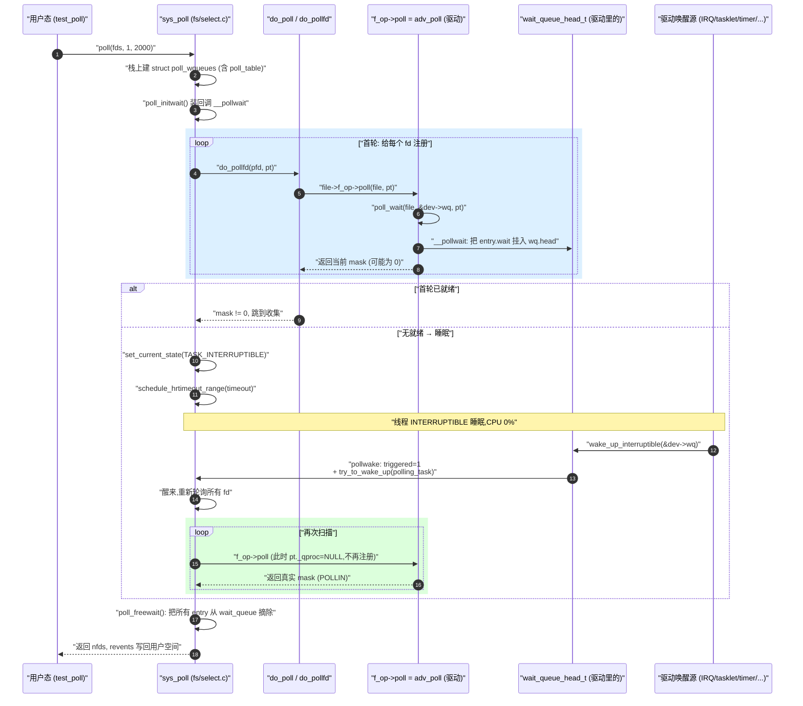

# poll 内核机制 — 单一可信源

> [!note]
> **Ref:**
> - 用户态文档:`man 2 poll`(本文 §1 是它的精炼)
> - 内核源码:`sdk/100ask_imx6ull-sdk/Linux-4.9.88/fs/select.c` (`sys_poll`, `do_sys_poll`, `do_poll`, `__pollwait`)
> - 头文件:`sdk/100ask_imx6ull-sdk/Linux-4.9.88/include/linux/poll.h` (`poll_table`, `poll_wqueues`, `poll_wait`)
> - 等待队列:`include/linux/wait.h`
> - 本仓 demo:`prj/03-Advanced-IO/src/` 的 `adv_poll`,strace 见 [`trail-strace.md`](./trail-strace.md) §③
> - 横向对照:[`06-multiplex-compare.md`](./06-multiplex-compare.md)
> - 驱动落地模板:[`08-drv-fops-recipes.md`](./08-drv-fops-recipes.md)

本文是 poll 机制**唯一的内核机制可信源**。原 `03-poll机制详解.md` 与 `poll-kernel-mechanism.md` 已合并到本文,旧链接请改指此处。结构按 "用户 API → 内核数据结构 → 调用流程 → 驱动配合 → 实证" 自顶向下展开。


## 1. man poll — 用户态 API 先行

读机制之前先把 API 语义钉死,后面所有内核细节才有靶子。

### 1.1 签名

```c
#include <poll.h>

/*
 * API 行为概述：
 * poll() 接收一个预先分配好的 pollfd 数组。
 * 用户将关心的事件填入 events，内核在唤醒时将实际发生的事件填入 revents。
 * 这种读写分离的设计意味着 pollfd 数组可以被反复重用，只需在下次调用前
 * 视情况重置 events 即可，无需像 select 那样每次重建整个集合。
 * 线程将被阻塞，直到发生请求的事件之一，或经过了 timeout 毫秒。
 */
int poll(struct pollfd *fds, nfds_t nfds, int timeout);

struct pollfd {
    int   fd;          /* 要监听的文件描述符,负值则忽略 */
    short events;      /* 关心的事件(输入参数) */
    short revents;     /* 实际发生的事件(内核回填) */
};
```

### 1.2 events / revents 位掩码

`events` 是请求,`revents` 是结果。**`POLLERR` / `POLLHUP` / `POLLNVAL` 三个永远会被报告**,无需也无法在 `events` 里订阅。

| 宏 | 值 | 语义 | 可订阅 |
|----|----|------|--------|
| `POLLIN`     | 0x0001 | 有数据可读 | ✅ |
| `POLLPRI`    | 0x0002 | 高优先级数据(带外) | ✅ |
| `POLLOUT`    | 0x0004 | 可以写入 | ✅ |
| `POLLRDNORM` | 0x0040 | 普通数据可读(等同 `POLLIN`) | ✅ |
| `POLLWRNORM` | 0x0100 | 普通数据可写(等同 `POLLOUT`) | ✅ |
| `POLLRDBAND` | 0x0080 | 带优先级数据可读 | ✅ |
| `POLLERR`    | 0x0008 | 错误条件 | ❌ 自动报告 |
| `POLLHUP`    | 0x0010 | 挂断(对端关闭) | ❌ 自动报告 |
| `POLLNVAL`   | 0x0020 | fd 非法(未打开等) | ❌ 自动报告 |

### 1.3 timeout 三种取值

| 值 | 语义 |
|----|------|
| `-1` (任意负数) | 永久等,直到事件或信号 |
| `0` | **不睡眠**,首轮扫一次立刻返回(用作"非阻塞 poll",查询当前是否就绪) |
| `>0` (毫秒) | 最多等这么久,期间一直睡眠 |

> [!warning] 最常见的误解
> `poll` 这个名字是历史包袱,它**不是轮询**。`timeout` 不是"每 N ms 主动查一次",而是 "**最长等待上限**"。期间线程是 `TASK_INTERRUPTIBLE` 睡眠,CPU 占用 0%,内核**只在被驱动 `wake_up` 唤醒后**才再调一次 `f_op->poll`。`poll(fds, n, 100)` 和 `poll(..., 5000)` 反应**一样快**(都由 wake_up 即时触发),只是兜底放弃时间不同。
>
> **类比**:`poll(timeout=2000)` ≈ "最多等 2 秒,门铃响了立刻去开",而不是"每 2 秒查一次"。

### 1.4 返回值与 errno

| 返回值 | 含义 |
|--------|------|
| `> 0` | 就绪的 fd 数量(有 `revents != 0` 的) |
| `0`   | timeout 到期,无 fd 就绪 |
| `-1`  | 错误,见 errno |

| errno | 触发场景 |
|-------|---------|
| `EINTR`  | 被信号中断(handler 没装 `SA_RESTART`) |
| `EFAULT` | `fds` 指针越界 |
| `EINVAL` | `nfds > RLIMIT_NOFILE` |
| `ENOMEM` | 内核分配 `poll_wqueues` 失败 |

### 1.5 最小用例

```c
struct pollfd pfd = { .fd = fd, .events = POLLIN };
int n = poll(&pfd, 1, 2000);
if (n < 0)         perror("poll");
else if (n == 0)   puts("timeout");
else if (pfd.revents & POLLIN) read(fd, buf, sizeof buf);
```

带住这几条 API 语义,下面所有内核机制都有了"为什么"的目标。


## 2. 问题定位

朴素阻塞读只能等一个 fd:

```c
read(fd_keyboard, buf, 1);   // 阻塞:无法同时监听网络/串口/...
```

多路复用的核心需求 — **一个线程同时监听多个 fd,任意一个就绪就处理**。Linux 在 `fs/select.c` 与 `fs/eventpoll.c` 里给出三套用户态 API,但**驱动层只暴露一个钩子** `f_op->poll`。本文只讲 poll 这一条路径,因为它最能体现 `f_op->poll` ↔ `wait_queue` 的协作。三套 API 的横向差异详见 [`06-multiplex-compare.md`](./06-multiplex-compare.md)。


## 3. 核心数据结构

### 3.1 等待队列(底座)

```c
// include/linux/wait.h
struct wait_queue_head_t {
    spinlock_t       lock;
    struct list_head task_list;     // 等待该事件的进程链表
};

struct wait_queue_t {
    unsigned int        flags;
    void               *private;    // → task_struct
    wait_queue_func_t   func;       // 唤醒回调(poll 用 pollwake, epoll 用 ep_poll_callback)
    struct list_head    task_list;
};
```

驱动持有 `wait_queue_head_t`(代表一个事件源),内核 poll 框架动态创建 `wait_queue_t`(代表一个等待者),把后者挂到前者的 `task_list` 上。

### 3.2 poll_table 三件套

```c
// include/linux/poll.h
typedef struct poll_table_struct {
    poll_queue_proc _qproc;     // 把当前任务挂到 wait_queue 的回调
    unsigned long   _key;       // 关心的事件掩码 (POLLIN/POLLOUT/...)
} poll_table;

struct poll_wqueues {            // do_sys_poll 在栈上分配
    poll_table              pt;
    struct poll_table_page *table;     // 链式 slab,存 poll_table_entry
    struct task_struct     *polling_task;
    int                     triggered; // wake_up 后置 1
    int                     error;
    int                     inline_index;
    struct poll_table_entry inline_entries[N_INLINE_POLL_ENTRIES];
};

struct poll_table_entry {        // 每 (fd, wait_queue) 一个
    struct file        *filp;
    unsigned long       key;
    wait_queue_entry_t  wait;       // 真正挂到驱动 wait_queue 的节点
    wait_queue_head_t  *wait_address;
};
```

记住一句话:**`poll_table` 是一个"回调容器",用户线程把它递给 `f_op->poll`,让驱动用它把自己挂进等待队列**。这是典型的 inversion-of-control。


## 4. 内核调用链

### 4.1 调用栈总览

```
用户态 poll(2)
  │
  ▼
SYSCALL_DEFINE3(poll, ...)        fs/select.c
  │  do_sys_poll
  │    poll_initwait()             ← 装回调 _qproc = __pollwait
  │    do_poll                     ← 主循环
  │      do_pollfd                 ← 对每个 fd
  │        f_op->poll(file, pt)    ← 调驱动
  │          poll_wait(file, &dev->wq, pt)
  │            __pollwait          ← 真正挂入 dev->wq
  │  poll_freewait()               ← 退出前从所有 wq 摘下
  ▼
return revents 给用户态
```

### 4.2 do_poll 核心循环 (简化)

```c
static int do_poll(unsigned int nfds, struct poll_list *list,
                   struct poll_wqueues *wait, struct timespec *end_time)
{
    int count = 0;

    for (;;) {
        struct poll_list *walk;

        // 第一轮:遍历所有 fd → 调驱动 .poll → 登记等待队列
        for (walk = list; walk; walk = walk->next)
            for (int i = 0; i < walk->len; i++)
                count += do_pollfd(&walk->entries[i], wait);

        if (count || !*timeout || signal_pending(current))
            break;

        if (wait->triggered)        // 已被某 wq wake_up
            break;

        schedule_hrtimeout_range(timeout);   // 睡到超时或被踢醒
    }
    return count;
}
```

注意 `if (count || !*timeout ...)` 这一行 —— `*timeout == 0` 直接 `break`,这就是 §1.3 表里 `timeout=0` "完全不睡眠"的实现。

### 4.3 poll_wait 与 __pollwait

```c
static inline void poll_wait(struct file *f, wait_queue_head_t *wq, poll_table *p)
{
    if (p && p->_qproc && wq)
        p->_qproc(f, wq, p);     // = __pollwait
}
```

`__pollwait` 做三件事:

1. 从 `poll_wqueues.table` 里分配一个 `poll_table_entry`。
2. `init_waitqueue_func_entry(&entry->wait, pollwake)` —— 自定义唤醒回调。
3. `add_wait_queue(wq, &entry->wait)` —— 挂入驱动 `wait_queue`。

之后驱动调用 `wake_up_interruptible(&dev->wq)`,`pollwake` 被触发 → 置位 `poll_wqueues.triggered` 并把 polling 线程踢醒。

### 4.4 race-free 的睡眠三段式

第一轮扫完 mask 全 0 后,真正睡眠发生在 `poll_schedule_timeout` 里,简化后是:

```c
set_current_state(TASK_INTERRUPTIBLE);   // ① 先置 INTERRUPTIBLE
if (!pwq->triggered)                      // ② 再查 triggered
    rc = schedule_hrtimeout_range(...);   // ③ 才睡
__set_current_state(TASK_RUNNING);
```

为什么这个顺序是必须的(`①②③`):**首轮扫描已经把 wait_entry 挂入驱动 wq**。假设 producer 在中断里调 `wake_up_interruptible(&dev->wq)`:

| wake 发生时刻 | 结果 |
|-------------|------|
| ① 之前 | ② 读到 `triggered=1`,跳过 schedule |
| ① 与 ② 之间 | `pollwake` 把状态从 INTERRUPTIBLE 改回 RUNNING **且** triggered=1,② 仍读到 1,跳过 schedule |
| ② 与 ③ 之间 | 状态被改回 RUNNING,`schedule_hrtimeout_range` 检测到 RUNNING **立即返回**,不真睡 |

**没有这个顺序就会有"丢失唤醒" race** — wake 信号在 check 之后、sleep 之前到达,然后你睡进去再也没人叫你。这是 Linux 内核所有可靠睡眠的标准模式,等价于 `wait_event_interruptible` 宏的展开。

`TASK_INTERRUPTIBLE` 还兼顾了第二个目的:让 `signal_pending(current)` 在 `schedule` 醒来后能命中,使 `poll(2)` 是可被信号中断的 syscall(返回 `-EINTR`)。


## 5. 全景时序图



**最容易被忽略的两点**:

- **第二轮扫描时 `pt._qproc = NULL`** —— `poll_wait()` 退化成空操作,只用来**采集 mask**,不再重复挂队列。
- **挂队列只发生一次,但摘除是必然的** —— 即便 timeout 也要遍历清理。这就是 poll/select 在大 fd 数下退化的真正原因(N 次 list_add + N 次 list_del per call)。


## 6. 驱动侧:实现 .poll 与唤醒

### 6.1 .poll 最小骨架

完整可编译版本见 [`08-drv-fops-recipes.md`](./08-drv-fops-recipes.md);此处只点出与本文机制相关的两个不变量。

```c
static __poll_t adv_poll(struct file *filp, struct poll_table_struct *pt)
{
    struct adv_dev *dev = filp->private_data;
    __poll_t mask = 0;

    poll_wait(filp, &dev->rwq, pt);     // 注册(首轮才真做事)
    poll_wait(filp, &dev->wwq, pt);     // 可以挂多个 wait_queue

    spin_lock(&dev->lock);
    if (!kfifo_is_empty(&dev->fifo)) mask |= POLLIN  | POLLRDNORM;
    if (!kfifo_is_full(&dev->fifo))  mask |= POLLOUT | POLLWRNORM;
    spin_unlock(&dev->lock);

    return mask;
}
```

两个**绝对不变量**:

1. **`.poll` 必须立即返回当前 mask**,不允许在里面睡眠。睡眠由 `do_poll` 里的 `schedule_hrtimeout_range` 统一负责。
2. **`.poll` 必须无副作用**,因为它会被调用两次以上(首轮注册 + 每次唤醒后再扫)。**不要**在里面修改 `data_ready` 之类的状态 —— 状态消费在 `.read` 里做。

### 6.2 谁来 wake_up — 五种唤醒上下文

`wake_up_interruptible(&dev->wq)` 本身**上下文无关**(只持自旋锁,不睡眠),所以驱动可以从几乎任何内核上下文调用。按"距离硬件的远近"排列:

#### (1) 硬中断上下文 (Hard IRQ) — 最常见

```c
static irqreturn_t adv_io_irq(int irq, void *dev_id)
{
    struct adv_io_dev *d = dev_id;

    spin_lock(&d->ring_lock);
    ring_push(d, hw_read_byte());
    spin_unlock(&d->ring_lock);

    wake_up_interruptible(&d->read_wq); // ← IRQ 上下文里直接 wake
    return IRQ_HANDLED;
}
```

**为什么硬中断里能 wake**:`wake_up_interruptible` 内部只做 `spin_lock_irqsave(&wq->lock)` + 遍历 wait_list + `try_to_wake_up`,**不睡眠、不调度**。它只是把目标线程状态从 `TASK_INTERRUPTIBLE` 改回 `TASK_RUNNING` 并塞进运行队列,**真正的调度发生在 IRQ 返回路径**(`irq_exit` → `preempt_schedule_irq`)。

按键、串口 RX、网卡 RX 完成 — 都是这条路径。

#### (2) 软中断 / Tasklet / Workqueue 底半部

硬中断里只把 buffer 抢出来,数据搬运延后到底半部时再唤醒。tasklet/softirq 仍是**原子上下文**(不能睡),但比硬中断"距离调度器更近"。

#### (3) 内核线程 / Workqueue (process context)

```c
static void adv_io_work_fn(struct work_struct *w)
{
    struct adv_io_dev *d = container_of(w, struct adv_io_dev, work);
    if (kfifo_in(&d->fifo, ...))
        wake_up_interruptible(&d->read_wq);
}
```

`workqueue` 跑在 `kworker` 进程上下文,**可以睡眠**,适合做需要 `GFP_KERNEL` 分配、互斥锁、阻塞 IO 的复杂处理。

#### (4) 高精度 / 普通 timer 回调

```c
static enum hrtimer_restart adv_io_tick(struct hrtimer *t)
{
    struct adv_io_dev *d = container_of(t, struct adv_io_dev, timer);
    ring_push(d, d->seq++);
    wake_up_interruptible(&d->read_wq);
    hrtimer_forward_now(t, ms_to_ktime(510));
    return HRTIMER_RESTART;
}
```

`hrtimer` 回调跑在**软中断上下文**(`HRTIMER_SOFTIRQ`),约束等同 (2)。本仓 `prj/03-Advanced-IO` 的 ~510 ms 节拍正是从这里来的。

#### (5) 另一个用户进程的 syscall 上下文

```c
static ssize_t adv_io_write(struct file *f, ...)
{
    spin_lock(&d->lock);
    ring_push(d, ...);
    spin_unlock(&d->lock);

    wake_up_interruptible(&d->read_wq);  // 唤醒在 read_wq 上 poll 的进程 A
    return n;
}
```

pipe / socketpair / 用户态 IPC 类设备的典型路径。**唤醒方和被唤醒方都是 process context**,只是不同进程。

#### 上下文速查表

| 上下文 | 可睡眠? | 典型用途 |
|--------|--------|---------|
| 硬中断 | ❌ | 真实硬件 fast path |
| Softirq / tasklet | ❌ | 网络协议栈、底半部 |
| hrtimer / timer | ❌ | 周期采样、超时 |
| Workqueue / kthread | ✅ | 复杂处理、GFP_KERNEL 分配 |
| 另一进程 syscall | ✅ | pipe、ringbuf 类驱动 |

### 6.3 wake_up 的两条共性约束

不管在哪种上下文,wake 路径都必须遵守:

1. **不能持有目标 wait_queue 的 lock 时再调 `wake_up`** — `wake_up_interruptible` 自己会拿 `wq->lock`,会**死锁**。
2. **`wake_up` 之前必须先发布数据** — 即"先 `ring_push`/`WRITE_ONCE` 写数据 → 再 `wake_up`",否则被唤醒的线程在 §4.4 race-free 三段式的第二轮 `f_op->poll` 时仍然看到 `mask=0`,误以为是伪唤醒重新去睡。

第二条配上读侧的 `set_current_state(INTERRUPTIBLE) → 检查条件 → schedule()`,构成 Linux 内核 wait_queue 的**完整 memory barrier 配对**(`wake_up` 内部有 `smp_mb__before_atomic`,`set_current_state` 是 `smp_store_mb`)。

### 6.4 跨上下文的桥梁

回到核心问题 — poll 进程睡在 `schedule_hrtimeout_range` 里,驱动唤醒它时跨越了上下文边界:

```
驱动上下文 (IRQ / tasklet / workqueue / hrtimer / 另一进程)
    │  wake_up_interruptible(&dev->wq)
    ▼
遍历 wq->task_list
    │  取出 entry.wait → 调 entry.wait.func = pollwake
    ▼
pollwake (fs/select.c)
    │  ① poll_wqueues.triggered = 1
    │  ② default_wake_function → try_to_wake_up(polling_task)
    ▼
polling_task:  TASK_INTERRUPTIBLE → TASK_RUNNING, 入运行队列
    │  调度时机:IRQ 返回 / 当前任务时间片到 / preempt
    ▼
poll syscall 进程从 schedule_hrtimeout_range 返回
    │
    ▼
do_poll 第二轮扫描 → f_op->poll 看到数据 → 返回 POLLIN
```

**两个上下文的桥梁就是 `dev->wq` 这一个数据结构** —— 驱动只要持有这个 wq head 就能跨任意上下文边界把 sleeper 叫醒。这就是 `wait_queue` 作为内核通用同步原语的核心价值,也是为什么 `f_op->poll` 钩子能同时支撑 select / poll / epoll / SIGIO 四套用户态 API:**它们底下用的是同一个 wq**。


## 7. Level-Triggered 是这条路径的天然结果

为什么 poll 是天然 LT?因为**第二轮扫描时再次调用 `f_op->poll`**,只要驱动看到 `kfifo_is_empty()` 还是 false,mask 就一直是 `POLLIN`。

**LT 不是协议,而是"重新查询当前状态"的副产品**。

epoll 的 ET 反而需要额外约束:`ep_poll_callback` 只在 wake_up 那一瞬间把 fd 链入 rdllist,用户必须一次读干净 —— 因为**没有第二次调用 `f_op->poll`** 去重新确认状态。详见 [`06-multiplex-compare.md`](./06-multiplex-compare.md)。


## 8. strace 实证

回看 [`trail-strace.md`](./trail-strace.md) §③:

```
poll([{fd=3, events=POLLIN}], 1, 2000) = 1 ([{fd=3, revents=POLLIN}])
read(3, "\5", 32)                       = 1
poll(...)                               = 1 ([POLLIN])
read(3, "\6", 32)                       = 1
```

每对 `poll → read` 之间的 ~510 ms 间隔,正是 producer 的 `wake_up` 触发了第 5 节图中的睡眠 → 唤醒 → 第二轮扫描;`revents=POLLIN` 是第二轮扫描时驱动 `adv_poll` 看到 fifo 非空返回的。整个过程**用户态完全感知不到 wait_queue 的存在** —— 这就是 `f_op->poll` + `poll_table` 这层抽象的优雅之处。
