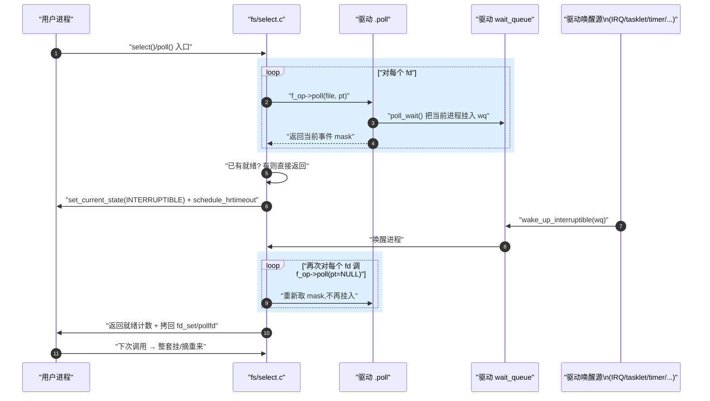
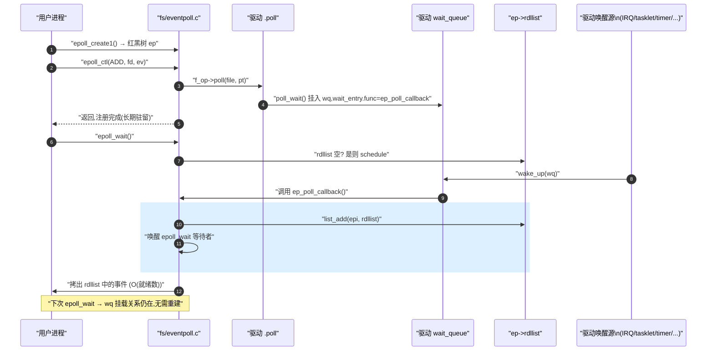

# select / poll / epoll 三态对比

> [!note]
> **Ref:**
> - man pages: `select(2)`, `poll(2)`, `epoll(7)`, `epoll_ctl(2)`, `epoll_wait(2)`
> - 内核源码:`sdk/100ask_imx6ull-sdk/Linux-4.9.88/fs/select.c`(`do_select`、`do_sys_poll`、`__pollwait`)
> - 内核源码:`sdk/100ask_imx6ull-sdk/Linux-4.9.88/fs/eventpoll.c`(`ep_insert:1303`、`ep_poll_callback:1009`、`ep_ptable_queue_proc:1119`)
> - 配套笔记:[`05-poll-kernel.md`](./05-poll-kernel.md)(poll 单一可信源)、[`08-drv-fops-recipes.md`](./08-drv-fops-recipes.md)(驱动模板)
> - 本仓 demo:`prj/03-Advanced-IO/src/`


## 1. man select — 用户态 API

> [!warning]
> select 是 1983 年 4.2BSD 引入的接口,**有诸多历史包袱**:fd 上限硬编码、超时被改写、每次调用都要重建集合。新代码不应再用,只为兼容旧系统保留。

### 1.1 函数签名

```c
#include <sys/select.h>

/*
 * API 行为概述：
 * select() 监控三组位图 (readfds, writefds, exceptfds)，看是否有 fd 就绪。
 * 核心特征（也是最大缺陷）是“破坏性更新”：调用返回时，内核会直接擦除位图中未就绪的位。
 * 因此，用户态【必须】在每次调用的循环中，使用 FD_ZERO 和 FD_SET 重新构建监听集合。
 * timeout 参数在某些系统（如 Linux）上也会被改写为剩余时间，也必须每次重置。
 */
int select(int nfds, fd_set *readfds, fd_set *writefds,
           fd_set *exceptfds, struct timeval *timeout);

void FD_ZERO (fd_set *set);
void FD_SET  (int fd, fd_set *set);
void FD_CLR  (int fd, fd_set *set);
int  FD_ISSET(int fd, fd_set *set);
```

### 1.2 三个集合 + 一个上界

| 参数 | 含义 |
|------|------|
| `nfds` | 集合中**最大 fd + 1**(不是数组长度) |
| `readfds` | 监听可读的 fd 位图 |
| `writefds` | 监听可写的 fd 位图 |
| `exceptfds` | 监听异常(带外数据 OOB) |
| `timeout` | 超时;`NULL` 永不超时,`{0,0}` 立返,其他正常等待 |

`fd_set` 是位图,大小由 `FD_SETSIZE`(通常 1024)决定 —— **fd ≥ 1024 直接 UB,数组越界破坏栈**。

### 1.3 返回值与陷阱

| 返回 | 含义 |
|------|------|
| `> 0` | 就绪 fd 总数 |
| `0` | 超时 |
| `-1` | 错;`EINTR` 被信号打断,`EBADF`/`EINVAL` 等 |

**两个致命陷阱**:

1. **`timeout` 在 Linux 上会被改写** —— 调用结束后 `timeout` 内容是剩余时间,循环里必须每次重置。
2. **三个 fd_set 都是 in/out 参数** —— 返回时被改成"哪些就绪",原始监听集合丢失,必须每次循环 `FD_ZERO` + `FD_SET` 重建。

### 1.4 最小例子

```c
fd_set rfds;
struct timeval tv;
for (;;) {
    FD_ZERO(&rfds); FD_SET(fd, &rfds);   // 每次重建
    tv.tv_sec = 5; tv.tv_usec = 0;        // 每次重置
    int n = select(fd + 1, &rfds, NULL, NULL, &tv);
    if (n > 0 && FD_ISSET(fd, &rfds)) read(fd, buf, sizeof buf);
}
```


## 2. man poll — 用户态 API

详见 [`05-poll-kernel.md`](./05-poll-kernel.md) §1。一句话:`pollfd` 数组可复用、无 fd 上限、`revents` 与 `events` 分离。比 select 体面得多,但内核侧仍是 O(n) 全量挂摘。


## 3. man epoll — 用户态 API

> [!note]
> `epoll` 是 Linux 2.5.44 (2002) 引入的**专属接口**,不可移植。三件套 `epoll_create / epoll_ctl / epoll_wait` 把"注册"和"等待"解耦,这正是性能跃迁的关键。

### 3.1 三件套签名

```c
#include <sys/epoll.h>

/*
 * API 行为概述：epoll 彻底解耦了“配置”与“等待”
 * 
 * 1. create: 在内核开辟一个专属的上下文（红黑树 + 就绪链表），返回 epfd。
 */
int epoll_create1(int flags);

/*
 * 2. ctl: 将要监听的 fd 及事件增(ADD)、删(DEL)、改(MOD)到内核红黑树。
 * 这是“持久化”的配置，只要不 DEL，内核会一直记得，无需每次重新注册。
 */
int epoll_ctl(int epfd, int op, int fd, struct epoll_event *event);

/*
 * 3. wait: 纯粹负责阻塞等待就绪链表中有数据。
 * 唤醒时，它只把“真正就绪”的事件拷贝到 events 数组中返回，与总监听数量无关（O(就绪数)）。
 */
int epoll_wait(int epfd, struct epoll_event *events, int maxevents, int timeout);

struct epoll_event {
    uint32_t     events;   /* 位掩码 */
    epoll_data_t data;     /* 用户数据,内核原样回传 */
};

typedef union epoll_data {
    void    *ptr;
    int      fd;
    uint32_t u32;
    uint64_t u64;
} epoll_data_t;
```

### 3.2 op 与 events 位

| `op`            | 含义                              |
|-----------------|----------------------------------|
| `EPOLL_CTL_ADD` | 把 fd 加入红黑树                    |
| `EPOLL_CTL_MOD` | 修改已注册 fd 的监听位 / data         |
| `EPOLL_CTL_DEL` | 摘除                              |

| `events` 位       | 含义                                                  |
|------------------|------------------------------------------------------|
| `EPOLLIN`        | 可读                                                  |
| `EPOLLOUT`       | 可写                                                  |
| `EPOLLRDHUP`     | 对端关闭(半关)                                        |
| `EPOLLPRI`       | 带外数据                                              |
| `EPOLLERR`       | 错误(始终监听,无需手动设)                              |
| `EPOLLHUP`       | 挂断(始终监听)                                        |
| `EPOLLET`        | **边沿触发**;不设则水平触发(默认)                       |
| `EPOLLONESHOT`   | 触发一次后自动从就绪树摘除,需 `EPOLL_CTL_MOD` 重新武装    |
| `EPOLLEXCLUSIVE` | (4.5+)惊群抑制,多个 epfd 监听同一 fd 时只唤醒一个       |

### 3.3 LT vs ET — man epoll 的核心章节

| 模式 | 触发条件 | 行为 |
|------|---------|------|
| **LT (默认)** | 只要 fd 处于"可读/可写"状态,每次 `epoll_wait` 都报告 | 与 poll 等价,不必读尽,允许部分消费 |
| **ET (`EPOLLET`)** | **状态变化的边沿**才报告(从无→有) | 必须**一次读尽**到 `EAGAIN`,否则数据滞留直到下一次新事件 |

> [!warning]
> ET 模式有两条铁律,man epoll 反复强调:
> 1. **fd 必须设 `O_NONBLOCK`** —— 否则"读尽"的最后一次 read 会阻塞,整个事件循环卡死。
> 2. **必须循环 read/write 直到 `EAGAIN`** —— 否则边沿事件丢失。

### 3.4 返回值

| 返回 | 含义 |
|------|------|
| `> 0` | 填入 `events[]` 的就绪事件数 |
| `0` | 超时 |
| `-1` | 错;`EINTR`、`EBADF`、`EINVAL` |

### 3.5 最小例子

```c
int ep = epoll_create1(EPOLL_CLOEXEC);
struct epoll_event ev = { .events = EPOLLIN | EPOLLET, .data.fd = fd };
epoll_ctl(ep, EPOLL_CTL_ADD, fd, &ev);

struct epoll_event evs[64];
for (;;) {
    int n = epoll_wait(ep, evs, 64, -1);
    for (int i = 0; i < n; i++) {
        int rfd = evs[i].data.fd;
        while (read(rfd, buf, sizeof buf) > 0) { /* ET: 读尽 */ }
        /* 此时 errno == EAGAIN,正常 */
    }
}
```


## 4. 一句话定位 — 三 API 速查

| API   | 数据结构(用户态)        | 注册时机                              | 复杂度    | fd 上限                                          |
|-------|-----------------------|---------------------------------------|----------|--------------------------------------------------|
| select| 三个 `fd_set` 位图     | 每次调用全量重挂                         | O(nfds)  | `FD_SETSIZE=1024`(硬编码)                      |
| poll  | `struct pollfd[]`      | 每次调用全量重挂                         | O(nfds)  | 无硬上限                                         |
| epoll | 内核红黑树 + 就绪链表    | `epoll_ctl(ADD)` 一次注册,长期保留        | O(就绪数) | 系统级 `/proc/sys/fs/epoll/max_user_watches`     |

**关键事实**:三者在驱动层共用同一个钩子 —— `file_operations.poll`。差异完全在 `fs/select.c` 与 `fs/eventpoll.c` 内核侧的"如何挂、如何摘、如何醒"。


## 5. 内核机制对比

### 5.1 共享底座 — `f_op->poll` + `poll_table`

驱动层**完全无感知**三者区别,只写一份:

```c
static unsigned int xxx_poll(struct file *filp, poll_table *wait)
{
    unsigned int mask = 0;
    poll_wait(filp, &xxx_wq, wait);   // 按 pt 给定的方式挂入 wq
    if (data_ready) mask |= POLLIN | POLLRDNORM;
    return mask;
}
```

`poll_wait()` 实际调用 `pt->_qproc(filp, wq, pt)`:

| 调用者       | `_qproc`                  | 创建的节点              | wait_entry 回调            |
|-------------|---------------------------|------------------------|---------------------------|
| select/poll | `__pollwait`              | `poll_table_entry`     | `pollwake`(默认)         |
| epoll       | `ep_ptable_queue_proc`    | `eppoll_entry`         | `ep_poll_callback`        |

> 这就是**同一个 `.poll` 钩子能被三种 API 复用**的全部秘密 —— 谁调谁定 `_qproc`。

机制详解见 [`05-poll-kernel.md`](./05-poll-kernel.md) §3-4。

### 5.2 数据结构差异

| 关注点      | select/poll                | epoll                                         |
|------------|----------------------------|-----------------------------------------------|
| fd 集合存储 | 调用栈/堆上的位图或数组       | 内核红黑树 `ep->rbr`(节点 `struct epitem`)   |
| 就绪集合    | 无 —— 唤醒后 O(n) 重扫       | `ep->rdllist` 链表,IRQ 时 O(1) 入队            |
| wait entry  | `poll_table_entry`,默认回调 | `eppoll_entry`,`func=ep_poll_callback`       |
| 触发模式    | 仅水平触发 (LT)              | LT (默认) + ET (`EPOLLET`)                    |
| 跨调用持久性 | 无                          | 注册一次长期保留                                |

### 5.3 唤醒后的工作量

```
select/poll:  IRQ → wake_up → 进程醒 → do_select/do_poll 再 O(n) 调 f_op->poll → 拷回 → 返回
epoll:        IRQ → wake_up → ep_poll_callback → list_add(rdllist) → 唤醒 epoll_wait → 仅拷 rdllist
```

epoll 把"扫描"工作前移到了 **IRQ 上下文里的回调**,且只处理"刚刚就绪的那一个 fd",故复杂度脱离 `nfds`。


## 6. 时序对比

### 6.1 select / poll —— 一次性挂摘



**痛点**:第 ②⑨ 两个 loop 都是 **O(nfds)**,且每次 syscall 都要把进程挂到所有 fd 的 wq、唤醒后再全部摘掉。10K fd 场景灾难性。

### 6.2 epoll —— 注册一次 + 回调驱动



**关键差异**:

1. **挂载只发生一次** —— `ep_insert()` 调用 `f_op->poll` 时,把 wait_entry 的回调换成 `ep_poll_callback`(`fs/eventpoll.c:1131`)。
2. **唤醒路径不再返回用户态遍历**,而是 `wake_up` 直接把 epi 节点 push 进 `rdllist`。
3. **`epoll_wait` 只看 rdllist** —— 长度即就绪数,与总监听 fd 数解耦。


## 7. 驱动侧 — 一份 `.poll` 通吃三家

驱动**只写一份** `.poll`,完整模板见 [`08-drv-fops-recipes.md`](./08-drv-fops-recipes.md)。要点重申:

1. 必须 `poll_wait(filp, &wq, wait)` —— 不挂队列内核就无从唤醒。
2. **必须立即返回当前 mask** —— 而不是"等到有数据再返回"。这是新手最常见的误解。
3. 任意唤醒上下文(IRQ / tasklet / kthread / hrtimer / 另一进程 syscall)就绪时调 `wake_up_interruptible(&wq)`。
4. epoll 的 `ep_poll_callback` 由 wait_entry 自动派发,**驱动不需要任何 epoll 感知代码**。
5. ET 模式不需要驱动配合 —— 边沿/水平语义在 `fs/eventpoll.c` 实现(就绪后是否把 epi 重新塞回 rdllist)。

最小骨架:

```c
static DECLARE_WAIT_QUEUE_HEAD(xxx_wq);
static atomic_t data_ready = ATOMIC_INIT(0);

static unsigned int xxx_poll(struct file *f, poll_table *pt)
{
    poll_wait(f, &xxx_wq, pt);
    return atomic_read(&data_ready) ? (POLLIN | POLLRDNORM) : 0;
}

static irqreturn_t xxx_isr(int irq, void *dev)
{
    atomic_set(&data_ready, 1);
    wake_up_interruptible(&xxx_wq);   // 同时唤醒 select/poll/epoll 三类等待者
    return IRQ_HANDLED;
}
```


## 8. 选型决策

| 场景                       | 推荐                  |
|---------------------------|----------------------|
| 极简单 demo / 教学          | select               |
| 监听 fd ≤ 数十,跨平台      | poll                 |
| 监听 fd ≥ 数百,长连接      | epoll (LT)           |
| 高并发服务器                | epoll (ET + 非阻塞)  |
| 嵌入式按键 + 串口少量 fd     | poll (本仓 demo 路线)|


## 9. 易混淆点速查

| 误解 | 真相 |
|------|------|
| select 的 timeout 像 sleep | timeout 是**最大等待上限**,有就绪立刻返回;且会被改写 |
| `nfds` 是数组长度 | 是**最大 fd + 1** |
| ET 比 LT 一定快 | 只在高频事件下有优势;低频反而因为强制非阻塞 + 循环 read 增加复杂度 |
| epoll 不需要 `O_NONBLOCK` | LT 不强制,ET **必须** |
| `EPOLLERR`/`EPOLLHUP` 要手动设 | 始终自动监听,设了也无害 |
| 驱动需要为 epoll 写额外代码 | 一份 `.poll` 通吃三家 |
