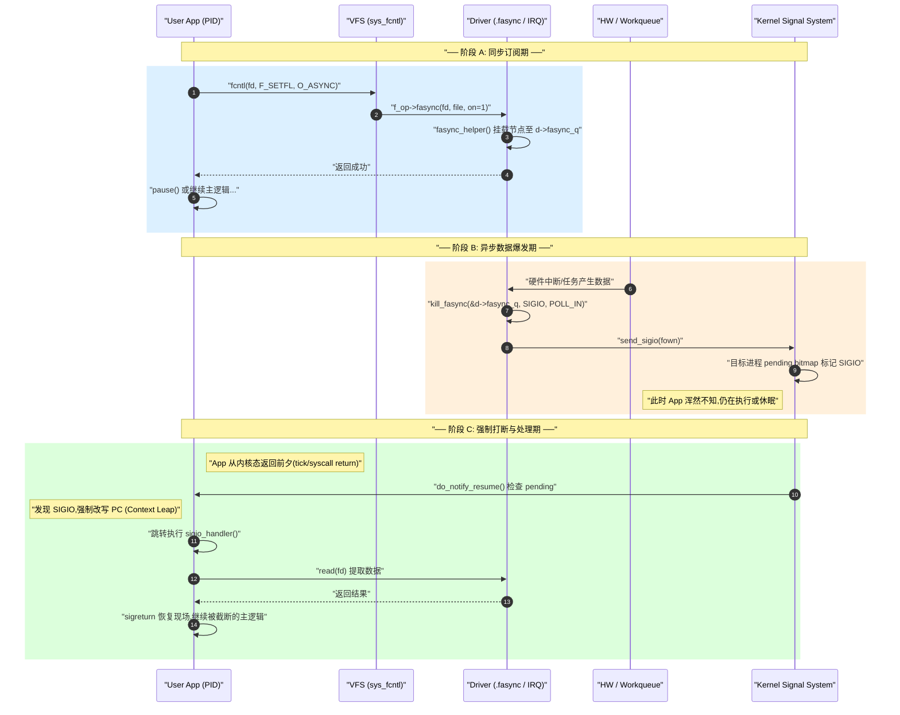

# 信号驱动 IO — fasync 与 SIGIO

> [!note]
> **Ref:**
> - 内核源码:`sdk/100ask_imx6ull-sdk/Linux-4.9.88/fs/fcntl.c` (`kill_fasync`, `send_sigio`, `fasync_helper`)
> - 驱动 demo:`prj/03-Advanced-IO/src/adv_io_fops.c` (`adv_io_fasync`)
> - strace 实证:[`trail-strace.md`](./trail-strace.md) §④
> - 配套机制:[`05-poll-kernel.md`](./05-poll-kernel.md)(`wait_queue` 共享底座)
> - 驱动落地模板:[`08-drv-fops-recipes.md`](./08-drv-fops-recipes.md)


## 1. 一句话定位

> **只把"等待"异步化,"拷贝"仍由进程自己做。**
> 内核充当"门铃" —— 数据到了按一下铃(SIGIO),进程被打断后**自己再调用 `read()`** 把数据搬回用户空间。

对照异步 IO:AIO 是"快递上门",连搬运都由内核完成。SIGIO 不是异步 IO,**它属于"同步非阻塞"**。


## 2. 三阶段时序全景

信号驱动 IO 的精髓在于彻底解耦,执行流横跨**用户配置**、**异步生产**、**信号投递**三个完全独立的时空。




## 3. 阶段 A — 用户态三步走 + 驱动 .fasync

### 3.1 用户态订阅模板

```c
#include <signal.h>
#include <fcntl.h>

static int g_fd;

void sigio_handler(int sig)
{
    char buf[256];
    int n = read(g_fd, buf, sizeof(buf));     // ⚠ 必须 async-signal-safe
    if (n > 0)
        write(STDOUT_FILENO, buf, n);
}

int main(void)
{
    g_fd = open("/dev/adv_io", O_RDWR | O_NONBLOCK);  // ⚠ O_NONBLOCK 必须

    /* 1. 注册 handler */
    signal(SIGIO, sigio_handler);

    /* 2. 告诉内核给谁发 */
    fcntl(g_fd, F_SETOWN, getpid());

    /* 3. 开 O_ASYNC 触发驱动 .fasync(on=1) */
    int flags = fcntl(g_fd, F_GETFL);
    fcntl(g_fd, F_SETFL, flags | O_ASYNC);

    while (1) pause();    // 等信号
}
```

为什么 `O_NONBLOCK` 是**必须**的?见 §6 易混淆点 (3)。

### 3.2 驱动侧 .fasync — 一行完成

```c
static int adv_io_fasync(int fd, struct file *file, int on)
{
    /*
     * fasync_helper 完成所有工作:
     *   on=1 → 申请 fasync_struct 节点,插入 fasync_queue 链表
     *   on=0 → 从链表删除并释放节点
     *
     * 返回值:
     *   >0  链表发生变化(新增或删除)
     *   =0  无变化
     *   <0  错误(如 -ENOMEM)
     */
    return fasync_helper(fd, file, on, &dev->fasync_q);
}
```

**禁止**在 `.fasync` 里做业务逻辑,它只是链表的维护接口。


## 4. 阶段 B — `kill_fasync` 的源码级真相

```c
// 通常在中断 / tasklet / 定时器回调里
static irqreturn_t adv_io_irq(int irq, void *dev_id)
{
    struct adv_io_dev *d = dev_id;

    /* 1. 更新数据状态 */
    ring_push(d, ...);

    /* 2. 唤醒 poll/阻塞 read */
    wake_up_interruptible(&d->read_wq);

    /* 3. 向所有 O_ASYNC fd 发 SIGIO */
    kill_fasync(&d->fasync_q, SIGIO, POLL_IN);

    return IRQ_HANDLED;
}
```

**深入 `fs/fcntl.c`**:

1. **并发保护**:`kill_fasync` 全程持 **RCU 读锁**。它在任何严苛上下文(中断底半部、spinlock 内部)调用都安全且零延迟,**不会引发睡眠**。
2. **遍历投递**:遍历 `fasync_q` 链表,取出当初记录的 owner(`f_owner`),向其 `send_sigio`。
3. **信号挂载**:`send_sigio` 不会立刻打断目标进程,只是在 `task_struct` 的 pending bitmap 中置位 `SIGIO`。若用户配 `SA_SIGINFO`,还会把 `POLL_IN` 等掩码存入 `si_band`。

`kill_fasync` 的第三个参数 `band`:

| 常量 | 值 | 含义 |
|------|----|------|
| `POLL_IN`  | 1 | 数据可读 |
| `POLL_OUT` | 2 | 数据可写 |
| `POLL_ERR` | 4 | 发生错误 |
| `POLL_HUP` | 6 | 连接断开 |


## 5. 阶段 C — 上下文返回劫持

阶段 B 中悬挂的信号,触发执行依赖于一个极巧妙的设计 —— **上下文返回劫持**。

当目标进程任何原因陷入内核态(syscall / tick / IRQ)准备**返回用户态前夕**,内核执行 `do_notify_resume`。它检测到 pending 的 `SIGIO`,**强行修改进程用户态栈帧和 PC 指针**,迫使其跃迁至 `sigio_handler`。`sigreturn` 后才回到被截断的位置。

正因为 handler 可能在主程序的**任意两条机器指令之间**强行切入,带来了极高的竞态风险:

- handler 中**只能调 async-signal-safe 函数**(原生 `read`/`write` syscall 可以)。
- **严禁** `printf`/`malloc` —— 它们的内部隐藏锁会与主程序构成死锁。


## 6. 三个易混淆点

1. **它不是"异步 IO"。** 教科书归类为"同步非阻塞" —— 等待异步、拷贝同步。
2. **`O_ASYNC` 名字误导。** 这个 flag 只是"开启 SIGIO 通知",跟 POSIX AIO 完全是两套机制。
3. **必须 `O_NONBLOCK`。** 看 [`trail-strace.md`](./trail-strace.md) §④:每个数据字节往往伴随**两次** SIGIO,一次真就绪、一次 handler 重入时 ring 已被掏空。如果 fd 是阻塞的,handler 第二次 read 会**阻塞死锁**整个进程。
4. **SIGIO 不携带 fd 信息。** 多个 fd 同时 `O_ASYNC` 时 handler 无法知道是谁就绪 —— 解决方案:`fcntl(F_SETSIG, SIGRTMIN+n)` 换实时信号,配合 `siginfo_t.si_fd`。


## 7. 致命陷阱:`.release` 必须清理

**最常见的 panic 来源**:

```c
static int adv_io_release(struct inode *inode, struct file *file)
{
    /* 文件关闭时把此 fd 从 fasync 链表摘除,防止野指针 */
    adv_io_fasync(-1, file, 0);
    return 0;
}
```

如果忘记此步,进程退出后 `fasync_q` 中残留悬空 `fasync_struct`。下次硬件触发遍历时,`kill_fasync` → `send_sigio` 访问已销毁 task_struct → **Use-After-Free → Kernel Panic**。


## 8. 与 poll/epoll 的关系

`fasync` 与 `poll` **共享驱动里的 `wait_queue`**:中断处理函数同时调用 `wake_up_interruptible(&dev->wq)` 与 `kill_fasync(&dev->fasync_q, SIGIO, POLL_IN)`,两套用户态 API(poll/epoll 与 SIGIO)互不冲突。`f_op` 钩子也互相独立:`.poll` 服务多路复用,`.fasync` 服务信号驱动。

详细对照矩阵见 [`06-multiplex-compare.md`](./06-multiplex-compare.md)。


## 9. 优缺点

| 优点 | 缺点 |
|------|------|
| 主循环不被等待阻塞 | handler 内只能调 async-signal-safe 函数 |
| 无轮询,低 CPU 占用 | 默认 SIGIO 不可区分来源 |
| 适合低频、事件型设备(按键、GPIO 中断) | 高频事件下信号会合并丢失 |
