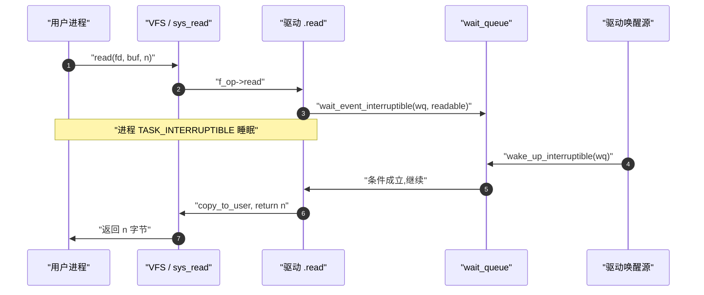
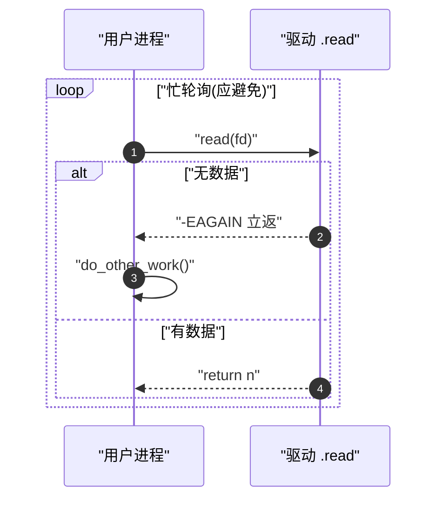
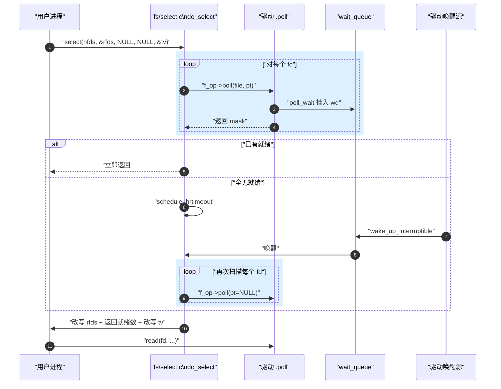
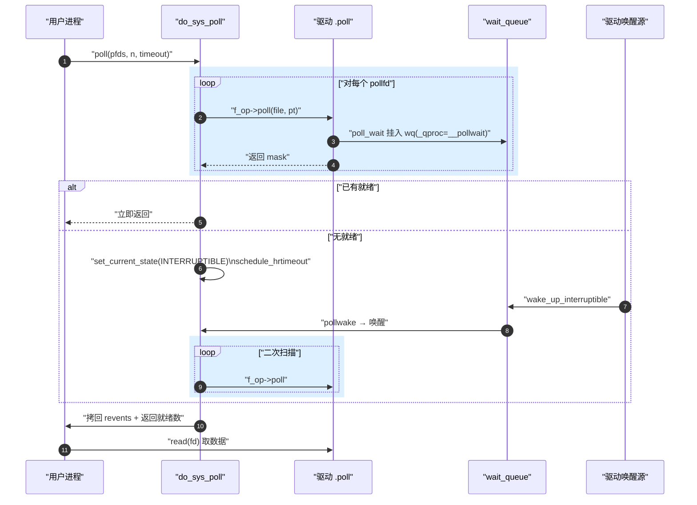
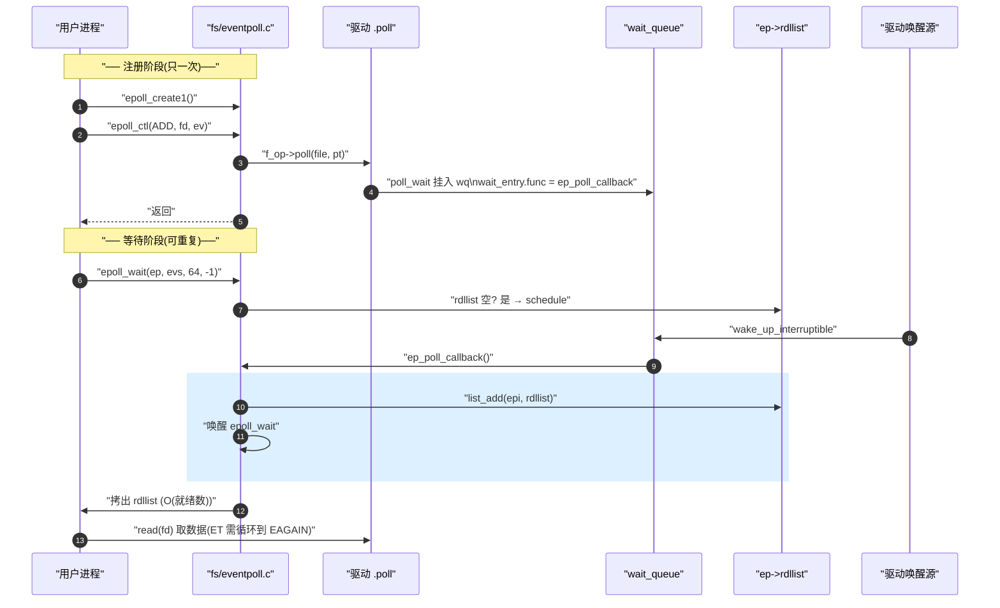
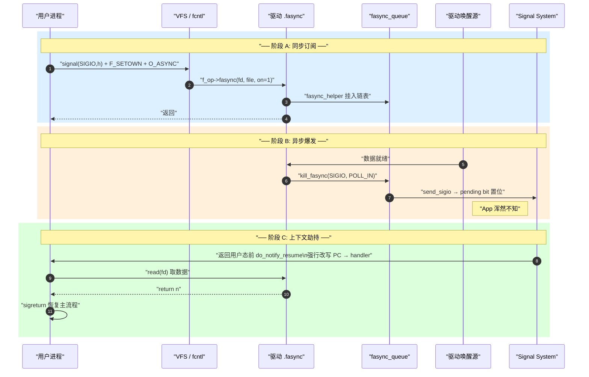

# 用户态 IO 编程模板

> [!note]
> **Ref:**
> - 驱动侧模板:[`08-drv-fops-recipes.md`](./08-drv-fops-recipes.md)
> - 范式地图:[`04-io-models-overview.md`](./04-io-models-overview.md)
> - 机制详解:[`03-blocking-semantics.md`](./03-blocking-semantics.md)、[`05-poll-kernel.md`](./05-poll-kernel.md)、[`06-multiplex-compare.md`](./06-multiplex-compare.md)、[`07-fasync-sigio.md`](./07-fasync-sigio.md)
> - 实证:[`trail-strace.md`](./trail-strace.md)

本文是**纯用户态落地**配方。每种范式给出最小可运行模板 + 一份独立时序图。机制原因去查 Ref。所有示例假设打开的是 `/dev/my_drv`,该驱动支持 `.read/.write/.poll/.fasync`(见 [`08-drv-fops-recipes.md`](./08-drv-fops-recipes.md))。


## 1. 阻塞 IO — 最简单的开始

### 1.1 模板

```c
#include <fcntl.h>
#include <unistd.h>

int main(void)
{
    int fd = open("/dev/my_drv", O_RDWR);   // 默认阻塞
    char buf[256];
    ssize_t n = read(fd, buf, sizeof buf);  // 没数据就睡到天荒地老
    if (n > 0) write(STDOUT_FILENO, buf, n);
    close(fd);
}
```

### 1.2 时序



**适用**:单 fd、不在乎主循环被卡住的场景(命令行工具、单传感器读取)。


## 2. 非阻塞 IO — 单独使用没意义

### 2.1 模板

```c
int fd = open("/dev/my_drv", O_RDWR | O_NONBLOCK);
char buf[256];

for (;;) {
    ssize_t n = read(fd, buf, sizeof buf);
    if (n > 0) {
        write(STDOUT_FILENO, buf, n);
    } else if (n < 0 && errno == EAGAIN) {
        /* 没数据,做点别的 */
        do_other_work();
    } else {
        perror("read"); break;
    }
}
```

### 2.2 时序



> [!warning]
> **裸用 `O_NONBLOCK` = CPU 100% 忙等**。它的真正价值是**和 poll/epoll/SIGIO 配合**,作为"读就绪通知后,一次性把缓冲读尽到 EAGAIN"的工具。详见 [`03-blocking-semantics.md`](./03-blocking-semantics.md) §2。


## 3. select — 历史接口

### 3.1 模板

```c
#include <sys/select.h>

int fd = open("/dev/my_drv", O_RDWR);
fd_set rfds;
struct timeval tv;

for (;;) {
    FD_ZERO(&rfds); FD_SET(fd, &rfds);    // ⚠ 每次重建
    tv.tv_sec = 5; tv.tv_usec = 0;         // ⚠ 每次重置(Linux 会改写)

    int n = select(fd + 1, &rfds, NULL, NULL, &tv);
    if (n < 0) { if (errno == EINTR) continue; perror("select"); break; }
    if (n == 0) { puts("timeout"); continue; }

    if (FD_ISSET(fd, &rfds)) {
        char buf[256];
        ssize_t r = read(fd, buf, sizeof buf);
        if (r > 0) write(STDOUT_FILENO, buf, r);
    }
}
```

### 3.2 时序



**陷阱**:fd_set 大小硬编码 1024、tv 被改写、rfds 被改写。新代码不要再用。


## 4. poll — 中等规模、跨平台首选

### 4.1 模板(单 fd)

```c
#include <poll.h>

int fd = open("/dev/my_drv", O_RDWR);
struct pollfd pfd = { .fd = fd, .events = POLLIN };

for (;;) {
    int n = poll(&pfd, 1, 5000 /*ms*/);
    if (n < 0) { if (errno == EINTR) continue; perror("poll"); break; }
    if (n == 0) { puts("timeout"); continue; }

    if (pfd.revents & POLLIN) {
        char buf[256];
        ssize_t r = read(fd, buf, sizeof buf);
        if (r > 0) write(STDOUT_FILENO, buf, r);
    }
    if (pfd.revents & (POLLERR | POLLHUP)) break;
}
```

### 4.2 模板(多 fd)

```c
struct pollfd pfds[3] = {
    { .fd = fd_btn,   .events = POLLIN },
    { .fd = fd_uart,  .events = POLLIN },
    { .fd = STDIN_FILENO, .events = POLLIN },
};

int n = poll(pfds, 3, -1);   // -1 = 无限等待
for (int i = 0; i < 3 && n > 0; i++) {
    if (pfds[i].revents & POLLIN) {
        handle(pfds[i].fd);
        n--;
    }
}
```

### 4.3 时序



详细机制见 [`05-poll-kernel.md`](./05-poll-kernel.md)。


## 5. epoll — 大量长连接首选

### 5.1 LT 模板(默认,简单)

```c
#include <sys/epoll.h>

int ep = epoll_create1(EPOLL_CLOEXEC);
int fd = open("/dev/my_drv", O_RDWR);

struct epoll_event ev = { .events = EPOLLIN, .data.fd = fd };
epoll_ctl(ep, EPOLL_CTL_ADD, fd, &ev);     // ⚠ 只注册一次

struct epoll_event evs[64];
for (;;) {
    int n = epoll_wait(ep, evs, 64, -1);
    if (n < 0) { if (errno == EINTR) continue; perror("epoll_wait"); break; }

    for (int i = 0; i < n; i++) {
        int rfd = evs[i].data.fd;
        if (evs[i].events & EPOLLIN) {
            char buf[256];
            ssize_t r = read(rfd, buf, sizeof buf);
            if (r > 0) write(STDOUT_FILENO, buf, r);
        }
        if (evs[i].events & (EPOLLERR | EPOLLHUP)) {
            epoll_ctl(ep, EPOLL_CTL_DEL, rfd, NULL);
            close(rfd);
        }
    }
}
```

### 5.2 ET 模板(高吞吐,有铁律)

```c
int fd = open("/dev/my_drv", O_RDWR | O_NONBLOCK);   // ⚠ ET 必须非阻塞

struct epoll_event ev = { .events = EPOLLIN | EPOLLET, .data.fd = fd };
epoll_ctl(ep, EPOLL_CTL_ADD, fd, &ev);

for (;;) {
    int n = epoll_wait(ep, evs, 64, -1);
    for (int i = 0; i < n; i++) {
        int rfd = evs[i].data.fd;
        if (evs[i].events & EPOLLIN) {
            /* ⚠ ET 必须循环 read 到 EAGAIN,否则边沿事件丢失 */
            for (;;) {
                char buf[256];
                ssize_t r = read(rfd, buf, sizeof buf);
                if (r > 0) write(STDOUT_FILENO, buf, r);
                else if (r < 0 && errno == EAGAIN) break;   // 正常,读尽
                else { perror("read"); goto out; }
            }
        }
    }
}
out: ;
```

> [!warning]
> **ET 两条铁律**(详见 [`06-multiplex-compare.md`](./06-multiplex-compare.md) §3.3):
> 1. fd 必须 `O_NONBLOCK`,否则最后一次 read 会阻塞死整个事件循环。
> 2. 必须循环读到 `EAGAIN`,否则边沿事件丢失,数据滞留直到下一次新事件。

### 5.3 时序




## 6. 信号驱动 IO — 门铃模型

### 6.1 模板

```c
#include <signal.h>
#include <fcntl.h>

static int g_fd;

/* ⚠ handler 内只能调 async-signal-safe 函数 */
static void sigio_handler(int sig)
{
    char buf[256];
    ssize_t n = read(g_fd, buf, sizeof buf);    // syscall 是 AS-safe 的
    if (n > 0) write(STDOUT_FILENO, buf, n);    // write 也是
    /* 严禁 printf/malloc */
}

int main(void)
{
    g_fd = open("/dev/my_drv", O_RDWR | O_NONBLOCK);   // ⚠ 必须非阻塞

    signal(SIGIO, sigio_handler);                       // 1. 装 handler
    fcntl(g_fd, F_SETOWN, getpid());                    // 2. 告诉内核发给谁
    int flags = fcntl(g_fd, F_GETFL);
    fcntl(g_fd, F_SETFL, flags | O_ASYNC);              // 3. 开门铃

    while (1) pause();   // 主循环可以做别的事
}
```

### 6.2 时序



详见 [`07-fasync-sigio.md`](./07-fasync-sigio.md)。


## 7. 范式速查表

| 范式 | 关键 syscall | 必须 `O_NONBLOCK`? | 复杂度 | 主循环可做事? |
|------|-------------|-------------------|-------|--------------|
| 阻塞 | `read` | 否 | O(1) | 否 |
| 非阻塞轮询 | `read`+`EAGAIN` | 是 | O(1)/次 | 是(但 CPU 100%) |
| select | `select` | 否 | O(nfds) | 等待时不能 |
| poll | `poll` | 否 | O(nfds) | 等待时不能 |
| epoll LT | `epoll_wait` | 否 | O(就绪数) | 等待时不能 |
| epoll ET | `epoll_wait` | **是** | O(就绪数) | 等待时不能 |
| SIGIO | `fcntl(O_ASYNC)` | **是** | O(1) | **是** |


## 8. 范式选型 — 重申决策树

见 [`04-io-models-overview.md`](./04-io-models-overview.md) §3 决策树。一句话:

- **1 个 fd + 主循环可阻塞** → 阻塞 IO
- **1 个 fd + 主循环不能阻塞** → SIGIO
- **多个 fd, < 100** → poll
- **多个 fd, ≥ 100 长连接** → epoll(LT 起步,瓶颈再上 ET)
- **教学/兼容旧代码** → select
