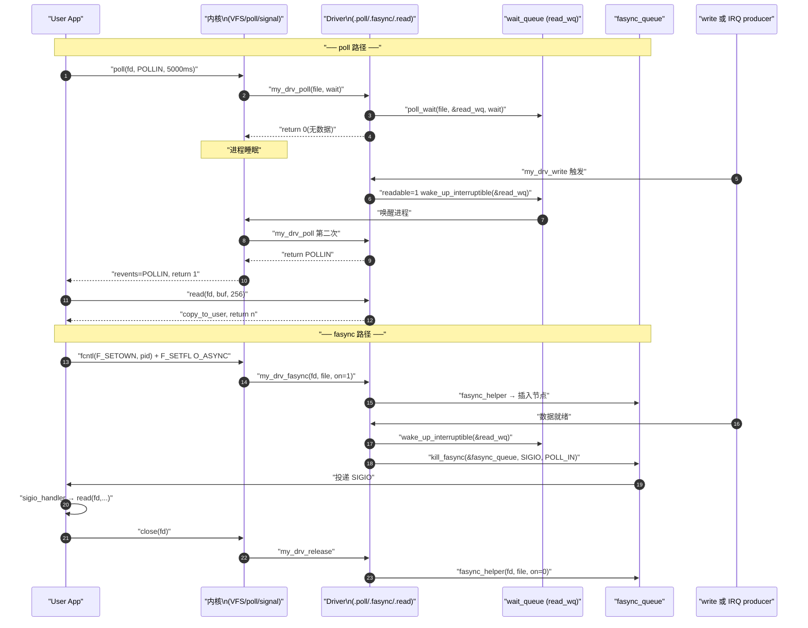

# 字符驱动 fops 落地模板

> [!note]
> **Ref:**
> - 真实驱动:`prj/03-Advanced-IO/src/adv_io_fops.c`
> - 机制详解:[`05-poll-kernel.md`](./05-poll-kernel.md)、[`07-fasync-sigio.md`](./07-fasync-sigio.md)、[`03-blocking-semantics.md`](./03-blocking-semantics.md)
> - 内核源参考:`sdk/100ask_imx6ull-sdk/Linux-4.9.88/fs/pipe.c:517`(`pipe_poll` 范例)

本文是**纯落地模板**,不重复讲机制。把它当骨架抄,机制原因去查上面三篇专题。


## 0. 设计目标

一个字符驱动同时支持:**阻塞 / 非阻塞 / poll-select-epoll 多路复用 / SIGIO 信号驱动**。这四种用户态范式在驱动侧只需要五个钩子 + 两组同步原语就能全部覆盖。

```
.open / .release   ── 资源生命周期
.read / .write     ── 阻塞 + 非阻塞
.poll              ── select/poll/epoll
.fasync            ── O_ASYNC → SIGIO
```


## 1. 全局状态:双 wait_queue + fasync_q

```c
#include <linux/wait.h>
#include <linux/poll.h>

#define BUF_SIZE 256

static char  kbuf[BUF_SIZE];
static int   buf_len  = 0;
static int   readable = 0;     /* 数据就绪标志(读)*/
static int   writable = 1;     /* 写缓冲可用标志 */

/* 读/写分开两个 wq,精确唤醒对应方向 */
static DECLARE_WAIT_QUEUE_HEAD(read_wq);
static DECLARE_WAIT_QUEUE_HEAD(write_wq);

/* fasync 链表头:记录所有 O_ASYNC 的 fd */
static struct fasync_struct *fasync_queue;
```

**为什么读写要分开两个 wq?**
`wake_up_interruptible(&read_wq)` 只唤醒等待可读的进程;混用单队列会导致无效唤醒(thundering herd)。


## 2. .poll 的两步范式

```c
static unsigned int my_drv_poll(struct file *file, poll_table *wait)
{
    unsigned int mask = 0;

    /* 步骤 1:登记等待队列(不睡眠!仅注册回调)*/
    poll_wait(file, &read_wq,  wait);
    poll_wait(file, &write_wq, wait);

    /* 步骤 2:无副作用的状态检查 */
    if (readable) mask |= POLLIN  | POLLRDNORM;
    if (writable) mask |= POLLOUT | POLLWRNORM;

    return mask;
}
```

两个**绝对不变量**(机制原因见 [`05-poll-kernel.md`](./05-poll-kernel.md) §5):

1. `.poll` **绝不睡眠** —— 内核框架负责睡眠,你只负责返回当前 mask。
2. `.poll` **绝不修改状态** —— 它会被调多次,任何状态消费必须放在 `.read` 里做。


## 3. .read 与 .write — 反向唤醒是核心纪律

```c
static ssize_t my_drv_read(struct file *file, char __user *buf,
                            size_t len, loff_t *off)
{
    int ret;

    /* 阻塞 / 非阻塞分支 */
    if (!(file->f_flags & O_NONBLOCK)) {
        ret = wait_event_interruptible(read_wq, readable != 0);
        if (ret) return -ERESTARTSYS;
    } else {
        if (!readable) return -EAGAIN;
    }

    /* 拷贝 */
    len = min_t(size_t, len, (size_t)buf_len);
    if (copy_to_user(buf, kbuf, len)) return -EFAULT;

    /* 状态推进:消费数据 */
    readable = 0;
    writable = 1;
    buf_len  = 0;

    /* ⚠ 反向唤醒 — 否则写者饿死 */
    wake_up_interruptible(&write_wq);
    kill_fasync(&fasync_queue, SIGIO, POLL_OUT);

    return (ssize_t)len;
}
```

`.write` 是镜像:满了就 `EAGAIN` 或睡 `write_wq`,成功后唤醒 `read_wq` + `kill_fasync(POLL_IN)`。

**这个"反向唤醒 + kill_fasync"二连击是 ring buffer 类驱动的标准纪律**,任何缺一就会饿死另一类等待者。详见 [`03-blocking-semantics.md`](./03-blocking-semantics.md) §1.4。


## 4. .fasync — 一行 + .release 必清理

```c
static int my_drv_fasync(int fd, struct file *file, int on)
{
    return fasync_helper(fd, file, on, &fasync_queue);
}

static int my_drv_release(struct inode *inode, struct file *file)
{
    my_drv_fasync(-1, file, 0);     /* ⚠ 必须:防 use-after-free panic */
    return 0;
}
```

`.release` 不清理 fasync 是**最常见的内核 panic 来源**,详见 [`07-fasync-sigio.md`](./07-fasync-sigio.md) §7。


## 5. 完整驱动示例

```c
/* my_drv.c — 完整示例:支持 poll + fasync */
#include <linux/module.h>
#include <linux/fs.h>
#include <linux/cdev.h>
#include <linux/device.h>
#include <linux/uaccess.h>
#include <linux/wait.h>
#include <linux/poll.h>
#include <linux/sched.h>
#include <linux/slab.h>

#define BUF_SIZE  256
#define DRV_NAME  "my_drv"
#define DRV_CLASS "my_class"

static char  kbuf[BUF_SIZE];
static int   buf_len  = 0;
static int   readable = 0;
static int   writable = 1;

static DECLARE_WAIT_QUEUE_HEAD(read_wq);
static DECLARE_WAIT_QUEUE_HEAD(write_wq);
static struct fasync_struct *fasync_queue;

static dev_t         devno;
static struct cdev   my_cdev;
static struct class *my_class;

static int my_drv_fasync(int fd, struct file *file, int on)
{
    return fasync_helper(fd, file, on, &fasync_queue);
}

static int my_drv_open(struct inode *inode, struct file *file) { return 0; }

static int my_drv_release(struct inode *inode, struct file *file)
{
    my_drv_fasync(-1, file, 0);
    return 0;
}

static ssize_t my_drv_read(struct file *file, char __user *buf,
                            size_t len, loff_t *off)
{
    int ret;
    if (!(file->f_flags & O_NONBLOCK)) {
        ret = wait_event_interruptible(read_wq, readable != 0);
        if (ret) return -ERESTARTSYS;
    } else {
        if (!readable) return -EAGAIN;
    }

    len = min_t(size_t, len, (size_t)buf_len);
    if (copy_to_user(buf, kbuf, len)) return -EFAULT;

    readable = 0;
    writable = 1;
    buf_len  = 0;

    wake_up_interruptible(&write_wq);
    kill_fasync(&fasync_queue, SIGIO, POLL_OUT);
    return (ssize_t)len;
}

static ssize_t my_drv_write(struct file *file, const char __user *buf,
                             size_t len, loff_t *off)
{
    int ret;
    if (!(file->f_flags & O_NONBLOCK)) {
        ret = wait_event_interruptible(write_wq, writable != 0);
        if (ret) return -ERESTARTSYS;
    } else {
        if (!writable) return -EAGAIN;
    }

    len = min_t(size_t, len, (size_t)BUF_SIZE);
    if (copy_from_user(kbuf, buf, len)) return -EFAULT;

    buf_len  = (int)len;
    readable = 1;
    writable = 0;

    wake_up_interruptible(&read_wq);
    kill_fasync(&fasync_queue, SIGIO, POLL_IN);
    return (ssize_t)len;
}

static unsigned int my_drv_poll(struct file *file, poll_table *wait)
{
    unsigned int mask = 0;
    poll_wait(file, &read_wq,  wait);
    poll_wait(file, &write_wq, wait);
    if (readable) mask |= POLLIN  | POLLRDNORM;
    if (writable) mask |= POLLOUT | POLLWRNORM;
    return mask;
}

static const struct file_operations my_fops = {
    .owner          = THIS_MODULE,
    .open           = my_drv_open,
    .release        = my_drv_release,
    .read           = my_drv_read,
    .write          = my_drv_write,
    .poll           = my_drv_poll,
    .fasync         = my_drv_fasync,
};

static int __init my_drv_init(void)
{
    int ret;
    ret = alloc_chrdev_region(&devno, 0, 1, DRV_NAME);
    if (ret < 0) return ret;

    cdev_init(&my_cdev, &my_fops);
    ret = cdev_add(&my_cdev, devno, 1);
    if (ret) goto err_cdev;

    my_class = class_create(THIS_MODULE, DRV_CLASS);
    if (IS_ERR(my_class)) { ret = PTR_ERR(my_class); goto err_class; }

    device_create(my_class, NULL, devno, NULL, DRV_NAME);
    return 0;

err_class: cdev_del(&my_cdev);
err_cdev:  unregister_chrdev_region(devno, 1);
    return ret;
}

static void __exit my_drv_exit(void)
{
    device_destroy(my_class, devno);
    class_destroy(my_class);
    cdev_del(&my_cdev);
    unregister_chrdev_region(devno, 1);
}

module_init(my_drv_init);
module_exit(my_drv_exit);
MODULE_LICENSE("GPL");
```


## 6. 用户态验证

用户态测试程序统一收敛到 [`08-1-app-IO-recipes.md`](./08-1-app-IO-recipes.md),覆盖五种范式各一份模板 + 时序图。本驱动可直接对接其中的 §1 阻塞、§4 poll、§5 epoll、§6 SIGIO 模板。


## 7. 完整交互时序




## 8. 常见陷阱清单

| 陷阱 | 错误做法 | 正确做法 |
|------|---------|---------|
| `.poll` 有副作用 | 在里面清 `readable=0` | 状态消费在 `.read` 里 |
| fasync 不清理 | release 忘 `fasync_helper(-1,...)` | 必须调,防 UAF |
| 单个等待队列 | 读写共用一个 wq | 读写分开,精确唤醒 |
| 忘 ERESTARTSYS | 被信号打断返 0 / -EINTR | 返 `-ERESTARTSYS`,glibc 自动重启 |
| `kill_fasync` 时机 | 在 spinlock 持有期间调 | 中断上下文 OK,但**不要持其他锁** |
| `poll_wait` 漏队列 | 只注册 read_wq | 所有方向 wq 都传给 `poll_wait` |
| 持锁 copy_to_user | 在 spinlock 内拷贝 | 出锁后再 `copy_to_user`(详见 03 §1.1) |


## 9. 驱动能力矩阵

```
fops 钩子              支持的用户态能力
─────────────────────────────────────────────────────
.read  + wait_event    阻塞读
.read  + O_NONBLOCK    非阻塞读 (-EAGAIN)
.poll  + poll_wait     select / poll / epoll_wait
.fasync + fasync_helper  O_ASYNC → SIGIO 通知
.fasync + kill_fasync  主动推送信号(中断驱动)
```
