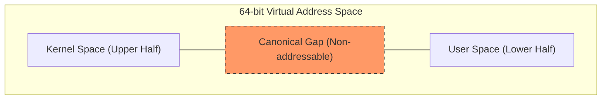

# 系统调用横向视野：ARMv8 与 x86_64 的演进

在掌握了 IMX6ULL (ARMv7/32-bit) 的系统调用后，我们需要跳出 3G/1G 的传统视野。在 64 位时代，地址空间和调用机制发生了质的变化。

## 1. 地址空间分布：再见 3G/1G

在 32 位架构（如 IMX6ULL）中，由于虚拟地址空间只有 4GB，内核被迫挤在用户空间的顶端（通常是 1GB 内核 + 3GB 用户）。

### 64 位架构 (ARMv8 / x86_64) 的“鸿沟”
64 位架构（通常使用 48 位物理寻址）拥有 256TB 的虚拟地址空间。内核与用户空间不再“背靠背”，而是分属两端：

- **Lower Half (User Space):** 0x0000_0000_0000_0000 — 0x0000_FFFF_FFFF_FFFF
- **Upper Half (Kernel Space):** 0xFFFF_0000_0000_0000 — 0xFFFF_FFFF_FFFF_FFFF
- **The Gap (Canonical Gap):** 中间是一段巨大的、非法的“禁飞区”。

## 2. ARMv8 (Cortex-A55, RK3568) 的实现

### 异常等级 (Exception Levels)
ARMv8 引入了 EL0/EL1/EL2/EL3 模型：
- **EL0:** 用户态 (User)。
- **EL1:** 内核态 (Kernel)。
- **EL2:** 虚拟化 (Hypervisor)。

### 寄存器与指令
- **指令:** 依然使用 `svc #0`，但语义发生了变化（从 EL0 陷入 EL1）。
- **系统调用号:** 使用 **`x8`** 寄存器（注意：ARMv7 使用 r7）。
- **传参:** 使用 **`x0 - x5`**。
- **返回值:** 使用 **`x0`**。
- **地址空间切换:** 硬件通过 `TTBR0_EL1` (指向用户页表) 和 `TTBR1_EL1` (指向内核页表) 独立管理，无需像 32 位那样修改页表偏移。

## 3. x86_64 (Intel/AMD) 的实现

x86_64 彻底抛弃了慢速的中断门（`int 0x80`），引入了专门的硬件电路。

### 快速调用：`syscall` 指令
- **指令:** `syscall` (进入内核) 和 `sysret` (返回用户态)。这是 CPU 为了提高系统调用效率专门设计的硬连线逻辑。
- **系统调用号:** 使用 **`rax`**。
- **传参顺序:** **`rdi, rsi, rdx, r10, r8, r9`**。
- **寄存器保存:** 执行 `syscall` 时，CPU 会自动将当前指令指针 (RIP) 暂存在 **`rcx`**，将状态位 (RFLAGS) 暂存在 **`r11`**。

## 4. 架构横向对比表

| 特性 | ARMv7 (IMX6ULL) | ARMv8 (RK3568) | x86_64 (Modern PC) |
| :--- | :--- | :--- | :--- |
| **地址空间** | 3G/1G (通常) | 独立 256TB 两端 | 独立 256TB 两端 |
| **陷入指令** | `svc #0` (或 `swi`) | `svc #0` | `syscall` |
| **调用号寄存器** | `r7` | `x8` | `rax` |
| **第1参数** | `r0` | `x0` | `rdi` |
| **返回值** | `r0` | `x0` | `rax` |
| **硬件模式** | USR / SVC | EL0 / EL1 | Ring 3 / Ring 0 |

## 5. 核心洞察 (Key Insight)

1. **硬件专门化:** 随着系统调用变得频繁（如高频 IO），架构商（Intel/ARM）都从“通用异常处理”转向了“专用调用电路”（如 `syscall` 指令），以减少压栈和模式切换的 CPU 周期。
2. **地址隔离增强:** 64 位架构通过 TTBR0/TTBR1 这种物理隔离的页表基址寄存器，彻底解决了 32 位下内核空间挤占用户空间的问题，也为 **KPTI (Kernel Page Table Isolation)** 防御熔断漏洞提供了硬件基础。
