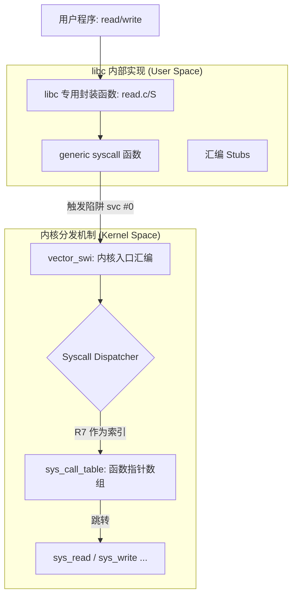

# libc 原理：系统调用封装 (Syscall Wrapper)

> [!note]
> **Ref:** [The GNU C Library (glibc)](https://www.gnu.org/software/libc/), [musl libc](https://musl.libc.org/), [Linux man-pages (syscall.2)](https://man7.org/linux/man-pages/man2/syscall.2.html)

在 Linux 编程中，开发者极少直接使用汇编触发 `svc` 或 `syscall` 指令，而是调用 `read()`、`open()` 等 C 函数。这些函数由 `libc` 提供，被称为 **系统调用包装函数 (Syscall Wrapper)**。

## 1. 为什么需要 libc 封装？

1.  **ABI 抽象**：内核使用寄存器传参，而 C 使用栈或特定寄存器（遵循架构调用约定）。libc 负责将 C 参数移动到正确的内核寄存器中。
2.  **错误处理**：内核通过返回 `-errno` 表示错误，libc 将其转换为正值存入全局变量 `errno` 并返回 `-1`。
3.  **移植性**：不同架构的系统调用号和触发指令（`svc`, `int 0x80`, `syscall`）各异，libc 屏蔽了这些差异。
4.  **POSIX 合规**：某些 POSIX 行为（如信号处理、线程取消点）需要在系统调用前后进行额外逻辑处理。

## 2. 封装层级架构



## 3. 实现机制 (以 glibc 为例)

### 3.1 自动生成的汇编桩 (Assembly Stubs)
对于大多数简单的系统调用，glibc 并不编写专门的 `.c` 文件，而是通过脚本根据 `syscalls.list` 生成汇编桩。
例如 ARMv7 下的 `read` 包装：

```assembly
/* 伪汇编代码：glibc 中的 read 桩 */
ENTRY(read)
    push {r7}            @ 保存寄存器
    mov r7, #__NR_read   @ 加载系统调用号 (r7 是 ARM 约定)
    svc #0               @ 触发软中断 -> 核心分发点
    pop {r7}             @ 恢复寄存器
    ...
```

### 3.2 核心桥梁：系统调用表分发 (Dispatching)
当 `svc #0` 指令执行后，CPU 陷入 SVC 模式并跳转到内核的异常向量表。
1.  **寄存器约定**：libc 保证 `R7` 寄存器存放了唯一的系统调用号（如 `read` 是 3）。
2.  **内核查找**：内核汇编代码（`vector_swi`）会以 `R7` 为索引，从 `sys_call_table` 这个函数指针数组中找到对应的处理函数。
    - 逻辑：`TargetAddr = sys_call_table[R7]`。
3.  **详细跳转逻辑参考**：[系统调用表 (sys_call_table) 详解](./01-系统调用表详解.md)

### 3.3 错误处理逻辑 (errno)
内核返回值的范围是 `[-4095, -1]` 时，表示发生错误。libc 的 `__syscall_error` 逻辑如下：
1.  取返回值的绝对值（如 `-EACCES` -> `13`）。
2.  将其写入线程局部存储（TLS）中的 `errno` 变量。
3.  函数返回 `-1`。

### 3.3 通用 `syscall()` 函数
当 libc 没有提供某个系统调用的直接包装时，可以使用 `syscall(long number, ...)`。
```c
// 使用通用接口调用自定义或较新的系统调用
long ret = syscall(__NR_read, fd, buf, count);
```
该函数使用变长参数，并根据架构将参数拷贝到 R0-R6 寄存器。

## 4. 进阶优化：vDSO (virtual Dynamic Shared Object)

对于高频调用的系统调用（如 `gettimeofday`, `clock_gettime`），进出内核模式的开销（Context Switch）很大。
- **原理**：内核将一页只读代码（`.so` 格式）映射到每个进程的地址空间。
- **libc 的配合**：在初始化时，libc 会检查辅助向量（Auxiliary Vector），如果发现 vDSO，则将对应的函数指针指向 vDSO 区域，从而在用户态直接读取内核导出的时间数据，完全跳过 `svc` 指令。

## 5. musl vs glibc 的实现差异

| 特性 | glibc (GNU) | musl (Lightweight) |
| :--- | :--- | :--- |
| **生成方式** | 复杂宏嵌套 + 自动生成汇编 | 简洁的内联汇编宏 |
| **静态链接** | 较重，存在 NSS 动态加载问题 | 极佳，原生支持纯静态链接 |
| **线程取消** | 复杂的信号机制 | 简单的原子操作标记 |
| **ARM 代码示例** | 使用 `INTERNAL_SYSCALL` 宏 | `__syscall3(n,a,b,c)` 直接定义 |

### musl 的内联汇编示例 (ARM)
```c
static inline long __syscall3(long n, long a, long b, long c) {
    register long r7 __asm__("r7") = n;
    register long r0 __asm__("r0") = a;
    register long r1 __asm__("r1") = b;
    register long r2 __asm__("r2") = c;
    __asm__ __volatile__ ("svc 0"
        : "=r"(r0) : "r"(r7), "0"(r0), "r"(r1), "r"(r2)
        : "memory");
    return r0;
}
```

## 6. 系统调用重启 (ERESTARTSYS)

当系统调用被信号中断时，内核可能返回 `ERESTARTSYS`。
- **libc 的职责**：如果信号处理函数没有设置 `SA_RESTART` 标志，libc 会将此错误暴露给用户（返回 `EINTR`）。
- **自动重启**：如果设置了 `SA_RESTART`，libc 的包装函数会透明地重新发起 `svc` 指令，用户感知不到中断。

## 7. 总结：穿越边界的代价

一次典型的 `libc -> syscall` 调用包含：
1.  **用户态参数准备** (C -> Register marshalling)。
2.  **触发陷阱** (Processor Mode Switch)。
3.  **内核分发** (Syscall Table lookup)。
4.  **结果回传与 errno 转换**。

在 IMX6ULL (Cortex-A7) 等嵌入式平台上，频繁的系统调用依然是性能瓶颈，应优先考虑 **批量 I/O (readv/writev)** 或 **内存映射 (mmap)** 绕过封装层。
