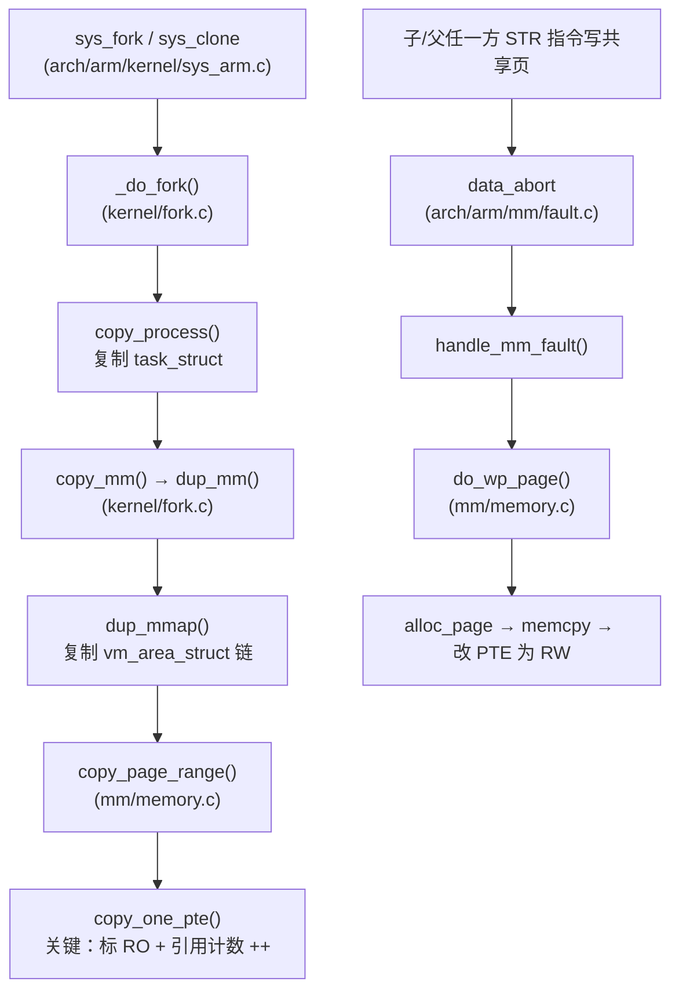
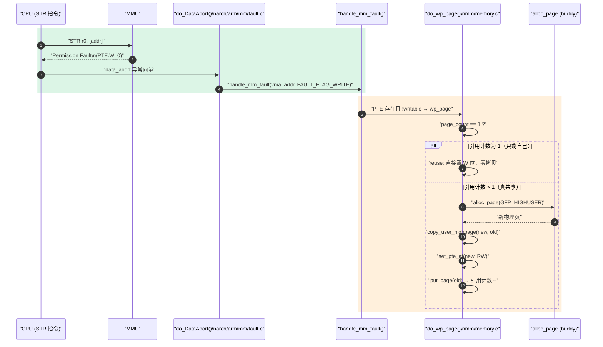

# fork 的 COW 优化：从 `dup_mm` 到缺页修复

> [!note]
> **Ref:** 原理与动机概览见 [`note/虚拟化/程序和进程/03-进程创建-fork-COW.md`](../../虚拟化/程序和进程/03-进程创建-fork-COW.md)；本篇聚焦内核源码路径与性能数据。

> [!note]
> **Ref:** [`note/虚拟化/程序和进程/03-进程创建的艺术：fork-与写时拷贝-(COW).md`](../../虚拟化/程序和进程/03-进程创建的艺术：fork-与写时拷贝-(COW).md), [`00-fork-exec-wait.md`](./00-fork-exec-wait.md), `sdk/Linux-4.9.88/kernel/fork.c`, `sdk/Linux-4.9.88/mm/memory.c`, `sdk/Linux-4.9.88/arch/arm/mm/fault.c`

## 1. 为什么 fork 必须是 COW

| 模式 | 1 GB 父进程 fork 成本 | 典型用例 |
|------|----------------------|----------|
| Naive fork（全量拷贝） | ~1 s + 1 GB 物理页 | 历史 Unix |
| COW fork | ~ms + **几页** PGD/PMD/PTE | 现代 Linux |
| `vfork` | 不复制页表，父挂起 | 仅 `exec` 前的极短窗口 |
| `posix_spawn` | 内部用 `vfork` + `exec` | 嵌入式无 MMU 兜底 |

90% 的 `fork()` 紧跟 `exec()`，立即丢弃地址空间 —— 完整拷贝 100% 浪费。COW 的本质是 **把"复制"延迟到第一次"写"，并按需以页为粒度执行**。

## 2. 内核路径全景



## 3. fork 路径关键步骤

### 3.1 `copy_one_pte` —— COW 的诞生点

`mm/memory.c` 中复制 PTE 时：

```c
/* 简化自 copy_one_pte() */
if (is_cow_mapping(vm_flags) && pte_write(pte)) {
    ptep_set_wrprotect(src_mm, addr, src_pte);   // 父端 PTE 去 W 位
    pte = pte_wrprotect(pte);                     // 子端 PTE 同样 RO
}
get_page(page);
page_dup_rmap(page, false);                       // 物理页引用计数 ++
rss[mm_counter(page)]++;
set_pte_at(dst_mm, addr, dst_pte, pte);
```

**关键三件事：**
1. 父 PTE 去掉写位（`pte_wrprotect`）—— 父亲也得"被骗"才能触发缺页。
2. 子 PTE 与父 PTE 现在指向**同一物理页**，引用计数 +1。
3. 整个 VMA 链（`vm_area_struct`）被复制，但底层物理页一个都没拷。

### 3.2 哪些映射不参与 COW

| 映射类型 | COW？ | 原因 |
|---------|:---:|------|
| 私有匿名（堆/栈/`MAP_PRIVATE`） | ✓ | 标准 COW |
| 共享匿名（`MAP_SHARED`） | ✗ | 父子本就要共享写 |
| 共享文件映射 | ✗ | 同上 |
| 私有文件映射只读段（`.text`） | ✓（但通常无写） | 标 RO，但永不触发 wp |
| `VM_PFNMAP` / `VM_IO` 设备映射 | ✗ | 物理地址固定 |
| `VM_HUGETLB` | 走 `hugetlb_cow` 单独路径 | 巨页粒度复制 |

`is_cow_mapping()` 的判定：`(vm_flags & (VM_SHARED | VM_MAYWRITE)) == VM_MAYWRITE`。

## 4. 写触发路径：`do_wp_page`

ARM Cortex-A7 写一个 RO 页 → CPU 抛 **Data Abort（permission fault）** → `arch/arm/mm/fault.c:do_page_fault` → `handle_mm_fault` → `do_wp_page`：



**`reuse_swap_page` 优化**：当一方在 fork 之后已经退出/exec，引用计数掉回 1，写者**直接重置 W 位并复用原页**，省掉一次 alloc + memcpy。这是嵌入式系统中 fork+exec 的性能基石。

## 5. 性能数量级（i.MX6ULL Cortex-A7 @ 792 MHz 估算）

| 操作 | 量级 |
|------|------|
| `copy_one_pte` 单次 | ~100 ns |
| 复制 1 GB VMA 的全部 PTE | ~1–5 ms（256 K 页） |
| 单次 `do_wp_page`（reuse 路径） | ~1 μs |
| 单次 `do_wp_page`（真拷贝 4 KB） | ~5–10 μs |
| Naive fork 1 GB | ~1–2 s |

→ **fork+exec 的总开销 ≈ PTE 复制 + 几次 wp_page 修复 ≈ ms 级**，与 1 GB 内存大小几乎解耦。

## 6. 与 `vfork` / `clone` 的对照

| 系统调用 | mm 复制策略 | 父进程行为 |
|---------|-------------|------------|
| `fork` | `dup_mm` + 全量 COW PTE 复制 | 立即返回 |
| `vfork` | **不复制 mm**，父子共享同一 `mm_struct` | **挂起**，直到子 `exec`/`exit` |
| `clone(CLONE_VM)` | 共享 mm（线程） | 立即返回 |
| `clone(...)` 不带 `CLONE_VM` | 等价 fork | 立即返回 |

`vfork` 在嵌入式 + 无 MMU（`nommu`）场景仍有价值；MMU 系统中由于 COW 已经够便宜，`vfork` 的窗口期风险（父被挂起、子误改父栈）通常得不偿失。

## 7. 用户视角的可观测信号

```sh
# 观察 COW 命中率
$ cat /proc/<pid>/status | grep -E 'VmRSS|VmData'
$ perf stat -e minor-faults,major-faults ./prog          # COW 触发记 minor fault

# 触发 do_wp_page 的 tracepoint
$ echo 1 > /sys/kernel/debug/tracing/events/exceptions/page_fault_user/enable
$ cat /sys/kernel/debug/tracing/trace_pipe
```

- **minor-faults 暴涨而 RSS 缓慢上升** → 典型 COW 修复模式。
- `vmstat 1` 的 `cow` 列（部分发行版）直接计数 wp 修复次数。

## 8. 常见陷阱

| 陷阱 | 机理 | 规避 |
|------|------|------|
| fork 后大量随机写 → RSS 翻倍 | 每页都触发真拷贝 | fork 紧跟 exec；或改 `posix_spawn` |
| `MADV_DONTFORK` 区域子进程访问段错误 | VMA 未被 dup | 只对真不需要的大缓冲使用 |
| fork 后调用 malloc 死锁 | glibc heap 锁在 fork 瞬间状态未知 | 使用 `pthread_atfork` 或只用 async-signal-safe API |
| 巨页 fork 慢 | `hugetlb_cow` 走整页复制（2 MB） | 合理切分；考虑 `MAP_SHARED` |
| KSM 合并页 + fork | KSM 页天然 RO，wp 必拷 | 高 fork 频率服务关 KSM |

## 9. 交叉引用

- [`00-fork-exec-wait.md`](./00-fork-exec-wait.md) —— fork/exec/wait API 全景与组合模式
- [`../../虚拟化/程序和进程/03-进程创建的艺术：fork-与写时拷贝-(COW).md`](../../虚拟化/程序和进程/03-进程创建的艺术：fork-与写时拷贝-(COW).md) —— COW 概念入门
- [`../../虚拟化/进程地址空间/02-进程地址空间-页表与MMU.md`](../../虚拟化/进程地址空间/02-进程地址空间-页表与MMU.md) —— ARM 页表与权限位
- [`../../kernel/sync/04-atomic-memory-barrier.md`](../../kernel/sync/04-atomic-memory-barrier.md) —— `page_count` 原子操作的语义保证
