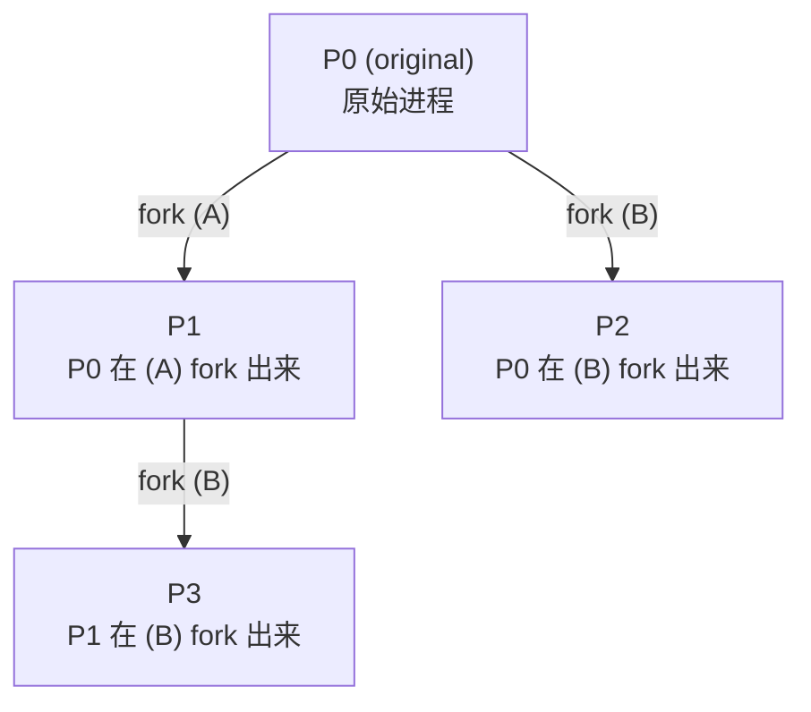
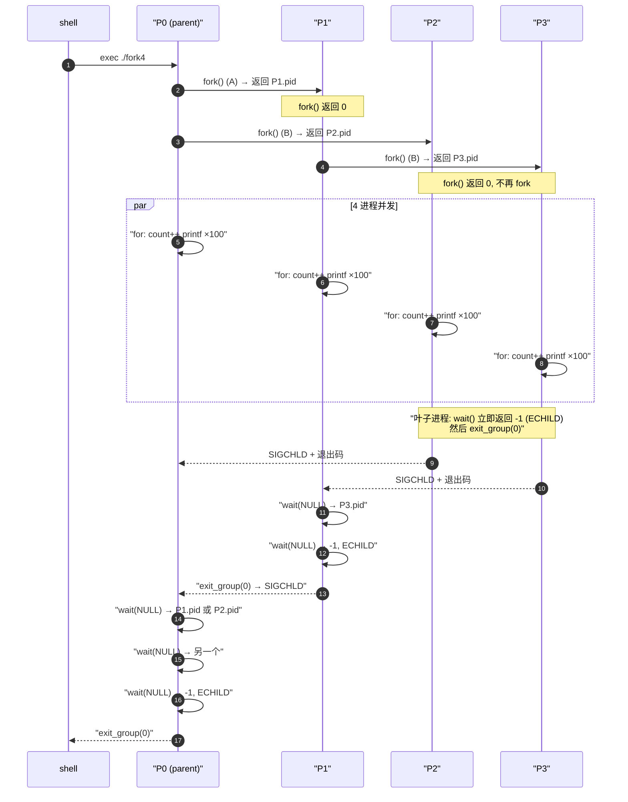

# fork4 — 双 fork 进程树与 fork/wait/exit 时序

> [!note]
> **Ref:** `note/SysCall/进程API/demo-fork/fork4.c`

## 1. 源码骨架

```c
fork();                              // (A) 第一次 fork
fork();                              // (B) 第二次 fork
for (i=0;i<100;i++) { count++; printf(...); }
while (wait(NULL) > 0);              // 回收所有直接子进程
```

两次 `fork()` 产生 **2² = 4** 个进程。关键是要看清:**第二个 fork 是被前一个 fork 之后的所有进程都执行的**。

---

## 2. 进程亲子关系



| 进程 | 父进程 | 直接子进程 | 经历的 fork 次数 |
|---|---|---|---|
| P0 | shell | P1, P2 | 调用 2 次 |
| P1 | P0    | P3     | 在 (A) 后被创建,自己再调 1 次 (B) |
| P2 | P0    | —      | 在 (B) 中作为子进程出生,fork 返回 0,无后续 fork |
| P3 | P1    | —      | 同上 |

**记忆诀窍**:每次 `fork()` 把"当前所有进程"翻一倍。第一次 1→2,第二次 2→4。新出生的子进程站在 fork **调用之后**那一行,所以 P2/P3 不会再次执行 (B)。

---

## 3. fork / wait / exit 时序



### 时序要点

1. **fork 调用顺序固定,但调度顺序不固定** —— 4 个进程谁先把 100 行 printf 打完完全看调度器,所以 stdout 会交错。
2. **`wait(NULL)` 只回收直接子进程**,不会回收孙子。所以 P0 不会等到 P3,P3 是被 P1 回收的。
3. **叶子进程 (P2/P3) 的 `while(wait>0)` 循环立刻退出** —— 第一次调用就因为没有子进程返回 -1/ECHILD,所以整个循环零次迭代,直接 `exit_group`。
4. **没有 `wait` 会怎样**:子进程比父进程晚结束 → 父进程已退出 → 子进程被 init (pid 1) 收养(reparent) → 它们的 stdout 在 shell 提示符之后才出现 → 看起来"丢了一行"。这正是上一轮 strace 里 4 进程只看到 3 行的原因。
5. **`SIGCHLD` 是隐式的**:每个子进程 `exit_group` 时内核给父进程发 SIGCHLD,默认 handler 是 SIG_DFL(忽略),但 `wait()` 仍能收到 zombie。如果父进程显式 `signal(SIGCHLD, SIG_IGN)`,则子进程死后直接被内核回收,`wait` 拿不到。

---

## 4. 与 strace 对照

预期的 syscall 计数(每个进程):

| syscall | 进程 | 次数 | 来源 |
|---|---|---|---|
| `clone` (fork) | P0 调 2 次, P1 调 1 次 | **3** | 总计 = 进程数 - 1 |
| `getpid` | 4 进程 × ≥1 | ≥4 | printf 里 |
| `write` | 4 进程 × 100 行 | **400** | printf flush(原 demo 是 1 次) |
| `wait4` | P0 ×3, P1 ×2, P2 ×1, P3 ×1 | **7** | 含最后一次返回 ECHILD |
| `exit_group` | 4 进程各 1 | **4** | 退出 |

> 注:之前 strace 看到 `clone=3 / write=4 / exit_group=4` 是因为 printf 在循环外只调一次。改成循环内 printf 后 write 会涨到 ~400(实际可能更少,因为行缓冲对 tty 是 flush-on-newline,对 pipe 则是块缓冲)。

---

## 5. 一句话总结

> **N 次 `fork()` 产生 2^N 个进程,其中只有最初那个进程经历了全部 N 次 fork;每个新生子进程从 fork 之后那一行开始执行,所以参与的 fork 数依次递减。** 父子关系恰好是一棵不平衡的二叉树:左子树继续 fork,右子树成为叶子。
