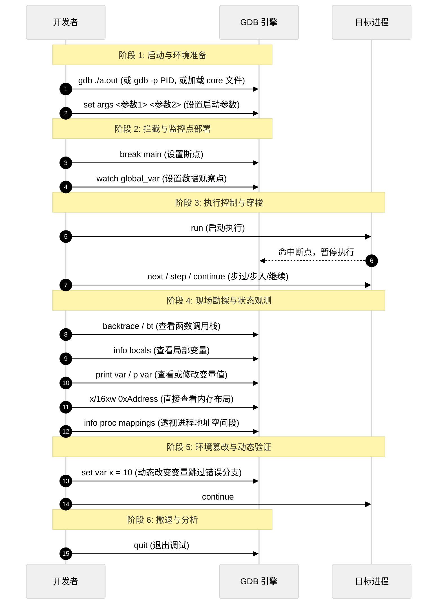

# GDB 与 二进制分析工具快速入门

> [!note]
> **Ref:** [GDB Documentation](https://sourceware.org/gdb/documentation/), [Binutils Manual](https://sourceware.org/binutils/docs/binutils/), [Strace Man Page](https://man7.org/linux/man-pages/man1/strace.1.html)

在研究进程地址空间与系统底层行为时，我们需要透视二进制文件（ELF）的静态结构，并观察程序在运行时的系统调用与内存布局。

---

## 1. 静态二进制透视：readelf 与 nm

在程序运行前，通常先使用 `binutils` 工具链了解其静态信息与预设蓝图。

### 1.1 `readelf` - ELF 文件深度解析
`readelf` 用于显示 ELF 格式目标文件和可执行文件的详细信息，它是查看进程地址空间布局蓝图的利器。

**常用选项清单：**
- `-h` (`--file-header`): **查看文件头**。获取魔数、体系结构（x86/ARM）、字节序、入口点地址等宏观信息。
- `-S` (`--section-headers`): **查看节区表**。列出 `.text`, `.data`, `.bss`, `.rodata` 等所有物理段在文件中的偏移和预定义大小。
- `-l` (`--program-headers`): **查看程序头/段表**。这是**进程内存映射的关键**，决定了文件中的哪些节区会被加载到内存，以及其访问权限（R/W/X）。
- `-s` (`--syms`): **查看符号表**。展示函数和变量在文件中的绑定信息。
- `-d` (`--dynamic`): **查看动态段**。列出程序依赖的共享库（如 `NEEDED libc.so.6`）。
- `-r` (`--relocs`): **查看重定位表**。了解哪些地址在加载时需要被动态链接器修改。
- `-w` (`--debug-dump`): **解析 DWARF 调试信息**。例如 `readelf -wl` 可查看源码行号与机器指令地址的映射表。

### 1.2 `nm` - 符号表提取器
`nm` 用于列出目标文件（如 `.o`, `.a`, `.so`, 可执行文件）中的符号（函数、全局变量）。

**常用选项清单：**
- **默认无参数**: 列出符号及类型。
  - 常见类型：`T/t` (代码段函数), `D/d` (已初始化数据), `B/b` (BSS 段未初始化数据), `U` (未定义，需外部动态链接)。
- `-n` (`--numeric-sort`): **按地址排序**。非常适合在调试时对照内存 Crash 地址快速定位所属函数。
- `-C` (`--demangle`): **C++ 符号还原**。将 C++ 编译器混淆后的符号（如 `_Z4funcv`）还原为人类可读的签名（如 `func()`）。
- `-u` (`--undefined-only`): **只列出未定义的符号**。排查“undefined reference”链接错误时必备。
- `-S` (`--print-size`): **打印符号占用的大小**。用于排查哪个全局变量或函数占用了过多的 BSS/Data 空间。

---

## 2. 动态边界探测：strace 追踪系统调用

程序在用户态和内核态之间交互的唯一桥梁是**系统调用（System Call）**。`strace` 是一个用于拦截和记录进程系统调用及接收信号的强大工具。

**核心应用场景：** 排查卡死问题、分析性能瓶颈、查看文件/网络IO过程。

**常用选项清单：**
- **基本使用**: `strace ./a.out` (直接运行并追踪所有系统调用，输出到屏幕)。
- `-p <PID>`: **附加到运行中的进程**。无需重启程序即可开始追踪其行为。
- `-e trace=<syscall>`: **按类型过滤追踪**。
  - `strace -e trace=open,read,write`: 只看文件操作。
  - `strace -e trace=network`: 只看网络相关调用（如 socket, bind, connect）。
  - `strace -e trace=memory`: 观察进程地址空间的变化（如 mmap, mprotect, brk）。
- `-c` (`--summary-only`): **统计模式**。程序运行结束后，打印每个系统调用花费的总时间、调用次数、错误次数（性能分析神器）。
- `-f` (`--follow-forks`): **跟随子进程**。如果程序会 fork 或创建多线程，必须加此参数才能追踪所有线程。
- `-tt` 或 `-ttt`: **打印微秒级时间戳**。排查耗时毛刺。
- `-o <file>`: **将结果重定向到文件**，避免污染终端输出。

---

## 3. GDB 的典型调试流程全景

从启动、运行到崩溃现场分析，GDB 调试通常遵循以下闭环流程。

### 3.1 阶段解析与核心命令备忘

#### 1. 启动选项
- **调试可执行文件**: `gdb ./program`
- **带参数启动**: 
  - `gdb --args ./program arg1 arg2`
  - 或在 GDB 内部：`set args arg1 arg2` 然后 `run`
- **附加正在运行的进程**: `gdb -p <PID>`
- **事后诸葛亮（分析 Core Dump）**: `gdb ./program core`

#### 2. 断点 (Breakpoints) 与 观察点 (Watchpoints)
- **设置断点 (`b`)**: `b main`, `b file.c:10`, `b *0x08048000` (绝对地址断点)
- **临时断点 (`tb`)**: 命中一次后自动删除。
- **条件断点**: `b 10 if x == 5` (当条件满足时才暂停)。
- **硬件观察点 (`watch`)**: `watch global_var` (当变量的值发生改变时程序暂停，极度适合排查**内存踩踏**问题)。
- **管理断点**: `info breakpoints` (查看), `delete <Num>` (删除), `disable/enable <Num>` (启停)。

#### 3. 执行控制
- **运行 (`r`)**: 启动程序。
- **单步步过 (`n`)**: 执行下一行源码，不进入函数调用。
- **单步步入 (`s`)**: 进入下一行源码调用的函数内部。
- **继续 (`c`)**: 恢复执行，直到遇到下一个断点或程序结束。
- **执行到返回 (`finish`)**: 一气呵成执行完当前函数并暂停在返回点。

#### 4. 现场观测 (核心看家本领)
- **调用栈查验**: `backtrace` (简写 `bt`，查看崩溃点是如何被层层调用的)。配合 `frame N` 切换到某一层栈查看当时的环境。
- **变量打印 (`p`)**: `p variable`，或以特定格式打印 `p/x variable` (十六进制)。
- **内存倾印 (`x`)**: 格式为 `x/nfu <addr>`。例如 `x/32xw $sp` 以16进制格式查看栈顶开始的32个字 (Words)。
- **地址空间映射**: **`info proc mappings`** (极其重要！查看 `.text`, `.data`, 栈堆分布及内存权限映射表)。
- **当前指令**: `display /i $pc` (每次单步时自动打印当前即将执行的汇编指令)。

通过将 `readelf` 静态分析与 `gdb` 和 `strace` 的动态追踪结合，我们可以获得进程运行生命周期中**事无巨细、从内到外**的全方位掌控力。
