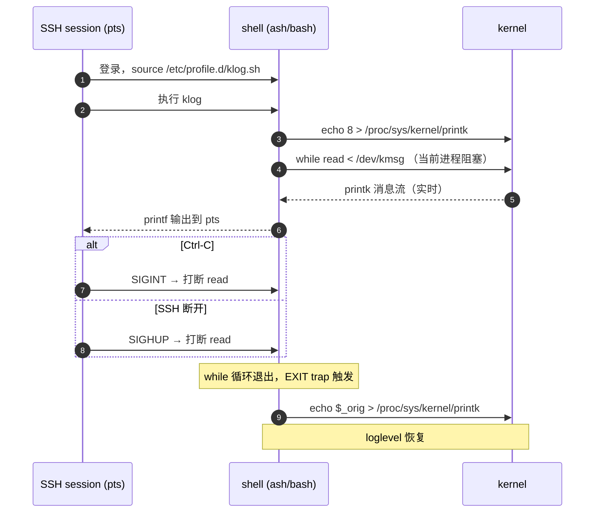

# klog — 将 printk 重定向到当前 SSH session

> [!note]
> **Ref:** [`note/devp/kdebug.md`](./kdebug.md), `man 1 dmesg`, Linux kernel `drivers/char/mem.c` (`/dev/kmsg`)

---

## 背景与设计约束

| 问题 | 原因 |
|------|------|
| `klogd -c 8 -n` 无输出 | 系统常驻 `klogd`（pid=179）独占 `/proc/kmsg`，消耗式接口只允许一个读者 |
| `dmesg` 有输出 | 走 `syslog(2)` 系统调用读 ring buffer，非消耗，不受影响 |
| 目标 | 前台阻塞流式输出，session 断开自动恢复，不干扰常驻 klogd |

**选择 `/dev/kmsg`**：非消耗式，支持多读者并发，Linux 3.5+ 可用。

---

## 实现

### `/usr/bin/klog`（核心脚本）

```sh
#!/bin/sh
# 作为独立子进程运行：EXIT trap 在脚本进程退出时必然触发。

_orig=$(awk '{print $1}' /proc/sys/kernel/printk)
echo 8 > /proc/sys/kernel/printk
echo "[klog] loglevel → 8 (was ${_orig}). Ctrl-C to stop."

trap "echo ${_orig} > /proc/sys/kernel/printk" EXIT

cat /dev/kmsg | while IFS= read -r _line; do
    printf '%s\n' "${_line#*;}"
done
```

### `/etc/profile.d/klog.sh`（session 自动加载）

```bash
# 仅作 wrapper，逻辑委托给脚本
klog() { /usr/bin/klog "$@"; }
```

> **为何拆成脚本而非 shell 函数**：见下方"trap 失效根因"。

---

## 工作原理



---

## trap 失效根因与演进

### 第一版：pipeline + sed（SSH 断开不恢复）

```
cat /dev/kmsg | sed ...
```

SSH 断开 → SIGHUP → pipeline 子进程先死 → ash 从 waitpid 返回后直接退出，trap 不执行。

### 第二版：shell 函数 + while read（Ctrl-C 不恢复）

```bash
klog() {
    trap "echo $_orig > ..." EXIT INT HUP TERM
    while IFS= read -r _line; do ...; done < /dev/kmsg
}
```

busybox ash **交互模式**下，Ctrl-C 发出 SIGINT：
- `read` 被打断，while 退出，函数返回
- `EXIT` trap 只在 **shell 进程退出**时触发，函数返回不算
- `INT` trap 在 ash 交互模式下行为不可靠，未必执行

### 第三版：独立脚本（当前，可靠）

```
用户 → klog (shell function wrapper)
           └─ exec /usr/bin/klog  ← 独立 sh 子进程
                  trap EXIT        ← 脚本进程退出时必然触发
                  cat | while read
```

脚本进程（非交互 sh）退出路径：
| 事件 | 脚本进程行为 | EXIT trap |
|------|------------|-----------|
| Ctrl-C | SIGINT → cat 死 → broken pipe → while 退出 → 脚本退出 | ✓ |
| SSH 断开 | SIGHUP → 脚本收到 → 脚本退出 | ✓ |
| 正常结束 | while 退出 → 脚本退出 | ✓ |

---

## `/dev/kmsg` vs `/proc/kmsg`

| | `/proc/kmsg` | `/dev/kmsg` |
|---|---|---|
| 读者数量 | 只能一个（消耗式） | 多个并发 |
| 系统 klogd 冲突 | 会（抢占） | 不会 |
| seek 支持 | 否 | 是（可从头读历史） |
| `dmesg` 使用 | 否 | 是（Linux 3.5+） |

---

## 原始格式说明

```
6,1234,123456789,-;mmap_drv: open (pid=312)
│  │    │         │  └─ 消息正文
│  │    │         └─ flags（通常 `-`）
│  │    └─ 时间戳（微秒，自启动）
│  └─ 序列号
└─ 优先级（= facility<<3 | level，纯驱动消息 facility=0，level=6 即 KERN_INFO）
```

`sed 's/^[0-9]*,[0-9]*,[0-9]*,[^;]*;//'` 去掉前缀，只保留消息正文。

---

## 使用

```bash
# 当前 session 立即加载（已登录时）
. /etc/profile.d/klog.sh

# 运行
klog

# 预期输出
[klog] console_loglevel → 8 (was 4), streaming /dev/kmsg ...
[klog] Ctrl-C to stop and restore loglevel
mmap_drv: open  (pid=312)
mmap_drv: pid=312 mapped phys=0x88ce8000 → virt=0x76ff7000 size=4096
^C
# loglevel 自动恢复为 4
```
