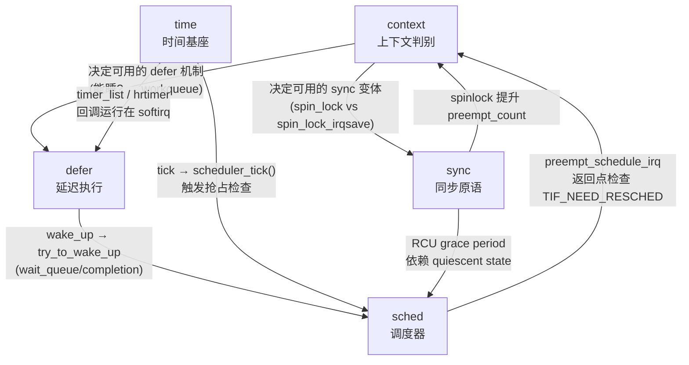
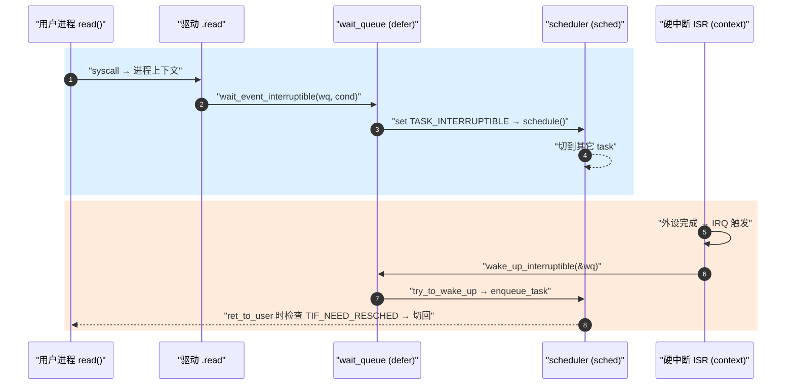

---
title: 内核执行模型总图
tags: [kernel, execution-model, context, sched, defer, time, sync, index]
desc: note/kernel 五子域（context/sched/defer/time/sync）的总图、关系与导航入口
update: 2026-04-07

---

# 内核执行模型总图

> [!note]
> **Ref:** [`plan-20260407.md`](./plan-20260407.md), `sdk/Linux-4.9.88/{kernel,include/linux}/`

## 1. 五子域定位

`note/kernel/` 按"代码在 CPU 上如何被执行"分为五个相互正交的子域：

| 子域 | 回答的问题 | 典型 API |
|------|-----------|----------|
| [`context/`](./context/) | 这段代码**在什么上下文运行**？能不能睡眠？能不能持锁？ | `in_irq()` / `in_atomic()` / `preempt_count` |
| [`sched/`](./sched/) | CPU **下一个跑谁**？被唤醒后何时上 CPU？ | `schedule()` / `try_to_wake_up()` / `sched_class` |
| [`defer/`](./defer/) | 现在不能做的工作 **延迟到什么上下文做**？ | softirq / tasklet / workqueue / threaded-irq / wait_queue / completion |
| [`time/`](./time/) | "多久之后"如何被精确触发？ | jiffies / timer_list / hrtimer / clockevents / tick |
| [`sync/`](./sync/) | 多 CPU / 多上下文共享数据如何保证一致？ | spinlock / mutex / RCU / atomic / barrier |

任意一行驱动代码都同时落在这 5 个维度上 —— 它**运行在某个 context**、被 **sched 调度上 CPU**、可能 **defer 到另一上下文**、依赖 **time 子系统**触发、用 **sync 原语**保护数据。

## 2. 五子域的耦合关系

**典型闭环：阻塞 IO**

5 个子域在这一条路径里**全部出现**：context（ISR vs 进程）、defer（wait_queue）、sched（wake-up path）、sync（wq 自带 spinlock 保护）、time（若超时还涉及 hrtimer）。

## 3. 子域入口导航

### [`context/`](./context/) —— 上下文
- [`00-overview.md`](./context/00-overview.md) —— 五类上下文全景、能力矩阵、`preempt_count` 位域、ARM Cortex-A7 调度触发点

### [`sched/`](./sched/) —— 调度器
- [`00-overview.md`](./sched/00-overview.md) —— sched 子域索引
- [`01-sched_class-CFS.md`](./sched/01-sched_class-CFS.md) —— sched_class 抽象、CFS vruntime
- [`02-runqueue-load-balance.md`](./sched/02-runqueue-load-balance.md) —— per-cpu rq、load_balance
- [`03-preemption-models.md`](./sched/03-preemption-models.md) —— PREEMPT_NONE/VOLUNTARY/PREEMPT/RT
- [`04-kthread-kworker.md`](./sched/04-kthread-kworker.md) —— kthread / kworker pool
- [`05-wake-up-path.md`](./sched/05-wake-up-path.md) —— try_to_wake_up → enqueue_task

### [`defer/`](./defer/) —— 延迟执行
- [`00-overview.md`](./defer/00-overview.md) —— 选型决策树
- [`01-softirq.md`](./defer/01-softirq.md) · [`02-tasklet.md`](./defer/02-tasklet.md) · [`03-workqueue.md`](./defer/03-workqueue.md) · [`04-threaded-irq.md`](./defer/04-threaded-irq.md)
- [`05-wait-queue.md`](./defer/05-wait-queue.md) · [`06-completion.md`](./defer/06-completion.md)

### [`time/`](./time/) —— 时间子系统
- [`00-overview.md`](./time/00-overview.md) —— clocksource / clockevents / tick / hrtimer / jiffies 关系图
- [`01-jiffies-HZ.md`](./time/01-jiffies-HZ.md) · [`02-soft-timer.md`](./time/02-soft-timer.md) · [`03-hrtimer.md`](./time/03-hrtimer.md)
- [`04-tick-nohz.md`](./time/04-tick-nohz.md) · [`05-imx6ull-gpt.md`](./time/05-imx6ull-gpt.md)

### [`sync/`](./sync/) —— 同步原语
- [`00-overview.md`](./sync/00-overview.md) —— 选型决策树 + 性能数量级
- [`01-spinlock.md`](./sync/01-spinlock.md) · [`02-mutex-semaphore.md`](./sync/02-mutex-semaphore.md)
- [`03-rcu.md`](./sync/03-rcu.md) · [`04-atomic-memory-barrier.md`](./sync/04-atomic-memory-barrier.md)
- [`05-cheatsheet.md`](./sync/05-cheatsheet.md)

## 4. 应用层出口

- 阻塞 IO 全链路 ↔ [`prj/03-Advanced-IO/`](../../prj/03-Advanced-IO/) 演示工程
- 五种 IO 范式与本五子域的对应 → [`note/SysCall/IO/04-IO范式总览.md`](../SysCall/IO/04-IO范式总览.md)
- 调试视角：`/proc/interrupts`、`/proc/softirqs`、`ftrace sched_switch`、`tracepoint:irq:*` → [`note/devp/kdebug.md`](../devp/kdebug.md)
