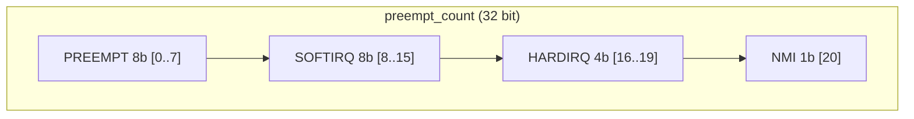
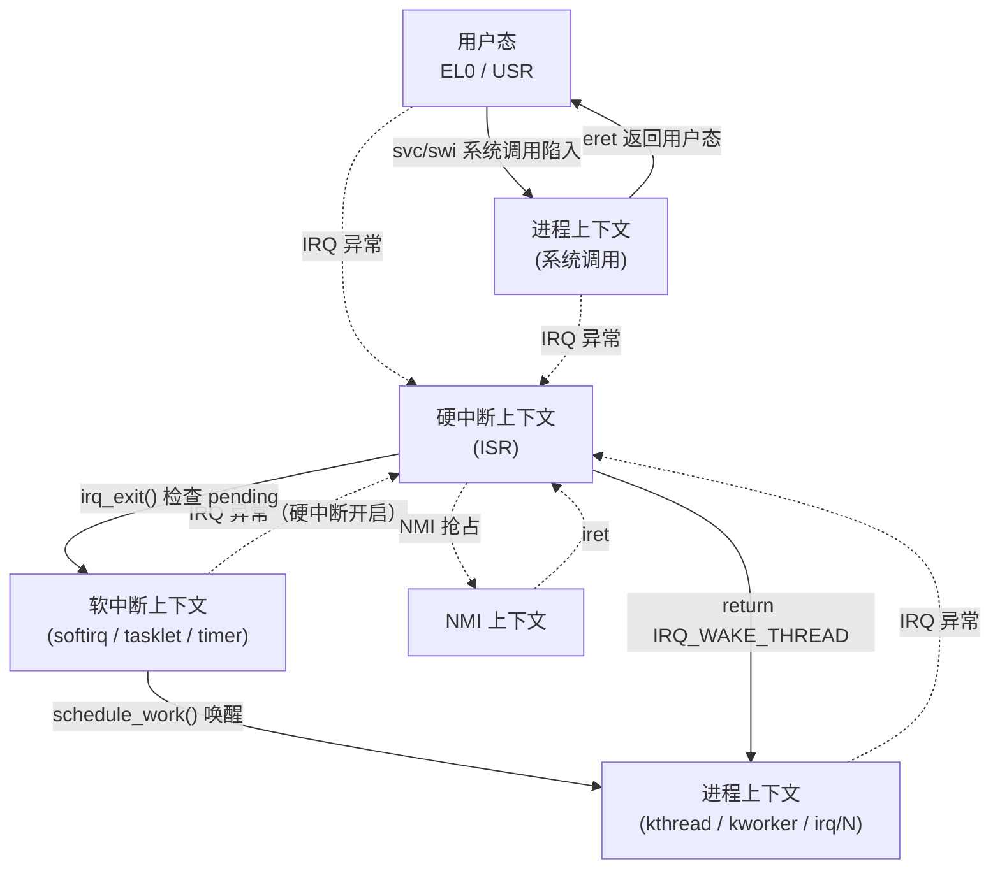
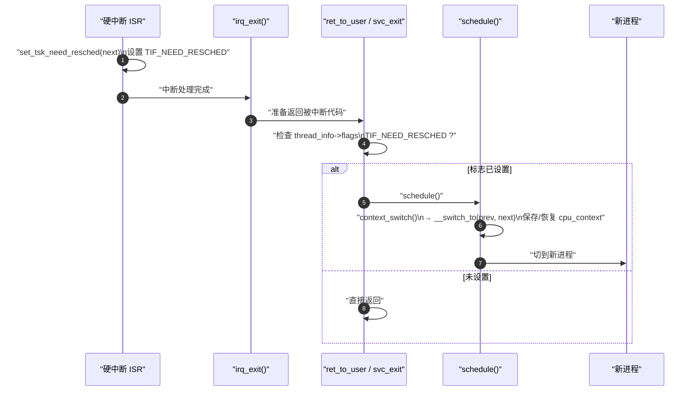

# 内核执行上下文全景

> [!note]
> **Ref:** [`include/linux/preempt.h`](../../../sdk/100ask_imx6ull-sdk/Linux-4.9.88/include/linux/preempt.h), [`include/linux/hardirq.h`](../../../sdk/100ask_imx6ull-sdk/Linux-4.9.88/include/linux/hardirq.h), [`include/linux/sched.h`](../../../sdk/100ask_imx6ull-sdk/Linux-4.9.88/include/linux/sched.h), [`include/linux/bottom_half.h`](../../../sdk/100ask_imx6ull-sdk/Linux-4.9.88/include/linux/bottom_half.h), [`arch/arm/include/asm/thread_info.h`](../../../sdk/100ask_imx6ull-sdk/Linux-4.9.88/arch/arm/include/asm/thread_info.h), [`kernel/softirq.c`](../../../sdk/100ask_imx6ull-sdk/Linux-4.9.88/kernel/softirq.c)

## 1. 为什么要区分"上下文"

Linux 内核同一段代码可能在**完全不同的运行环境**里被调用。"能不能睡眠？能不能持锁？能不能 `GFP_KERNEL`？" 的答案 **只取决于当前 CPU 的执行上下文**，而不取决于函数本身。写驱动时弄错上下文 = 死锁 / oops / 调度器崩溃。

内核用一个 per-CPU 的 `preempt_count` 字段**编码**当前上下文，并提供 `in_irq()` / `in_softirq()` / `in_atomic()` 等宏作为运行时判别。

---

## 2. 五类上下文逐一拆解

由宽松到严格：用户态 → 进程上下文 → 软中断 → 硬中断 → NMI。

### 2.1 用户态上下文（User Context）

**进入方式：** 程序正常执行用户代码（`main()` 及调用链）

| 特征 | 状态 |
|------|------|
| ARM 模式 | EL0 / USR |
| 栈 | 用户栈（用户地址空间内）|
| 可访问地址 | `0x0` ~ `TASK_SIZE`（3 GB 用户空间）|
| 特权指令 | 触发 Undefined Instruction 异常 |
| `current` | 有效，指向当前进程 `task_struct` |

需要内核服务时通过**系统调用**（ARM `svc` / 旧 `swi` 指令）陷入内核。

### 2.2 进程上下文（Process Context）

**进入方式：** 系统调用 (`read/write/ioctl`)、内核线程 (`kthread`)、`workqueue` (`kworker`)、`threaded IRQ` (`irq/N`)

| 特征 | 状态 |
|------|------|
| ARM 模式 | EL1 / SVC |
| 栈 | 内核栈（`task_struct` 关联的 8 KB 栈）|
| `current` | 有效，知道"我是谁" |
| 可被抢占 | ✓（`preempt_count == 0` 且 `CONFIG_PREEMPT`）|
| 可睡眠/调度 | ✓ |
| `copy_to/from_user` | ✓（仅 syscall 子类型）|
| `mutex_lock` | ✓ |

这是内核**约束最少**的上下文，绝大多数驱动代码在此运行。

**两种子类型：**

| | 系统调用上下文 | 内核线程上下文 |
|--|----------------|----------------|
| `current` | 发起 syscall 的用户进程 | kthread 自身 |
| `current->mm` | 非 NULL（有用户地址空间）| **NULL**（无用户空间）|
| `copy_to_user` | ✓ | ✗ |
| 典型代表 | `read()` / `ioctl()` handler | `kworker`、`ksoftirqd`、`kthread_run()` |

### 2.3 软中断上下文（Softirq / BH）

**进入方式：** 硬中断返回时 `irq_exit()` → `__do_softirq()`，或 `local_bh_enable()` 触发，或 `ksoftirqd` 内核线程兜底

| 特征 | 状态 |
|------|------|
| 线程归属 | **不是独立线程**，借用当前 CPU 执行流 |
| 栈 | 被中断进程的内核栈 |
| `current` | 有效但**无意义**（是被中断者）|
| 硬件中断 | **开启** ✓（可被新硬中断打断）|
| 抢占 | **禁止** ✗ |
| 可睡眠 | ✗ |
| `copy_to_user` | ✗ |
| `spinlock` | ✓（`mutex` 不可）|

**包含的具体场景：**

| 场景 | 说明 |
|------|------|
| softirq handler | `NET_RX_SOFTIRQ` 等 |
| tasklet 回调 | 运行在 `TASKLET_SOFTIRQ` / `HI_SOFTIRQ` |
| `timer_list` 回调 | 运行在 `TIMER_SOFTIRQ` |
| `local_bh_disable()` 区域 | 进程上下文中禁用 BH 的临界段 |

### 2.4 硬中断上下文（Hardirq / ISR）

**进入方式：** 外设触发 IRQ → GIC → CPU 异常向量 → `gic_handle_irq()`

| 特征 | 状态 |
|------|------|
| ARM 模式 | EL1 / IRQ 模式 |
| 栈 | 被中断进程的内核栈（或独立 IRQ 栈）|
| `current` | 有效但**无意义** |
| 硬件中断 | **关闭** ✗（仅本 CPU）|
| 抢占 | **禁止** ✗ |
| 可睡眠 | ✗ |
| `spinlock` | ✓（**必须** `_irqsave` 变体）|
| `raise_softirq` | ✓ |

> **约束最严**的常规上下文。ISR 必须极短（通常 < 100 μs），耗时工作下放至 BH/threaded IRQ。

### 2.5 NMI 上下文（Non-Maskable Interrupt）

**进入方式：** 不可屏蔽中断（看门狗超时、硬件故障、perf 采样）

| 特征 | 状态 |
|------|------|
| 不能被任何中断打断 | ✓（包括 NMI 自身）|
| 不能持有任何普通锁 | 仅 `trylock`，否则死锁 |
| 用途 | panic 输出、perf 采样、watchdog 复位 |

---

## 3. 能力矩阵（中心表）

| 能力 | 用户态 | 进程上下文 | softirq BH | hardirq ISR | NMI |
|------|:------:|:----------:|:----------:|:-----------:|:---:|
| 可睡眠 / `schedule()` | ✓ | ✓ | ✗ | ✗ | ✗ |
| `copy_to/from_user` | — | ✓ (syscall) | ✗ | ✗ | ✗ |
| `mutex_lock` | ✓ | ✓ | ✗ | ✗ | ✗ |
| `spin_lock` | — | ✓ | ✓ | ✓ (`_irqsave`) | ✗ (仅 trylock) |
| `kmalloc(GFP_KERNEL)` | — | ✓ | ✗ | ✗ | ✗ |
| `kmalloc(GFP_ATOMIC)` | — | ✓ | ✓ | ✓ | ✗ |
| 硬件中断状态 | 开 | 开 | **开** | **关** | 关 |
| 可被抢占 | ✓ | ✓ (无锁时) | ✗ | ✗ | ✗ |
| `current` 有效 | ✓ | ✓ | 有但无意义 | 有但无意义 | 有但无意义 |
| `in_interrupt()` | — | 0 | ≠0 | ≠0 | ≠0 |
| `in_atomic()` | — | 0 / 持锁 ≠0 | ≠0 | ≠0 | ≠0 |

> kthread 与 syscall 上下文在能力上等价，差别只在 `current->mm` 与是否能 `copy_to_user`。

---

## 4. `preempt_count` 一字段编码所有上下文

源自 [`include/linux/preempt.h`](../../../sdk/100ask_imx6ull-sdk/Linux-4.9.88/include/linux/preempt.h)：

```c
#define PREEMPT_BITS   8   /* [ 0.. 7] preempt_disable 嵌套计数 */
#define SOFTIRQ_BITS   8   /* [ 8..15] softirq / local_bh_disable 嵌套 */
#define HARDIRQ_BITS   4   /* [16..19] 硬中断嵌套 */
#define NMI_BITS       1   /* [20]     NMI 标志 */
```



**判别宏（均读 `preempt_count`）：**

| 宏 | 含义 |
|----|------|
| `in_nmi()` | NMI bit 置位 |
| `in_irq()` | HARDIRQ 段非零 |
| `in_softirq()` | SOFTIRQ 段非零（含 `local_bh_disable`）|
| `in_serving_softirq()` | 精确：正在跑 softirq handler |
| `in_interrupt()` | `HARDIRQ \| SOFTIRQ \| NMI` 任一非零 |
| `in_atomic()` | 以上任一 OR preempt 计数非零 → **不可睡眠** |
| `in_task()` | `!in_interrupt()`，真正进程上下文 |

**各上下文对应的 `preempt_count` 状态：**

| 上下文 | NMI | hardirq | softirq | preempt |
|--------|:---:|:-------:|:-------:|:-------:|
| 进程上下文（无锁）| 0 | 0 | 0 | 0 |
| 进程上下文（持 spinlock）| 0 | 0 | 0 | >0 |
| `local_bh_disable` 区域 | 0 | 0 | >0 | 可能 >0 |
| softirq handler | 0 | 0 | >0 | >0 |
| hardirq handler | 0 | >0 | 可能 >0 | >0 |
| NMI handler | >0 | 可能 >0 | 可能 >0 | >0 |

---

## 5. 上下文转换路径



**关键事实：**

1. 硬中断可以打断**除 NMI 外的任何**上下文（包括 softirq）—— 因此 softirq 与 ISR 共享数据需要 `spin_lock_irqsave`，而非普通 `spin_lock`。
2. softirq 只在 `irq_exit()` / `local_bh_enable()` / `ksoftirqd` 中执行，**不会嵌套自身**，但会在硬中断**返回途中**被触发。
3. 从"原子上下文"进入"进程上下文"只有一条路：**显式唤醒某个进程 / kthread / kworker**。

---

## 6. ARM Cortex-A7 调度触发点

Cortex-A 通过 `TIF_NEED_RESCHED` 标志 + 固定检查点实现**延迟调度**（对比 Cortex-M 的 PendSV 机制见 [`../../SoC-Arch/cortexM-pendsv.md`](../../SoC-Arch/cortexM-pendsv.md)）：



**调度检查点（`TIF_NEED_RESCHED` 生效的位置）：**

| 检查点 | 时机 |
|--------|------|
| `ret_to_user` | 从内核态返回用户态前（系统调用/中断返回）|
| `preempt_schedule_irq` | 中断返回内核态时（`CONFIG_PREEMPT`）|
| `preempt_schedule` | `spin_unlock` / `preempt_enable` 时 |
| `cond_resched()` | 长循环中主动让出点 |

---

## 7. 常见坑

- **ISR 里调用 `kmalloc(GFP_KERNEL)`** → 可能睡眠 → `BUG: scheduling while atomic`
- **持 spinlock 调用 `copy_from_user()`** → page fault 睡眠 → 死锁
- **tasklet 里 `mutex_lock()`** → 同样的问题
- **忘记 `request_threaded_irq()` 的 `IRQF_ONESHOT`** → 线程化部分运行时硬中断又进 → 竞争
- **softirq 与 ISR 共享数据用普通 `spin_lock`** → 被硬中断打断后死锁，必须 `_irqsave`

调试期用 `might_sleep()` 主动断言"我此刻可睡眠"。

---

## 8. 交叉引用

- [`../defer/00-overview.md`](../defer/00-overview.md) —— 各类延迟机制运行的上下文与选型决策树
- [`../defer/01-softirq.md`](../defer/01-softirq.md) —— softirq 上下文的精确含义
- [`../defer/04-threaded-irq.md`](../defer/04-threaded-irq.md) —— 把 ISR 搬到进程上下文的手段
- [`../sync/01-spinlock.md`](../sync/01-spinlock.md) —— 不同上下文下的 spinlock 变体选型
- [`../../SoC-Arch/cortexM-pendsv.md`](../../SoC-Arch/cortexM-pendsv.md) —— 对照：Cortex-M 用 PendSV 完成等价工作
