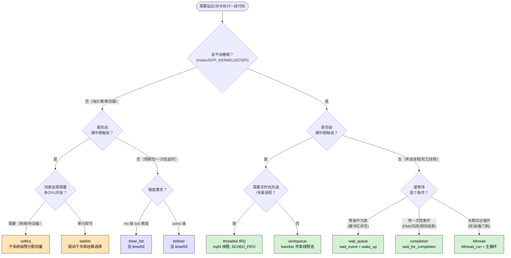
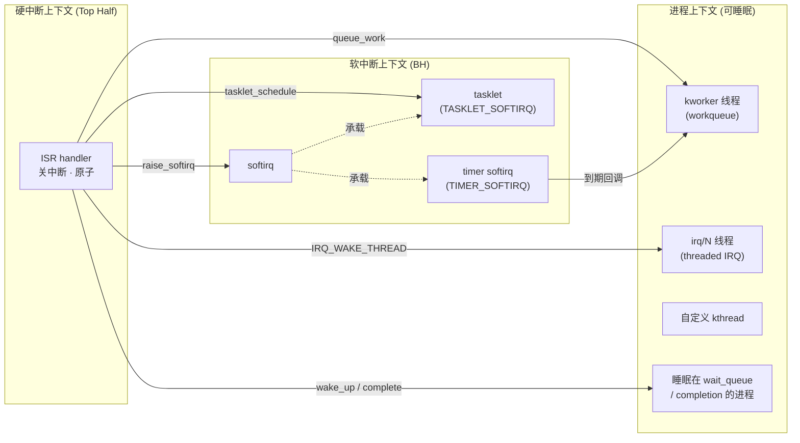

# 内核延迟与异步执行机制全景

> [!note]
> **Ref:** [`include/linux/interrupt.h`](../../../sdk/100ask_imx6ull-sdk/Linux-4.9.88/include/linux/interrupt.h), [`kernel/softirq.c`](../../../sdk/100ask_imx6ull-sdk/Linux-4.9.88/kernel/softirq.c), [`kernel/workqueue.c`](../../../sdk/100ask_imx6ull-sdk/Linux-4.9.88/kernel/workqueue.c), [`include/linux/wait.h`](../../../sdk/100ask_imx6ull-sdk/Linux-4.9.88/include/linux/wait.h), [`include/linux/completion.h`](../../../sdk/100ask_imx6ull-sdk/Linux-4.9.88/include/linux/completion.h), [`include/linux/kthread.h`](../../../sdk/100ask_imx6ull-sdk/Linux-4.9.88/include/linux/kthread.h)

## 1. 目录定位

`note/kernel/defer/` 收录所有与“**不立即做、换个上下文做、等条件满足再做**”相关的机制。这些机制彼此配合，构成了驱动开发中最常用的异步骨架：

- **Botton Half**：softirq / tasklet / workqueue / threaded-irq —— 把 ISR 的重活推迟到更宽松的上下文
- **同步等待族**：wait_queue / completion —— 让进程睡眠直到条件满足或事件发生
- **线程化执行族**：kthread —— 独立内核线程承载长期后台任务
- **定时延迟族**：timer_list（低精度）/ hrtimer（高精度）—— 见 [`../time/02-soft-timer.md`](../time/02-soft-timer.md)、[`../time/03-hrtimer.md`](../time/03-hrtimer.md)

所有机制本质上都是在回答：**“这段代码应该在什么上下文、什么时机被执行？”**

---

## 2. 选型决策树（核心）



> **读图提示**：橙色 = 原子上下文机制（不可睡眠）；绿色 = 进程上下文机制（可睡眠）；蓝色 = 时间触发机制。

---

## 3. 机制全家福



---

## 4. 横向对比速查

| 机制 | 上下文 | 可睡眠 | 触发者 | 调度策略 | 典型用途 |
|------|:------:|:------:|--------|----------|----------|
| **softirq** | 软中断 BH | ✗ | 子系统 | — | 网络 NET_RX、块设备、RCU |
| **tasklet** | 软中断 BH | ✗ | ISR | — | DMA 完成、驱动下半部 |
| **workqueue** | 进程 (kworker) | ✓ | 任何 | SCHED_NORMAL | I2C/SPI 读取、复杂处理 |
| **threaded IRQ** | 进程 (irq/N) | ✓ | 硬中断返回 | SCHED_FIFO=50 | 传感器、触摸屏 |
| **wait_queue** | 进程 | ✓ | `wake_up()` | — | read/write 阻塞、条件等待 |
| **completion** | 进程 | ✓ | `complete()` | — | 一次性事件：DMA 完成、探测同步 |
| **kthread** | 进程 | ✓ | 显式 `kthread_run` | 可设 | 看门狗、后台轮询、USB khubd |
| **timer_list** | 软中断 BH | ✗ | tick | — | ms 级延时、超时 |
| **hrtimer** | 软中断/硬中断 | ✗ | clockevent | — | us/ns 级精确延时 |

---

## 5. preempt_count 上下文检测

```c
/* include/linux/preempt.h */
in_irq()              /* 硬中断 handler 中 */
in_softirq()          /* softirq 中 或 local_bh_disable 区域 */
in_serving_softirq()  /* 精确：正在跑 softirq handler */
in_interrupt()        /* 硬 or 软中断（任何中断上下文） */
in_atomic()           /* 持锁/中断/preempt_disable —— 禁止睡眠 */
```

详见 [`../context/00-overview.md`](../context/00-overview.md)。

---

## 6. 笔记导航

| 文件 | 内容 |
|------|------|
| [`01-softirq.md`](./01-softirq.md) | softirq 向量、执行点、ksoftirqd |
| [`02-tasklet.md`](./02-tasklet.md) | tasklet 串行语义、上/下半部拆分模板 |
| [`03-workqueue.md`](./03-workqueue.md) | CMWQ、delayed_work、自定义 WQ |
| [`04-threaded-irq.md`](./04-threaded-irq.md) | `request_threaded_irq`、irq_thread 主循环、IRQF_ONESHOT |
| [`05-wait-queue.md`](./05-wait-queue.md) | `wait_event` / `wake_up` 实现与条件等待模板 |
| [`06-completion.md`](./06-completion.md) | `completion` 的 one-shot 同步语义 |
| [`07-kthread-pattern.md`](./07-kthread-pattern.md) | kthread 启动/退出模式、停止协议 |
| 交叉引用 | [`../time/02-soft-timer.md`](../time/02-soft-timer.md)、[`../time/03-hrtimer.md`](../time/03-hrtimer.md) |
