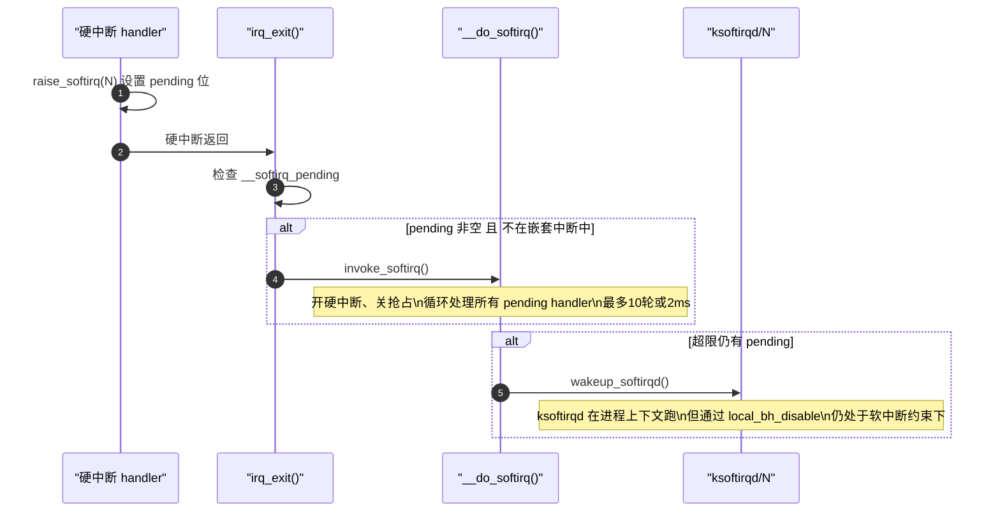

# softirq：软中断执行上下文与机制

> [!note]
> **Ref:** [`sdk/Linux-4.9.88/kernel/softirq.c`](../../../sdk/100ask_imx6ull-sdk/Linux-4.9.88/kernel/softirq.c), [`sdk/Linux-4.9.88/include/linux/interrupt.h`](../../../sdk/100ask_imx6ull-sdk/Linux-4.9.88/include/linux/interrupt.h), [`sdk/Linux-4.9.88/include/linux/preempt.h`](../../../sdk/100ask_imx6ull-sdk/Linux-4.9.88/include/linux/preempt.h)

## 1. 预定义向量

```c
/* include/linux/interrupt.h */
enum {
    HI_SOFTIRQ      = 0,  /* 高优先级 tasklet（tasklet_hi_schedule）*/
    TIMER_SOFTIRQ   = 1,  /* 内核定时器到期处理 */
    NET_TX_SOFTIRQ  = 2,  /* 网络发送 */
    NET_RX_SOFTIRQ  = 3,  /* 网络接收 */
    BLOCK_SOFTIRQ   = 4,  /* 块设备 IO 完成 */
    IRQ_POLL_SOFTIRQ= 5,  /* IRQ 轮询 */
    TASKLET_SOFTIRQ = 6,  /* 普通 tasklet */
    SCHED_SOFTIRQ   = 7,  /* 调度器负载均衡 */
    HRTIMER_SOFTIRQ = 8,  /* 高分辨率定时器（已废弃，占位）*/
    RCU_SOFTIRQ     = 9,  /* RCU 回调处理（始终最后）*/
    NR_SOFTIRQS
};
```

> 编号固定、静态注册、不可动态添加。驱动不应自定义 softirq，使用 tasklet 或 workqueue。

---

## 2. 执行上下文

softirq **不是独立线程**，它借用当前 CPU 的执行流，在一个特殊的"软中断上下文"中运行：

| 特征 | 状态 |
|------|------|
| 硬件中断（IRQ）| **开启**（可被新硬中断打断）|
| 抢占（preempt）| **禁止** |
| 可以睡眠 | **不可以** |
| 可以访问用户空间 | 不可以 |
| `in_softirq()` | true |
| `in_interrupt()` | true |
| `in_irq()` | false |

---

## 3. `preempt_count` 位域机制

内核用 `thread_info.preempt_count` 一个 32-bit 字段同时追踪所有上下文状态：

```
 bit 31     20  19     16  15      8  7       0
┌───────────┬──────────┬──────────┬──────────┐
│  NMI (4)  │hardirq(4)│softirq(8)│preempt(8)│
└───────────┴──────────┴──────────┴──────────┘
```

- **进入硬中断** → hardirq 位域 +1
- **进入软中断** → softirq 位域 +1（`__local_bh_disable()`）
- **持有 spinlock** → preempt 位域 +1
- **任何位域非零** → `in_atomic() = true` → 不允许调度/睡眠

```c
/* include/linux/preempt.h */
#define in_irq()       (hardirq_count())              /* hardirq 位域 > 0 */
#define in_softirq()   (softirq_count())              /* softirq 位域 > 0 */
#define in_interrupt()  (irq_count())                  /* hardirq | softirq > 0 */
#define in_atomic()    (preempt_count() != 0)          /* 整个字段 != 0 */
```

---

## 4. 触发时机



三个触发入口：

1. **`irq_exit()`** — 硬中断返回前（最主要入口）
2. **`local_bh_enable()`** — 重新开启 BH 时，若有 pending 立即执行
3. **`ksoftirqd/N`** — 持续高负载时由内核线程接管

---

## 5. SMP 并发：同类 softirq 可多CPU同时运行

这是 softirq 与 tasklet 的核心区别：

```
CPU0                          CPU1
────────────────              ────────────────
NET_RX_SOFTIRQ 正在执行  ←→   NET_RX_SOFTIRQ 也在执行
         （完全合法，同时运行）
```

同一个 softirq handler 函数在多个 CPU 上**并发执行**。handler 访问共享数据必须用锁。

> **锁的选择**：softirq handler 内部保护共享数据应使用 `spin_lock()`（非 `_bh` 变体），因为已经在 BH 上下文中，`local_bh_disable()` 无意义。

---

## 6. API

```c
/* 注册（内核启动时，子系统调用）*/
open_softirq(NET_RX_SOFTIRQ, net_rx_action);

/* 触发 */
raise_softirq(unsigned int nr);           /* 标记 pending，自动处理中断状态 */
raise_softirq_irqoff(unsigned int nr);    /* 已在关中断环境中使用，更高效 */

/* 临界区保护（进程上下文 与 softirq 之间）*/
local_bh_disable();     /* 禁止本 CPU 的 BH（softirq + tasklet）*/
local_bh_enable();      /* 恢复，可能立即执行 pending softirq */

/* spinlock + BH 保护（一步到位）*/
spin_lock_bh(&lock);    /* = spin_lock + local_bh_disable */
spin_unlock_bh(&lock);  /* = spin_unlock + local_bh_enable */
```

---

## 7. ksoftirqd 退让策略

`__do_softirq()` 有两个退出阈值，防止软中断饿死用户进程：

```c
/* kernel/softirq.c */
#define MAX_SOFTIRQ_TIME  msecs_to_jiffies(2)   /* 最长执行 2ms */
#define MAX_SOFTIRQ_RESTART  10                   /* 最多重新检查 10 轮 */
```

超过任一阈值 → `wakeup_softirqd()` → 由 `ksoftirqd/N` 内核线程在更低优先级下处理剩余 pending。

> `ksoftirqd/N` 虽是内核线程（进程上下文），但内部通过 `local_bh_disable()` 将自身提升到软中断上下文，**仍不可睡眠**。
