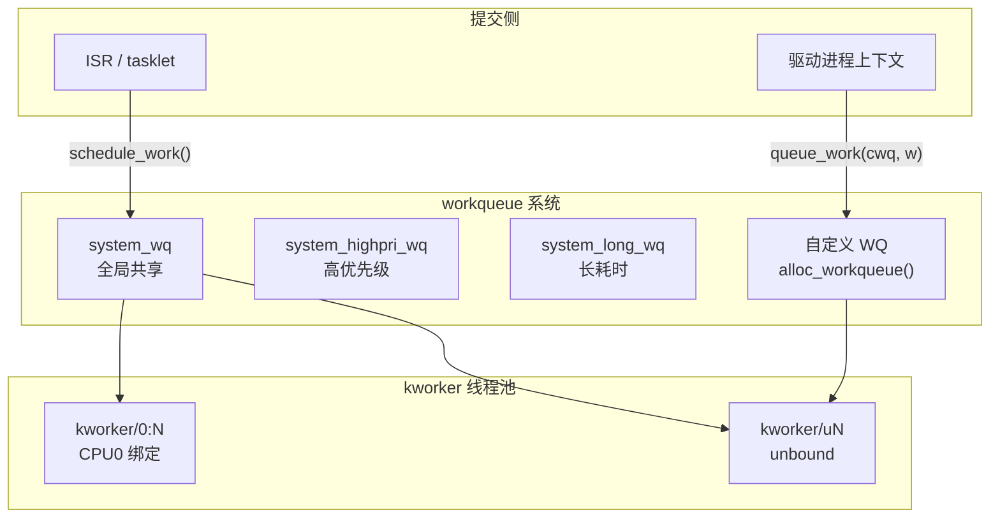

# workqueue：内核延迟进程上下文执行

> [!note]
> **Ref:** [`sdk/Linux-4.9.88/include/linux/workqueue.h`](../../../sdk/100ask_imx6ull-sdk/Linux-4.9.88/include/linux/workqueue.h), [`sdk/Linux-4.9.88/kernel/workqueue.c`](../../../sdk/100ask_imx6ull-sdk/Linux-4.9.88/kernel/workqueue.c)

## 1. 体系结构（CMWQ）

Linux 4.x 使用 **Concurrency Managed Workqueue** 架构：



- 每个 CPU 维护一个 worker pool（普通 + 高优先级）
- kworker 数量动态扩缩：有 worker 睡眠（等待 I2C）时自动创建新 worker
- `WQ_UNBOUND` 的 work 由全局 pool 处理，调度器可跨 CPU 迁移

---

## 2. 核心数据结构

```c
/* include/linux/workqueue.h */
typedef void (*work_func_t)(struct work_struct *work);

struct work_struct {
    atomic_long_t  data;    /* 状态标志 + pool_workqueue 指针 */
    struct list_head entry; /* 工作队列链表节点 */
    work_func_t    func;    /* 工作函数 */
};

struct delayed_work {
    struct work_struct      work;   /* 内嵌 work_struct */
    struct timer_list       timer;  /* 延迟触发定时器 */
    struct workqueue_struct *wq;
};
```

### container_of 反向取回驱动结构体

```c
struct my_dev {
    struct work_struct  rx_work;
    char                rx_buf[256];
};

static void rx_work_fn(struct work_struct *work)
{
    struct my_dev *dev = container_of(work, struct my_dev, rx_work);
    process_rx_data(dev);
}
```

---

## 3. work_struct API

```c
/* 初始化 */
DECLARE_WORK(my_work, my_work_fn);         /* 静态 */
INIT_WORK(&dev.rx_work, rx_work_fn);       /* 动态（嵌入结构体时）*/

/* 提交 */
schedule_work(&work);                      /* 提交到 system_wq */
queue_work(my_wq, &work);                  /* 提交到指定 WQ */

/* 同步与取消 */
flush_work(&work);                         /* 等待执行完成 */
cancel_work_sync(&work);                   /* 取消 + 等待完成 */
work_pending(&work);                       /* 是否在队列中 */
```

---

## 4. delayed_work

结合定时器与 workqueue：N 毫秒后在进程上下文执行。

```c
/* 初始化 */
INIT_DELAYED_WORK(&dev->poll_work, poll_work_fn);

/* 调度 */
schedule_delayed_work(&dev->poll_work, msecs_to_jiffies(200));
queue_delayed_work(my_wq, &dev->poll_work, msecs_to_jiffies(200));

/* 防抖：重置到期时间（与 mod_timer 等价但在进程上下文执行）*/
mod_delayed_work(system_wq, &dev->debounce_work, msecs_to_jiffies(20));

/* 取消 */
cancel_delayed_work_sync(&dev->poll_work);
```

---

## 5. 自定义 workqueue

**何时需要：** 执行时间长（避免阻塞 system_wq）、需串行保证（`max_active=1`）、需高优先级。

```c
struct workqueue_struct *my_wq;

/* 创建：max_active=1 强制串行 */
my_wq = alloc_workqueue("my_drv_wq", WQ_UNBOUND | WQ_MEM_RECLAIM, 1);

/* 常用标志 */
WQ_UNBOUND      /* 不绑定 CPU（推荐）*/
WQ_HIGHPRI      /* 高优先级 kworker */
WQ_MEM_RECLAIM  /* 保证内存压力下仍可执行（驱动推荐）*/
WQ_FREEZABLE    /* 系统挂起时冻结工作 */

/* 销毁（等待 pending work 完成后销毁）*/
destroy_workqueue(my_wq);
```

---

## 6. 完整驱动示例：ISR → I2C 数据读取

```c
struct sensor_dev {
    struct i2c_client       *client;
    struct workqueue_struct *wq;
    struct work_struct       data_work;
    wait_queue_head_t        read_wq;
    u8                       data[6];
    int                      data_ready;
};

/* workqueue 工作函数（进程上下文，可睡眠）*/
static void sensor_data_work(struct work_struct *work)
{
    struct sensor_dev *dev = container_of(work, struct sensor_dev, data_work);
    i2c_master_recv(dev->client, dev->data, sizeof(dev->data));
    dev->data_ready = 1;
    wake_up_interruptible(&dev->read_wq);
}

/* ISR（不做 I2C，只调度 workqueue）*/
static irqreturn_t sensor_isr(int irq, void *dev_id)
{
    struct sensor_dev *dev = dev_id;
    queue_work(dev->wq, &dev->data_work);
    return IRQ_HANDLED;
}

/* probe */
INIT_WORK(&dev->data_work, sensor_data_work);
dev->wq = alloc_workqueue("sensor_wq", WQ_UNBOUND | WQ_MEM_RECLAIM, 1);
devm_request_irq(&client->dev, client->irq, sensor_isr,
                 IRQF_TRIGGER_FALLING, "sensor", dev);

/* remove */
cancel_work_sync(&dev->data_work);
destroy_workqueue(dev->wq);
```
