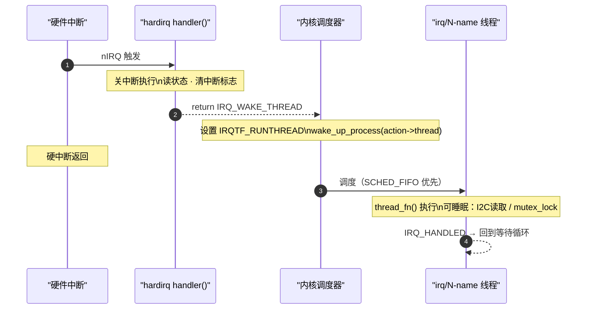
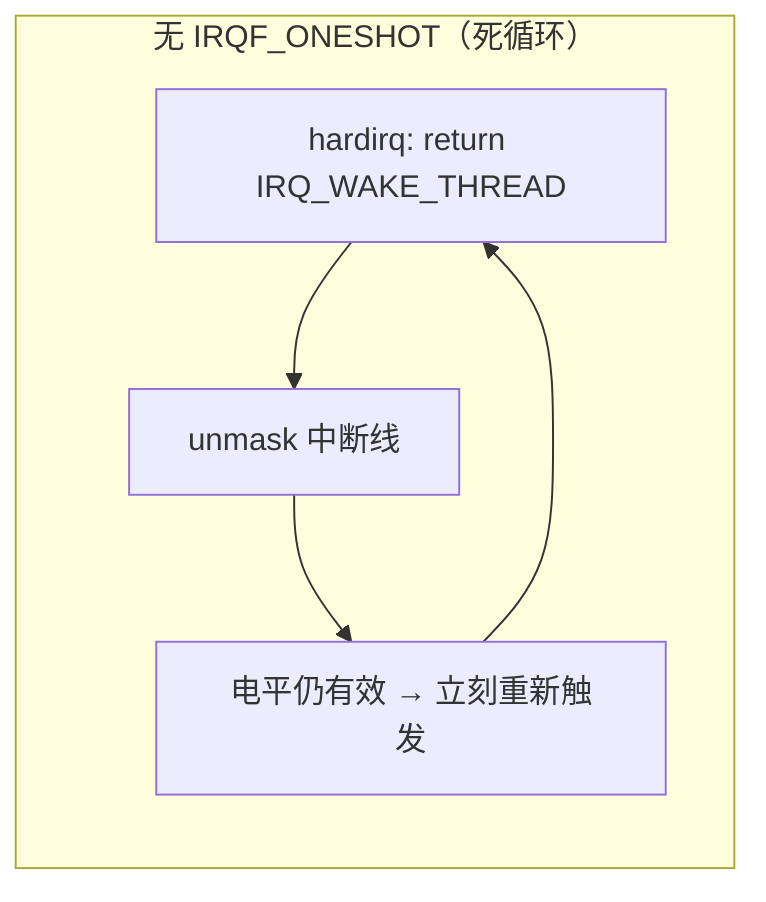
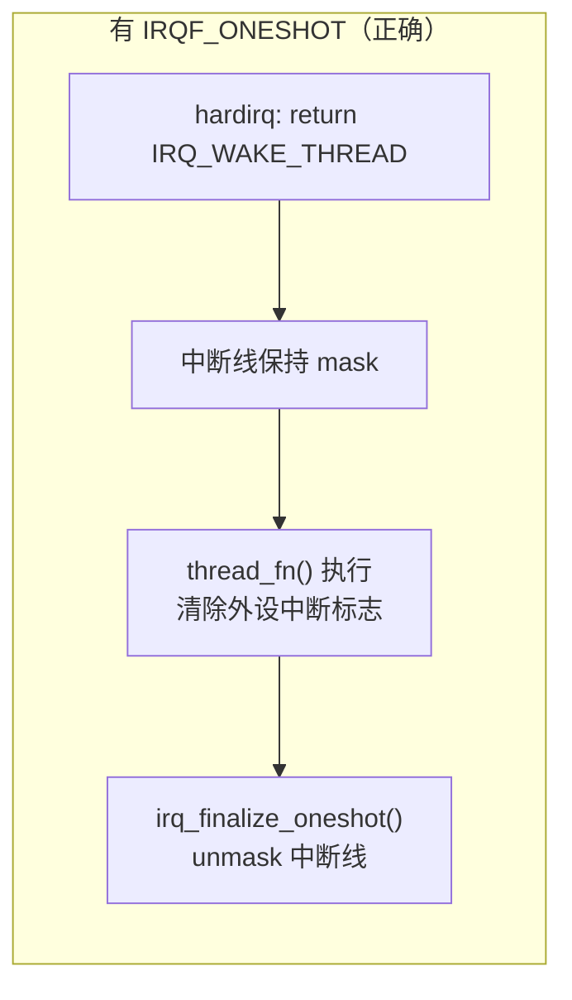

# 线程化IRQ：内核实现机制

> [!note]
> **Ref:** [`sdk/Linux-4.9.88/kernel/irq/manage.c`](../../../sdk/100ask_imx6ull-sdk/Linux-4.9.88/kernel/irq/manage.c), [`sdk/Linux-4.9.88/include/linux/interrupt.h`](../../../sdk/100ask_imx6ull-sdk/Linux-4.9.88/include/linux/interrupt.h)

## 1. 与 workqueue 的关键差异

| | threaded IRQ | workqueue |
|--|-------------|-----------|
| 线程 | 每个 irqaction **专属**线程 | 共享 kworker 线程池 |
| 调度策略 | `SCHED_FIFO` prio=50（实时）| `SCHED_NORMAL`（普通）|
| 唤醒路径 | hardirq → `wake_up_process` 直接唤醒 | hardirq → work 入队 → kworker 竞争 |
| 延迟 | 更低（实时线程优先调度）| 更高 |
| 适用 | 中断有实时性要求（传感器/触摸屏）| 通用延迟工作 |

---

## 2. API

```c
int request_threaded_irq(
    unsigned int   irq,        /* Linux 虚拟中断号 */
    irq_handler_t  handler,    /* 上半部（hardirq context），可为 NULL */
    irq_handler_t  thread_fn,  /* 下半部（irq/N 线程 context）*/
    unsigned long  flags,      /* IRQF_* 标志 */
    const char     *name,
    void           *dev_id);
```

---

## 3. 内核实现：线程创建

`__setup_irq()` 内部为有 `thread_fn` 的 irqaction 创建专属内核线程：

```c
/* kernel/irq/manage.c */
static int setup_irq_thread(struct irqaction *new, unsigned int irq,
                            bool secondary)
{
    struct task_struct *t;
    /* 创建线程，命名如 "irq/35-uart1" */
    t = kthread_create(irq_thread, new, "irq/%d-%s", irq, new->name);

    /* 设置为实时调度 SCHED_FIFO，优先级 50 */
    struct sched_param param = { .sched_priority = MAX_USER_RT_PRIO / 2 };
    sched_setscheduler_nocheck(t, SCHED_FIFO, &param);

    new->thread = t;
    wake_up_process(t);   /* 启动后立即进入等待 */
}
```

---

## 4. irq_thread() 主循环

线程启动后进入等待-执行循环，由上半部的 `IRQ_WAKE_THREAD` 返回值唤醒：

```c
/* kernel/irq/manage.c: 简化 */
static int irq_thread(void *data)
{
    struct irqaction *action = data;

    while (!irq_wait_for_interrupt(action)) {
        /* 被唤醒：执行下半部 */
        irq_thread_fn(action, action->dev_id);
    }
    return 0;
}

static int irq_wait_for_interrupt(struct irqaction *action)
{
    set_current_state(TASK_INTERRUPTIBLE);

    /* 检查 IRQTF_RUNTHREAD 标志（由上半部设置）*/
    if (!test_and_clear_bit(IRQTF_RUNTHREAD, &action->thread_flags))
        schedule();   /* 无待处理，睡眠让出 CPU */

    __set_current_state(TASK_RUNNING);
    return 0;
}
```



---

## 5. IRQF_ONESHOT 防重入

**问题：** 电平触发中断，hardirq 返回后中断线默认会 unmask。若 thread_fn 尚未清除外设标志，电平仍然有效 → 立刻再次触发硬中断 → 死循环。





内核实现：`irq_thread_fn()` 返回后调用 `irq_finalize_oneshot()` 执行延迟 unmask：

```c
/* kernel/irq/manage.c */
static void irq_finalize_oneshot(struct irq_desc *desc,
                                 struct irqaction *action)
{
    if (!(desc->istate & IRQS_ONESHOT))
        return;
    /* 共享中断：所有 thread 完成后才 unmask */
    desc->threads_oneshot &= ~action->thread_mask;
    if (desc->threads_oneshot)
        return;
    chip_bus_lock(desc);
    irq_chip_unmask_parent(desc);   /* 真正 unmask */
    chip_bus_sync_unlock(desc);
}
```

---

## 6. handler=NULL 快捷方式

若上半部无需任何操作，可传 `handler=NULL`，内核自动补充默认 handler：

```c
/* kernel/irq/manage.c: __setup_irq() 内部 */
if (!handler) {
    handler = irq_default_primary_handler;  /* 仅返回 IRQ_WAKE_THREAD */
    irqflags |= IRQF_ONESHOT;              /* 强制添加 ONESHOT */
}
```

驱动常用写法：

```c
/* 完全省略上半部，全部逻辑在线程中处理 */
request_threaded_irq(irq, NULL, sensor_thread_fn,
                     IRQF_TRIGGER_FALLING | IRQF_ONESHOT,
                     "my-sensor", dev);
```

---

## 7. 驱动模板

```c
struct sensor_dev {
    struct i2c_client *client;
    u8                 buf[6];
    ktime_t            timestamp;
};

/* 上半部（可选，记录精确时间戳）*/
static irqreturn_t sensor_hardirq(int irq, void *dev_id)
{
    struct sensor_dev *dev = dev_id;
    dev->timestamp = ktime_get();
    return IRQ_WAKE_THREAD;
}

/* 下半部（进程上下文，可睡眠）*/
static irqreturn_t sensor_thread_fn(int irq, void *dev_id)
{
    struct sensor_dev *dev = dev_id;
    i2c_master_recv(dev->client, dev->buf, sizeof(dev->buf));
    input_report_abs(dev->input, ABS_X, (dev->buf[0] << 8) | dev->buf[1]);
    input_sync(dev->input);
    return IRQ_HANDLED;
}

/* probe */
devm_request_threaded_irq(&client->dev, client->irq,
                          sensor_hardirq, sensor_thread_fn,
                          IRQF_TRIGGER_FALLING | IRQF_ONESHOT,
                          "my-sensor", dev);
/* devm_ 前缀：设备卸载时自动 free_irq */
```
