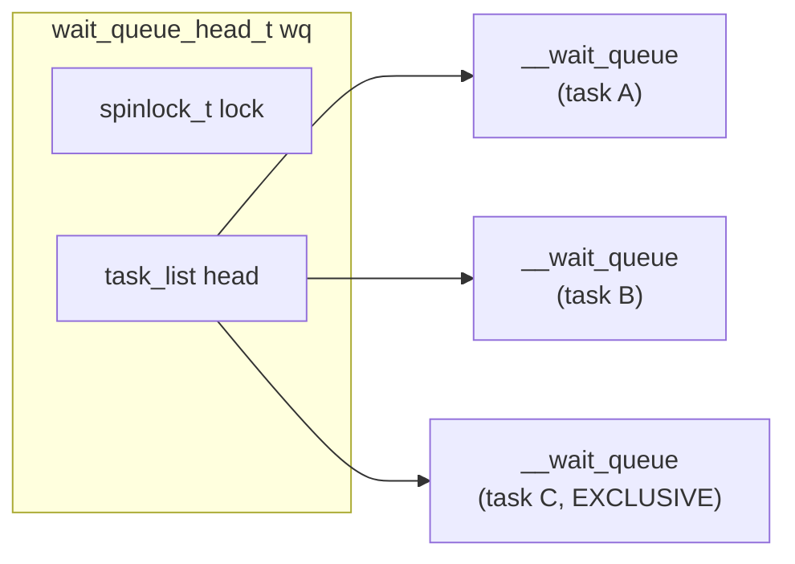
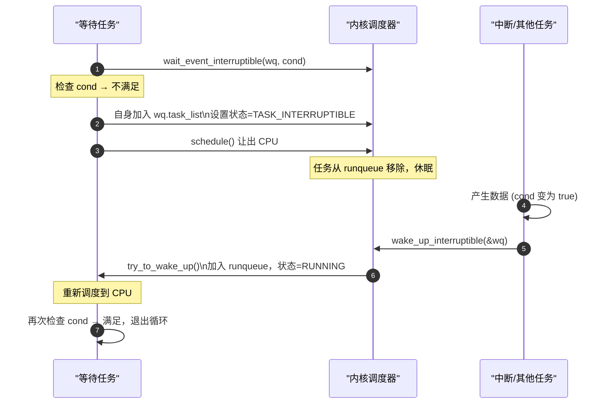

# wait_queue：内核睡眠与唤醒机制

> [!note]
> **Ref:** [`sdk/Linux-4.9.88/include/linux/wait.h`](../../../sdk/100ask_imx6ull-sdk/Linux-4.9.88/include/linux/wait.h), [`sdk/Linux-4.9.88/kernel/sched/wait.c`](../../../sdk/100ask_imx6ull-sdk/Linux-4.9.88/kernel/sched/wait.c)

## 1. 核心数据结构

```c
/* include/linux/wait.h */

/* 等待队列节点：代表一个正在等待的任务 */
struct __wait_queue {
    unsigned int       flags;       /* WQ_FLAG_EXCLUSIVE: 独占唤醒标志 */
    void              *private;     /* 通常指向 task_struct（等待的任务）*/
    wait_queue_func_t  func;        /* 唤醒回调（默认：try_to_wake_up）*/
    struct list_head   task_list;   /* 挂入 wait_queue_head 的链表节点 */
};

/* 等待队列头：挂载所有等待者，配一把 spinlock 保护 */
struct __wait_queue_head {
    spinlock_t       lock;
    struct list_head task_list;   /* 等待节点链表 */
};
typedef struct __wait_queue_head wait_queue_head_t;
```



---

## 2. 初始化

```c
/* 静态声明（全局/模块级）*/
DECLARE_WAIT_QUEUE_HEAD(my_wq);

/* 动态初始化（嵌入结构体时）*/
wait_queue_head_t my_wq;
init_waitqueue_head(&my_wq);
```

---

## 3. 等待侧 API（进程进入睡眠）

所有 `wait_event*` 宏的本质：**检查条件 → 条件不满足则睡眠 → 被唤醒后再次检查**（循环）。

```c
/* 不可中断睡眠（TASK_UNINTERRUPTIBLE）
 * 无返回值，不能被信号打断 — 慎用，会贡献 D 状态 */
wait_event(wq_head, condition);

/* 可中断睡眠（TASK_INTERRUPTIBLE）— 驱动首选
 * 返回 0：条件满足正常唤醒
 * 返回 -ERESTARTSYS：被信号中断 */
int ret = wait_event_interruptible(wq_head, condition);

/* 带超时的可中断睡眠
 * 返回 >0：剩余 jiffies（正常唤醒）
 * 返回 0：超时
 * 返回 -ERESTARTSYS：信号中断 */
long ret = wait_event_interruptible_timeout(wq_head, condition,
                                            msecs_to_jiffies(500));

/* 带超时，不可中断 */
long ret = wait_event_timeout(wq_head, condition, timeout);
```

> **condition 参数**：一个 C 表达式（如 `buf->count > 0`），内核在每次唤醒后重新求值。**必须是无副作用的表达式**（可能被多次执行）。这是 **while 循环**，不是 if。

---

## 4. 唤醒侧 API（中断/其他任务触发）

```c
/* 唤醒一个等待者（非独占）+ 所有 EXCLUSIVE 等待者中的第一个 */
wake_up(&wq_head);

/* 唤醒所有等待者（包括所有 EXCLUSIVE）*/
wake_up_all(&wq_head);

/* 只唤醒 TASK_INTERRUPTIBLE 状态的等待者（对应 wait_event_interruptible）*/
wake_up_interruptible(&wq_head);

/* 只唤醒一个 TASK_INTERRUPTIBLE 等待者 */
wake_up_interruptible_sync(&wq_head);  /* 不触发调度，稍后调度 */
```

**`wake_up` vs `wake_up_interruptible` 对比：**

| API | 唤醒 UNINTERRUPTIBLE | 唤醒 INTERRUPTIBLE |
|-----|:---:|:---:|
| `wake_up` | ✓ | ✓ |
| `wake_up_interruptible` | ✗ | ✓ |

> 一般原则：等待侧用 `wait_event_interruptible`，唤醒侧用 `wake_up_interruptible`，**保持对称**。

---

## 5. wait_event 底层实现原理



---

## 6. 独占等待（WQ_FLAG_EXCLUSIVE）

**问题：** `wake_up_all()` 唤醒所有等待者，但只有一个能获得资源，其余重新睡眠 → **惊群效应（Thundering Herd）**。

**解决：** 使用独占等待，每次 `wake_up` 只精确唤醒**一个** EXCLUSIVE 等待者。

```c
/* 独占等待：进入队列尾部，唤醒时只唤醒一个 */
wait_event_interruptible_exclusive(wq_head, condition);

/* 手动操作（低级 API）*/
DEFINE_WAIT(wait);
wait.flags |= WQ_FLAG_EXCLUSIVE;
prepare_to_wait_exclusive(&wq_head, &wait, TASK_INTERRUPTIBLE);
// ... 检查条件 ...
schedule();
finish_wait(&wq_head, &wait);
```

---

## 7. 驱动典型模式：字符设备读等待

```c
struct my_dev {
    wait_queue_head_t read_wq;    /* 读等待队列 */
    char              buf[256];
    int               buf_len;    /* 有数据时 > 0 */
    spinlock_t        lock;
};

/* --- 中断 ISR：数据到达，唤醒读者 --- */
static irqreturn_t my_isr(int irq, void *dev_id)
{
    struct my_dev *dev = dev_id;
    unsigned long flags;

    spin_lock_irqsave(&dev->lock, flags);
    dev->buf_len = receive_data(dev->buf);  /* 读取硬件FIFO */
    spin_unlock_irqrestore(&dev->lock, flags);

    wake_up_interruptible(&dev->read_wq);   /* 唤醒等待的 read() */
    return IRQ_HANDLED;
}

/* --- read() 系统调用：等待数据 --- */
static ssize_t my_read(struct file *filp, char __user *ubuf,
                       size_t count, loff_t *ppos)
{
    struct my_dev *dev = filp->private_data;
    int ret;

    /* 等待数据就绪，可被信号中断 */
    ret = wait_event_interruptible(dev->read_wq, dev->buf_len > 0);
    if (ret)
        return -ERESTARTSYS;   /* 被信号打断，告知 libc 重试 */

    /* 数据就绪，copy 给用户 */
    ret = min((size_t)dev->buf_len, count);
    if (copy_to_user(ubuf, dev->buf, ret))
        return -EFAULT;

    dev->buf_len = 0;
    return ret;
}

/* --- poll/select 支持 --- */
static __poll_t my_poll(struct file *filp, poll_table *wait)
{
    struct my_dev *dev = filp->private_data;

    /* 把等待队列注册到 poll_table（epoll 监听用）*/
    poll_wait(filp, &dev->read_wq, wait);

    if (dev->buf_len > 0)
        return POLLIN | POLLRDNORM;
    return 0;
}
```

---

## 8. 与 completion 的对比

| | `wait_queue` | `completion` |
|--|---|---|
| 适用场景 | 等待**可变条件**（数据就绪、资源可用）| 等待**一次性事件**（初始化完成、IO完成）|
| condition | 任意 bool 表达式 | 内部计数器 |
| 多次复用 | 天然支持 | 需 `reinit_completion()` |
| 超时 | `wait_event_timeout` | `wait_for_completion_timeout` |
| 推荐 | 数据流、生产者-消费者 | 同步两个任务的单次完成点 |
