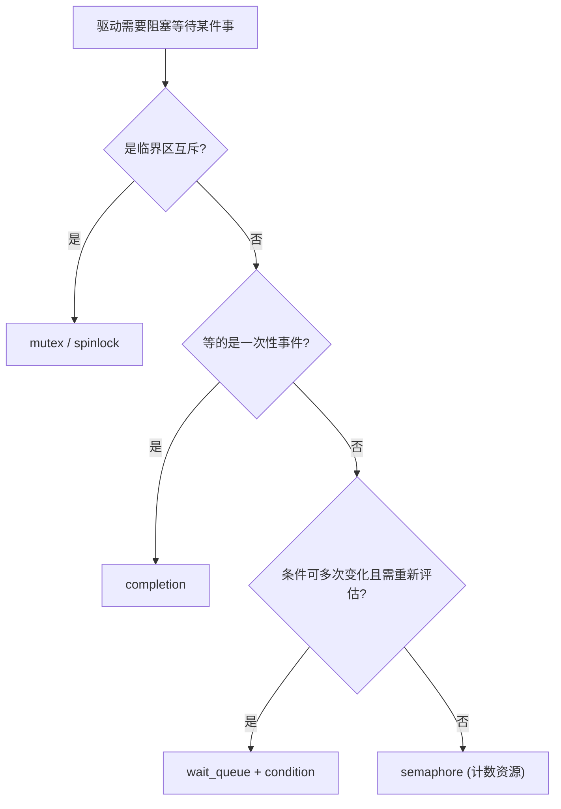
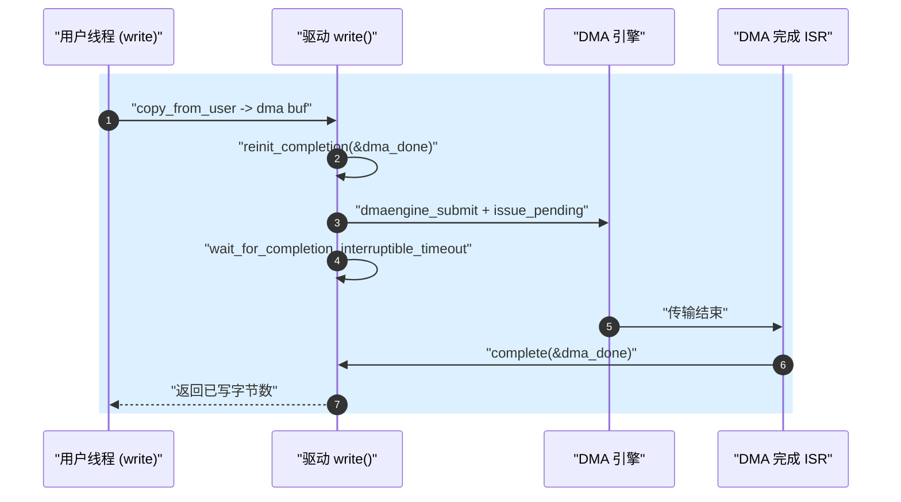

# Completion 一次性同步原语

> [!note]
> **Ref:** [`include/linux/completion.h`](../../../sdk/100ask_imx6ull-sdk/Linux-4.9.88/include/linux/completion.h)，[`kernel/sched/completion.c`](../../../sdk/100ask_imx6ull-sdk/Linux-4.9.88/kernel/sched/completion.c)，[`include/linux/wait.h`](../../../sdk/100ask_imx6ull-sdk/Linux-4.9.88/include/linux/wait.h)，LDD3 Chapter 5 / kernel Documentation/scheduler/completion.txt

## 1. 为什么需要 completion

驱动开发中经常遇到这样的场景：线程 A 要等待“某件事发生一次”，而线程 B（或中断上半部/下半部）在事件发生时唤醒 A。例如：

- `probe()` 启动硬件初始化序列，需要等待硬件自检完成中断。
- 启动一个 kthread，主线程等它跑到某一初始化点后再继续。
- 提交一次 DMA 传输，等待 DMA 完成中断把数据取回。
- `module_init` 中触发 firmware 加载，等待异步回调结束。

这类需求的本质是 **一次性的生产者-消费者同步（one-shot event）**：不是保护临界区（那是 spinlock/mutex 的事），也不是表达“某个条件持续成立”（那是 wait_queue 要解决的），而是“等一个 flag 从 0 变成 1”。

历史上 Linus 写过一段时间用 `struct semaphore` 初始化为 0 来做这件事，但这有 race：当 `up()` 发生在 `down()` 进入之前、且任务正在销毁栈上的 semaphore 时，`up()` 还在访问已释放内存。于是 Ingo Molnar 在 2.4.7 引入了 `struct completion`，专门干这一件事。

## 2. 数据结构

完整定义非常精简，见 `include/linux/completion.h:25`：

```c
struct completion {
    unsigned int done;
    wait_queue_head_t wait;
};
```

- `done`：事件计数。`complete()` 每次 `done++`，`wait_for_completion()` 每次消耗一个。
- `wait`：底层仍然是一个 wait_queue_head，等待者都挂在这里。

所以 completion **本质上是 wait_queue 的薄封装**：它把“条件变量”固化为一个计数字段，把“等待/唤醒的 race”封装进锁序里，对使用者只暴露“发信号 / 等信号”两个动作。

## 3. 初始化与使用 API

```c
/* 静态声明（file scope）*/
DECLARE_COMPLETION(my_done);

/* 栈上变量：lockdep 下走特殊变体 */
DECLARE_COMPLETION_ONSTACK(my_done);

/* 动态初始化（kmalloc 出来的 struct 里）*/
init_completion(&dev->done);

/* 复用：complete_all 之后必须 reinit */
reinit_completion(&dev->done);
```

等待端（必须是可睡眠上下文）：

| API | 行为 |
| --- | --- |
| `wait_for_completion(x)` | 不可中断睡眠直到 `done > 0` |
| `wait_for_completion_interruptible(x)` | 可被信号打断，返回 `-ERESTARTSYS` |
| `wait_for_completion_killable(x)` | 仅致命信号可打断 |
| `wait_for_completion_timeout(x, jiffies)` | 带超时，返回剩余 jiffies，0 表示超时 |
| `wait_for_completion_io(x)` | 计入 iowait 统计，体现给 loadavg |
| `try_wait_for_completion(x)` | 非阻塞试取，返回 bool |
| `completion_done(x)` | 仅查询，不修改状态 |

通知端（可在中断/softirq/进程上下文调用）：

| API | 语义 |
| --- | --- |
| `complete(x)` | `done++` 并唤醒 **一个** 等待者 |
| `complete_all(x)` | `done` 置为 `UINT_MAX/2`，唤醒 **所有** 等待者，此后所有后续 `wait_for_completion` 立刻返回；复用前必须 `reinit_completion` |

## 4. kernel/sched/completion.c 源码骨架

```c
void complete(struct completion *x)
{
    unsigned long flags;

    spin_lock_irqsave(&x->wait.lock, flags);
    if (x->done != UINT_MAX)
        x->done++;
    __wake_up_locked(&x->wait, TASK_NORMAL, 1);
    spin_unlock_irqrestore(&x->wait.lock, flags);
}

void complete_all(struct completion *x)
{
    unsigned long flags;

    spin_lock_irqsave(&x->wait.lock, flags);
    x->done = UINT_MAX;
    __wake_up_locked(&x->wait, TASK_NORMAL, 0);
    spin_unlock_irqrestore(&x->wait.lock, flags);
}

static inline long __sched
do_wait_for_common(struct completion *x, long (*action)(long), long timeout, int state)
{
    if (!x->done) {
        DECLARE_WAITQUEUE(wait, current);
        __add_wait_queue_tail_exclusive(&x->wait, &wait);
        do {
            if (signal_pending_state(state, current)) { ... }
            __set_current_state(state);
            spin_unlock_irq(&x->wait.lock);
            timeout = action(timeout);
            spin_lock_irq(&x->wait.lock);
        } while (!x->done && timeout);
        __remove_wait_queue(&x->wait, &wait);
        if (!x->done) return timeout;
    }
    if (x->done != UINT_MAX)
        x->done--;
    return timeout ?: 1;
}
```

关键点：

1. **wait_queue_head::lock** 同时保护 `done` 字段与队列本身 —— 消除了“check then sleep”的经典 race。
2. `__add_wait_queue_tail_exclusive` 使得 `complete()` 每次唤醒的是 **独占等待者**，与 FIFO 语义配合，避免 thundering herd。
3. `complete_all` 把 `done` 钉在 `UINT_MAX`，之后 `do_wait_for_common` 里的 `done--` 分支 **跳过**（有 `!= UINT_MAX` 判断，位于 `complete()`），因此永久“已完成”状态。

## 5. 与 semaphore / wait_queue 的选型对比



| 维度 | `completion` | `wait_queue_head` | `semaphore` |
| --- | --- | --- | --- |
| 语义 | 一次性事件 done flag | 任意布尔条件 | 计数资源 |
| 复用 | `reinit_completion` | 天生可复用 | 天生可复用 |
| 栈上分配安全 | 是（`_ONSTACK`） | 是 | 有 race，被弃用 |
| 可中断变体 | 有 | 需自己写 `wait_event_interruptible` | `down_interruptible` |
| 典型场景 | probe 等硬件、DMA 完成、kthread 启动握手 | ring buffer 非空/非满 | 槽位/令牌资源池 |

一句话判定：**“我只想等这件事发生过一次”** → completion；**“我要反复检查某个条件”** → wait_queue；**“我有 N 个可用资源要分配”** → semaphore。

## 6. 经典模式

### 6.1 kthread 启动握手

```c
static DECLARE_COMPLETION(worker_ready);

static int worker_fn(void *data)
{
    /* ... 初始化 ... */
    complete(&worker_ready);
    while (!kthread_should_stop()) { /* work */ }
    return 0;
}

static int __init my_init(void)
{
    task = kthread_run(worker_fn, NULL, "my_worker");
    wait_for_completion(&worker_ready); /* 确保 worker 已跑到点 */
    return 0;
}
```

### 6.2 ISR 通知 probe

```c
struct mydev {
    struct completion hw_ready;
    void __iomem *base;
};

static irqreturn_t mydev_isr(int irq, void *dev_id)
{
    struct mydev *d = dev_id;
    u32 sts = readl(d->base + STATUS);
    if (sts & SELFTEST_DONE) {
        writel(sts, d->base + STATUS); /* W1C */
        complete(&d->hw_ready);
    }
    return IRQ_HANDLED;
}

static int mydev_probe(struct platform_device *pdev)
{
    struct mydev *d = devm_kzalloc(&pdev->dev, sizeof(*d), GFP_KERNEL);
    init_completion(&d->hw_ready);
    /* ... ioremap, request_irq ... */
    writel(START_SELFTEST, d->base + CTRL);
    if (!wait_for_completion_timeout(&d->hw_ready, msecs_to_jiffies(500))) {
        dev_err(&pdev->dev, "hw self-test timeout\n");
        return -ETIMEDOUT;
    }
    return 0;
}
```

### 6.3 DMA 完成



## 7. 常见陷阱

- **栈上 completion 必须用 `DECLARE_COMPLETION_ONSTACK`**，否则 lockdep key 会是全局同一把，虚假报死锁。
- **`complete_all` 之后一定要 `reinit_completion`** 才能再次使用，否则 `done` 永远非零，后续等待不会阻塞。
- **`wait_for_completion` 不要在原子上下文调用**（中断、持自旋锁、软中断）——它会睡眠。通知端 `complete()` 则可以在中断里调。
- **超时版本的返回值** 是“剩余 jiffies”，`0` 表示超时，非 0 表示在超时前被唤醒；不要误当错误码。
- 如果对端可能在你之前就 `complete()` 了，**这没关系**：`done` 已是 1，后续 `wait_for_completion` 会立即返回。这正是 completion 相对“裸 wait_queue + 条件变量”的最大好处。

## 8. 与 wait_queue 笔记的衔接

参见 [`05-wait-queue.md`](./05-wait-queue.md)：completion 可以视作 wait_queue 的一个特例封装——把“条件”固定为 `done > 0`，把锁与唤醒序列打包好。学会 wait_queue 后再读 `kernel/sched/completion.c`，会发现它只有不到 300 行却覆盖了所有变体，是理解“如何正确写阻塞原语”的极好样本。
