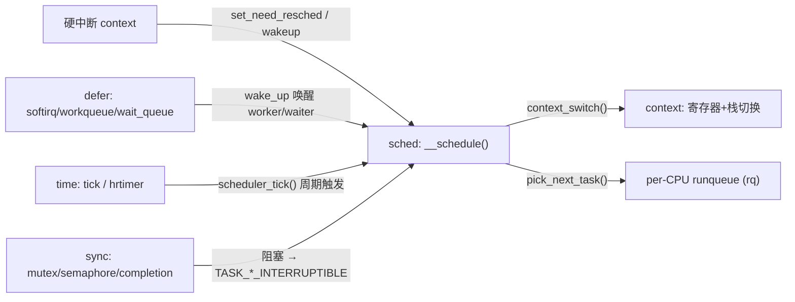
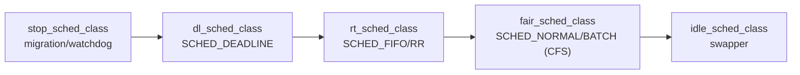
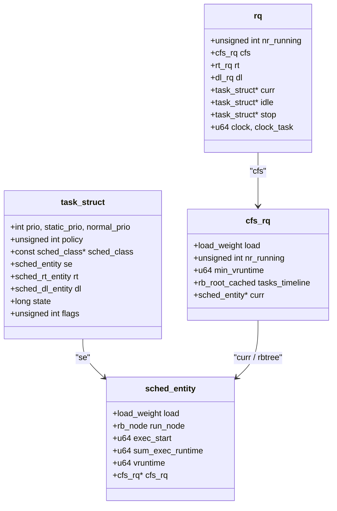
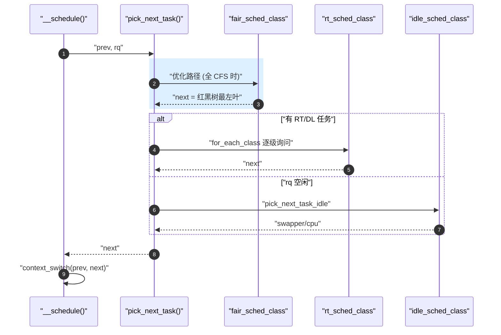

# 调度器子域总览

> [!note]
> **Ref:** [`kernel/sched/core.c`](../../../sdk/100ask_imx6ull-sdk/Linux-4.9.88/kernel/sched/core.c), [`kernel/sched/sched.h`](../../../sdk/100ask_imx6ull-sdk/Linux-4.9.88/kernel/sched/sched.h), [`kernel/sched/fair.c`](../../../sdk/100ask_imx6ull-sdk/Linux-4.9.88/kernel/sched/fair.c), [`include/linux/sched.h`](../../../sdk/100ask_imx6ull-sdk/Linux-4.9.88/include/linux/sched.h)

## 1. 调度器在内核全景中的位置

调度器不是一个独立王国，它是把 **中断上下文、延迟执行、时间子系统、同步原语** 这些机制"兑现"成 CPU 时间的地方。下图给出 `sched` 与相邻子域的关系：



要点：
- **defer 子域的睡眠**最终都落到 `schedule()`（见 [`defer/05-wait-queue.md`](../defer/05-wait-queue.md)）。
- **唤醒**则是 `try_to_wake_up()` 入队 + 设置 `TIF_NEED_RESCHED`，**真正的切换**发生在下一个 preempt point（见 [`context/00-overview.md`](../context/00-overview.md) §6 的检查点表）。
- **时间**子系统通过 `scheduler_tick()` 给当前 CFS 实体扣账、检查是否需要抢占。

## 2. `sched_class` 五大类优先级链

Linux 4.9.88 的调度类以静态链表形式按优先级串起，`pick_next_task()` 从最高优先级开始询问"你有没有可运行的任务"，直到有人回应为止。



源码中链式声明见 `kernel/sched/sched.h`：

```c
#define sched_class_highest (&stop_sched_class)
#define for_each_class(class) \
   for (class = sched_class_highest; class; class = class->next)

extern const struct sched_class stop_sched_class;
extern const struct sched_class dl_sched_class;
extern const struct sched_class rt_sched_class;
extern const struct sched_class fair_sched_class;
extern const struct sched_class idle_sched_class;
```

每个类都实现同一组回调：`enqueue_task / dequeue_task / pick_next_task / put_prev_task / check_preempt_curr / task_tick / ...`。这就是"调度类"的多态接口——驱动开发者看到 `p->sched_class->enqueue_task(rq, p, flags)` 这一行，心里要立即浮现上面这张表。

## 3. 核心数据结构总览



几条必须刻进肌肉记忆的事实：
- `rq` 是 **per-CPU** 的，`this_rq() / cpu_rq(cpu)` 拿到本 CPU 的运行队列。
- CFS 的可运行实体挂在红黑树 `cfs_rq.tasks_timeline` 上，键是 `vruntime`（虚拟运行时间）。
- `task_struct.state` 是一个位图：`TASK_RUNNING(0)`、`TASK_INTERRUPTIBLE(1)`、`TASK_UNINTERRUPTIBLE(2)`…… 睡眠/唤醒路径的全部问题都围绕它和 `on_rq` 展开。
- `task_struct.sched_class` 是函数指针表，决定这个任务被 CFS、RT 还是 DL 管理。

## 4. `__schedule()` 主循环骨架

`kernel/sched/core.c:3333`：

```c
static void __sched notrace __schedule(bool preempt)
{
    struct task_struct *prev, *next;
    struct rq *rq;
    int cpu;

    cpu  = smp_processor_id();
    rq   = cpu_rq(cpu);
    prev = rq->curr;

    /* 1. 关抢占 + 上锁 rq */
    /* 2. 若 prev 因睡眠进入 __schedule，则 deactivate_task(): 从 rq 摘除 */
    /* 3. pick_next_task(rq, prev, cookie) —— 按 sched_class 链询问 */
    next = pick_next_task(rq, prev, cookie);
    clear_tsk_need_resched(prev);

    if (likely(prev != next)) {
        rq->nr_switches++;
        rq->curr = next;
        /* 4. 真正的切换点 —— 见 context/00-overview.md */
        rq = context_switch(rq, prev, next, cookie);
    } else {
        /* 没得选，prev 继续跑 */
        lockdep_unpin_lock(&rq->lock, cookie);
        raw_spin_unlock_irq(&rq->lock);
    }
}
```

配合上面调度类链理解 `pick_next_task`：



`schedule()` 是对 `__schedule(false)` 的用户态/内核态可重入包装；抢占路径走 `preempt_schedule() → __schedule(true)`。

## 5. 子域笔记导航

| 文件 | 主题 | 状态 |
|------|------|------|
| `00-overview.md` | 本文：子域入口、优先级链、主循环骨架 | 本文 |
| [`01-sched_class-CFS.md`](./01-sched_class-CFS.md) | `sched_class` 多态接口、CFS `vruntime` 红黑树、`pick_next_task` 路径 | 已就位 |
| [`02-runqueue-load-balance.md`](./02-runqueue-load-balance.md) | `struct rq` / per-CPU runqueue / `load_balance` / migration | 已就位 |
| [`03-preemption-models.md`](./03-preemption-models.md) | `PREEMPT_NONE/VOLUNTARY/PREEMPT/RT`、`preempt_count`、`cond_resched` | 已就位 |
| [`04-kthread-kworker.md`](./04-kthread-kworker.md) | `kthread_create/run`、`kthread_worker`、kworker pool | 已就位 |
| [`05-wake-up-path.md`](./05-wake-up-path.md) | `try_to_wake_up → enqueue_task → check_preempt_curr` 全链路 | 已就位 |

## 6. 与相邻子域的缝合点

- **`context/00-overview.md`** — `context_switch()` 是 `__schedule` 的出口；抢占点表决定 NEED_RESCHED 何时兑现。
- **`defer/05-wait-queue.md`** — `wait_event()` 家族把调用者送进 `TASK_INTERRUPTIBLE` 并调 `schedule()`；`wake_up()` 走 `05-wake-up-path.md` 的 TTWU 链路把它拉回。
- **`defer/06-completion.md`** — 完成量是 wait_queue 的薄封装，唤醒路径完全复用本子域。
- **`time/`** — `scheduler_tick()` 在 timer 中断里调用 `curr->sched_class->task_tick()`，CFS 在这里扣 `vruntime`、必要时置位 `TIF_NEED_RESCHED`。
- **`sync/`** — `mutex_lock_slowpath` / `down()` / `wait_for_completion()` 等阻塞原语都在通过 sched 兑现"等待"。

## 7. 学习路径建议

1. 先读本文，把五大调度类、`rq` 布局、`__schedule` 主循环在脑中画出来。
2. 立刻跳到 [`05-wake-up-path.md`](./05-wake-up-path.md)，因为"睡眠—唤醒"是驱动开发者最高频触达调度器的通道。
3. 然后再深入 `01-cfs.md`（红黑树 + `vruntime`）和 `03-preemption.md`（NEED_RESCHED 的生命周期）。
4. 最后 `02-runqueue.md` / `04-kthread.md` 作为补完。
