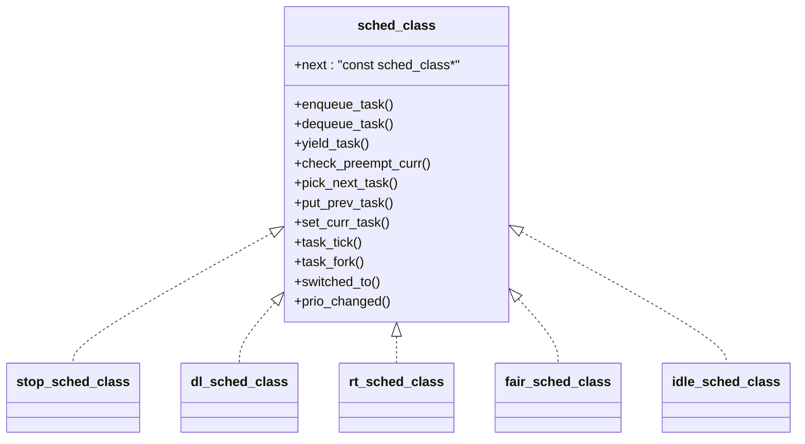
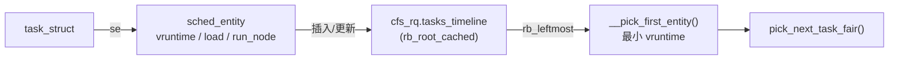
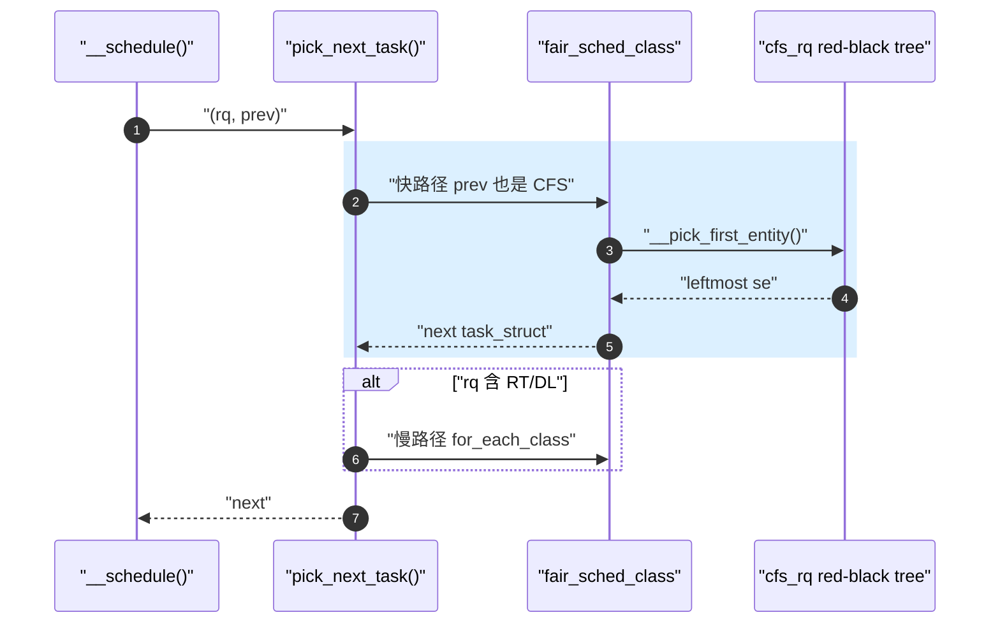

---
title: sched_class 与 CFS 调度类
tags: [kernel, sched, cfs, sched_class, vruntime, rbtree]
desc: Linux 4.9.88 的 sched_class 多态接口、CFS vruntime 红黑树与 pick_next_task_fair 路径
update: 2026-04-07

---


# sched_class 与 CFS 调度类

> [!note]
> **Ref:** [`kernel/sched/sched.h`](../../../sdk/100ask_imx6ull-sdk/Linux-4.9.88/kernel/sched/sched.h), [`kernel/sched/fair.c`](../../../sdk/100ask_imx6ull-sdk/Linux-4.9.88/kernel/sched/fair.c) (`pick_next_task_fair` @5883), [`kernel/sched/core.c`](../../../sdk/100ask_imx6ull-sdk/Linux-4.9.88/kernel/sched/core.c) (`pick_next_task` @3259), [`include/linux/sched.h`](../../../sdk/100ask_imx6ull-sdk/Linux-4.9.88/include/linux/sched.h)

## 1. sched_class：调度器多态接口

`sched_class` 是 Linux 调度器的"虚函数表"。每个调度策略 (CFS / RT / DL / Idle / Stop) 实现同一组回调，`__schedule()` 通过 `prev->sched_class->xxx()` 解耦策略与机制。



驱动开发者只需记住：**任何让任务"进入/离开 runqueue"的操作，最终都化作 `enqueue_task / dequeue_task` 这两个回调**。`wake_up()`、`mutex_unlock()`、`complete()` 全部殊途同归。

## 2. CFS 的核心抽象：sched_entity 与 vruntime

CFS (Completely Fair Scheduler) 用 **virtual runtime (`vruntime`)** 衡量"谁更亏欠 CPU"。`vruntime` 越小越优先被选中，权重 (`load.weight`) 越大 `vruntime` 增长越慢。



关键不变量：
- **红黑树键 = `vruntime`**，最左叶就是下一个被调度的 entity。
- `min_vruntime` 单调递增，作为新入队 entity 的基线，避免长睡任务一醒来就霸占 CPU。
- `update_curr()` 在每次 tick / 入队 / 出队前被调用，把当前 entity 的 `delta_exec` 折算为 `delta_vruntime = delta_exec * NICE_0_LOAD / se->load.weight` 累计到 `vruntime` 上。

## 3. pick_next_task 的快慢路径

`kernel/sched/core.c:3259 pick_next_task()` 有一个"全 CFS 优化路径"：当 `rq->nr_running == cfs_rq->h_nr_running` 时直接调 `fair_sched_class.pick_next_task`，省去逐类轮询。

```c
/* core.c:3259 */
static inline struct task_struct *
pick_next_task(struct rq *rq, struct task_struct *prev, struct pin_cookie cookie)
{
    const struct sched_class *class = &fair_sched_class;
    struct task_struct *p;

    if (likely(prev->sched_class == class &&
               rq->nr_running == rq->cfs.h_nr_replaced_running)) {
        p = fair_sched_class.pick_next_task(rq, prev, cookie);
        if (likely(p))
            return p;
    }

    for_each_class(class) {
        p = class->pick_next_task(rq, prev, cookie);
        if (p) return p;
    }
    BUG(); /* idle 类必有返回值 */
}
```



## 4. CFS 的入队/出队回调

| 回调 | 触发场景 | 关键动作 |
|------|----------|----------|
| `enqueue_task_fair` | TTWU、fork、迁移 | `update_curr()` → 把 se 插入红黑树 → `nr_running++` |
| `dequeue_task_fair` | 进入 sleep、被迁移 | `update_curr()` → 从红黑树摘除 → `nr_running--` |
| `check_preempt_wakeup` | 唤醒后判断 | 若新任务 `vruntime` 显著小于 curr，置 `TIF_NEED_RESCHED` |
| `task_tick_fair` | `scheduler_tick()` 周期 | 扣 vruntime；超 `sched_slice()` 则置 NEED_RESCHED |
| `task_fork_fair` | fork 时 | 给子进程一个略大于父的 `vruntime`，避免 fork bomb |

## 5. 与相邻笔记的缝合点

- 唤醒入队全链路 → [`05-wake-up-path.md`](./05-wake-up-path.md)
- runqueue 物理布局与 SMP 负载均衡 → [`02-runqueue-load-balance.md`](./02-runqueue-load-balance.md)
- `task_tick_fair` 的时间来源 → [`../time/00-overview.md`](../time/00-overview.md)

## 6. 小结

1. `sched_class` 是策略与机制解耦的多态接口；CFS 只是其中之一，但承载 `SCHED_NORMAL` 几乎所有任务。
2. CFS 的"公平"由 `vruntime` + 权重定义，红黑树仅是数据结构上的兑现手段。
3. `pick_next_task` 的快路径是 CFS-only 系统的高频通道，i.MX6ULL 单核场景几乎只走这一条。
