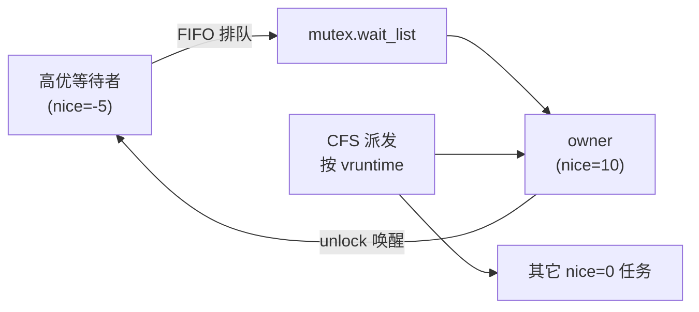
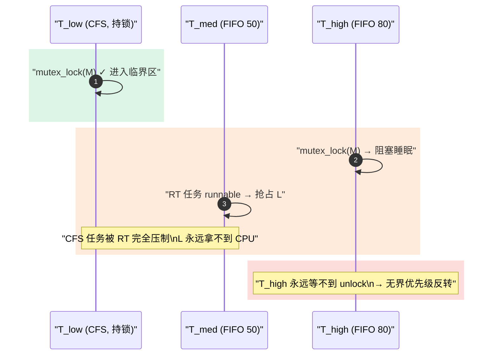

---
title: CFS 背景下 mutex 的"有界优先级反转"
tags: [sched, CFS, mutex, rt_mutex, priority-inversion, PI-futex, PREEMPT_RT]
desc: 解释为什么纯 CFS + struct mutex 只产生有界延迟膨胀、混入 SCHED_FIFO/RR 才出现经典无界反转，以及 rt_mutex / PI-futex / PREEMPT_RT 的根治路径
update: 2026-04-07

---


# CFS 背景下 mutex 的"有界优先级反转"

> [!note]
> **Ref:** `sdk/Linux-4.9.88/kernel/locking/mutex.c`, `kernel/locking/rtmutex.c`, `kernel/sched/core.c`, `kernel/futex.c`, `include/linux/sched/prio.h`; 配套笔记 [`02-runqueue-load-balance.md`](./02-runqueue-load-balance.md), [`03-preemption-models.md`](./03-preemption-models.md), [`../sync/02-mutex-semaphore.md`](../sync/02-mutex-semaphore.md)

## 1. 简短结论

**会有，但形态分两层：**

| 场景 | 现象 | 边界 |
|------|------|------|
| 纯 CFS（`SCHED_NORMAL`）+ `struct mutex` | 高优先级（低 nice）等待者被低 nice owner 拖慢 | **有界**：最坏延迟 ≈ 临界区长度 × CFS 份额倒数 |
| CFS owner + `SCHED_FIFO/RR` 等待者 + 中等 RT 干扰者 | 经典无界优先级反转 | **无界**：owner 可被 RT 任务永远抢占 |

`struct mutex` 自身**不做优先级继承 (PI)**；要根治反转必须切到 `rt_mutex` / PI-futex / PREEMPT_RT。

## 2. 两个层次的锁

| 层 | 对象 | PI? | 实现 |
|----|------|:---:|------|
| 用户态 | `pthread_mutex_t`（默认）| ✗ | futex fast path |
| 用户态 | `pthread_mutex_t` + `PTHREAD_PRIO_INHERIT` | ✓ | `futex_lock_pi` → 内核 `rt_mutex` |
| 内核态 | `struct mutex` | ✗ | `kernel/locking/mutex.c` |
| 内核态 | `struct rt_mutex` | ✓ | `kernel/locking/rtmutex.c`（PI-chain 红黑树）|
| 内核态 | PREEMPT_RT 补丁 | ✓ | 几乎所有 `mutex`/`spinlock` 被替换为 `rt_mutex` |

`struct mutex` 的"高级特性"是 **乐观自旋 (optimistic spin / MCS lock)**：当 owner 正在另一 CPU 上跑时，等待者短暂自旋而非立即睡，这是为吞吐设计，**与反转无关**。源码见 `mutex.c:mutex_optimistic_spin()`。

## 3. 纯 CFS 下：为什么"无界"反转不会发生

CFS 没有"绝对优先级"概念，调度量由 `vruntime` + nice 权重 (`sched_prio_to_weight[]`) 决定：

- nice 0 ↔ weight 1024；nice 19 ↔ weight 15；比值 ≈ **88 : 1**
- 任意 runnable 任务的 CPU 份额非零 → **不会饿死**
- `mutex_lock()` 慢路径中等待者按 FIFO 挂入 `mutex->wait_list`；owner `mutex_unlock()` 主动唤醒队首 —— 调度器层面无"插队"



**最坏延迟模型**：

```
T_wait_max  ≈  T_critical_section  ×  (W_total / W_owner)
```

`W_owner` 越小（owner nice 越大），膨胀越严重。100 μs 的临界区在 CPU 满载场景下可能膨胀到 **几十 ms**。对吞吐型负载无所谓，对低延迟交互体感非常糟糕 —— 这就是 "**有界但可能严重膨胀**" 的本意。

## 4. 一旦混入 `SCHED_FIFO/RR`：经典无界反转

```
T_high  SCHED_FIFO prio 80   ──── 想拿 mutex M
T_med   SCHED_FIFO prio 50   ──── CPU bound，永远在跑
T_low   SCHED_NORMAL         ──── 已持有 M
```



`struct mutex` 在这里**无能为力**：它不知道"应当把 owner 临时提到 T_high 的优先级"。

## 5. 根治：`rt_mutex` 与 PI-chain

`rt_mutex` (`kernel/locking/rtmutex.c`) 维护一棵 **PI-chain**：

- 每个 task 有 `pi_waiters`（红黑树，按等待者优先级排序）和 `pi_blocked_on`（自己阻塞在哪把锁上）
- 等待者带来的**最高优先级**沿锁链向上传播给 owner（`rt_mutex_adjust_prio_chain()`）
- owner 被临时提权（`rt_mutex_setprio()`，触发 `sched_pi_setprio` tracepoint）
- owner 释放锁时优先级回落

PI-futex (`futex_lock_pi`) 把这套机制暴露给用户态：`PTHREAD_PRIO_INHERIT` 的 `pthread_mutex` 在内核里就是一个 `rt_mutex`。

| 机制 | 适用 | 代价 |
|------|------|------|
| `rt_mutex` | 内核里 RT 与非 RT 任务共享的锁 | PI-chain 维护开销，不支持乐观自旋 |
| PI-futex | 实时用户进程 | 需要慢路径进内核 |
| PREEMPT_RT | 整机硬实时 | 全栈替换，吞吐略降 |
| 设计规避 | 临界区极短 + owner/waiter 同优先级类 | 需要架构纪律 |

## 6. i.MX6ULL 驱动开发实操建议

1. **纯 CFS 应用层**：用默认 `pthread_mutex` 即可。尾延迟异常时先用 `perf sched latency` 定位，不要急着上 PI。
2. **涉及实时线程（音频、马达、控制环）**：默认开 PI 协议
   ```c
   pthread_mutexattr_t a;
   pthread_mutexattr_init(&a);
   pthread_mutexattr_setprotocol(&a, PTHREAD_PRIO_INHERIT);
   pthread_mutex_init(&m, &a);
   ```
3. **内核驱动**：若临界区可能被 RT 线程等待、owner 可能是 CFS（典型：`workqueue` 持锁），二选一：
   - 把 owner 提到 RT：`alloc_workqueue(..., WQ_HIGHPRI, ...)` 或 `kthread_create` + `sched_setscheduler(SCHED_FIFO)`
   - 改用 `rt_mutex_lock()`
4. **调试观测**：
   ```sh
   cat /proc/<pid>/sched          # nr_voluntary_switches / wait_sum
   echo 1 > /sys/kernel/debug/tracing/events/sched/sched_pi_setprio/enable
   cat /sys/kernel/debug/tracing/trace_pipe
   perf sched latency -p <pid>
   ```

## 7. 一句话记忆

> **CFS + `struct mutex` = 有界但可能严重膨胀；CFS/RT 混跑 + `struct mutex` = 无界反转；根治只有 `rt_mutex` / PI-futex / PREEMPT_RT。**

## 8. 交叉引用

- [`01-sched_class-CFS.md`](./01-sched_class-CFS.md) —— `sched_prio_to_weight[]` 与 vruntime 计算
- [`03-preemption-models.md`](./03-preemption-models.md) —— RT 抢占 CFS 的内核路径
- [`../sync/02-mutex-semaphore.md`](../sync/02-mutex-semaphore.md) —— `struct mutex` 慢路径与乐观自旋
- [`../sync/00-overview.md`](../sync/00-overview.md) —— 同步原语选型决策树
