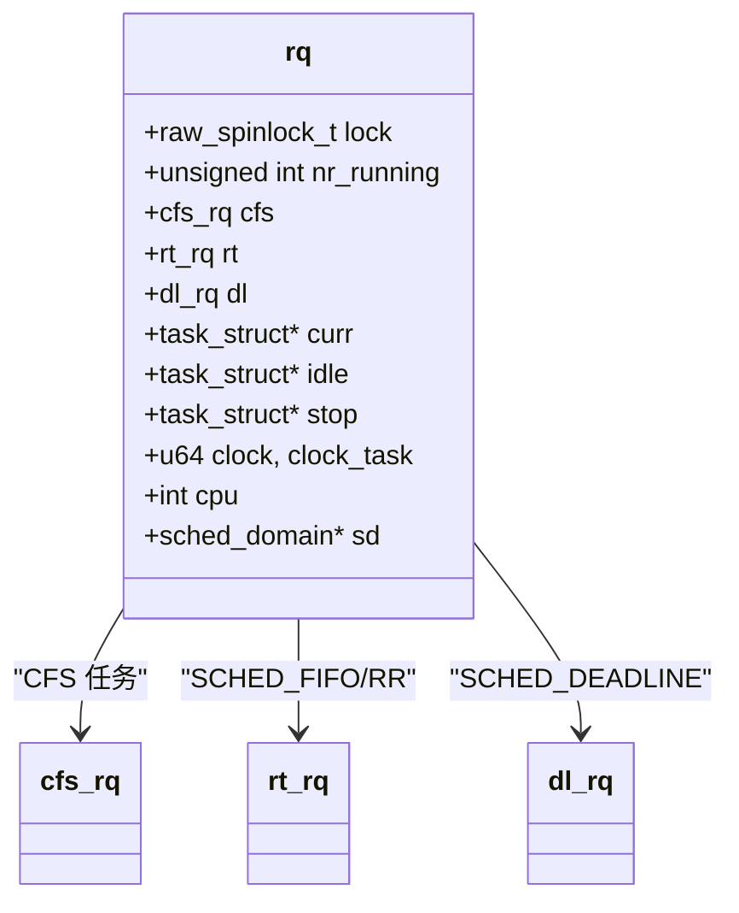
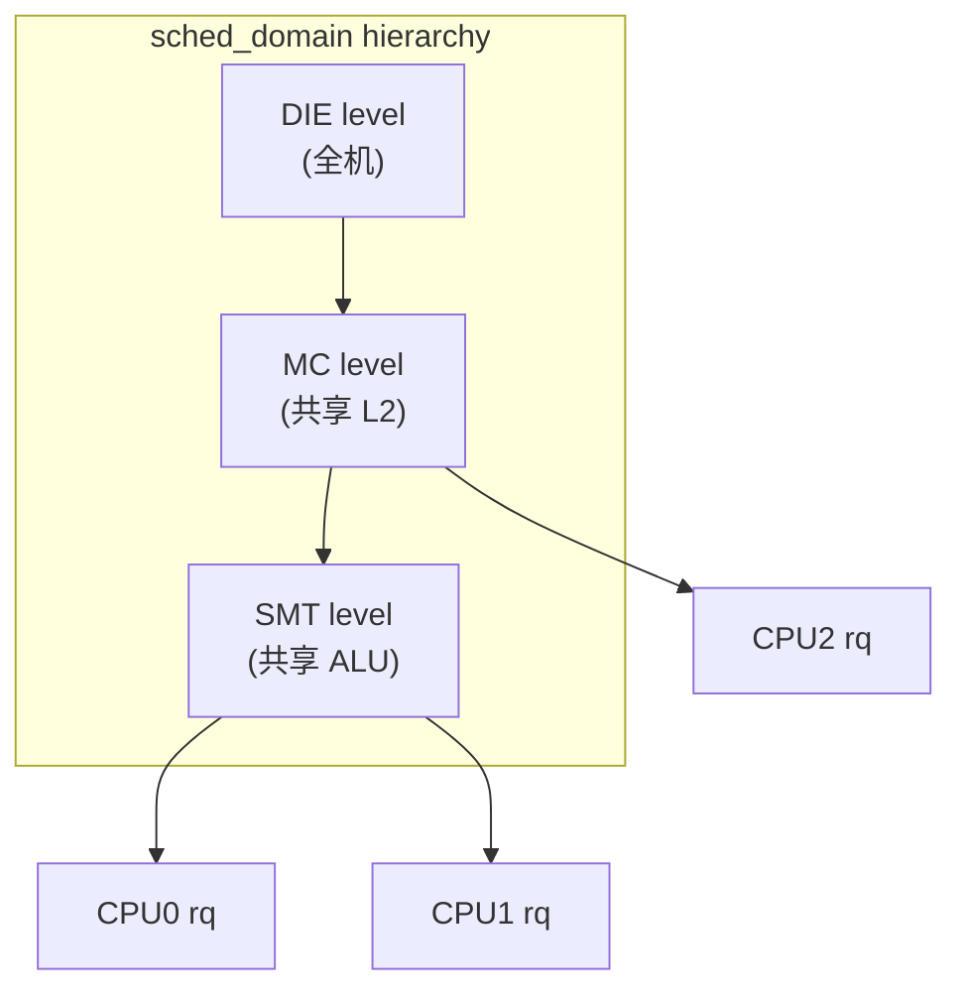
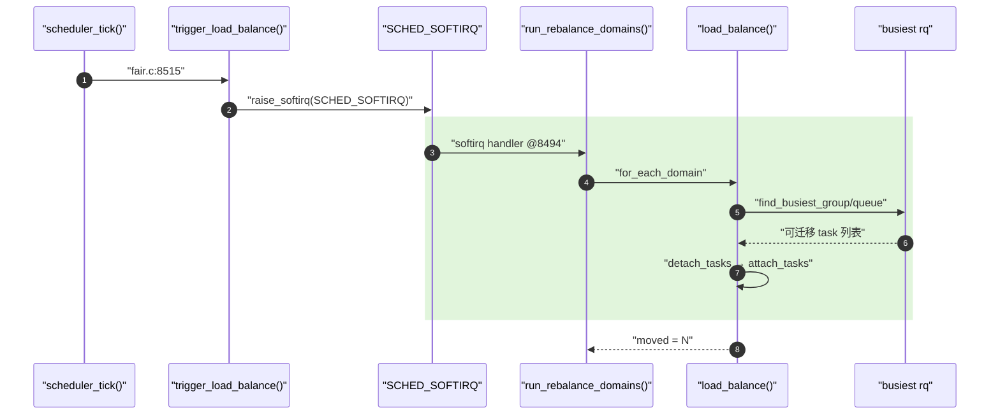

---
title: runqueue 与负载均衡
tags: [kernel, sched, runqueue, load_balance, smp, percpu]
desc: struct rq 的 per-CPU 布局、load_balance 主流程与 i.MX6ULL 单核场景的退化
update: 2026-04-07

---


# runqueue 与负载均衡

> [!note]
> **Ref:** [`kernel/sched/sched.h`](../../../sdk/100ask_imx6ull-sdk/Linux-4.9.88/kernel/sched/sched.h) (struct rq), [`kernel/sched/core.c`](../../../sdk/100ask_imx6ull-sdk/Linux-4.9.88/kernel/sched/core.c), [`kernel/sched/fair.c`](../../../sdk/100ask_imx6ull-sdk/Linux-4.9.88/kernel/sched/fair.c) (`load_balance` @7636, `trigger_load_balance` @8515, `run_rebalance_domains` @8494)

## 1. struct rq：per-CPU 调度状态机

`rq` 是每个 CPU 的"调度桌面"，全部任务都摊在这张桌子上，被三类子运行队列分类管理：



要点：
- `DECLARE_PER_CPU_SHARED_ALIGNED(struct rq, runqueues)` —— `rq` 是 per-CPU 的，访问通过 `this_rq()` / `cpu_rq(cpu)`。
- `rq->lock` 是 **raw_spinlock**，关中断保护。任何修改 `nr_running / curr / on_rq` 的代码都必须持有它。
- `rq->clock` 由 `update_rq_clock()` 推进，`clock_task` 扣除中断/虚拟化时间，是 CFS 计费的真实时基。

## 2. SMP 拓扑与 sched_domain 层级

负载均衡的目的是让任务分布与 CPU 拓扑（SMT → core → package → NUMA）匹配，避免跨缓存域迁移带来的性能损失。



> i.MX6ULL 是 **单核 Cortex-A7**，`num_online_cpus() == 1`，整套 sched_domain / load_balance 路径在编译时基本被裁剪或运行时短路。但理解机制对未来跳到多核 SoC 必要。

## 3. load_balance 主流程

`fair.c:7636 load_balance()` 是周期均衡的入口：



关键步骤：
1. **`trigger_load_balance()`** 在 `scheduler_tick()` 末尾被调用 (`core.c:3094`)，仅置位让 `SCHED_SOFTIRQ` 软中断在退出中断时跑。
2. **`run_rebalance_domains()`** 是 `SCHED_SOFTIRQ` 的处理函数，遍历 `sched_domain` 调用 `load_balance()`。
3. **`load_balance()`** 内部：`find_busiest_group → find_busiest_queue → detach_tasks → attach_tasks`。迁移代价由 `imbalance_pct`、缓存热度 (`task_hot()`) 控制。
4. **`active_load_balance_cpu_stop`** (`fair.c:8028`) 处理"被均衡 CPU 的 curr 也想迁走"的边界。

## 4. 任务迁移的同步语义

迁移要同时获取**两个** `rq->lock`，按 `double_rq_lock()` 顺序加锁防死锁：

```c
/* 简化版 */
double_lock_balance(this_rq, busiest);
detach_task(p, busiest);    /* dequeue + set_task_cpu */
attach_task(this_rq, p);    /* enqueue */
double_unlock_balance(this_rq, busiest);
```

迁移完成后会对被迁入 rq 调用 `check_preempt_curr()` (`core.c:1274`)，给新到任务一个抢占当前 curr 的机会。

## 5. 与相邻笔记的缝合点

- 软中断 `SCHED_SOFTIRQ` 的派发 → [`../defer/01-softirq.md`](../defer/01-softirq.md)
- 唤醒时 `select_task_rq()` 选 CPU → [`05-wake-up-path.md`](./05-wake-up-path.md)
- per-CPU 变量布局 → [`../sync/00-overview.md`](../sync/00-overview.md)

## 6. 小结

1. `rq` 是 per-CPU 调度状态总账本，由 `raw_spinlock` 严格保护。
2. 负载均衡走 **tick → SCHED_SOFTIRQ → run_rebalance_domains → load_balance** 链路，永不在硬中断里直接迁移。
3. i.MX6ULL 单核场景这套路径几近 no-op，但 `update_rq_clock` / `task_tick` / NEED_RESCHED 仍是必经之路。
