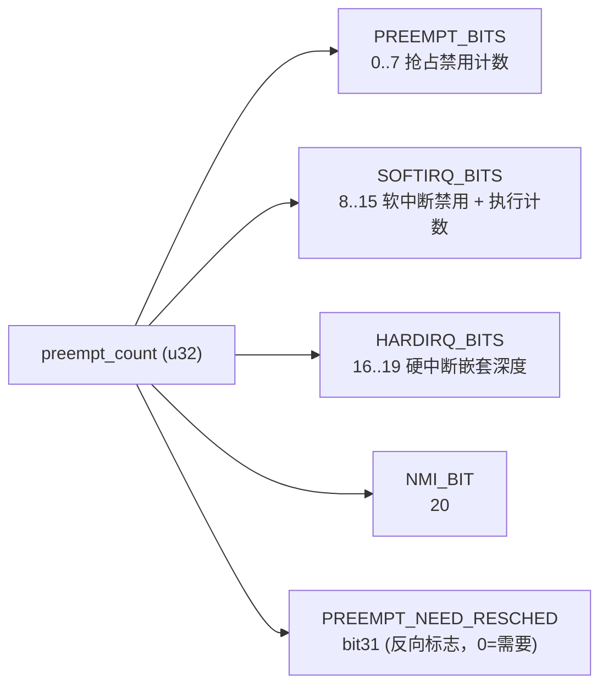
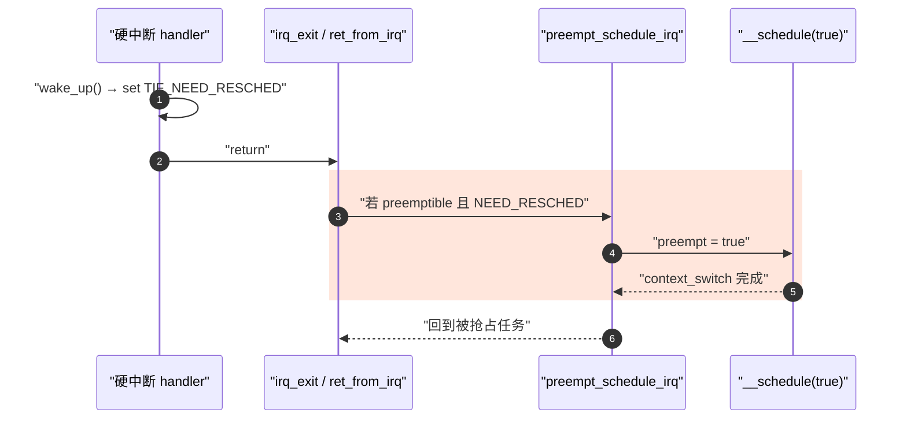

# 内核抢占模型

> [!note]
> **Ref:** [`kernel/Kconfig.preempt`](../../../sdk/100ask_imx6ull-sdk/Linux-4.9.88/kernel/Kconfig.preempt), [`kernel/sched/core.c`](../../../sdk/100ask_imx6ull-sdk/Linux-4.9.88/kernel/sched/core.c) (`preempt_schedule` @3529, `preempt_schedule_irq` @3603, `_cond_resched` @4903), [`include/linux/preempt.h`](../../../sdk/100ask_imx6ull-sdk/Linux-4.9.88/include/linux/preempt.h)

## 1. 四档抢占模型

`Kconfig.preempt` 决定一个内核镜像的"抢占性格"：

| 配置 | 用户态可抢占 | 内核态可抢占 | 适用场景 |
|------|--------------|--------------|----------|
| `PREEMPT_NONE` | 是 | **否**，仅在显式 `schedule()` 时切换 | 服务器、吞吐优先 |
| `PREEMPT_VOLUNTARY` | 是 | 仅在 `might_sleep()` 检查点 | 桌面默认 |
| `PREEMPT` | 是 | **是**，任何非 atomic 区可抢占 | 低延迟、嵌入式 |
| `PREEMPT_RT` | 是 | 几乎全部可抢占（含 spinlock 转 mutex） | 硬实时 |

> 100ask i.MX6ULL 默认 `imx_v7_defconfig` 通常是 `PREEMPT_VOLUNTARY` 或 `PREEMPT`，可通过 `zcat /proc/config.gz | grep PREEMPT` 验证。
>
> ```bash
> [root@imx6ull:~]# zcat /proc/config.gz | grep PREEMPT
> CONFIG_PREEMPT_RCU=y
> # CONFIG_PREEMPT_NONE is not set
> # CONFIG_PREEMPT_VOLUNTARY is not set
> CONFIG_PREEMPT=y
> CONFIG_PREEMPT_COUNT=y
> CONFIG_DEBUG_PREEMPT=y
> # CONFIG_PREEMPT_TRACER is not set
> ```

## 2. preempt_count 位布局

抢占禁用是个**计数器**，不是布尔。`thread_info->preempt_count` 是 32 位字段，按区段使用：



关键 API：
- `preempt_disable() / preempt_enable()` —— `PREEMPT_BITS++/--`，`enable` 时若 `==0` 且 `NEED_RESCHED` 置位则触发 `preempt_schedule()`。
- `local_bh_disable() / local_bh_enable()` —— 操作 `SOFTIRQ_BITS`，禁用底半部。
- `in_atomic() == (preempt_count() != 0)` —— 这就是"原子上下文"的精确定义；驱动中 `might_sleep()` 检查的就是它。

## 3. preempt_schedule：内核态抢占入口

```c
/* core.c:3529 */
asmlinkage __visible void __sched notrace preempt_schedule(void)
{
    if (likely(!preemptible()))
        return;
    preempt_schedule_common();
}
```

`preemptible() = !preempt_count() && !irqs_disabled()`。只有同时满足"未禁用抢占"与"未关中断"才能内核态抢占。`preempt_schedule_irq()` (`core.c:3603`) 则是中断返回路径上的孪生入口：在 IRQ 退出时已经天然具备抢占条件。



## 4. cond_resched：PREEMPT_NONE 的兜底

在 `PREEMPT_NONE / VOLUNTARY` 内核里，长循环（如文件系统扫盘、`copy_huge_page`）必须自己**主动**让出 CPU。`_cond_resched` 是这条出路：

```c
/* core.c:4903 */
int __sched _cond_resched(void)
{
    if (should_resched(0)) {
        preempt_schedule_common();
        return 1;
    }
    return 0;
}
```

派生 API：
- `cond_resched()` —— 普通版。
- `cond_resched_lock(lock)` (`core.c:4922`) —— 若需要重调度则**释放锁**让出 → 重新加锁。驱动写大循环遍历链表时常用。
- `cond_resched_softirq()` —— 软中断关闭区间使用。

## 5. 抢占点总览（什么时候 NEED_RESCHED 真正兑现）

| 抢占点 | 触发条件 |
|--------|----------|
| 系统调用返回用户态 | `ret_to_user` 检查 `TIF_NEED_RESCHED` |
| 中断返回用户态 | 同上 |
| 中断返回内核态 | `preempt_schedule_irq()`，仅 `CONFIG_PREEMPT` |
| `preempt_enable()` 计数归零 | `preempt_schedule()` |
| 显式 `schedule()` / `cond_resched()` | 主动让出 |

## 6. 100ask EVB 实测配置剖析

EVB 当前配置（`zcat /proc/config.gz | grep PREEMPT`）落在 **`PREEMPT` 档**，逐项含义：

| 配置 | 作用 | 含义 |
|------|------|------|
| `CONFIG_PREEMPT=y` | 选定低延迟抢占模型 | 内核态非原子区可立即被抢占，走 `preempt_schedule_irq` 路径 |
| `CONFIG_PREEMPT_RCU=y` | RCU 读临界区可被抢占 | 走 Tree-PREEMPT-RCU；GP 判定更复杂，但**最大读侧延迟显著降低** |
| `CONFIG_PREEMPT_COUNT=y` | 维护 `preempt_count` 4 段位域 | `in_atomic()` / `might_sleep()` 全部生效（PREEMPT 强制依赖）|
| `CONFIG_DEBUG_PREEMPT=y` | 运行时插桩 | 检测原子上下文里睡眠、`smp_processor_id()` 误用、preempt 不平衡 → **开发板信号**，量产应关 |
| `# CONFIG_PREEMPT_TRACER is not set` | 未开启 preempt-off 区段长度 tracer | 想做实时性 profiling 需手工打开 |

**这套配置解决了什么、没解决什么：**

- ✅ ISR 唤醒高优任务后，`irq_exit() → preempt_schedule_irq()` 立即切换，**不必等回到用户态** —— wake-to-run 延迟从 ms 级抖动压到百 μs 级
- ✅ RCU 读侧不会拉长持锁 owner 的临界区
- ✅ 驱动开发期严查"原子上下文中睡眠"，让 `might_sleep()` 报警尽早暴露 bug
- ❌ 仍存在不可抢占窗口（最大延迟来源）：

  | 区段 | 关抢占机制 | 典型时长 |
  |------|------------|---------|
  | `spin_lock()` 临界区 | `preempt_disable()` | 几 μs |
  | `spin_lock_irqsave` 区段 | + 关 CPSR.I | 可达几十 μs |
  | 硬中断 ISR | hardirq 段 ≠ 0 | 取决于驱动质量 |
  | softirq / tasklet | softirq 段 ≠ 0 | 网络/块设备可达 ms 级 |
  | `local_irq_disable()` | 直接关中断 | 应 < 50 μs |

- ❌ **不是 PREEMPT_RT**：`struct mutex` 不会被替换为 `rt_mutex`，混合 `SCHED_FIFO/RR` 时 [`02-1-CFS背景下的mutex优先级有界反转.md`](./02-1-CFS背景下的mutex优先级有界反转.md) 描述的无界反转性质不变 —— `PREEMPT=y` 只是缩短了"普通延迟"，没有改变锁语义

**实测最差延迟方法：**

```sh
# 安装 rt-tests 后跑
cyclictest -p 80 -t1 -n -i 1000 -l 100000

# 想抓 preempt-off 最长区段，先打开 tracer
echo 1 > /proc/sys/kernel/ftrace_enabled
echo preemptoff > /sys/kernel/debug/tracing/current_tracer
cat /sys/kernel/debug/tracing/tracing_max_latency
```

EVB（PREEMPT 非 RT）典型 `cyclictest` 最差延迟在数百 μs ~ 几 ms 区间；同硬件叠加 PREEMPT_RT 补丁后通常可压到 < 100 μs。

> **一句话定性**：100ask EVB 内核 = **PREEMPT (低延迟) + PREEMPT_RCU + DEBUG_PREEMPT** —— 面向驱动开发与亚毫秒级响应的开发配置，但不是硬实时。

## 7. 与相邻笔记的缝合点

- `TIF_NEED_RESCHED` 的置位时机 → [`05-wake-up-path.md`](./05-wake-up-path.md)
- 抢占禁用 vs 中断禁用语义对照 → [`../context/02-preempt-irq-flags.md`](../context/02-preempt-irq-flags.md)
- spinlock 与抢占的耦合 → [`../sync/01-spinlock.md`](../sync/01-spinlock.md)

## 8. 小结

1. 抢占模型是**编译期**选择，决定内核态能否被打断。
2. `preempt_count` 是分段计数器，`in_atomic()` 是它的布尔投影。
3. `cond_resched` 是非抢占内核里写长循环驱动代码的护身符——`might_sleep` 报警时第一时间想到它。
