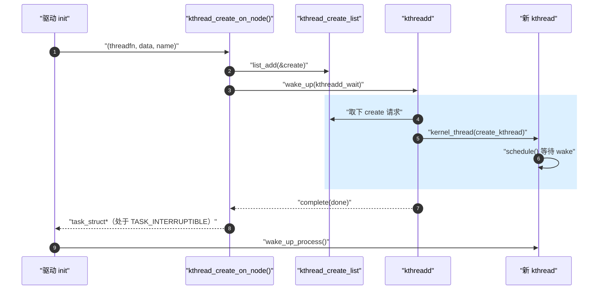
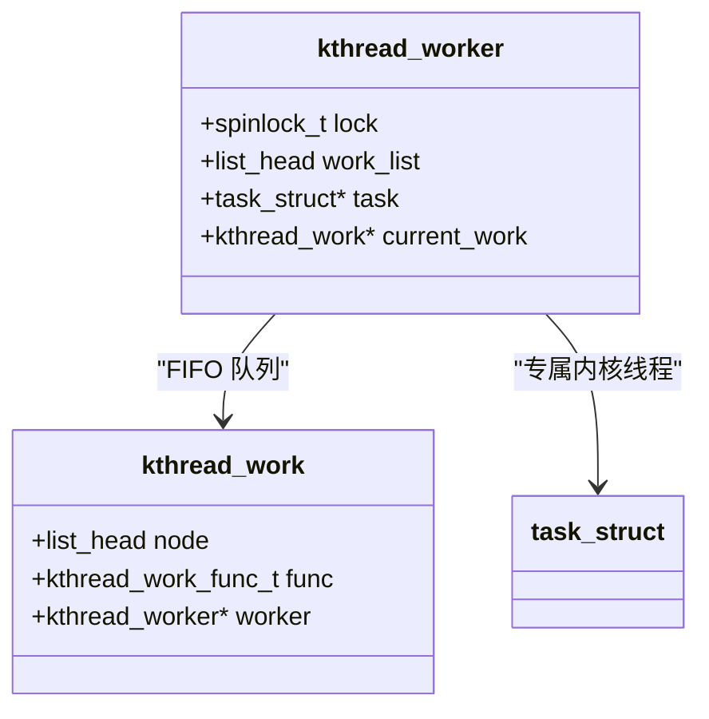

---
title: kthread 与 kthread_worker
tags: [kernel, sched, kthread, kworker, kthreadd]
desc: kthread_create/run 创建路径、kthread_worker/work 通用框架与 workqueue kworker 池的对照
update: 2026-04-07

---


# kthread 与 kthread_worker

> [!note]
> **Ref:** [`kernel/kthread.c`](../../../sdk/100ask_imx6ull-sdk/Linux-4.9.88/kernel/kthread.c) (`kthread_should_stop` @80, `__kthread_create_on_node` @249, `kthread_worker_fn` @589, `kthread_create_worker` @688), [`include/linux/kthread.h`](../../../sdk/100ask_imx6ull-sdk/Linux-4.9.88/include/linux/kthread.h)

## 1. 内核线程是什么

内核线程是只在内核态运行的 `task_struct`：
- `mm == NULL`（无用户地址空间），借用前任的 `active_mm`。
- `flags |= PF_KTHREAD`。
- 父进程是 `kthreadd` (PID 2)，所有内核线程的总管。
- 仍参与 CFS / RT 调度，与普通进程平等竞争 CPU。

## 2. 创建路径：kthread_create / kthread_run

`kthread_create()` 不是直接新建任务，而是把"创建请求"丢给 `kthreadd`，由 `kthreadd` 在自己的上下文里 `kernel_thread()`：



`kthread_run(fn, data, fmt, ...)` 是 `kthread_create + wake_up_process` 的合体宏，是驱动里最常用的一行。

## 3. 退出协议：kthread_should_stop

被创建的线程函数典型骨架：

```c
static int my_kthread_fn(void *data) {
    while (!kthread_should_stop()) {
        /* 一次工作 */
        wait_event_interruptible(my_wq, has_work() || kthread_should_stop());
        do_work();
    }
    return 0;
}
```

`kthread_stop(task)` 做三件事：
1. 设置 `KTHREAD_SHOULD_STOP` 标志；
2. `wake_up_process(task)` 把它从睡眠里拉起；
3. `wait_for_completion()` 等待线程函数返回。

注意 `kthread_should_stop()` 必须**和睡眠条件一起**作为 `wait_event` 的判据，否则会错过 stop 信号永远不返回。

## 4. kthread_worker：手工版的 workqueue

当你只需要"几个延迟项目按顺序在专属线程里跑"，又不想引入 workqueue 的全局复杂度时，`kthread_worker` 是更轻量的选择：



核心 API（`kernel/kthread.c`）：
- `kthread_create_worker(flags, fmt, ...)` (`@688`) —— 创建 worker + 线程。
- `kthread_init_work(work, func)` —— 初始化工作项。
- `kthread_queue_work(worker, work)` —— 入队 + 唤醒 worker 线程。
- 线程主循环就是 `kthread_worker_fn` (`@589`)：`wait_event_interruptible → 取 work → func(work)`。

```c
/* kthread_worker_fn 内层 (简化) */
repeat:
    set_current_state(TASK_INTERRUPTIBLE);
    if (work_list_empty) { schedule(); goto repeat; }
    work = list_first_entry(...);
    __set_current_state(TASK_RUNNING);
    work->func(work);
    goto repeat;
```

## 5. 与 workqueue 的 kworker 对照

| 维度 | `kthread_worker` | workqueue (`kworker/*`) |
|------|------------------|-------------------------|
| 线程数量 | 每 worker 一个固定线程 | 池化、按需弹性增长 |
| 调度策略 | 显式可调（`sched_setscheduler`） | CMWQ 自管理 |
| 适用场景 | 实时性要求、私有上下文 | 通用延迟任务 |
| 接口 | `kthread_queue_work` | `queue_work / schedule_work` |

详见 [`../defer/03-workqueue.md`](../defer/03-workqueue.md)。

## 6. 与相邻笔记的缝合点

- 唤醒 worker 线程的具体路径 → [`05-wake-up-path.md`](./05-wake-up-path.md)
- wait_queue 在 `kthread_worker_fn` 中的使用 → [`../defer/05-wait-queue.md`](../defer/05-wait-queue.md)
- workqueue / kworker 池 → [`../defer/03-workqueue.md`](../defer/03-workqueue.md)

## 7. 小结

1. `kthread_create` 借道 `kthreadd` 创建，`kthread_run` 是"创建+唤醒"的便捷入口。
2. `kthread_should_stop` 必须出现在睡眠条件中，否则 `kthread_stop` 永远等不到。
3. `kthread_worker` 是轻量、可控的替代品；workqueue 的 `kworker/*` 是更通用的池化方案。
