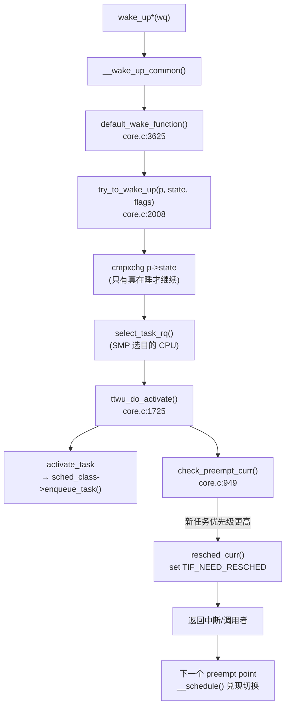
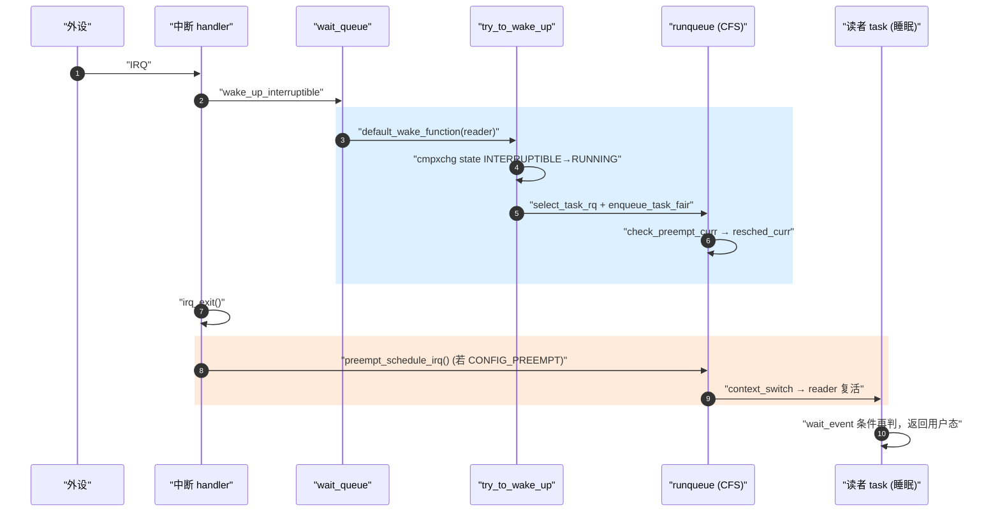

---
title: 唤醒路径 try_to_wake_up
tags: [kernel, sched, wakeup, ttwu, wait_queue, enqueue]
desc: try_to_wake_up → ttwu_do_activate → enqueue_task → check_preempt_curr 全链路，闭合 wait_queue 与 sched
update: 2026-04-07

---


# 唤醒路径 try_to_wake_up

> [!note]
> **Ref:** [`kernel/sched/core.c`](../../../sdk/100ask_imx6ull-sdk/Linux-4.9.88/kernel/sched/core.c) (`try_to_wake_up` @2008, `ttwu_do_activate` @1725, `check_preempt_curr` @949, `default_wake_function` @3625), [`kernel/sched/wait.c`](../../../sdk/100ask_imx6ull-sdk/Linux-4.9.88/kernel/sched/wait.c)

## 1. 为什么这条路径是驱动开发的核心

驱动里最常见的"中断 → 数据就绪 → 唤醒读者"模式：

```c
/* 中断 handler */
buffer_ready = true;
wake_up_interruptible(&drv->rq);

/* read() */
wait_event_interruptible(drv->rq, buffer_ready);
```

`wake_up_interruptible` 之后到底发生了什么？答案就是 **try_to_wake_up (TTWU) 链路**——它把"睡眠的 task"从 wait_queue 取出，丢回 runqueue，并按需置位 `TIF_NEED_RESCHED`。

## 2. 全链路总图



## 3. 关键函数逐段拆解

### 3.1 `wake_up_*` 宏家族

`wake_up_interruptible(wq)` 展开后调用 `__wake_up_common(wq, TASK_INTERRUPTIBLE, 1, 0, NULL)`，遍历 wait_queue 上的 entry，按 entry 注册的 `func` 回调唤醒。绝大多数 entry 用的就是 `default_wake_function`。

### 3.2 `default_wake_function` (`core.c:3625`)

```c
int default_wake_function(wait_queue_t *curr, unsigned mode,
                          int wake_flags, void *key)
{
    return try_to_wake_up(curr->private, mode, wake_flags);
}
```

桥梁仅一行：`curr->private` 就是当初 `prepare_to_wait` 时挂上去的目标 `task_struct *`。

### 3.3 `try_to_wake_up` (`core.c:2008`)

主要职责：
1. **状态校验**：用 `cmpxchg` 把 `p->state` 从 `state` 改成 `TASK_RUNNING`。失败说明任务并不处于期望的睡眠态——直接返回 0，避免重复入队。
2. **on_rq 短路**：若 `p->on_rq != 0`，说明它还没真的离开 rq（"刚 dequeue 还没切完"），直接 `ttwu_remote()` 重置为 RUNNING。
3. **选 CPU**：`select_task_rq(p, ...)` 调用 `sched_class->select_task_rq()`，CFS 在这里走 wake-affinity / find_idlest_cpu。
4. **提交入队**：调 `ttwu_queue() → ttwu_do_activate()`。
5. **`p->state = TASK_RUNNING`**。

### 3.4 `ttwu_do_activate` (`core.c:1725`)

```c
static void ttwu_do_activate(struct rq *rq, struct task_struct *p,
                             int wake_flags, struct pin_cookie cookie)
{
    activate_task(rq, p, ENQUEUE_WAKEUP);   /* → sched_class->enqueue_task */
    ttwu_do_wakeup(rq, p, wake_flags, cookie);
}
```

`ttwu_do_wakeup` 内部调 `check_preempt_curr(rq, p, wake_flags)` (`core.c:1695`)。

### 3.5 `check_preempt_curr` (`core.c:949`)

```c
void check_preempt_curr(struct rq *rq, struct task_struct *p, int flags)
{
    const struct sched_class *class;
    if (p->sched_class == rq->curr->sched_class) {
        rq->curr->sched_class->check_preempt_curr(rq, p, flags);
    } else {
        for_each_class(class) {
            if (class == rq->curr->sched_class) break;
            if (class == p->sched_class) {
                resched_curr(rq);  /* 高优先级类入队，立即抢占 */
                break;
            }
        }
    }
}
```

两条出口：
- 同类同档：调 `class->check_preempt_curr` 判定（CFS 用 `vruntime` 差值 + `wakeup_gran`）。
- 跨类高升：直接 `resched_curr()` 置 `TIF_NEED_RESCHED`。

## 4. 时序图：中断里唤醒读者



## 5. 闭合：wait_queue ↔ sched 一图流

```mermaid
flowchart LR
    A["read() 调用"] --> B["wait_event_interruptible"]
    B --> C["prepare_to_wait<br/>state=TASK_INTERRUPTIBLE"]
    C --> D["schedule()<br/>__schedule(false)"]
    D --> E["dequeue + context_switch<br/>读者休眠"]
    E -. "中断到来" .-> F["wake_up_interruptible"]
    F --> G["try_to_wake_up"]
    G --> H["enqueue_task_fair"]
    H --> I["check_preempt_curr → NEED_RESCHED"]
    I --> J["preempt point: __schedule"]
    J --> K["读者被 pick_next_task 选中"]
    K --> L["wait_event 条件复检 → 返回 read()"]
```



这就是 `defer/05-wait-queue.md` 描述的"睡眠半边"和本文"唤醒半边"的合龙。

## 6. 与相邻笔记的缝合点

- `wait_event` / `prepare_to_wait` 的睡眠半边 → [`../defer/05-wait-queue.md`](../defer/05-wait-queue.md)
- `enqueue_task_fair` 内部细节 → [`01-sched_class-CFS.md`](./01-sched_class-CFS.md)
- `TIF_NEED_RESCHED` 何时兑现 → [`03-preemption-models.md`](./03-preemption-models.md)
- 抢占点与上下文切换 → [`../context/00-overview.md`](../context/00-overview.md)

## 7. 小结

1. 唤醒路径 = `wake_up_*` → `default_wake_function` → `try_to_wake_up` → `enqueue_task` → `check_preempt_curr`。
2. TTWU 用 `cmpxchg` 保证幂等：重复唤醒不会重复入队。
3. **唤醒只置位 NEED_RESCHED，不立即切换**；真正的 `context_switch` 发生在下一个 preempt point。
4. 这条链路是驱动阻塞 IO 的"心跳"，理解它就理解了 wait_queue 与 sched 的契约。
