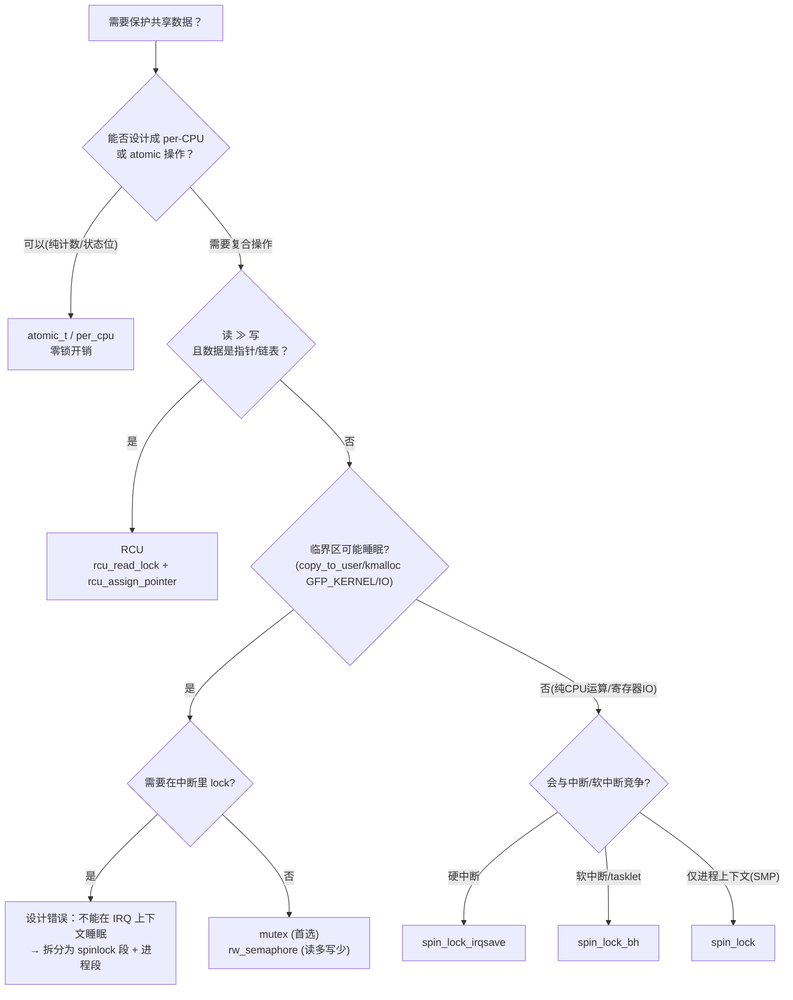
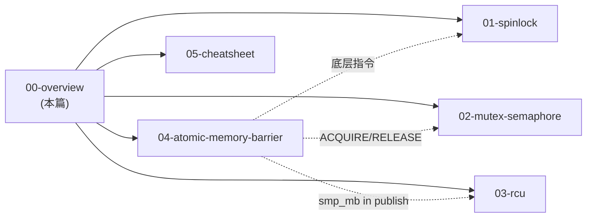

---
title: 内核同步原语全景与选型决策树
tags: [kernel, sync, overview, decision-tree, primitives]
desc: per-cpu/atomic/spinlock/mutex/rwsem/RCU 的语义对比与驱动选型流程
update: 2026-04-07

---

# 内核同步原语全景与选型决策树

> [!note]
> **Ref:**
> - [`include/linux/spinlock.h`](../../../sdk/100ask_imx6ull-sdk/Linux-4.9.88/include/linux/spinlock.h)
> - [`include/linux/mutex.h`](../../../sdk/100ask_imx6ull-sdk/Linux-4.9.88/include/linux/mutex.h)
> - [`include/linux/rwsem.h`](../../../sdk/100ask_imx6ull-sdk/Linux-4.9.88/include/linux/rwsem.h)
> - [`include/linux/rcupdate.h`](../../../sdk/100ask_imx6ull-sdk/Linux-4.9.88/include/linux/rcupdate.h)
> - [`include/linux/percpu.h`](../../../sdk/100ask_imx6ull-sdk/Linux-4.9.88/include/linux/percpu.h)
> - [`include/linux/atomic.h`](../../../sdk/100ask_imx6ull-sdk/Linux-4.9.88/include/linux/atomic.h)
> - 同目录 `01-spinlock.md` / `02-mutex-semaphore.md` / `03-rcu.md` / `04-atomic-memory-barrier.md` / `05-cheatsheet.md`

## 1. 同步问题的三个变量

任何"要不要加锁"的讨论，先回答三个问题：

1. **谁会并发访问？** 多 CPU、硬中断、软中断、抢占进程上下文。
2. **临界区有多长？** 几条指令 vs 毫秒级 IO；前者忙等划算，后者必须睡眠让出 CPU。
3. **读写比例？** 读 ≫ 写 时，无锁/无写者阻塞的方案（RCU、seqlock）远优于互斥锁。

下表把 Linux 4.9 的主要原语按这三轴分类：

| 原语                 | 可在硬中断   | 可睡眠 | 写者阻塞读者 | 典型开销         | 最佳场景                           |
| -------------------- | ------------ | ------ | ------------ | ---------------- | ---------------------------------- |
| `atomic_t` / bitops  | 是           | 否     | —            | 1 条 LL/SC       | 计数器、状态位                     |
| `per_cpu` 变量       | 是           | 否     | —            | 一次内存访问     | 统计、缓存、无共享数据             |
| `spinlock_t`         | 是 (`_irq*`) | 否     | 是           | 总线原子 + 忙等  | μs 级临界区，含中断路径            |
| `rwlock_t`           | 是           | 否     | 是           | 同上 + 计数      | 读多写少（已基本被 RCU 取代）      |
| `seqlock_t`          | 写禁中断     | 否     | 否（读重试） | 写者快、读者重试 | 极少写、读端不阻塞（jiffies、时间）|
| `mutex`              | 否           | 是     | 是           | 快路径原子       | ms 级、进程上下文互斥（首选）      |
| `struct semaphore`   | 否           | 是     | 是           | 同上             | 旧 API、计数信号量                 |
| `rw_semaphore`       | 否           | 是     | 是           | 较 mutex 高      | 进程上下文读多写少（mmap_sem 等）  |
| `RCU`                | 是 (读端)    | 否     | **否**       | 读端零开销       | 读极多写极少链表/指针更新          |
| `completion`         | 触发任意     | 是     | —            | 一次 wake_up     | 一次性事件（probe、IO 完成）       |

## 2. 选型决策树

## 3. 上下文 × 原语 允许矩阵

| 上下文 \ 原语 | atomic | spin_lock | spin_lock_irqsave | mutex | rwsem | RCU 读端 | RCU `synchronize_rcu` |
| ------------- | :----: | :-------: | :---------------: | :---: | :---: | :------: | :-------------------: |
| 硬中断 ISR    |   Y    |  注 1     |        Y          |   N   |   N   |    Y     |          N            |
| softirq/tasklet|  Y    |     Y     |        Y          |   N   |   N   |    Y     |          N            |
| 进程上下文 (atomic) | Y |     Y     |        Y          |   N   |   N   |    Y     |          N            |
| 进程上下文 (可睡眠) | Y |     Y     |        Y          |   Y   |   Y   |    Y     |          Y            |

> 注 1：仅当不会与同 CPU 的非中断路径再次抢同一把锁时；否则必须 `_irqsave`。

## 4. 性能数量级（参考 Cortex-A7 1GHz 单核）

| 操作                       | 估算耗时           |
| -------------------------- | ------------------ |
| `atomic_inc`               | 5–20 ns            |
| `spin_lock` 无竞争         | 20–50 ns           |
| `mutex_lock` 无竞争快路径  | 30–80 ns           |
| `mutex_lock` 慢路径        | μs 级（含调度）    |
| `synchronize_rcu`          | 1–数十 ms（等 GP） |
| `rcu_read_lock` (PREEMPT=n)| 0 ns（编译屏障）   |

启示：

- 临界区只剩 "几个原子操作" 时，干脆直接用 `atomic_*`，省掉锁开销。
- 写极少时 RCU 把"互斥成本"全部转嫁给写者；读端是 0 成本，**这是 4.9 内核中读多写少路径的标配**。
- `mutex` 快路径其实和 spinlock 接近，**只要可能睡眠就大胆用 mutex**，别因为"听说慢"就强行 spinlock。

## 5. 五条经验法则

1. **能 atomic 不 spinlock，能 RCU 不 rwlock，能 mutex 不 semaphore**。
2. **有疑问就 `_irqsave`**：性能损失 ns 级，错一次就是死锁。
3. **锁保护数据，不保护代码**：每个共享字段在注释里写清楚由哪把锁保护，`lockdep` 才能帮你。
4. **减少锁内动作**：把 `copy_to/from_user`、`kmalloc(GFP_KERNEL)`、日志、分配都搬到锁外。
5. **同一对象的所有访问点必须使用同一把（或同一组顺序固定的）锁**——AB-BA 死锁基本都源于"我以为这条路径不需要那把锁"。

## 6. 与本子目录其它笔记的关系

继续阅读建议路径：`04-atomic-memory-barrier` → `01-spinlock` → `02-mutex-semaphore` → `03-rcu` → `05-cheatsheet`。
