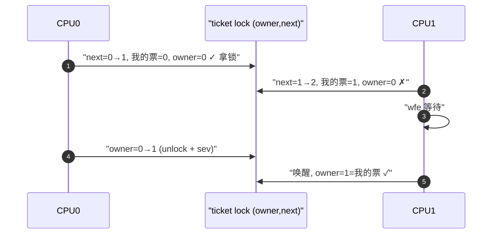

# Spinlock 自旋锁深入

> [!note]
> **Ref:**
> - [`include/linux/spinlock.h`](../../../sdk/100ask_imx6ull-sdk/Linux-4.9.88/include/linux/spinlock.h)
> - [`include/linux/spinlock_api_smp.h`](../../../sdk/100ask_imx6ull-sdk/Linux-4.9.88/include/linux/spinlock_api_smp.h)
> - [`kernel/locking/spinlock.c`](../../../sdk/100ask_imx6ull-sdk/Linux-4.9.88/kernel/locking/spinlock.c)
> - [`arch/arm/include/asm/spinlock.h`](../../../sdk/100ask_imx6ull-sdk/Linux-4.9.88/arch/arm/include/asm/spinlock.h)
> - [`include/linux/rwlock.h`](../../../sdk/100ask_imx6ull-sdk/Linux-4.9.88/include/linux/rwlock.h)


## 1. 什么是 Spinlock

Spinlock 是 Linux 内核最基础的 **忙等待（busy-wait）** 互斥原语：当一个 CPU 未能获取锁时，它会在原地循环读取锁状态，直到持锁者释放。它的设计目标是保护 **极短** 的临界区，避免上下文切换的开销。

核心属性：

- **不可睡眠（non-sleepable）**：持有自旋锁期间，当前任务不能调用任何可能睡眠的函数（`kmalloc(GFP_KERNEL)`、`copy_from_user`、`mutex_lock`、`msleep` 等）。
- **禁止内核抢占**：`spin_lock()` 进入时自动调用 `preempt_disable()`，避免持锁任务被调度出去后另一 CPU 无谓自旋。
- **SMP 安全 + UP 退化**：在 `CONFIG_SMP=n` 的单核内核上，spinlock 退化为仅 `preempt_disable()`（UP 下无须真正的原子旋转）。
- **对称使用**：任意上下文都可能去抢这把锁时，所有调用点必须采用一致的 "最严变体"（见第 3 节选择矩阵）。

### 1.1 为什么不能睡眠

假设 CPU0 持有 spinlock A 并调用 `schedule()`：

1. CPU0 切出，任务 T1 进入运行。
2. T1 也访问共享资源，尝试 `spin_lock(A)` → 在 CPU0 上自旋。
3. 但原持锁者已被调度走，CPU0 永远不会去释放 A → **死锁**。

此外，持锁期间抢占被禁用，若睡眠则 `schedule()` 会命中 `BUG: scheduling while atomic`。


## 2. 数据结构与 ARM 实现要点（Linux 4.9 = ticket spinlock）

```c
// include/linux/spinlock_types.h
typedef struct spinlock {
    union {
        struct raw_spinlock rlock;
        /* lockdep/debug 扩展字段 */
    };
} spinlock_t;
```

4.9 内核在 ARM 架构上使用 **ticket spinlock**（`arch/arm/include/asm/spinlock.h`）。x86 在更高版本才切到 qspinlock，4.9 的 ARM 仍然是 ticket：

```c
// arch/arm/include/asm/spinlock_types.h  (概念等价)
typedef struct {
    union {
        u32 slock;
        struct __raw_tickets { u16 owner, next; } tickets;
    };
} arch_spinlock_t;
```

取锁流程（`arch_spin_lock`）：

1. 以 `ldrex/strex` 原子地将 `tickets.next` 自增，返回旧值作为"自己的号码牌"。
2. 轮询 `tickets.owner == 我的号码`，未命中则 `wfe` 休眠核心直到别的 CPU `sev` 唤醒。
3. 释放（`arch_spin_unlock`）：`tickets.owner++` 并 `dsb + sev`。

**特性**：严格 FIFO，杜绝饥饿；相比老式 `test_and_set`，不会让多个 CPU 同时抢同一位置。




## 3. 变体选择矩阵（最重要）

关键问题：**临界区运行在哪种上下文？以及它可能被什么抢占？**

| 变体                 | preempt | 本地 IRQ        | 本地 softirq    | 适用场景                                         |
| -------------------- | ------- | --------------- | --------------- | ------------------------------------------------ |
| `spin_lock`          | 禁用    | 开启            | 开启            | 只在进程上下文访问，不会与中断/软中断竞争        |
| `spin_lock_bh`       | 禁用    | 开启            | **禁用**        | 进程上下文 + softirq/tasklet 共享                |
| `spin_lock_irq`      | 禁用    | **禁用**        | 禁用            | 进程上下文 + 硬中断共享，且确定进入时 IRQ 是开的 |
| `spin_lock_irqsave`  | 禁用    | **禁用并保存**  | 禁用            | 同上，但不确定进入时 IRQ 状态（最安全通用选择）  |

**铁律**：如果临界区 **可能** 被硬中断处理函数进入，必须用 `_irqsave`；否则硬中断来临时再取同一把锁 → 同核死锁。

### 3.1 `irq` vs `irqsave` 的区别

```c
spin_lock_irq(&lock);    // local_irq_disable() 无脑关
...
spin_unlock_irq(&lock);  // local_irq_enable()  无脑开  ← 若调用者之前 IRQ 就是关的，这里被意外打开！

unsigned long flags;
spin_lock_irqsave(&lock, flags);   // 保存 CPSR.I 再关
...
spin_unlock_irqrestore(&lock, flags); // 还原原状态
```

在 ISR、嵌套锁、复杂调用链中 **一律用 `_irqsave`**，只有能 100% 确认调用者处于进程上下文且 IRQ 开着时才偷懒用 `_irq`。

### 3.2 为何有 `_bh`

`_bh` 仅关 softirq（含 tasklet），不关硬中断，比 `_irqsave` 开销低。用于 **只与下半部竞争** 的数据（如网络栈的 per-CPU 队列），不必支付关硬中断的代价。


## 4. Reader-Writer Spinlock（简述）

`rwlock_t` 允许多读单写：

```c
rwlock_t lk;
read_lock(&lk);   /* ... */ read_unlock(&lk);
write_lock(&lk);  /* ... */ write_unlock(&lk);
```

- 对 **读多写极少** 的场景有意义，但读者仍然忙等写者。
- 不公平，写者可能饿死；4.9 之后多数路径已被 **RCU** 取代。
- 同样有 `read_lock_irqsave` / `write_lock_irqsave` 系列。
- 驱动新代码基本不建议使用 `rwlock_t`，优先考虑 RCU 或普通 spinlock。


## 5. 常见陷阱

1. **持锁睡眠**：`spin_lock` 后调用 `copy_from_user` / `kmalloc(GFP_KERNEL)` / `mutex_lock` → `BUG: scheduling while atomic` 或死锁。内存分配请用 `GFP_ATOMIC`。
2. **同核递归加锁**：同一 CPU 第二次 `spin_lock(同一个锁)` 会自旋等自己永不释放。4.9 的 `lockdep` 在调试内核下可捕获。
3. **IRQ 顺序错乱**：线程路径用 `spin_lock`，中断路径用 `spin_lock`（未关 IRQ）→ 线程持锁时硬中断到来、ISR 再次 `spin_lock` → 死锁。**任一上下文需要关 IRQ，则所有上下文都必须用 `_irqsave`**。
4. **锁的粒度与层级**：多把锁必须按 **固定顺序** 获取以防 AB-BA 死锁；`lockdep` 可以自动学习顺序并报警。
5. **过长临界区**：spinlock 持锁期间其他 CPU 纯忙等浪费能耗，应尽量把可以外移的工作（拷贝、日志、分配）放到锁外。
6. **UP 下错觉**：`CONFIG_SMP=n` 时 `spin_lock` 仅关抢占，看似"没事"，一旦打开 SMP 立刻暴露问题。


## 6. 驱动使用示例

### 6.1 与硬中断共享：经典 FIFO 设备

```c
struct mydev {
    spinlock_t     lock;
    struct kfifo   fifo;
    wait_queue_head_t wq;
};

/* 硬中断：把数据塞进 FIFO */
static irqreturn_t mydev_isr(int irq, void *data)
{
    struct mydev *d = data;
    u32 sample = readl(d->regs + DATA);

    spin_lock(&d->lock);             /* 已在硬中断里，IRQ 天然关着 */
    kfifo_in(&d->fifo, &sample, sizeof(sample));
    spin_unlock(&d->lock);

    wake_up_interruptible(&d->wq);
    return IRQ_HANDLED;
}

/* read() 进程上下文：从 FIFO 取 */
static ssize_t mydev_read(struct file *f, char __user *buf,
                          size_t cnt, loff_t *pos)
{
    struct mydev *d = f->private_data;
    unsigned long flags;
    u32 sample;
    int ret;

    wait_event_interruptible(d->wq, !kfifo_is_empty(&d->fifo));

    spin_lock_irqsave(&d->lock, flags);   /* 必须关 IRQ，防 ISR 冲突 */
    ret = kfifo_out(&d->fifo, &sample, sizeof(sample));
    spin_unlock_irqrestore(&d->lock, flags);

    if (ret != sizeof(sample))
        return -EAGAIN;

    /* 锁外再 copy_to_user —— 因为它可能睡眠 */
    if (copy_to_user(buf, &sample, sizeof(sample)))
        return -EFAULT;
    return sizeof(sample);
}
```

**要点**：

- 进程上下文用 `_irqsave`；ISR 已在关中断态，只需 `spin_lock`（同一把锁也可）。
- `copy_to_user` 搬出锁外执行。
- 内存分配若在锁内必须 `GFP_ATOMIC`。

### 6.2 初始化

```c
spin_lock_init(&d->lock);
/* 或静态：DEFINE_SPINLOCK(my_lock); */
```


## 7. 速查表

```text
只有进程上下文                    spin_lock
进程 + softirq/tasklet            spin_lock_bh
进程 + 硬中断 (IRQ 状态确定)      spin_lock_irq
进程 + 硬中断 (通用/嵌套/不确定)  spin_lock_irqsave   ← 首选
纯硬中断内部                      spin_lock           (IRQ 已关)
读远多于写 (新代码)               RCU / 普通 spinlock, 避免 rwlock_t
临界区需要睡眠                    mutex / semaphore   (见 02-mutex-semaphore)
```
