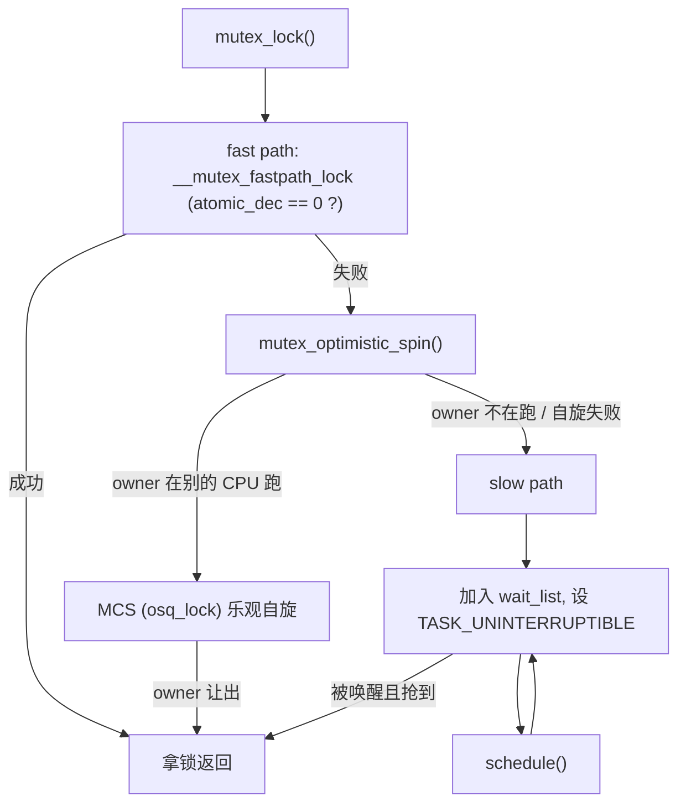
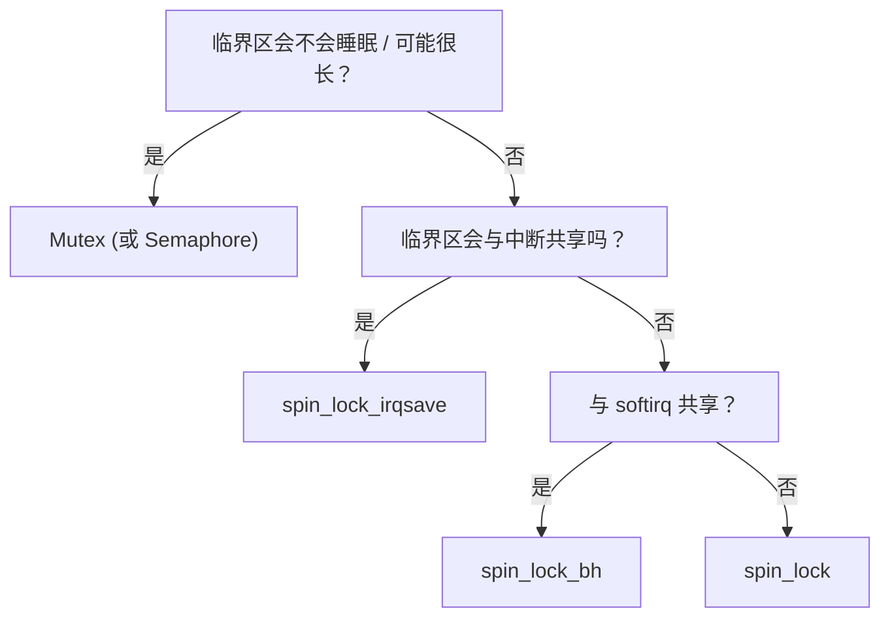

# Mutex 与 Semaphore 可睡眠锁

> [!note]
> **Ref:**
> - [`include/linux/mutex.h`](../../../sdk/100ask_imx6ull-sdk/Linux-4.9.88/include/linux/mutex.h)
> - [`kernel/locking/mutex.c`](../../../sdk/100ask_imx6ull-sdk/Linux-4.9.88/kernel/locking/mutex.c)
> - [`include/linux/semaphore.h`](../../../sdk/100ask_imx6ull-sdk/Linux-4.9.88/include/linux/semaphore.h)
> - [`kernel/locking/semaphore.c`](../../../sdk/100ask_imx6ull-sdk/Linux-4.9.88/kernel/locking/semaphore.c)
> - [`include/linux/osq_lock.h`](../../../sdk/100ask_imx6ull-sdk/Linux-4.9.88/include/linux/osq_lock.h)


## 1. 为什么需要可睡眠锁

[01-spinlock](01-spinlock.md) 已经说明 spinlock 不能保护"会睡眠"的临界区。驱动中以下动作都会睡眠：

- `copy_{to,from}_user`（可能触发缺页）
- `kmalloc(GFP_KERNEL)`
- `wait_event_*`
- 磁盘/网络 IO 等待
- 再次去抢一把被别人持有的 mutex

临界区内一旦可能出现上述动作，就必须用 **mutex** 或 **semaphore** 这类 **可让出 CPU** 的阻塞锁。它们与 spinlock 最本质的区别是：拿不到锁时 **进入 `TASK_UNINTERRUPTIBLE` / `TASK_INTERRUPTIBLE` 并 `schedule()`**，而不是原地自旋。

> **不可在原子上下文使用**：硬中断、软中断、tasklet、spin_lock 临界区内 —— 都不能调用 `mutex_lock` / `down`，否则 `might_sleep()` 会 `BUG`。


## 2. Mutex

### 2.1 数据结构（4.9.88）

```c
// include/linux/mutex.h
struct mutex {
    atomic_t              count;    /* 1=unlocked, 0=locked, <0=有等待者 */
    spinlock_t            wait_lock;
    struct list_head      wait_list;
    struct task_struct   *owner;    /* CONFIG_MUTEX_SPIN_ON_OWNER 下记录持锁者 */
#ifdef CONFIG_MUTEX_SPIN_ON_OWNER
    struct optimistic_spin_queue osq; /* MCS 乐观自旋队列 */
#endif
};
```

关键特征：

- **单一持有者（owner）**：mutex 只能被 **它自己的持锁者** 解锁，语义上是"资源的主人"，不像 semaphore 可以由他人释放。
- **严格互斥**：同一时刻最多一个任务持锁。
- **可睡眠**：失败路径 `schedule()`。
- **支持 PI（priority inheritance）**：内核提供 `rt_mutex` 变体（本文不展开，见 `kernel/locking/rtmutex.c`）。

### 2.2 三条路径：fast / optimistic spin / slow

`kernel/locking/mutex.c` 中 `__mutex_lock_common` 的核心结构：



1. **Fast path**：`__mutex_fastpath_lock(&lock->count, __mutex_lock_slowpath)` —— 架构相关的 `atomic_dec`（或 `cmpxchg`），无竞争时一条指令拿锁。
2. **Optimistic spin（MCS）**：失败时若 **当前 owner 正在某 CPU 上运行**，大概率很快会释放；此时借助 `osq_lock`（MCS 队列锁）在 **不让出 CPU** 的情况下短暂自旋，避免上下文切换开销。由 `CONFIG_MUTEX_SPIN_ON_OWNER` 控制。
3. **Slow path**：`__mutex_lock_slowpath` → `__mutex_lock_common`，把当前任务入 `wait_list`，设 `TASK_UNINTERRUPTIBLE`（或 `_INTERRUPTIBLE`）后 `schedule()`。

> 4.9 的 mutex 是"混合锁"：好情况下接近 spinlock 性能，坏情况下退化成真正的睡眠等待。这就是常说的 "hybrid adaptive mutex"。

### 2.3 API

```c
DEFINE_MUTEX(m);                 /* 静态 */
mutex_init(&m);                  /* 动态 */

mutex_lock(&m);                  /* TASK_UNINTERRUPTIBLE，不响应信号 */
ret = mutex_lock_interruptible(&m); /* 可被信号打断，返回 -EINTR */
ret = mutex_lock_killable(&m);      /* 仅 fatal signal 可打断 */
if (mutex_trylock(&m)) { ... }   /* 非阻塞，立刻返回 0/1 */

mutex_unlock(&m);                /* 必须由持锁者调用 */
mutex_is_locked(&m);             /* 仅诊断用途，非原子判断 */
```

**选择建议**：

- 用户空间系统调用路径（`read/write/ioctl`）优先 `mutex_lock_interruptible`，允许 Ctrl-C 中断等待。
- 不能被任意信号打断、必须完成的清理路径用 `mutex_lock`。
- 轮询/不等待的场景用 `mutex_trylock`，注意返回 1 表示拿到。

### 2.4 何时 **不能** 用 mutex

| 上下文              | 允许？                                       |
| ------------------- | -------------------------------------------- |
| 硬中断 ISR          | 禁止                                         |
| softirq / tasklet   | 禁止                                         |
| timer 回调          | 禁止（运行在 softirq）                       |
| spin_lock 临界区内  | 禁止                                         |
| 进程上下文          | 允许                                         |
| workqueue handler   | 允许（本身就是进程上下文）                   |
| kthread             | 允许                                         |

速记：**只要当前上下文不允许 `schedule()`，就不允许 mutex**。


## 3. Semaphore

### 3.1 数据结构

```c
// include/linux/semaphore.h
struct semaphore {
    raw_spinlock_t    lock;
    unsigned int      count;
    struct list_head  wait_list;
};
```

- `count` 即信号量计数，`down` 减一、`up` 加一；<0 概念上表示有等待者（实际实现靠 `wait_list` 非空判断）。
- **计数信号量**：`count > 1` 时允许最多 `count` 个并发持有者，适合表达 "资源池"（如 N 个 DMA 通道）。
- **二值信号量**：`count = 1` 时等价互斥，但 **没有 owner 概念**，允许 "A 线程 down，B 线程 up"，可做生产者-消费者的一次性同步。
- **可睡眠**：语义与 mutex 类似，失败进入 `wait_list` 并 `schedule()`；但 **不参与乐观自旋**，没有 fast path 模板下那种混合策略。

### 3.2 API

```c
struct semaphore sem;
sema_init(&sem, 1);               /* 计数初值 */

down(&sem);                       /* TASK_UNINTERRUPTIBLE */
ret = down_interruptible(&sem);   /* 可被信号打断 */
ret = down_killable(&sem);
ret = down_trylock(&sem);         /* 返回 0 成功，1 未获取 */
ret = down_timeout(&sem, msecs_to_jiffies(100));

up(&sem);                         /* 任意线程都可调用 */
```

### 3.3 历史定位

Linux 早期用 semaphore（初值为 1）做互斥，直到 2.6.16 引入 mutex。**现代驱动除非明确需要"计数"或"异线程唤醒"语义，否则一律选 mutex**。典型遗留写法：

```c
/* 旧代码 */
struct semaphore lock;
sema_init(&lock, 1);
down(&lock); ... up(&lock);

/* 等价新写法 */
struct mutex lock;
mutex_init(&lock);
mutex_lock(&lock); ... mutex_unlock(&lock);
```


## 4. 对比表

### 4.1 Mutex vs Semaphore

| 维度            | Mutex                              | Semaphore                            |
| --------------- | ---------------------------------- | ------------------------------------ |
| 持有者         | 单一 owner，有记录                 | 无 owner，`count` 管理               |
| 解锁者         | **必须是持锁者**                   | 任意任务                             |
| 计数            | 二值（互斥）                       | 0..N 计数                            |
| 乐观自旋        | **有**（MCS, SPIN_ON_OWNER）       | 无                                   |
| PI 支持         | 通过 `rt_mutex`                    | 无                                   |
| 典型用途       | 保护共享数据                       | 资源池计数、线程间一次性同步         |
| 现代推荐        | **默认选择**                       | 仅在需要计数/异线程释放时使用        |

### 4.2 Mutex vs Spinlock

| 维度            | Mutex                    | Spinlock                          |
| --------------- | ------------------------ | --------------------------------- |
| 失败时行为     | 睡眠 → `schedule()`      | 忙等 (+乐观自旋)                  |
| 可用上下文     | 仅进程上下文             | 任意上下文（含中断）              |
| 临界区可否睡眠 | **可以**                 | **不可以**                        |
| 临界区长度    | 中长，IO/拷贝/分配都可  | 极短（纳秒到微秒级）              |
| 开销           | 高（上下文切换潜在成本）| 低（无竞争时近乎零）              |
| 关中断         | 不需要                   | `_irqsave` 等变体显式控制         |

选择方法（决策树）：




## 5. 驱动使用示例

### 5.1 典型字符设备 ioctl 路径（mutex）

```c
struct mydev {
    struct mutex  lock;     /* 保护配置寄存器缓存 */
    struct cdev   cdev;
    u32           cfg_shadow;
    void __iomem *regs;
};

static long mydev_ioctl(struct file *f, unsigned int cmd, unsigned long arg)
{
    struct mydev *d = f->private_data;
    u32 val;
    int ret = 0;

    switch (cmd) {
    case MYDEV_SET_CFG:
        if (copy_from_user(&val, (void __user *)arg, sizeof(val)))
            return -EFAULT;

        if (mutex_lock_interruptible(&d->lock))
            return -ERESTARTSYS;

        d->cfg_shadow = val;
        writel(val, d->regs + CFG);     /* 寄存器写可能较慢 */

        mutex_unlock(&d->lock);
        break;
    ...
    }
    return ret;
}

static int mydev_probe(struct platform_device *pdev)
{
    struct mydev *d = devm_kzalloc(&pdev->dev, sizeof(*d), GFP_KERNEL);
    mutex_init(&d->lock);
    ...
}
```

**要点**：

- `copy_from_user` 在锁外先做，缩短临界区；锁内只保护真正的共享状态。
- 用 `mutex_lock_interruptible`，允许用户按 Ctrl-C 退出。
- 失败返回 `-ERESTARTSYS`，由 VFS/信号层决定是否自动重启系统调用。

### 5.2 计数信号量：DMA 通道池

```c
#define N_DMA_CH 4
static struct semaphore dma_slots;
static struct mutex     ch_lock[N_DMA_CH];
static bool             ch_busy[N_DMA_CH];

static int __init mydma_init(void)
{
    int i;
    sema_init(&dma_slots, N_DMA_CH);    /* 最多 4 个并发使用者 */
    for (i = 0; i < N_DMA_CH; i++)
        mutex_init(&ch_lock[i]);
    return 0;
}

int mydma_acquire(void)
{
    int i;
    if (down_interruptible(&dma_slots))     /* 池耗尽则睡眠 */
        return -ERESTARTSYS;

    for (i = 0; i < N_DMA_CH; i++) {
        mutex_lock(&ch_lock[i]);
        if (!ch_busy[i]) {
            ch_busy[i] = true;
            mutex_unlock(&ch_lock[i]);
            return i;
        }
        mutex_unlock(&ch_lock[i]);
    }
    /* 理论不可达 */
    up(&dma_slots);
    return -EBUSY;
}

void mydma_release(int ch)
{
    mutex_lock(&ch_lock[ch]);
    ch_busy[ch] = false;
    mutex_unlock(&ch_lock[ch]);
    up(&dma_slots);                         /* 归还一个名额 */
}
```

这是 semaphore 相对 mutex **仍然有价值** 的场景：它表达的是 "最多 N 个并发者" 的资源计数语义，用 mutex 做不到。


## 6. 常见陷阱

1. **原子上下文调用 `mutex_lock`/`down`**：最典型的初学者错误，`might_sleep()` 会直接 BUG。
2. **忘记 `mutex_unlock`**：错误路径 `return` 前没释放 → 永久死锁；推荐用 `goto err_unlock:` 模式或 `guard()`（更高版本）。
3. **mutex 跨进程释放**：mutex 要求"谁拿谁放"，用于生产者-消费者的一次性同步语义请用 semaphore 或 `completion`。
4. **初始化遗漏**：`mutex_init` / `sema_init` 必须执行，栈上定义的锁一般不要使用，除非用 `DEFINE_MUTEX` 宏或确保对象生命周期。
5. **混用锁层级**：持 mutex A 再去拿 mutex B 的路径，必须在全代码路径中保持相同顺序，启用 `CONFIG_PROVE_LOCKING` 让 lockdep 帮你查。
6. **持 mutex 进入 spin_lock**：合法（进程上下文未被打破）；但 **持 spin_lock 再 mutex_lock 违法**（原子上下文睡眠）。
7. **选错粒度**：用一把大 mutex 串行化整个驱动会让多队列/多客户端场景严重退化，要按数据结构拆锁。


## 7. 速查表

```text
只是互斥保护一块数据，进程上下文可能睡眠 → mutex
需要"最多 N 并发"语义                     → semaphore (计数)
A 线程等，B 线程通知一次                   → completion (首选) 或 binary semaphore
可被信号中断的等待                         → mutex_lock_interruptible / down_interruptible
实时/优先级反转敏感                        → rt_mutex
原子上下文                                 → 只能 spinlock / 无锁结构 (见 01-spinlock)
```
