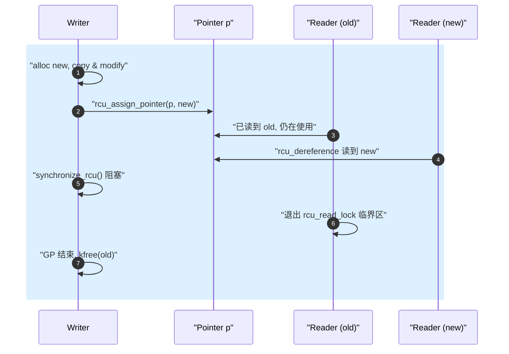
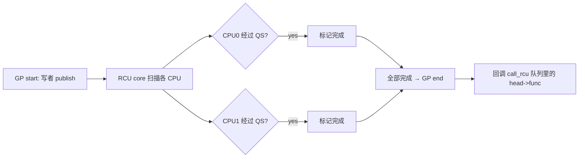

# RCU 读-复制-更新机制

> [!note]
> **Ref:**
> - [`include/linux/rcupdate.h`](../../../sdk/100ask_imx6ull-sdk/Linux-4.9.88/include/linux/rcupdate.h)
> - [`kernel/rcu/tree.c`](../../../sdk/100ask_imx6ull-sdk/Linux-4.9.88/kernel/rcu/tree.c)
> - [`kernel/rcu/tree_plugin.h`](../../../sdk/100ask_imx6ull-sdk/Linux-4.9.88/kernel/rcu/tree_plugin.h) `call_rcu()@647`、`synchronize_rcu()@667`
> - [`kernel/rcu/tiny.c`](../../../sdk/100ask_imx6ull-sdk/Linux-4.9.88/kernel/rcu/tiny.c)
> - [`kernel/rcu/update.c`](../../../sdk/100ask_imx6ull-sdk/Linux-4.9.88/kernel/rcu/update.c) `__rcu_read_lock()@200`
> - [`include/linux/rculist.h`](../../../sdk/100ask_imx6ull-sdk/Linux-4.9.88/include/linux/rculist.h)
> - `Documentation/RCU/whatisRCU.txt`


## 1. 核心思想：读端零开销

RCU (Read-Copy-Update) 是 Linux 内核中**读极多写极少**场景的首选同步机制。它的根本承诺：

> **读者永不阻塞、永不写共享内存、（在 CONFIG_PREEMPT=n 时）零指令开销**。

实现这种"魔法"的代价转嫁给写者：写者必须**复制旧对象 → 修改副本 → 原子地把指针切到新副本 → 等待所有"在切换前已经开始的读者"完成 → 释放旧对象**。

这个"等待所有旧读者完成"的窗口叫 **grace period (GP)**，是 RCU 的灵魂。




## 2. 四个关键 API

| API                              | 作用                                                |
| -------------------------------- | --------------------------------------------------- |
| `rcu_read_lock() / _unlock()`    | 标记读端临界区，禁止该 CPU 进入 quiescent state    |
| `rcu_dereference(p)`             | 安全读取 RCU 保护的指针（含必要的 memory barrier） |
| `rcu_assign_pointer(p, v)`       | 写者发布指针（含 release barrier）                  |
| `synchronize_rcu()`              | 阻塞直到 GP 结束                                    |
| `call_rcu(head, func)`           | 异步：GP 结束后回调 `func` 释放（不阻塞写者）      |

### 2.1 `rcu_read_lock` 的实现

```c
// kernel/rcu/update.c:200 (CONFIG_PREEMPT_RCU=y)
void __rcu_read_lock(void) {
    current->rcu_read_lock_nesting++;
    barrier();
}
```

在 `CONFIG_PREEMPT_RCU=n`（即经典 server 配置）下，`rcu_read_lock()` **直接展开为 `preempt_disable()`**——一条 `preempt_count++` 加编译屏障，没有任何原子操作或总线锁。这是"读端零开销"的来源。

IMX6ULL `imx_v6_v7_defconfig` 通常选 `TREE_RCU + PREEMPT_RCU`（依抢占模型而定），但读端开销在两种模式下都极低。


## 3. Grace Period：等什么？

GP 的定义：**所有 CPU 至少经过一次 quiescent state (QS)**。QS = "我现在不可能持有任何 RCU 读端引用"。

经典 (non-preemptible) RCU 的 QS 触发点：

1. **上下文切换** (`schedule()`)
2. **进入 idle**
3. **从内核态返回用户态**
4. **`cond_resched()`**

只要每个 CPU 都经过其中之一，就证明所有"GP 开始之前的读者"都退出了——因为读端禁止抢占，读者持锁期间这些事都不会发生。



在 Tree-RCU 中，CPU 通过 per-CPU `rcu_data` 上报 QS，向 `rcu_node` 树聚合，最终由 `rcu_state` 决定 GP 结束。`rcu_gp_kthread()`（`kernel/rcu/tree.c`）是核心调度线程，负责推进 GP。


## 4. Tree-RCU vs Tiny-RCU

| 维度          | Tiny-RCU (`tiny.c`)            | Tree-RCU (`tree.c`)              |
| ------------- | ------------------------------ | -------------------------------- |
| `CONFIG`      | `CONFIG_TINY_RCU` (UP only)    | `CONFIG_TREE_RCU` (SMP)          |
| 数据结构      | 单 list 头                     | 多层 `rcu_node` 树 + per-CPU `rcu_data` |
| GP 检测       | 直接在 `synchronize_rcu` 里轮询 | `rcu_gp_kthread` 异步推进         |
| 适用          | 单核、嵌入式 (≤ 64KB 节省)     | SMP（包括 4 核 IMX6ULL 之类）    |
| 回调延迟      | 极低（同步）                   | 取决于 GP 长度（通常 ms 级）     |

IMX6ULL 4 核 Cortex-A7 → 默认 Tree-RCU。单核裁剪场景才会切到 Tiny。

`call_rcu()` 在 Tree-RCU 中（`tree_plugin.h:647`）把 `rcu_head` 挂入当前 CPU 的 `rcu_data->cblist`，由 `rcu_do_batch()` 在 GP 结束后的 softirq (RCU_SOFTIRQ) 上下文里逐个调用 `head->func`。


## 5. 典型用例：RCU 保护的链表

`include/linux/rculist.h` 提供 `_rcu` 后缀变体：

```c
struct foo {
    struct list_head node;
    int              key;
    int              data;
    struct rcu_head  rcu;
};

LIST_HEAD(foo_list);
DEFINE_SPINLOCK(foo_lock);   /* 仅写者用 */

/* ----------- 读者：可在任何上下文（含中断），完全无锁 ---------- */
struct foo *foo_lookup(int key)
{
    struct foo *p;
    rcu_read_lock();
    list_for_each_entry_rcu(p, &foo_list, node) {
        if (p->key == key) {
            int v = p->data;        /* 可继续在锁内读字段 */
            rcu_read_unlock();
            return p;               /* 实际驱动里通常拷贝出去再 unlock */
        }
    }
    rcu_read_unlock();
    return NULL;
}

/* ----------- 写者：互相之间用 spinlock 串行 ----------- */
static void foo_reclaim(struct rcu_head *h)
{
    struct foo *p = container_of(h, struct foo, rcu);
    kfree(p);
}

int foo_delete(int key)
{
    struct foo *p;
    spin_lock(&foo_lock);
    list_for_each_entry(p, &foo_list, node) {
        if (p->key == key) {
            list_del_rcu(&p->node);    /* 原子 unlink */
            spin_unlock(&foo_lock);
            call_rcu(&p->rcu, foo_reclaim);  /* 异步 free */
            return 0;
        }
    }
    spin_unlock(&foo_lock);
    return -ENOENT;
}
```

读侧要点：

- `list_for_each_entry_rcu` 内部用 `rcu_dereference` 跟随 `next` 指针，保证看到的链表节点要么是旧版本要么是新版本，永远不会是"半更新"。
- 读端期间 **不能睡眠**（除非是 SRCU），因为这会让 QS 永远到不来，GP 卡死。

写侧要点：

- 多写者之间仍需 spinlock/mutex 串行——RCU 不帮写者互斥。
- 选择 `synchronize_rcu()`（同步等 GP，简单但慢）还是 `call_rcu()`（异步注册回调，写者立即返回），取决于写者上下文是否允许阻塞。


## 6. 何时不该用 RCU

1. **写远多于读**：每次写都要等 GP，吞吐很差。
2. **需要在读端睡眠**：用 SRCU (`Sleepable RCU`) 或 mutex。
3. **数据结构不便"复制"**：例如有大量内嵌字段、外部指针的对象，复制成本极高时不划算。
4. **强一致性要求**：RCU 允许读者短暂看到旧值，对要求"写后立即可见"的场景不合适。


## 7. 调试观察

```sh
cat /sys/kernel/debug/rcu/rcudata    # 每 CPU GP 状态
cat /sys/kernel/debug/rcu/rcugp      # GP 序号
dmesg | grep -i rcu                  # rcu_sched stall 警告
```

`rcu_sched stall` 警告说明某 CPU 长时间没经过 QS——通常因为驱动里有"长循环不让出 CPU"或"在禁抢占下死循环"，这类 bug 在启用 RCU 的内核中会被这条日志暴露。


## 8. 小结

- RCU = 读端零成本 + 写端"复制+发布+等GP+回收"。
- GP 通过"所有 CPU 经过一次 QS"间接证明无遗留读者。
- IMX6ULL 上默认 Tree-RCU；驱动只要遵守"读端不睡眠 + `rcu_assign_pointer/rcu_dereference` 配对"两条规则即可安全使用。
- 是 4.9 内核中替代 `rwlock_t` 的首选方案。
