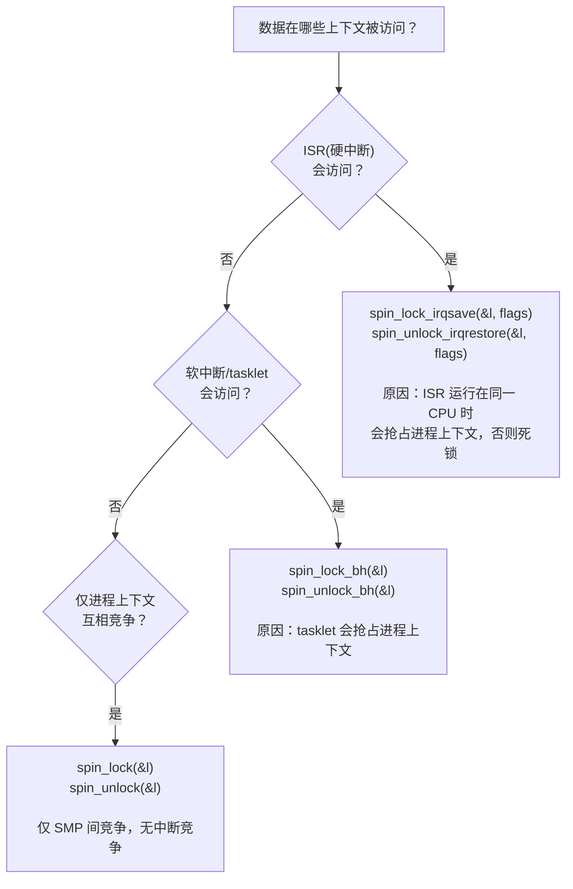

# 内核同步原语：驱动上下文速查

> [!note]
> **Ref:** [`note/虚拟化/进程通信IPC/semaphore/04-kernel-sync-primitives.md`](../../虚拟化/进程通信IPC/semaphore/04-kernel-sync-primitives.md)（完整结构、API、原理）, `sdk/Linux-4.9.88/include/linux/spinlock.h`, `mutex.h`

---

## 1. 上下文 × 原语约束矩阵

| 原语 | 硬中断 ISR | 软中断/tasklet/timer | 进程上下文 |
|------|:---:|:---:|:---:|
| `atomic_t` 操作 | ✓ | ✓ | ✓ |
| `spinlock_t`（基础）| ✗（会死锁）| ✓ | ✓ |
| `spinlock_t` + `_irq` 变体 | ✓ | ✓ | ✓ |
| `spinlock_t` + `_bh` 变体 | ✓（关BH）| ✓ | ✓ |
| `mutex` | ✗ | ✗ | ✓ |
| `semaphore` | ✗ | ✗ | ✓ |
| `rw_semaphore` | ✗ | ✗ | ✓ |
| `completion` (wait侧) | ✗ | ✗ | ✓ |
| `completion` (complete侧) | ✓ | ✓ | ✓ |
| `seqlock` (write侧) | ✓ | ✓ | ✓ |
| `seqlock` (read侧) | ✓ | ✓ | ✓ |

> ✗ = 会导致睡眠/调度，在该上下文中造成内核 BUG

---

## 2. spinlock 变体选型

**规则：持有 spinlock 的代码必须与所有可能竞争的上下文使用匹配的变体。**



### 具体 API

```c
/* ISR 竞争 — 推荐写法（自动保存/恢复中断状态）*/
unsigned long flags;
spin_lock_irqsave(&dev->lock, flags);
/* ... 临界区 ... */
spin_unlock_irqrestore(&dev->lock, flags);

/* BH(软中断/tasklet) 竞争 */
spin_lock_bh(&dev->lock);
/* ... 临界区 ... */
spin_unlock_bh(&dev->lock);

/* 仅进程上下文（多核）*/
spin_lock(&dev->lock);
/* ... 临界区 ... */
spin_unlock(&dev->lock);

/* 尝试获锁（非阻塞，返回1=成功，0=失败）*/
if (spin_trylock_irqsave(&dev->lock, flags)) {
    /* ... */
    spin_unlock_irqrestore(&dev->lock, flags);
}
```

---

## 3. 驱动模板：ISR 与进程上下文共享数据

```c
struct my_dev {
    spinlock_t   lock;           /* 保护以下字段 */
    u32          hw_status;      /* ISR 和 read() 均访问 */
    wait_queue_head_t wq;
};

/* ISR（硬中断）：用 irqsave 变体 */
static irqreturn_t my_isr(int irq, void *dev_id)
{
    struct my_dev *dev = dev_id;
    unsigned long flags;

    spin_lock_irqsave(&dev->lock, flags);
    dev->hw_status = readl(dev->base + STATUS);
    spin_unlock_irqrestore(&dev->lock, flags);

    wake_up_interruptible(&dev->wq);
    return IRQ_HANDLED;
}

/* read() 系统调用（进程上下文）：用 irqsave 变体与 ISR 匹配 */
static ssize_t my_read(struct file *f, char __user *buf, size_t n, loff_t *p)
{
    struct my_dev *dev = f->private_data;
    unsigned long flags;
    u32 status;

    wait_event_interruptible(dev->wq, dev->hw_status != 0);

    spin_lock_irqsave(&dev->lock, flags);
    status = dev->hw_status;
    dev->hw_status = 0;
    spin_unlock_irqrestore(&dev->lock, flags);

    return copy_to_user(buf, &status, sizeof(status)) ? -EFAULT : sizeof(status);
}
```

---

## 4. completion — 一次性事件同步

**适用：** 驱动 probe 等待硬件就绪、异步 IO 完成通知、模块卸载等待线程退出。

```c
struct completion hw_ready;

/* 初始化 */
init_completion(&hw_ready);
/* 或静态：DECLARE_COMPLETION(hw_ready); */

/* 等待侧（进程上下文，可睡眠）*/
wait_for_completion(&hw_ready);
wait_for_completion_interruptible(&hw_ready);
wait_for_completion_timeout(&hw_ready, msecs_to_jiffies(1000));

/* 触发侧（任意上下文）*/
complete(&hw_ready);        /* 唤醒一个等待者 */
complete_all(&hw_ready);    /* 唤醒所有等待者 */

/* 重置（复用时）*/
reinit_completion(&hw_ready);
```

---

## 5. 常见错误模式

```c
/* ❌ 错误：在 ISR 中用 plain spinlock（自死锁）*/
static irqreturn_t bad_isr(int irq, void *dev_id) {
    spin_lock(&dev->lock);   /* 若 ISR 打断了正在 spin_lock 的进程 → 死锁 */
    ...
}

/* ✓ 正确：irqsave 变体 */
static irqreturn_t good_isr(int irq, void *dev_id) {
    unsigned long flags;
    spin_lock_irqsave(&dev->lock, flags);
    ...
    spin_unlock_irqrestore(&dev->lock, flags);
}

/* ❌ 错误：在 tasklet 中使用 mutex */
static void bad_tasklet(unsigned long data) {
    mutex_lock(&dev->mutex);  /* tasklet 是 BH 上下文，mutex 会 BUG! */
}

/* ✓ 正确：在 tasklet 中用 spinlock_bh */
static void good_tasklet(unsigned long data) {
    spin_lock_bh(&dev->lock);
    ...
    spin_unlock_bh(&dev->lock);
}

/* ❌ 错误：持 spinlock 时调用可能睡眠的函数 */
spin_lock(&dev->lock);
kzalloc(size, GFP_KERNEL);   /* GFP_KERNEL 可能睡眠，MUST use GFP_ATOMIC */

/* ✓ 正确 */
spin_lock(&dev->lock);
kzalloc(size, GFP_ATOMIC);   /* 原子分配，不睡眠 */
```

---

## 6. GFP 标志与上下文

| 上下文 | 允许的 GFP 标志 |
|--------|----------------|
| 进程上下文（可睡眠）| `GFP_KERNEL`（推荐）|
| 中断/原子上下文（spinlock 持有）| `GFP_ATOMIC`（可能失败）|
| DMA 内存 | `GFP_KERNEL \| GFP_DMA` |
| 不触发 OOM killer | `GFP_KERNEL \| __GFP_NORETRY` |

```c
/* 原子上下文安全分配 */
buf = kmalloc(size, GFP_ATOMIC);
if (!buf)
    return -ENOMEM;   /* GFP_ATOMIC 可能失败，必须检查 */
```
