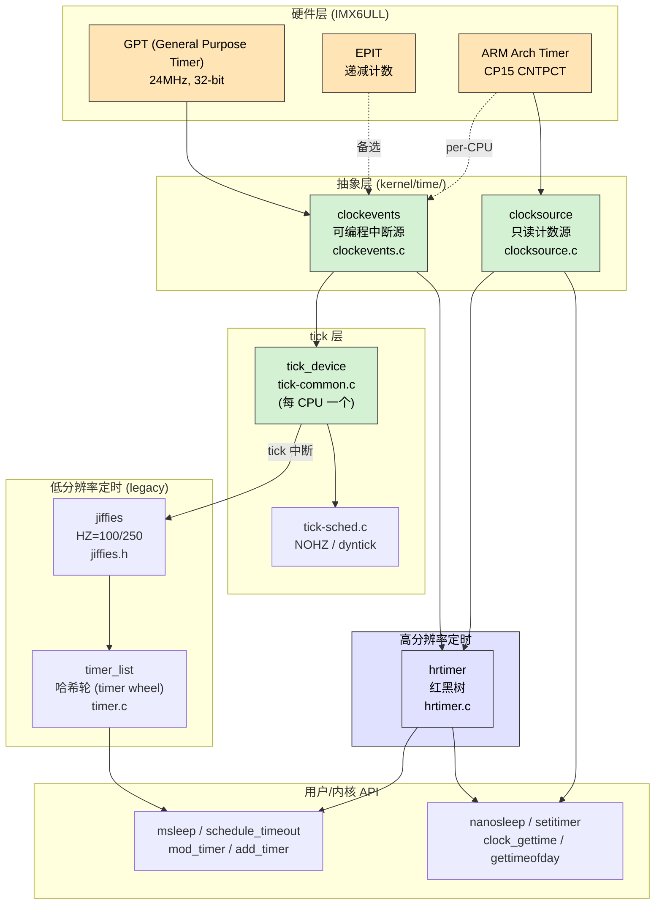
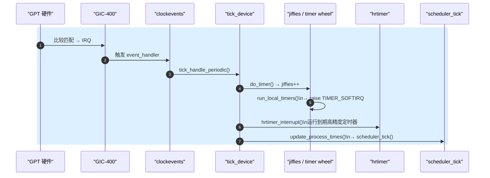

# Linux 时间子系统全景

> [!note]
> **Ref:** [`kernel/time/clocksource.c`](../../../sdk/100ask_imx6ull-sdk/Linux-4.9.88/kernel/time/clocksource.c), [`kernel/time/clockevents.c`](../../../sdk/100ask_imx6ull-sdk/Linux-4.9.88/kernel/time/clockevents.c), [`kernel/time/tick-common.c`](../../../sdk/100ask_imx6ull-sdk/Linux-4.9.88/kernel/time/tick-common.c), [`kernel/time/hrtimer.c`](../../../sdk/100ask_imx6ull-sdk/Linux-4.9.88/kernel/time/hrtimer.c), [`kernel/time/timer.c`](../../../sdk/100ask_imx6ull-sdk/Linux-4.9.88/kernel/time/timer.c), [`include/linux/jiffies.h`](../../../sdk/100ask_imx6ull-sdk/Linux-4.9.88/include/linux/jiffies.h)

## 1. 两个基本问题

Linux 时间子系统回答两个正交的问题：

1. **“现在几点？”** —— 需要一个**单调递增、高分辨率、可读**的计数器 → **clocksource**
2. **“到点叫我。”** —— 需要一个**可编程产生中断**的硬件 → **clockevents**

所有上层 API（`jiffies`、`timer_list`、`hrtimer`、`nanosleep`、`gettimeofday` …）都构筑在这两类抽象之上。

---

## 2. 核心依赖图（中心图）

> **4.9.88 现实**：低分辨率路径 `clockevents → tick_device → tick 中断 → jiffies++ → timer_list 到期` 始终存在；打开 `CONFIG_HIGH_RES_TIMERS` 后，`tick_device` 切为 oneshot 模式，`hrtimer` 接管下一次中断编程。

---

## 3. 典型 tick 一次完整流程

---

## 4. IMX6ULL 时间硬件落地

| 硬件 | 角色 | 备注 |
|------|------|------|
| **GPT** | 主 clockevent device | `arch/arm/boot/dts/imx6ul.dtsi` 中 `gpt1`, 24MHz 输入，用作 tick 源 |
| **EPIT** | 备选 timer | Enhanced Periodic Interrupt Timer，早期 BSP 曾用作 clockevent |
| **ARM Arch Timer** | 可作 clocksource/clockevent | Cortex-A7 CP15 `CNTPCT_EL0`（per-CPU），IMX6ULL 单核场景意义较小 |
| **SNVS RTC** | 墙上时间 | 不参与 tick，仅供 `hwclock` |

DTS 中常见节点：`gpt1: gpt@2098000 { compatible = "fsl,imx6ul-gpt" };`，驱动 `drivers/clocksource/timer-imx-gpt.c` 同时注册 clocksource + clockevents。

---

## 5. 分辨率与 HZ

- `HZ` 在 ARM 默认 **100**，即一个 jiffy = 10ms
- `jiffies` 为 32 位（`jiffies_64` 64 位），回绕需用 `time_after()` / `time_before()` 宏
- `timer_list` 精度受限于 HZ；**hrtimer** 精度可达硬件分辨率（GPT 24MHz ≈ 41ns）

---

## 6. 笔记导航

| 文件 | 内容 |
|------|------|
| [`01-jiffies-HZ.md`](./01-jiffies-HZ.md) | `jiffies` / `HZ` / 回绕比较宏 / `time_after` |
| [`02-soft-timer.md`](./02-soft-timer.md) | `timer_list` 哈希轮、`mod_timer`、TIMER_SOFTIRQ |
| [`03-hrtimer.md`](./03-hrtimer.md) | `hrtimer` 红黑树、oneshot 模式、`schedule_hrtimeout` |
| [`04-tick-nohz.md`](./04-tick-nohz.md) | tick_device、周期 vs oneshot、NOHZ/dyntick |
| [`05-imx6ull-gpt.md`](./05-imx6ull-gpt.md) | IMX6ULL GPT 控制器寄存器与 timer-imx-gpt.c 剖析 |

交叉引用：[`../defer/00-overview.md`](../defer/00-overview.md)（定时器属于“延迟执行”家族的一员）。
