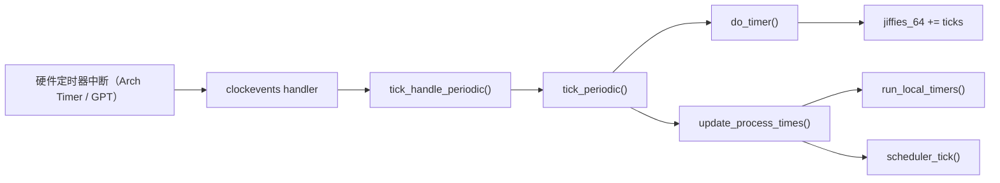

# jiffies 与 HZ — 内核时间基石

> [!note]
> **Ref:** [`include/linux/jiffies.h`](../../../sdk/100ask_imx6ull-sdk/Linux-4.9.88/include/linux/jiffies.h), [`kernel/time/timer.c`](../../../sdk/100ask_imx6ull-sdk/Linux-4.9.88/kernel/time/timer.c), [`kernel/time/tick-common.c`](../../../sdk/100ask_imx6ull-sdk/Linux-4.9.88/kernel/time/tick-common.c), 本地 [`time/05-imx6ull-gpt.md`](05-imx6ull-gpt.md)

`jiffies` 是 Linux 最古老的时间度量单位：内核启动以来发生的 timer tick 次数。它是软件定时器、超时、负载统计等上层机制的时间基准。理解 `jiffies` 与 `HZ` 的语义及其更新链路，是进入 time 子系统的第一步。


## 1. HZ：tick 的频率

`HZ` 是宏，表示每秒钟产生多少个 timer tick。它由 `CONFIG_HZ` 在编译时决定，常见取值：

| HZ  | 周期     | 场景                 |
| --- | -------- | -------------------- |
| 100 | 10 ms    | 老式嵌入式 / 省电    |
| 250 | 4 ms     | 桌面默认（通用平衡） |
| 300 | 3.33 ms  | 影音（与 NTSC 兼容） |
| 1000| 1 ms     | 低延迟服务器 / 实时  |

在 IMX6ULL 默认 `imx_v6_v7_defconfig` 下 `CONFIG_HZ=100`，也就是每 10 ms 一次 tick。

> HZ 越高：调度粒度越细，超时精度越高，但 tick 中断开销越大。动态 tick（NO_HZ）可在空闲时抑制 tick，详见 [`04-tick-nohz.md`](04-tick-nohz.md)。


## 2. jiffies 的定义

在 `include/linux/jiffies.h` 中：

```c
extern u64 __cacheline_aligned_in_smp jiffies_64;
extern unsigned long volatile __cacheline_aligned_in_smp jiffies;
```

- `jiffies_64`：64 位计数器，不会溢出（以 HZ=1000 算也要 5 亿年）。
- `jiffies`：`unsigned long`，在 32 位 ARM 上是 32 位。与 `jiffies_64` 的低位别名，由链接脚本绑定到同一地址。

32 位的 `jiffies` 在 HZ=100 下约 497 天溢出一次，HZ=1000 下约 49.7 天，所以比较时必须使用回绕安全的宏。


## 3. 防回绕：time_after / time_before

```c
#define time_after(a,b)     ((long)((b) - (a)) < 0)
#define time_before(a,b)    time_after(b,a)
#define time_after_eq(a,b)  ((long)((a) - (b)) >= 0)
#define time_in_range(a,b,c) (time_after_eq(a,b) && time_before_eq(a,c))
```

核心技巧：用有符号差值 `(long)(b - a)` 判断顺序，即使 `jiffies` 刚刚回绕也能正确比较。**永远不要写 `if (jiffies > timeout)`**，请改成 `if (time_after(jiffies, timeout))`。

典型超时等待：

```c
unsigned long timeout = jiffies + msecs_to_jiffies(500);
while (!condition) {
    if (time_after(jiffies, timeout))
        return -ETIMEDOUT;
    cpu_relax();
}
```


## 4. tick 中断链路：从硬件到 jiffies_64++

IMX6ULL 上，tick 由 ARM 架构的 Generic Timer 或 i.MX GPT 驱动。无论底层硬件是谁，最终都接入 `clockevent` 框架，由 tick 层统一分发：



关键函数定位：

- `tick_handle_periodic()` / `tick_periodic()`：`kernel/time/tick-common.c`
- `do_timer()`：`kernel/time/timer.c`，累加 `jiffies_64` 并调用 `calc_global_load()`
- `update_process_times()`：`kernel/time/timer.c`，在当前进程上下文统计用户/内核态 tick，并驱动软定时器与 scheduler tick

在 SMP 上只有一个 CPU（boot CPU）负责 `do_timer()`，其它 CPU 通过本地 tick 维护自身统计。


## 5. HZ vs USER_HZ

用户空间看到的 tick 频率通过 `sysconf(_SC_CLK_TCK)` 返回，这个值即 `USER_HZ`（一般固定为 100）。内核与用户空间对 tick 频率的约定不一定相同，所以 `/proc/stat`、`times(2)` 返回的 clock_t 单位是 `USER_HZ`，而不是内核实际的 `HZ`。

转换宏：

```c
jiffies_to_clock_t(x)    // 内核 HZ tick 数 -> USER_HZ clock_t
clock_t_to_jiffies(x)    // 反向
```


## 6. 时间单位换算

`include/linux/jiffies.h` 提供一整套换算宏：

| 宏                          | 用途                              |
| --------------------------- | --------------------------------- |
| `msecs_to_jiffies(ms)`      | 毫秒 → jiffies（向上取整，安全）  |
| `usecs_to_jiffies(us)`      | 微秒 → jiffies                    |
| `jiffies_to_msecs(j)`       | jiffies → 毫秒                    |
| `nsecs_to_jiffies(ns)`      | 纳秒 → jiffies                    |
| `timespec_to_jiffies(ts)`   | `struct timespec` → jiffies       |

注意 `msecs_to_jiffies(1)` 在 HZ=100 时返回 1（10 ms），向上取整保证不小于请求值——这是计算超时的正确语义。


## 7. jiffies 能做什么，不能做什么

能做：
- 粗粒度超时（几十毫秒以上）
- 软定时器 (`timer_list`) 的到期比较
- 系统活跃时间 (`uptime`) 的粗略估算

不能做：
- 微秒级计时——使用 `ktime_get()` / `getnstimeofday()`
- 高分辨率定时器——使用 `hrtimer`，参考 [`03-hrtimer.md`](03-hrtimer.md)
- 跨 CPU 原子递增——`jiffies_64` 只由一个 CPU 写入


## 8. 小结

`jiffies` 是一个"低精度但极廉价"的时间戳：每次 tick 只做一次内存写入，所有上层定时机制都以它为底。但因为 32 位回绕的存在，必须用 `time_after` 系列宏比较；因为精度只有 `1/HZ` 秒，高精度场景需要切换到 hrtimer。掌握 `jiffies` 的更新链路（tick → `do_timer` → `jiffies_64`）也是理解 NO_HZ 动态 tick 以及 hrtimer 与 tick 共存关系的前置。

**下一步阅读：**
- [`02-soft-timer.md`](02-soft-timer.md) — 基于 jiffies 的 `timer_list`
- [`03-hrtimer.md`](03-hrtimer.md) — 高精度定时器
- [`04-tick-nohz.md`](04-tick-nohz.md) — 动态 tick / NO_HZ
- [`05-imx6ull-gpt.md`](05-imx6ull-gpt.md) — IMX6ULL GPT 硬件细节
