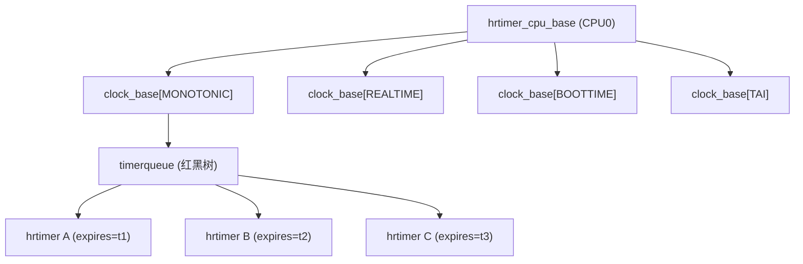
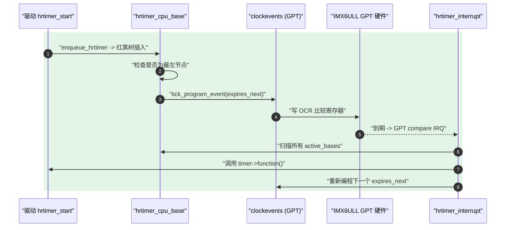

# hrtimer 高精度定时器

> [!note]
> **Ref:** [`include/linux/hrtimer.h`](../../../sdk/100ask_imx6ull-sdk/Linux-4.9.88/include/linux/hrtimer.h)，[`kernel/time/hrtimer.c`](../../../sdk/100ask_imx6ull-sdk/Linux-4.9.88/kernel/time/hrtimer.c)，[`kernel/time/clockevents.c`](../../../sdk/100ask_imx6ull-sdk/Linux-4.9.88/kernel/time/clockevents.c)，[`Documentation/timers/hrtimers.txt`](../../../sdk/100ask_imx6ull-sdk/Linux-4.9.88/Documentation/timers/hrtimers.txt)，本仓库 [`02-soft-timer.md`](./02-soft-timer.md)、[`05-imx6ull-gpt.md`](./05-imx6ull-gpt.md)

## 1. 为什么需要 hrtimer

传统的 `timer_list`（下文叫 **soft timer**）精度被 `HZ` 钉死：IMX6ULL 默认 `CONFIG_HZ=100`，也就是 **10 ms 一次** tick，最小可表达定时粒度 10 ms，抖动也是 10 ms 量级。这对以下场景是不可接受的：

- 音频/视频采样、IIO 传感器等微秒级周期。
- 精确脉宽 GPIO bit-banging、1-Wire 时序。
- `nanosleep`、POSIX timer、`itimer` 等要求任意精度的系统调用。
- 网络 QoS、packet pacing。

hrtimer 的目标：**让超时精度只受硬件 clockevent device 的分辨率限制**，而与 `HZ` 解耦。IMX6ULL 上 clockevent 由 **GPT（General Purpose Timer）** 提供，驱动在 `drivers/clocksource/timer-imx-gpt.c`，理论分辨率可到 24 MHz 时钟域下的几十纳秒。

## 2. 数据模型

### 2.1 三层结构

hrtimer 是一个 **per-CPU、per-clock、红黑树排序** 的系统：



对应 4.9 源码定义（`include/linux/hrtimer.h:100` 起）：

```c
struct hrtimer {
    struct timerqueue_node        node;       /* rbtree 节点 + expires */
    ktime_t                       _softexpires;
    enum hrtimer_restart        (*function)(struct hrtimer *);
    struct hrtimer_clock_base    *base;
    u8                            state;      /* INACTIVE / ENQUEUED */
    u8                            is_rel;
};

struct hrtimer_clock_base {
    struct hrtimer_cpu_base      *cpu_base;
    int                           index;
    clockid_t                     clockid;
    struct timerqueue_head        active;     /* 红黑树根 */
    ktime_t                     (*get_time)(void);
    ktime_t                       offset;
};

enum hrtimer_base_type {
    HRTIMER_BASE_MONOTONIC,
    HRTIMER_BASE_REALTIME,
    HRTIMER_BASE_BOOTTIME,
    HRTIMER_BASE_TAI,
    HRTIMER_MAX_CLOCK_BASES,
};

struct hrtimer_cpu_base {
    raw_spinlock_t      lock;
    struct hrtimer     *running;
    unsigned int        cpu;
    unsigned int        active_bases;   /* bitmap，哪些 clock base 非空 */
    ktime_t             expires_next;   /* 下次最早到期时间 */
    struct hrtimer     *next_timer;
    unsigned int        hres_active : 1;
    ...
    struct hrtimer_clock_base clock_base[HRTIMER_MAX_CLOCK_BASES];
};
```

- **每 CPU 一个 `hrtimer_cpu_base`**：避免跨核锁争用。
- 每个 CPU 挂 4 棵 clock_base（MONO / REAL / BOOT / TAI），每个 base 一棵红黑树。
- 最左节点就是该 base 的最近到期者；`expires_next` 跨所有 base 取最小值，用来编程 clockevent 硬件。
- `state` 字段只记录是否在树里，**回调正在运行** 的状态靠 `cpu_base->running == timer` 标识——这使得回调内可以安全地 `kfree(timer)`（先解树再跑回调）。

### 2.2 和 timerqueue 的关系

`timerqueue` 是一个“缓存最早节点指针的红黑树”，在 `include/linux/timerqueue.h`。插入/删除 O(log N)，查询最近到期 O(1)。hrtimer 与 POSIX CPU timer 共用它。

## 3. 核心 API

```c
void hrtimer_init(struct hrtimer *timer, clockid_t which_clock,
                  enum hrtimer_mode mode);

timer->function = my_callback;

int  hrtimer_start(struct hrtimer *timer, ktime_t tim, enum hrtimer_mode mode);
int  hrtimer_start_range_ns(struct hrtimer *timer, ktime_t tim,
                            u64 delta_ns, enum hrtimer_mode mode);

int  hrtimer_cancel(struct hrtimer *timer);   /* 同步等待回调结束 */
int  hrtimer_try_to_cancel(struct hrtimer *timer);

u64  hrtimer_forward(struct hrtimer *timer, ktime_t now, ktime_t interval);
u64  hrtimer_forward_now(struct hrtimer *timer, ktime_t interval);

bool hrtimer_active(const struct hrtimer *timer);
bool hrtimer_is_queued(struct hrtimer *timer);
```

### 3.1 `enum hrtimer_mode`

```c
HRTIMER_MODE_ABS        = 0x0,   /* expires 为绝对时间 */
HRTIMER_MODE_REL        = 0x1,   /* expires 为相对当前 */
HRTIMER_MODE_PINNED     = 0x02,  /* 绑定到当前 CPU，不迁移 */
HRTIMER_MODE_ABS_PINNED = 0x02,
HRTIMER_MODE_REL_PINNED = 0x03,
```

### 3.2 回调返回值

```c
enum hrtimer_restart {
    HRTIMER_NORESTART,  /* 一次性 */
    HRTIMER_RESTART,    /* 通常配合 hrtimer_forward 做周期定时 */
};
```

周期定时器的惯用写法：

```c
static enum hrtimer_restart tick_cb(struct hrtimer *t)
{
    /* do work */
    hrtimer_forward_now(t, ktime_set(0, 1000 * 1000)); /* 1 ms */
    return HRTIMER_RESTART;
}
```

`hrtimer_forward` 会把 `expires` 推进到 **大于 now 的下一个整倍数**，可以自动吞掉因回调延迟导致的多次到期，避免“时间债务”累积。

## 4. 回调上下文：softirq 还是 hardirq？

这是 hrtimer 最容易踩的坑。**Linux 4.9 的规则：**

- 在 **high-resolution mode** 下（`CONFIG_HIGH_RES_TIMERS=y` 且底层有合适 clockevent），hrtimer 回调默认跑在 **hardirq 上下文**——它是从 `hrtimer_interrupt()` 里直接分派出来的。
- 在 **low-resolution fallback**（没高精度硬件，或尚未切换）时，hrtimer 挂靠到常规 tick，由 `hrtimer_run_queues()` 在 tick handler / softirq 中运行。
- 某些特殊用途（如 `HRTIMER_BASE_SOFT` 的 itimer）借道 `HRTIMER_SOFTIRQ`，由 `run_hrtimer_softirq()` 执行。注意 4.9 此机制较弱，完整的 **soft hrtimer** 体系（`is_hard` / `is_soft` 显式区分）要到 4.16 以后才成熟。

**给驱动作者的可执行结论：**

> 在 IMX6ULL + 4.9.88 上，写 `hrtimer_init(HRTIMER_BASE_MONOTONIC)` + `hrtimer_start(REL)` 的驱动时，**假定回调在 hardirq 上下文运行**：不能睡眠、不能 `mutex_lock`、不能 `copy_to_user`；`spin_lock` 必须用 `_irqsave` 版本或确认已在中断关闭环境；要做耗时工作请在回调里 `tasklet_schedule` / `schedule_work` / `wake_up` 一个线程。

## 5. 红黑树 + clockevents：硬件编程回路



关键入口函数（`kernel/time/hrtimer.c`）：

- `enqueue_hrtimer()` — 插入 timerqueue；若成为最左节点则触发 reprogram。
- `hrtimer_reprogram()` — 比较 `expires_next` 与新 timer，必要时调 `tick_program_event()`。
- `hrtimer_interrupt()` — clockevent ISR 走到这里，遍历到期 timer 批量执行回调，维护 `cpu_base->running`，循环直到 `expires_next > now`，检测 hang。
- `hrtimer_run_queues()` — 低精度回退路径，tick 处理里调用。

## 6. hrtimer vs `timer_list`（soft timer）

| 维度 | `hrtimer` | `timer_list` |
| --- | --- | --- |
| 精度 | 纳秒级，受 clockevent 硬件限制 | 受 `HZ` 限制（IMX6ULL 10 ms） |
| 数据结构 | per-CPU 红黑树 | per-CPU 时间轮（timer wheel） |
| 到期检查 | clockevent ISR 触发 | tick handler 轮询 |
| 回调上下文 | hardirq（4.9 默认） | softirq `TIMER_SOFTIRQ` |
| 成本 | 插入/取消 O(log N)，但每次都可能 reprogram 硬件 | 插入 O(1)，成本低 |
| 典型用途 | nanosleep、QoS、精密采样、I2S/PWM 节拍 | 看门狗、心跳、秒级超时 |
| 取消语义 | `hrtimer_cancel` 同步等回调完成 | `del_timer_sync` 同理 |

选型口诀：**秒/百毫秒级且可容忍 jiffies 抖动 → `timer_list`；毫秒及以下、对抖动敏感 → `hrtimer`。** 大量高频到期的场景（上万个 timer）同时要权衡红黑树 O(log N) 带来的 reprogram 开销。

## 7. high-res mode vs low-res fallback

- 开机早期 clockevent 尚未就绪，hrtimer 以 **低精度模式** 挂在 tick 上跑，精度 = 1 jiffy。
- `hrtimer_run_queues()` 用 `ktime_get()` 拉取最新时间，遍历 4 个 base 执行到期 timer。
- 一旦 `tick_init_highres()` 成功把 tick device 切换成 **one-shot** 模式，`cpu_base->hres_active = 1`，之后走 `hrtimer_interrupt()` 路径。
- 判定：`hrtimer_hres_active()` 或用户态看 `/proc/timer_list` 里 `.resolution` 字段（1 ns 表示高精度已启用）。

## 8. 与 clockevents / tick device 的关系

`kernel/time/clockevents.c` 提供统一的 clockevent 抽象：

```c
struct clock_event_device {
    void (*event_handler)(struct clock_event_device *);
    int  (*set_next_event)(unsigned long evt, struct clock_event_device *);
    int  (*set_state_oneshot)(struct clock_event_device *);
    int  (*set_state_periodic)(struct clock_event_device *);
    ...
    enum clock_event_state state_use_accessors;
    unsigned int features;   /* CLOCK_EVT_FEAT_PERIODIC / _ONESHOT */
    ...
};
```

- **periodic 模式**：HZ 固定间隔触发，只够 `timer_list` 使用。
- **one-shot 模式**：由软件每次 reprogram 下一次到期，是 hrtimer 和 NO_HZ 的前提。
- tick 层在 `kernel/time/tick-*.c` 里管理“每个 CPU 的 tick device”，hrtimer core 通过 `tick_program_event()` 把 `expires_next` 写进去。

因此 hrtimer 能否到纳秒级，**取决于底层 clockevent 是否支持 one-shot 且 `set_next_event` 的 min_delta 足够小**。

## 9. IMX6ULL 硬件落地：GPT 作为 clockevent

IMX6ULL 的时钟事件源由 **GPT（General Purpose Timer）** 提供，驱动在 `drivers/clocksource/timer-imx-gpt.c`（dts compatible `"fsl,imx6ul-gpt"`）。要点：

- GPT 有 Output Compare 寄存器（OCR1/2/3）+ Free-Running Counter，配置成 **restart mode**，输入时钟一般选 24 MHz ipg_clk（约 41 ns 单位）。
- 驱动注册两个对象：
  - 一个 **clocksource**（`imx_timer->clksrc`），连续计数供 `ktime_get()` 读。
  - 一个 **clock_event_device**，实现 `set_next_event` = 写 OCR1，`state_oneshot` 切换模式。
- 到期时 GPT 拉 IRQ，中断 handler 调 `ce->event_handler()`，该 handler 在 tick 层被设为 `hrtimer_interrupt` 或 `tick_handle_periodic`，最终把到期的 hrtimer 跑起来。

细节笔记见 [`05-imx6ull-gpt.md`](./05-imx6ull-gpt.md)。

## 10. 驱动使用示例：1 ms 周期采样

```c
#include <linux/hrtimer.h>
#include <linux/ktime.h>

struct mysensor {
    struct hrtimer tick;
    ktime_t        period;
    void __iomem  *base;
    struct work_struct sample_work;
};

static enum hrtimer_restart mysensor_tick(struct hrtimer *t)
{
    struct mysensor *s = container_of(t, struct mysensor, tick);

    /* 在 hardirq 上下文，只做最短动作 */
    schedule_work(&s->sample_work);

    hrtimer_forward_now(t, s->period);
    return HRTIMER_RESTART;
}

static int mysensor_probe(struct platform_device *pdev)
{
    struct mysensor *s = devm_kzalloc(&pdev->dev, sizeof(*s), GFP_KERNEL);

    INIT_WORK(&s->sample_work, mysensor_do_sample);
    s->period = ktime_set(0, 1000 * 1000);          /* 1 ms */

    hrtimer_init(&s->tick, CLOCK_MONOTONIC, HRTIMER_MODE_REL);
    s->tick.function = mysensor_tick;

    hrtimer_start(&s->tick, s->period, HRTIMER_MODE_REL);

    platform_set_drvdata(pdev, s);
    return 0;
}

static int mysensor_remove(struct platform_device *pdev)
{
    struct mysensor *s = platform_get_drvdata(pdev);

    hrtimer_cancel(&s->tick);      /* 等到回调确实结束 */
    cancel_work_sync(&s->sample_work);
    return 0;
}
```

要点回顾：

1. `hrtimer_cancel` 是 **同步** 取消，之后回调保证不会再跑——资源释放可安全进行。
2. 回调里用 `schedule_work` 把重活甩到 workqueue 进程上下文，那里才能 `copy_to_user` / `mutex_lock`。
3. 周期节拍用 `hrtimer_forward_now` 而不是每次 `hrtimer_start`，避免累积偏差。
4. 要高精度（而非省电），必要时加 `HRTIMER_MODE_REL_PINNED` 把 timer 钉到当前 CPU，避免迁移开销。

## 11. 常见坑

- 回调在 **hardirq** 上下文（4.9 默认），不要调用任何 might_sleep 函数。
- `hrtimer_cancel` 在回调上下文里调会死锁（它要等自己）——回调若想自杀，直接返回 `HRTIMER_NORESTART`。
- 周期定时器漏 tick：一定要用 `hrtimer_forward` 系列吞掉多余到期，否则 `expires` 落后 `now` 会导致后续立刻反复触发。
- min_delta 限制：clockevent 有最小编程间隔（GPT 一般 1 µs 量级），start 小于该值会被上抬。
- NO_HZ 空闲下 hrtimer 不会“饿死”：空闲被打破会重新编程 tick device。
- 统计视图：`/proc/timer_list`、`/proc/timer_stats`（需 `CONFIG_TIMER_STATS`）、`perf timer`。

## 12. 学习路径衔接

- 上游：[`02-soft-timer.md`](./02-soft-timer.md) 讲 `timer_list` 和 HZ/jiffies，是理解“为什么需要 hrtimer”的前置。
- 下游：[`05-imx6ull-gpt.md`](./05-imx6ull-gpt.md) 讲 GPT 硬件与 clocksource/clockevent 驱动注册流程。
- 延伸：`posix-timers.c`、`alarmtimer.c`、`nanosleep` 系统调用都构筑在 hrtimer 之上；研读它们可以把“时间子系统”从硬件一路贯通到用户空间 API。
