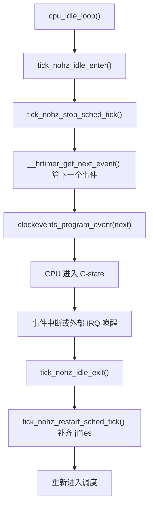
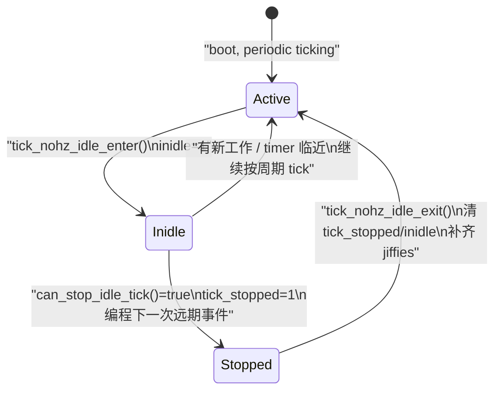
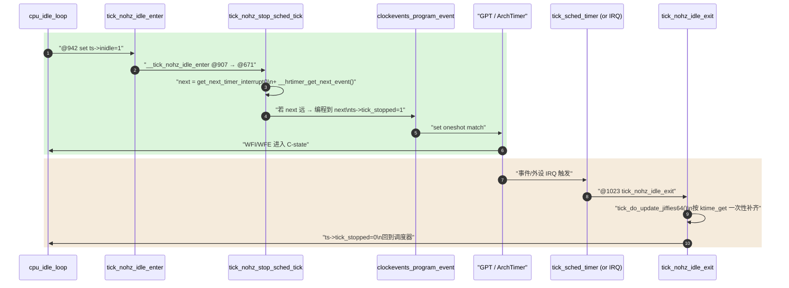

# dynticks 与 NO_HZ — 动态 tick 机制

> [!note]
> **Ref:**
> - [`kernel/time/tick-sched.c`](../../../sdk/100ask_imx6ull-sdk/Linux-4.9.88/kernel/time/tick-sched.c) `tick_nohz_stop_sched_tick()@671`、`__tick_nohz_idle_enter()@907`、`tick_nohz_idle_enter()@942`、`tick_nohz_idle_exit()@1023`
> - [`kernel/time/tick-common.c`](../../../sdk/100ask_imx6ull-sdk/Linux-4.9.88/kernel/time/tick-common.c)
> - [`kernel/time/clockevents.c`](../../../sdk/100ask_imx6ull-sdk/Linux-4.9.88/kernel/time/clockevents.c)
> - [`include/linux/tick.h`](../../../sdk/100ask_imx6ull-sdk/Linux-4.9.88/include/linux/tick.h) (`struct tick_sched`)
> - [`kernel/time/Kconfig`](../../../sdk/100ask_imx6ull-sdk/Linux-4.9.88/kernel/time/Kconfig)
> - 本地 [`01-jiffies-HZ.md`](01-jiffies-HZ.md), [`03-hrtimer.md`](03-hrtimer.md)

传统周期 tick 固定每 `1/HZ` 秒产生一次中断。CPU 即使无事可做也会被周期性唤醒，这对电池供电设备、虚拟化以及延迟敏感负载都不友好。NO_HZ（dynticks）允许内核在特定条件下**关闭周期 tick**，节省能耗或避免 tick 噪声。


## 1. 动机

周期 tick 的代价：

1. **能耗**：即使 CPU 应当进入深度 idle，tick 也会每 `1/HZ` 秒拉它出来一次。HZ=1000 时每秒被打断 1000 次，C 状态无法驻留。
2. **抖动 (jitter)**：CPU-bound 的用户态工作（HPC、DPDK、金融低延迟）不希望被无关的 tick 干扰。
3. **虚拟化开销**：每个 vCPU 的 tick 都意味着一次 VM-exit。

NO_HZ 想解决的就是"该停就停"。


## 2. 三种配置

`CONFIG` 项位于 `kernel/time/Kconfig`：

| 选项              | 行为                                                       | 适用场景                 |
| ----------------- | ---------------------------------------------------------- | ------------------------ |
| `HZ_PERIODIC`     | 经典周期 tick，从不停                                      | 简单、可预测             |
| `NO_HZ_IDLE`      | 仅在 CPU 进入 idle 时停 tick，唤醒后恢复                   | **几乎所有现代内核默认** |
| `NO_HZ_FULL`      | 非 idle 且只有 1 个可运行任务时也停 tick（"tickless CPU"） | HPC / RT / NFV           |

IMX6ULL 的 `imx_v6_v7_defconfig` 默认启用 `NO_HZ_IDLE`（作为 `NO_HZ=y` 与 `HIGH_RES_TIMERS=y` 的组合），这是节能与通用性最平衡的选择。


## 3. NO_HZ_IDLE 的工作路径

CPU 进入 idle loop 时，调度器最终会走到 `tick_nohz_idle_enter()`：



关键步骤（均在 `kernel/time/tick-sched.c`）：

1. **`tick_nohz_idle_enter()`**：标记本 CPU 进入 NO_HZ idle，调用 `tick_nohz_stop_sched_tick()`。
2. **`tick_nohz_stop_sched_tick()`**：查询下一个 hrtimer / timer_list 到期时间，重新编程 clockevent 到那个时间点；如果两者都没有，则把下一次 tick 推到 `KTIME_MAX` 附近。
3. **`tick_nohz_idle_exit()`**：被中断或 IPI 唤醒后恢复周期 tick 并通过 `tick_do_update_jiffies64()` 一次性补齐错过的 `jiffies`（它不是"几次 tick 中断"，而是"多少 HZ 周期"的重算）。

> `jiffies_64` 的精度在 NO_HZ 下不会降低，因为补齐是基于 clocksource（`ktime_get`）计算的，tick 只是触发而非源头。


## 3.1 Periodic vs One-shot clockevent

NO_HZ 的物理基础是 **clockevent device 必须支持 one-shot 模式**（`CLOCK_EVT_MODE_ONESHOT`）。

| 模式               | 特征                                  | 谁在用                              |
| ------------------ | ------------------------------------- | ----------------------------------- |
| `MODE_PERIODIC`    | 硬件按固定 `1/HZ` 周期自动重装 + 触发 | `HZ_PERIODIC` 配置；早期内核默认    |
| `MODE_ONESHOT`     | 软件每次显式编程下一个超时点          | `NO_HZ_*` + `HIGH_RES_TIMERS` 必需   |

切换流程（`tick_switch_to_oneshot()` in `tick-oneshot.c`）：

1. 内核启动时各 CPU 注册 `tick_device`，初始 `MODE_PERIODIC`。
2. 当 `HIGH_RES_TIMERS=y` 的 hrtimer 子系统激活时调用 `hrtimer_switch_to_hres()`，要求 tick 切到 one-shot。
3. 自此 tick 由 hrtimer (`tick_sched_timer`) 接管，每次 expire 时手动重新编程下一次到期点。

IMX6ULL 上 clockevent 一般是 GPT 或 ARM Generic Timer 的 per-CPU 通道，二者都支持 one-shot。若硬件**只支持** periodic，NO_HZ 不能启用，hrtimer 也降级到 jiffies 粒度。


## 3.2 `struct tick_sched` 状态机

每个 CPU 一份的 `tick_sched`（`include/linux/tick.h`）是 NO_HZ 的核心控制块：

```c
struct tick_sched {
    struct hrtimer        sched_timer;     /* one-shot tick 由它驱动 */
    unsigned long         check_clocks;
    enum tick_nohz_mode   nohz_mode;       /* NOHZ_MODE_INACTIVE/LOWRES/HIGHRES */
    unsigned int          inidle    : 1;   /* 已进入 idle loop 但未必停 tick */
    unsigned int          tick_stopped : 1;/* 真的已经停了 tick */
    unsigned int          idle_active  : 1;/* 在统计 idle 时间 */
    ktime_t               idle_entrytime;
    ktime_t               idle_sleeptime;
    ktime_t               idle_exittime;
    ktime_t               last_tick;       /* 停 tick 前最后一次 tick 时刻 */
    unsigned long         last_jiffies;
    u64                   next_timer;      /* 下一次预期事件 */
    /* ... */
};
```

状态机三个关键比特：



`can_stop_idle_tick()`（`tick-sched.c`）的拒绝条件包括：

- 本 CPU 还有 RCU 回调等待执行 (`rcu_needs_cpu`)
- `nohz_full` 但本 CPU 是 timekeeping CPU
- 有 pending 的软中断
- 下一次 timer 距离过近（不值得停）


## 3.3 代码级路径走读（4.9.88）



关键函数与行号：

- `tick_nohz_idle_enter()` —— `tick-sched.c:942`：仅设置 `inidle`，真停 tick 在 `__tick_nohz_idle_enter`。
- `__tick_nohz_idle_enter()` —— `:907`：调 `tick_nohz_stop_sched_tick(ts, ktime_get(), cpu)`。
- `tick_nohz_stop_sched_tick()` —— `:671`：核心算法，决定停不停、停多久，重新编程 clockevent。
- `tick_nohz_restart_sched_tick()` —— `:813`：唤醒后恢复周期 tick、补 jiffies。
- `tick_nohz_idle_exit()` —— `:1023`：清 `inidle`，按需调用 restart。

### jiffies 补齐的本质

`tick_do_update_jiffies64()` 不是"睡了多少次 tick 中断 jiffies 就加多少"，而是：

```text
delta_ns = now_ns - last_jiffies_update_ns
delta_ticks = delta_ns / TICK_NSEC
jiffies_64 += delta_ticks
last_jiffies_update += delta_ticks * TICK_NSEC
```

——所有 jiffies 增量都来自 **clocksource (`ktime_get`)**，因此 NO_HZ 不会让墙上时间漂移。tick 中断只是"通知该补一次了"的触发器。


## 3.4 与 RCU、timer_list、调度器的耦合

NO_HZ idle 必须协调多个子系统：

- **RCU**：CPU 进入 idle 即视为一次 quiescent state，RCU GP 推进；但若 `rcu_needs_cpu()` 仍有未处理回调，禁止停 tick。
- **timer_list**：`get_next_timer_interrupt()` 枚举本 CPU 时间轮，给出最近一次到期，确保不会"睡过头"。`TIMER_DEFERRABLE` 的 timer 不参与，允许更深 idle。
- **hrtimer**：`__hrtimer_get_next_event()` 给出最近 hrtimer 到期。
- **scheduler**：负载均衡 (`nohz.idle_cpus_mask`) 通过 `nohz_balancer_kick` 把 idle CPU 拉起来跑 rebalance；`NO_HZ_FULL` CPU 把这部分工作转嫁给 housekeeping CPU。
- **softirq**：有 pending softirq 时禁止停 tick——因为 softirq 通常在 tick 退出路径处理。


## 4. NO_HZ_FULL：tickless CPU

在启用 `CONFIG_NO_HZ_FULL=y` 并通过 cmdline `nohz_full=1-3` 指定一组 CPU 后，这些 CPU 只要**可运行任务数 ≤ 1** 就可以停 tick，无需进入 idle。

代价：

- 必须有 1 个 "timekeeping CPU"（通常是 CPU 0）负责更新 `jiffies_64` 和全局时间；
- 调度器负载均衡、RCU 回调处理会被转移到 housekeeping CPU；
- 某些 per-CPU 统计需要在进入/退出用户态时同步 (`tick_nohz_full_*` hooks)。

对 4 核 Cortex-A7 的 IMX6ULL，NO_HZ_FULL 的价值不大：多核数量少、功耗敏感而非延迟敏感，默认保持 `NO_HZ_IDLE` 即可。


## 5. 对 hrtimer / timer_list 的影响

- **hrtimer**：NO_HZ 依赖 hrtimer 基础设施（`HIGH_RES_TIMERS=y`）把"下一个过期时间"编程到 clockevent；停 tick 后未来的超时由 hrtimer 接管。
- **timer_list**：基于 `jiffies`，在 NO_HZ idle 下由 `get_next_timer_interrupt()` 参与计算下一次唤醒点。如果一个 CPU 上还有未到期的 timer_list，它不会进入"无限深度"的 idle。
- **deferrable timer**：用 `TIMER_DEFERRABLE` 声明的软定时器在 NO_HZ idle 时不会把 CPU 拉起——它们等下一次自然唤醒再执行。适合统计类、尽力而为的周期任务。


## 6. 调试与观察

在目标板上可以看：

```sh
cat /sys/devices/system/clocksource/clocksource0/current_clocksource
cat /proc/timer_list | head -40     # 列出各 CPU 的 hrtimer 队列与 tick_sched
cat /proc/interrupts | grep -i tick # LOC / timer IRQ 计数
```

在 `timer_list` 输出中能看到每个 CPU 的 `tick_sched` 结构，包括 `idle_jiffies`, `idle_calls`, `last_tick`, `nohz_mode`，是判断 NO_HZ 是否生效的直接证据。


## 7. 驱动开发者注意事项

1. **不要假设 tick 必然按时到来**。周期性 housekeeping 请使用 timer_list / hrtimer / workqueue，不要手算 `jiffies`。
2. **轮询要让出 CPU**：`msleep()` / `usleep_range()` 优于 `udelay()` 大循环；后者会阻止 idle 进入而破坏 NO_HZ 节能。
3. **禁用中断区间要短**：NO_HZ 唤醒基于中断，长时间 `local_irq_disable()` 会延后 tick 恢复与 jiffies 补齐。
4. **deferrable 场景**：在周期上报的传感器驱动中，若可以容忍延迟，使用 `init_timer_deferrable()` 能显著改善空闲功耗。


## 8. 嵌入式（IMX6ULL）选型建议

| 目标         | 推荐配置                                             |
| ------------ | ---------------------------------------------------- |
| 低功耗消费类 | `NO_HZ_IDLE=y` + `HIGH_RES_TIMERS=y` + HZ=100        |
| 一般通用     | 默认（`NO_HZ_IDLE`）                                 |
| 硬实时       | `PREEMPT_RT` + `NO_HZ_FULL`（需要 patch），HZ=1000   |
| 简单确定性   | `HZ_PERIODIC=y`，关闭 NO_HZ，方便静态分析 tick 行为  |

**小结**：NO_HZ 不是一个"功能开关"，而是对"tick 是时间基准"这一假设的弱化。它让 `jiffies` 在空闲时按需延后更新，以换取功耗或延迟的收益。理解其路径（`tick_nohz_idle_enter/exit` → `tick_nohz_stop_sched_tick` → clockevent 重编程）有助于正确定位"为什么我的驱动在空闲时没跑"或"为什么 `/proc/interrupts` 的 tick 中断数低于预期"。
