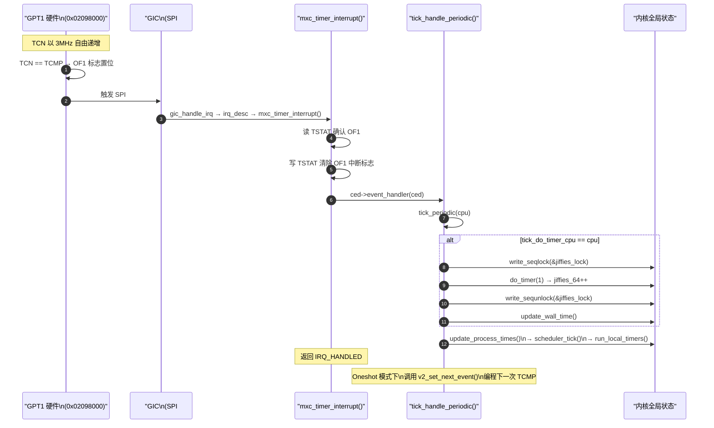
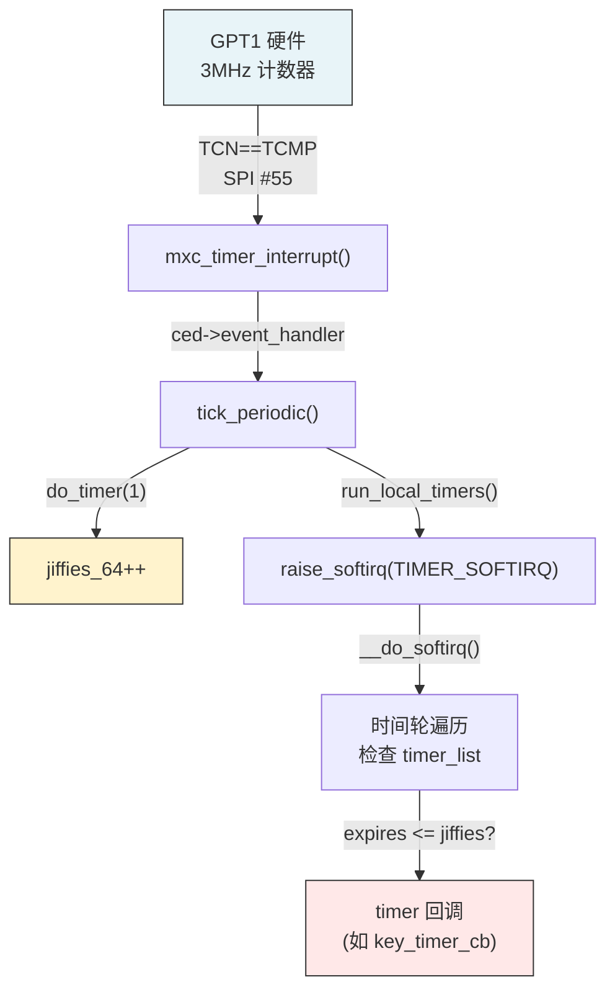

# IMX6ULL jiffies 时钟源：GPT 而非 Generic Timer

> [!note]
> **Ref:** [`sdk/Linux-4.9.88/drivers/clocksource/timer-imx-gpt.c`](../../../sdk/100ask_imx6ull-sdk/Linux-4.9.88/drivers/clocksource/timer-imx-gpt.c), [`sdk/Linux-4.9.88/arch/arm/boot/dts/imx6ull.dtsi`](../../../sdk/100ask_imx6ull-sdk/Linux-4.9.88/arch/arm/boot/dts/imx6ull.dtsi), [`sdk/Linux-4.9.88/kernel/time/tick-common.c`](../../../sdk/100ask_imx6ull-sdk/Linux-4.9.88/kernel/time/tick-common.c)

## 1. 关键结论：IMX6ULL 不使用 ARM Generic Timer

Cortex-A7 架构定义了 **ARM Generic Timer**（通过 CP15 `CNTPCT` / `CNTP_TVAL` 寄存器访问），许多 Cortex-A7 SoC（如全志 H3、树莓派 BCM2836）将其作为系统 tick 源。

**但 IMX6ULL（Linux 4.9.88 BSP）使用的是 SoC 内置的 GPT（General Purpose Timer）**，而非 ARM Generic Timer。在 DTS 中没有 `arm,armv7-timer` 节点，内核通过 `fsl,imx6ul-gpt` compatible 匹配 GPT 驱动。

| | ARM Generic Timer | IMX6ULL GPT |
|--|-------------------|-------------|
| 访问方式 | CP15 协处理器寄存器 | MMIO 寄存器（`0x02098000`）|
| 时钟源 | 架构级固定频率 | SoC 时钟树（`ipg` / `osc_per` 3MHz）|
| 中断 | PPI（每核私有）| SPI #55（共享外设中断）|
| 驱动 | `arch/arm/kernel/arch_timer.c` | `drivers/clocksource/timer-imx-gpt.c` |
| 多核支持 | 每核独立 | 单实例（`cpumask_of(0)`）|

---

## 2. DTS 配置

```dts
/* arch/arm/boot/dts/imx6ull.dtsi:503 */
gpt1: gpt@02098000 {
    compatible = "fsl,imx6ul-gpt", "fsl,imx31-gpt";
    reg = <0x02098000 0x4000>;
    interrupts = <GIC_SPI 55 IRQ_TYPE_LEVEL_HIGH>;
    clocks = <&clks IMX6UL_CLK_GPT1_BUS>,
             <&clks IMX6UL_CLK_GPT_3M>;
    clock-names = "ipg", "osc_per";
};
```

| 字段 | 说明 |
|------|------|
| `compatible` | 匹配 `CLOCKSOURCE_OF_DECLARE(imx6ul_timer, "fsl,imx6ul-gpt", ...)` |
| `reg` | GPT1 寄存器基地址 `0x02098000`，大小 16KB |
| `interrupts` | GIC SPI #55（INTID = 55+32 = 87），电平触发 |
| `clocks[0]` ipg | 总线时钟（寄存器访问） |
| `clocks[1]` osc_per | 计数时钟源 **3MHz**（24MHz OSC / 8）|

---

## 3. GPT 硬件寄存器（V2 版本）

```
基地址: 0x02098000

偏移    名称          作用
────────────────────────────────────────
0x00    TCTL          控制寄存器（使能、时钟选择、FreeRun模式）
0x04    TPRER         预分频器
0x08    TSTAT         状态寄存器（OF1 溢出标志）
0x0C    IR            中断使能寄存器
0x10    TCMP (OCR1)   输出比较寄存器（设置下一次中断时刻）
0x24    TCN           当前计数值（自由递增）
```

**工作原理：** GPT 的 TCN 寄存器从 0 以 3MHz 速率自由递增。驱动将"下一次 tick 时刻"写入 TCMP，当 `TCN == TCMP` 时触发 OF1 中断（SPI #55）。

---

## 4. 驱动架构

### 4.1 核心数据结构

```c
/* drivers/clocksource/timer-imx-gpt.c */
struct imx_timer {
    enum imx_gpt_type type;       /* GPT_TYPE_IMX6DL（imx6ul-gpt 使用此类型）*/
    void __iomem      *base;      /* ioremap(0x02098000) */
    int               irq;        /* virq（从 DTS 解析）*/
    struct clk        *clk_per;   /* osc_per 3MHz 时钟 */
    struct clk        *clk_ipg;   /* ipg 总线时钟 */
    const struct imx_gpt_data *gpt;  /* V2 寄存器操作函数表 */
    struct clock_event_device ced;   /* 嵌入的 clock_event_device */
    struct irqaction  act;           /* 中断处理注册 */
};
```

### 4.2 Compatible 匹配与初始化链

```
DTS: compatible = "fsl,imx6ul-gpt"
        ↓
CLOCKSOURCE_OF_DECLARE(imx6ul_timer, "fsl,imx6ul-gpt", imx6dl_timer_init_dt)
        ↓
mxc_timer_init_dt(np, GPT_TYPE_IMX6DL)
        ↓
_mxc_timer_init(imxtm)
    ├─ imxtm->gpt = &imx6dl_gpt_data     // V2 寄存器操作表
    ├─ clk_prepare_enable(clk_ipg)        // 使能总线时钟
    ├─ clk_prepare_enable(clk_per)        // 使能计数时钟 3MHz
    ├─ gpt_setup_tctl()                   // 配置 TCTL：FreeRun + 使能
    ├─ mxc_clocksource_init()             // 注册 clocksource（读 TCN）
    └─ mxc_clockevent_init()              // 注册 clock_event_device + IRQ
```

### 4.3 clock_event_device 注册

```c
/* mxc_clockevent_init() */
ced->name = "mxc_timer1";
ced->features = CLOCK_EVT_FEAT_ONESHOT | CLOCK_EVT_FEAT_DYNIRQ;
ced->set_next_event = v2_set_next_event;    /* 写 TCMP 寄存器 */
ced->set_state_oneshot = mxc_set_oneshot;
ced->rating = 200;
ced->cpumask = cpumask_of(0);               /* 仅绑定 CPU0 */

clockevents_config_and_register(ced, clk_get_rate(clk_per),  /* 3MHz */
                                0xff, 0xfffffffe);

/* 注册中断 */
act->name = "i.MX Timer Tick";
act->flags = IRQF_TIMER | IRQF_IRQPOLL;
act->handler = mxc_timer_interrupt;
act->dev_id = ced;
setup_irq(imxtm->irq, act);
```

### 4.4 set_next_event — 编程下一次 tick

```c
static int v2_set_next_event(unsigned long evt,
                             struct clock_event_device *ced)
{
    struct imx_timer *imxtm = to_imx_timer(ced);
    unsigned long tcmp;

    tcmp = readl_relaxed(imxtm->base + V2_TCN) + evt;  /* 当前计数 + 间隔 */
    writel_relaxed(tcmp, imxtm->base + V2_TCMP);        /* 写入比较寄存器 */

    /* 检查是否已经错过（竞态保护）*/
    return evt < 0x7fffffff &&
        (int)(tcmp - readl_relaxed(imxtm->base + V2_TCN)) < 0 ?
            -ETIME : 0;
}
```

---

## 5. jiffies 完整递增链路



### 关键函数调用栈

```
mxc_timer_interrupt()                    /* 硬中断上下文 */
  └─ ced->event_handler(ced)             /* = tick_handle_periodic */
       └─ tick_periodic(cpu)
            ├─ do_timer(1)               /* jiffies_64 += 1 */
            ├─ update_wall_time()        /* 更新 wall clock */
            └─ update_process_times()
                 ├─ scheduler_tick()     /* CFS vruntime 更新 */
                 ├─ run_local_timers()   /* 触发 TIMER_SOFTIRQ */
                 └─ account_process_tick()/* 进程 CPU 时间统计 */
```

---

## 6. clocksource 与 sched_clock

GPT 同时提供 **clocksource**（高精度时间读取）：

```c
/* mxc_clocksource_init() */
sched_clock_reg = imxtm->base + V2_TCN;   /* 直接读 TCN 寄存器 */

sched_clock_register(mxc_read_sched_clock, 32, c);  /* 32位，3MHz */
clocksource_mmio_init(reg, "mxc_timer1", c, 200, 32,
                      clocksource_mmio_readl_up);
```

| 角色 | 说明 |
|------|------|
| `clocksource` | 为 `ktime_get()` / `gettimeofday()` 提供高精度时间戳 |
| `sched_clock` | 为调度器提供纳秒级单调时钟（`sched_clock()` → 读 TCN）|
| `clock_event_device` | 为 tick 子系统提供定时中断（写 TCMP 触发 OF1）|

> 一个 GPT 硬件同时承担了 clocksource（读 TCN）和 clock_event（写 TCMP）两个角色。

---

## 7. jiffies 相关内核配置

```
CONFIG_HZ = 100          /* IMX6ULL 默认：每秒 100 次 tick */
                          /* → tick 间隔 = 10ms */
                          /* → GPT evt 参数 ≈ 3MHz / 100 = 30000 计数 */

CONFIG_NO_HZ_IDLE = y    /* tickless idle：CPU 空闲时停止周期 tick */
                          /* tick_handle_periodic 仅在非 idle 时持续调用 */
```

tick 周期计算：
```
GPT 时钟频率 = 3,000,000 Hz (osc_per = 24MHz / 8)
HZ = 100
每个 tick 的 GPT 计数 = 3,000,000 / 100 = 30,000
每个 tick 间隔 = 10ms
```

---

## 8. 与 timer_list 的关系



驱动中使用的 `timer_list`（见 → [`02-softtimer.md`](./02-softtimer.md)）最终依赖此 GPT 硬件中断链驱动 jiffies 递增，进而触发时间轮检查。
